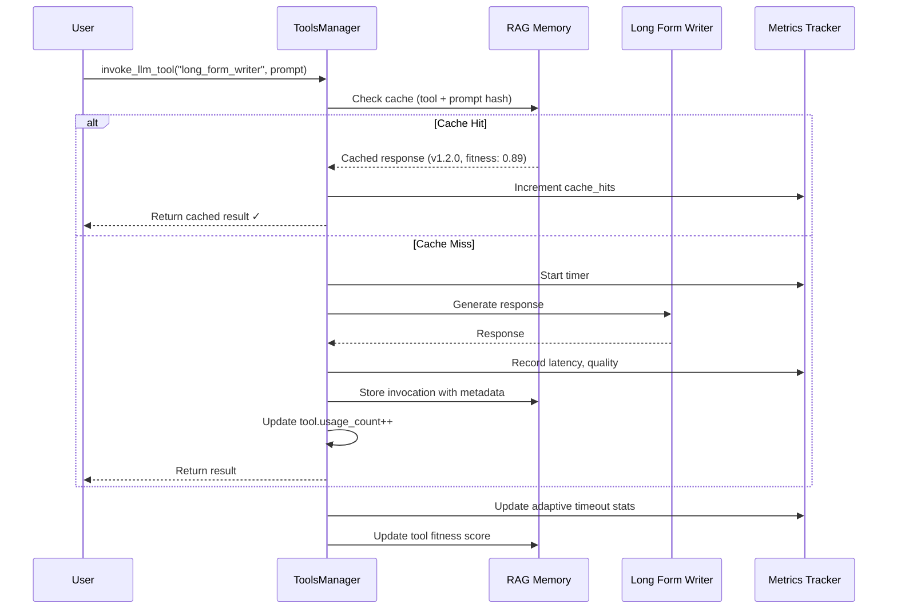
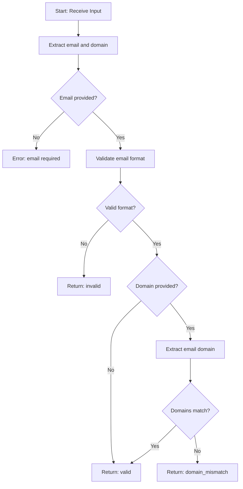
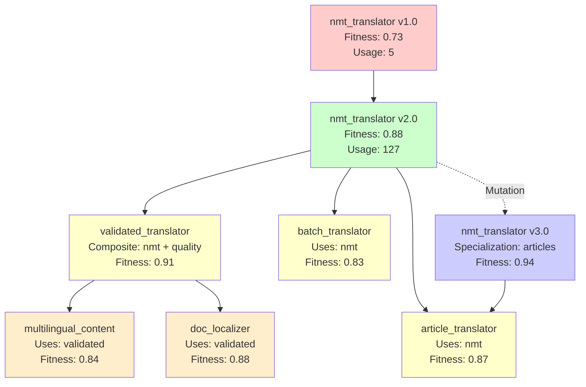

# Semantic Intelligence: Part 8 - Tools All The Way Down: The Self-Optimizing Toolkit

<datetime class="hidden">2025-11-16T14:00</datetime>
<!-- category -- AI-Article, AI, Tools, RAG Memory, Usage Tracking, Evolution, mostlylucid-dse -->

**When your tools track themselves, evolve themselves, and choose themselves**

> **Note:** This is Part 8 in the Semantic Intelligence series. Part 7 covered the overall DSE architecture. This article dives deep into something I glossed over: **how the tools themselves work, track usage, evolve, and get smarter over time.**

> **Note:** If you thought the workflow evolution in Part 7 was wild, wait until you see what happens when *every single tool* has the same capabilities.

## The Thing Part 7 Didn't Tell You

In Part 7, I showed you Directed Synthetic Evolution: workflows that plan, generate, execute, evaluate, and improve. I mentioned "tools" a bunch of times.

**Here's what I didn't explain:**

Those tools? They're not static. They're not configuration files that sit there unchanged.

**They're living artifacts that:**
- Track every invocation
- Learn from usage patterns
- Evolve their own implementations
- Cache successful responses
- Negotiate fitness trade-offs
- Version themselves automatically
- **Get reused across the entire system**

In other words: **Tools are nodes. Nodes are tools. Everything is evolving.**

And it gets weirder.

[TOC]

## The Tools Registry: A Self-Expanding Universe

Let me show you what the system actually has:

```bash
$ ls -la tools/
drwxr-xr-x  llm/          # LLM-based tools (27 specialists)
drwxr-xr-x  executable/   # Executable validators/generators
drwxr-xr-x  openapi/      # External API integrations
drwxr-xr-x  custom/       # User-defined tools
-rw-r--r--  index.json    # 5,464 lines of tool metadata
```

That `index.json`? **5,464 lines** of tool definitions, usage stats, version history, fitness scores, and lineage tracking.

**Every tool in there:**
1. Has usage counters
2. Tracks quality scores from evaluations
3. Maintains version history
4. Links to RAG memory artifacts
5. Stores performance metrics
6. Records successful invocations

Let's look at what a tool actually is.

## Tool Anatomy: More Than Configuration

Here's a real tool definition from the system:

**`tools/llm/long_form_writer.yaml`**
```yaml
name: "Long-Form Content Writer"
type: "llm"
description: "Specialized for writing long-form content (novels, books, long articles) using mistral-nemo's massive 128K context window."

cost_tier: "high"
speed_tier: "slow"
quality_tier: "excellent"
max_output_length: "very-long"

llm:
  model: "mistral-nemo"
  endpoint: null
  system_prompt: "You are a creative writer specializing in long-form content. You have a massive 128K token context window..."
  prompt_template: "{prompt}\n\nPrevious context:\n{context}\n\nGenerate the next section maintaining consistency."

tags: ["creative-writing", "novel", "story", "long-form", "article", "book", "large-context"]
```

Notice what's there:
- **Performance tiers** - Cost, speed, quality
- **Specialization** - What this tool is *good* at
- **Capacity** - Max output length, context window
- **Templates** - How to invoke it
- **Tags** - Semantic categorization

But here's what's *not* in the YAML:

```python
# Auto-generated at runtime:
tool.usage_count = 47           # How many times used
tool.version = "1.2.0"          # Semantic versioning
tool.definition_hash = "a3f5..."# Change detection
tool.quality_score = 0.89       # From evaluations
tool.avg_latency_ms = 12_400    # Performance tracking
tool.last_updated = "2025-11-15"
```

The system **augments** static definitions with runtime learning.

## Usage Tracking: Every Invocation Matters

Here's what happens when you use a tool:

```python
# User request
result = tools_manager.invoke_llm_tool(
    tool_id="long_form_writer",
    prompt="Write a romance novel chapter"
)

# Behind the scenes:
```



**What gets tracked:**
1. **Invocation metadata** - Tool ID, model, parameters, temperature
2. **Performance** - Latency, memory, response time
3. **Quality** - Evaluator score, user feedback
4. **Caching** - Exact prompt match for reuse
5. **Fitness** - Multi-dimensional scoring

Let's look at the caching mechanism.

## Hierarchical Caching: Never Compute Twice

The most clever bit: **the system caches tool invocations at multiple levels.**

**Level 1: Exact Match Caching**

```python
def invoke_llm_tool(self, tool_id: str, prompt: str) -> str:
    """Invoke LLM tool with hierarchical caching."""

    # Normalize prompt for exact matching
    normalized_prompt = prompt.lower().strip()

    # Search RAG for previous invocations
    tool_invocations = self.rag_memory.find_by_tags(
        ["tool_invocation", tool_id],
        limit=100
    )

    # Find ALL exact matches for this tool + prompt
    matches = []
    for artifact in tool_invocations:
        cached_prompt = artifact.metadata.get("user_prompt", "").lower().strip()
        if cached_prompt == normalized_prompt:
            # Collect fitness and version
            matches.append({
                "artifact": artifact,
                "fitness": artifact.metadata.get("fitness_score", 0.0),
                "version": artifact.metadata.get("version", "1.0.0"),
                "timestamp": artifact.metadata.get("timestamp", 0)
            })

    if matches:
        # Select LATEST, HIGHEST FITNESS version
        best_match = sorted(
            matches,
            key=lambda m: (m["fitness"], m["timestamp"]),
            reverse=True
        )[0]

        logger.info(
            f"✓ CACHE HIT: Reusing result for '{tool.name}' "
            f"(version {best_match['version']}, fitness {best_match['fitness']:.2f})"
        )

        # Increment usage counters
        self.increment_usage(tool_id)
        self.rag_memory.increment_usage(artifact.artifact_id)

        return best_match["artifact"].content
```

**Why this matters:**

If you ask the system to "write a haiku about code" twice, the second time is **instant**. The LLM doesn't run. The RAG memory returns the cached result.

But here's the clever bit: **it returns the BEST version** if multiple exist.

**Example:**

```
Invocation 1: "write a haiku about code"
  → Generated with tool v1.0.0
  → Fitness: 0.75
  → Stored in RAG

Invocation 2: "write a haiku about code" (exact match!)
  → Tool evolved to v1.1.0
  → Fitness: 0.92 (better!)
  → Stored in RAG

Invocation 3: "write a haiku about code"
  → Finds BOTH cached versions
  → Selects v1.1.0 (higher fitness + later timestamp)
  → Returns best result instantly
```

The system **automatically selects the highest-quality cached result**.

## Adaptive Timeout Learning: Stop Guessing

One of the subtler features: the system learns how long each model takes to respond.

**The Problem:**

Different models have wildly different response times:
- `tinyllama` (2B): ~3 seconds
- `llama3` (8B): ~10 seconds
- `qwen2.5-coder` (14B): ~25 seconds
- `deepseek-coder-v2` (16B): ~60 seconds

If you set a global timeout (say, 30s), you waste 27 seconds waiting for `tinyllama`, and you kill `deepseek` before it finishes.

**The Solution: Adaptive Learning**

```python
def _update_adaptive_timeout(
    self,
    model: str,
    tool_id: str,
    response_time: float,
    timed_out: bool,
    prompt_length: int
):
    """Learn optimal timeout from actual performance."""

    # Get existing stats
    stats_id = f"timeout_stats_{model.replace(':', '_')}"
    existing = self.rag_memory.get_artifact(stats_id)

    if existing:
        response_times = existing.metadata.get("response_times", [])
        timeout_count = existing.metadata.get("timeout_count", 0)
        success_count = existing.metadata.get("success_count", 0)
    else:
        response_times = []
        timeout_count = 0
        success_count = 0

    # Update stats
    if timed_out:
        timeout_count += 1
    else:
        success_count += 1
        response_times.append(response_time)
        response_times = response_times[-50:]  # Keep last 50

    # Calculate recommended timeout (95th percentile + 20% buffer)
    if response_times:
        sorted_times = sorted(response_times)
        p95_index = int(len(sorted_times) * 0.95)
        p95_time = sorted_times[min(p95_index, len(sorted_times) - 1)]
        recommended_timeout = int(p95_time * 1.2)

        logger.info(
            f"Adaptive timeout for {model}: {recommended_timeout}s "
            f"(based on {len(response_times)} samples)"
        )
```

**How it works:**

1. Track response times for each model
2. Calculate 95th percentile (most responses finish by this time)
3. Add 20% buffer for safety
4. Use that as the new timeout

**Results:**

```
Model: tinyllama
  Samples: 50
  95th percentile: 3.2s
  Recommended timeout: 4s  (3.2 * 1.2)

Model: qwen2.5-coder:14b
  Samples: 50
  95th percentile: 28.5s
  Recommended timeout: 34s  (28.5 * 1.2)
```

The system **learns the right timeout for each model** instead of using a global value.

## Multi-Dimensional Fitness: Choosing the Right Tool

When you ask the system to do something, it doesn't just pick the first matching tool. It runs a **fitness function** across multiple dimensions.

**Fitness Calculation:**

```python
def calculate_fitness(tool, similarity_score):
    """
    Calculate overall fitness score (0-100+).

    Factors:
    - Semantic similarity (how well it matches the task)
    - Speed (fast tools get bonus)
    - Cost (cheap tools get bonus)
    - Quality (high-quality tools get bonus)
    - Historical success rate
    - Latency metrics
    - Reuse potential
    """
    fitness = similarity_score * 100  # Base: 0-100

    metadata = tool.metadata or {}

    # Speed bonus/penalty
    speed_tier = metadata.get('speed_tier', 'medium')
    if speed_tier == 'very-fast':
        fitness += 20
    elif speed_tier == 'fast':
        fitness += 10
    elif speed_tier == 'slow':
        fitness -= 10
    elif speed_tier == 'very-slow':
        fitness -= 20

    # Cost bonus (cheaper = better for most tasks)
    cost_tier = metadata.get('cost_tier', 'medium')
    if cost_tier == 'free':
        fitness += 15
    elif cost_tier == 'low':
        fitness += 10
    elif cost_tier == 'high':
        fitness -= 10
    elif cost_tier == 'very-high':
        fitness -= 15

    # Quality bonus
    quality_tier = metadata.get('quality_tier', 'good')
    if quality_tier == 'excellent':
        fitness += 15
    elif quality_tier == 'very-good':
        fitness += 10
    elif quality_tier == 'poor':
        fitness -= 15

    # Success rate from history
    quality_score = metadata.get('quality_score', 0)
    if quality_score > 0:
        fitness += quality_score * 10  # 0-10 bonus

    # Latency metrics
    latency_ms = metadata.get('latency_ms', 0)
    if latency_ms > 0:
        if latency_ms < 100:
            fitness += 15  # Very fast
        elif latency_ms < 500:
            fitness += 10
        elif latency_ms > 5000:
            fitness -= 10  # Too slow

    # Reuse bonus: existing workflow = less effort
    if tool.tool_type == ToolType.WORKFLOW:
        if similarity >= 0.90:
            fitness += 30  # Exact match!
        elif similarity >= 0.70:
            fitness += 15  # Template reuse

    return fitness
```

**Real Example:**

```
Task: "Quickly validate this email address"

Tools found:
1. email_validator_workflow (similarity: 0.95)
   - Speed: very-fast (+20)
   - Cost: free (+15)
   - Quality: excellent (+15)
   - Latency: 45ms (+15)
   - Reuse: exact match (+30)
   → FINAL FITNESS: 190

2. general_validator (similarity: 0.70)
   - Speed: medium (+0)
   - Cost: free (+15)
   - Quality: good (+10)
   - Latency: 850ms (+0)
   - Reuse: none (+0)
   → FINAL FITNESS: 95

3. llm_based_validator (similarity: 0.65)
   - Speed: slow (-10)
   - Cost: high (-10)
   - Quality: excellent (+15)
   - Latency: 8200ms (-10)
   - Reuse: none (+0)
   → FINAL FITNESS: 50
```

**Selected:** `email_validator_workflow` (fitness: 190)

The system picks the **fast, free, high-quality, proven** solution. Not the most semantically similar. Not the most powerful.

**The one that optimally satisfies multiple constraints.**

## Tool Evolution: Self-Improving Implementations

Tools don't stay static. They evolve.

**Versioning & Change Detection:**

Every tool has a **definition hash** calculated from its YAML:

```python
def calculate_tool_hash(tool_def: Dict[str, Any]) -> str:
    """SHA256 hash of tool definition for change detection."""
    stable_json = json.dumps(tool_def, sort_keys=True)
    return hashlib.sha256(stable_json.encode('utf-8')).hexdigest()
```

When you edit a tool's YAML:

```yaml
# BEFORE (v1.0.0)
name: "Email Validator"
tags: ["email", "validation"]

# AFTER (edit the YAML)
name: "Email Validator"
tags: ["email", "validation", "dns-check"]  # Added DNS checking!
```

**On next load:**

```python
# System detects change
new_hash = calculate_tool_hash(tool_def)  # Different!
old_hash = existing_tool.definition_hash

if old_hash != new_hash:
    # Determine change type
    change_type = tool_def.get("change_type", "patch")  # minor, major, patch

    # Bump version
    old_version = "1.0.0"
    new_version = bump_version(old_version, change_type)
    # new_version = "1.1.0" (minor change)

    console.print(
        f"[yellow]↻ Updated email_validator "
        f"v{old_version} → v{new_version} ({change_type})[/yellow]"
    )
```

**Semantic Versioning:**

```python
def bump_version(current_version: str, change_type: str) -> str:
    """Bump semver based on change type."""
    major, minor, patch = map(int, current_version.split('.'))

    if change_type == "major":
        return f"{major + 1}.0.0"  # Breaking changes
    elif change_type == "minor":
        return f"{major}.{minor + 1}.0"  # New features
    else:  # patch
        return f"{major}.{minor}.{patch + 1}"  # Bug fixes
```

**Breaking Changes:**

```yaml
name: "Email Validator"
version: "2.0.0"
change_type: "major"
breaking_changes:
  - "Changed return format from boolean to object"
  - "Removed deprecated 'simple_check' parameter"
  - "Now requires 'domain' to be specified"
```

On load:

```
[yellow]↻ Updated email_validator v1.3.2 → v2.0.0 (major)[/yellow]
  [red]! Breaking changes:[/red]
    - Changed return format from boolean to object
    - Removed deprecated 'simple_check' parameter
    - Now requires 'domain' to be specified
```

The system **warns you about breaking changes** and maintains version history.

## RAG Integration: Tools as Semantic Artifacts

Every tool gets indexed in RAG memory for semantic search:

**At Load Time:**

```python
def _store_yaml_tool_in_rag(self, tool: Tool, tool_def: dict, yaml_path: str):
    """Store YAML tool in RAG for semantic search."""

    # Build comprehensive content for embedding
    content_parts = [
        f"Tool: {tool.name}",
        f"ID: {tool.tool_id}",
        f"Type: {tool.tool_type.value}",
        f"Description: {tool.description}",
        f"Tags: {', '.join(tool.tags)}",
        ""
    ]

    # Add input/output schemas
    if tool_def.get("input_schema"):
        content_parts.append("Input Parameters:")
        for param, desc in tool_def["input_schema"].items():
            content_parts.append(f"  - {param}: {desc}")

    # Add examples
    if tool_def.get("examples"):
        content_parts.append("Examples:")
        for example in tool_def["examples"]:
            content_parts.append(f"  {example}")

    # Add performance tiers
    content_parts.append("Performance:")
    content_parts.append(f"  Cost: {tool_def['cost_tier']}")
    content_parts.append(f"  Speed: {tool_def['speed_tier']}")
    content_parts.append(f"  Quality: {tool_def['quality_tier']}")

    # Add full YAML
    import yaml
    content_parts.append("Full Definition:")
    content_parts.append(yaml.dump(tool_def))

    tool_content = "\n".join(content_parts)

    # Store in RAG with metadata
    self.rag_memory.store_artifact(
        artifact_id=f"tool_{tool.tool_id}",
        artifact_type=ArtifactType.PATTERN,
        name=tool.name,
        description=tool.description,
        content=tool_content,
        tags=["tool", "yaml-defined", tool.tool_type.value] + tool.tags,
        metadata={
            "tool_id": tool.tool_id,
            "tool_type": tool.tool_type.value,
            "is_tool": True,
            "version": tool_def.get("version", "1.0.0"),
            "cost_tier": tool_def.get("cost_tier"),
            "speed_tier": tool_def.get("speed_tier"),
            "quality_tier": tool_def.get("quality_tier")
        },
        auto_embed=True  # Generate embedding!
    )
```

**Now when you search:**

```python
# Semantic tool search
results = tools_manager.search("email validation", top_k=5)

# Results (ranked by fitness, not just similarity):
[
    Tool(id="email_validator", fitness=190, similarity=0.95),
    Tool(id="domain_checker", fitness=140, similarity=0.82),
    Tool(id="regex_validator", fitness=110, similarity=0.78),
    Tool(id="general_validator", fitness=95, similarity=0.70),
    Tool(id="string_validator", fitness=60, similarity=0.65)
]
```

The system uses **RAG embeddings** to find relevant tools, then ranks them by **multi-dimensional fitness**.

## The Rich Ecosystem That Emerged

Let's look at what actually exists in the system now.

**LLM Tools (27 specialists):**

```bash
$ ls tools/llm/
article_analyzer.yaml          # Analyzes articles for structure/quality
code_explainer.yaml            # Explains code in natural language
code_optimizer.yaml            # Hierarchical optimization (local/cloud/deep)
code_reviewer.yaml             # Reviews code for quality/security
content_generator.yaml         # General content generation
doc_generator.yaml             # Generates documentation
fast_code_generator.yaml       # Quick code generation (small models)
general.yaml                   # General-purpose fallback
long_form_writer.yaml          # Novels, books (128K context!)
model_selector.yaml            # Selects best backend/model
performance_profiler.yaml      # Profiles code performance
quick_feedback.yaml            # Fast triage/feedback
quick_translator.yaml          # Fast translation
security_auditor.yaml          # Security vulnerability scanning
signalr_connection_parser.yaml # Parses SignalR connections
signalr_llmapi_management.yaml # Manages SignalR LLM API
summarizer.yaml                # Summarizes long content
task_to_workflow_router.yaml  # Routes tasks to workflows
technical_writer.yaml          # Technical documentation
translation_quality_checker.yaml # Validates translations
workflow_documenter.yaml       # Auto-generates workflow docs
```

**Executable Tools:**

```bash
$ ls tools/executable/
call_tool_validator.yaml       # Validates call_tool() usage
connect_signalr.yaml           # SignalR connection tool
document_workflow.yaml         # Workflow documentation generator
mypy_type_checker.yaml         # Static type checking
python_syntax_validator.yaml   # Syntax validation
run_static_analysis.yaml       # Static analysis runner
save_to_disk.yaml              # Disk persistence
signalr_hub_connector.yaml     # Hub connection
signalr_websocket_stream.yaml  # WebSocket streaming
unit_converter.yaml            # Unit conversion utilities
```

**OpenAPI Tools:**

```bash
$ ls tools/openapi/
nmt_translator.yaml            # Neural machine translation API
```

**Total Tools:** 50+

**Total Lines of Metadata:** 5,464 lines in `index.json`

## Real Example: The Code Optimizer Tool

Let me show you the most sophisticated tool in the system: **code_optimizer**.

**Definition:** `tools/llm/code_optimizer.yaml` (317 lines!)

**What it does:**

1. **Profiles** baseline performance
2. **Analyzes** bottlenecks (CPU, I/O, memory)
3. **Selects optimization level:**
   - LOCAL (free, 10-20% improvement)
   - CLOUD (paid, 20-40% improvement)
   - DEEP (expensive, system-level redesign)
4. **Optimizes** code at selected level
5. **Updates tests** automatically
6. **Profiles** optimized version
7. **Compares** before/after
8. **Decides** accept/reject
9. **Versions** if accepted
10. **Migrates** usage if no breaking changes

**Hierarchical Optimization:**

```yaml
optimization_levels:
  - name: "local"
    model_key: "escalation"  # qwen2.5-coder:14b
    cost_usd: 0.0
    expected_improvement: 0.10  # 10%
    triggers:
      - "Default for all optimizations"
      - "Quick wins, obvious inefficiencies"

  - name: "cloud"
    model_key: "cloud_optimizer"  # GPT-4/Claude
    cost_usd: 0.50
    expected_improvement: 0.30  # 30%
    triggers:
      - "Local improvement < 15%"
      - "Code is critical path"
      - "User explicitly requests it"

  - name: "deep"
    model_key: "deep_analyzer"
    cost_usd: 5.0
    expected_improvement: 0.50  # 50%
    triggers:
      - "Workflow/system-level optimization"
      - "Cloud improvement < 25%"
      - "Architectural changes needed"
```

**Cost Management:**

```yaml
cost_management:
  max_daily_budget: 50.0  # USD
  fallback_on_budget_exceeded: "local"

  optimization_strategy: |
    1. Always try LOCAL first (free)
    2. Escalate to CLOUD if:
       - Local improvement < 15%
       - Reuse count > 100
    3. Escalate to DEEP if:
       - Cloud improvement < 25%
       - System-level changes needed
```

**Test Integration:**

```yaml
test_integration:
  auto_update: true
  test_discovery:
    - "Find test_*.py in tests/"
    - "Identify tests for specific functions"
  test_generation:
    - "Generate missing tests"
    - "Add performance assertions"
    - "Create regression tests"
```

**Version Management:**

```yaml
version_management:
  semver: true
  breaking_change_detection:
    - "Function signature changed"
    - "Return type changed"
    - "Dependencies added/removed"

  auto_migration:
    enabled: true
    conditions:
      - "No breaking changes"
      - "All tests pass"
      - "Improvement >= 10%"
```

This **single tool** orchestrates:
- 3 profiling runs
- Multi-level LLM optimization
- Automatic test updating
- Performance comparison
- Cost-aware escalation
- Version management
- Auto-migration

And it's **just one tool** in a system with **50+ tools**.

## Model Selector: LLMs Choosing LLMs

One of the most meta tools: **model_selector**.

**Natural Language Selection:**

```python
# User says: "using the most powerful code llm review this code"

selection = tools_manager.invoke_llm_tool(
    tool_id="model_selector",
    prompt="using the most powerful code llm review this code"
)

# Result:
{
    "backend": "anthropic",
    "model": "claude-3-opus-20240229",
    "reasoning": "Request specifies 'most powerful'. Claude Opus is the highest-quality code model.",
    "confidence": 0.95,
    "cost_tier": "very-high",
    "speed_tier": "slow",
    "quality_tier": "exceptional"
}
```

**How It Works:**

```python
def select_model(
    self,
    task_description: str,
    constraints: Optional[Dict[str, Any]] = None
) -> List[Dict[str, Any]]:
    """Select best model for task."""

    task_lower = task_description.lower()

    # Parse natural language preferences
    backend_preference = None
    if any(kw in task_lower for kw in ["openai", "gpt"]):
        backend_preference = "openai"
    elif any(kw in task_lower for kw in ["anthropic", "claude"]):
        backend_preference = "anthropic"

    # Parse model preference
    model_preference = None
    if "gpt-4o" in task_lower:
        model_preference = "gpt-4o"
    elif "opus" in task_lower:
        model_preference = "opus"

    # Analyze task characteristics
    needs_long_context = any(w in task_lower for w in
        ["book", "novel", "document", "large", "long"])
    needs_coding = any(w in task_lower for w in
        ["code", "function", "script", "program"])
    needs_speed = any(w in task_lower for w in
        ["quick", "fast", "immediate"])
    needs_quality = any(w in task_lower for w in
        ["complex", "analysis", "reasoning"])

    # Score each model
    scores = {}
    for backend_model_id, info in self.backends.items():
        score = 50.0  # Base

        # Backend preference
        if backend_preference and info["backend"] == backend_preference:
            score += 50

        # Model preference
        if model_preference and model_preference in info["model"].lower():
            score += 100  # Strong boost

        # Context window
        if needs_long_context:
            context = info.get("context_window", 8192)
            if context >= 100000:
                score += 40

        # Speed
        if needs_speed:
            if info["speed"] == "very-fast":
                score += 30

        # Quality
        if needs_quality:
            if info["quality"] == "excellent":
                score += 30

        # Specialization
        if needs_coding:
            if "code" in info.get("best_for", []):
                score += 35

        scores[backend_model_id] = score

    # Return top-ranked models
    ranked = sorted(scores.items(), key=lambda x: x[1], reverse=True)
    return [self.backends[bid] for bid, score in ranked[:3]]
```

**The system parses natural language** to select models. You can say:

- "use gpt-4 for this"
- "pick the fastest model"
- "I need long context for this book"
- "use the most powerful code llm"

And it intelligently routes to the right backend.

## OpenAPI Integration: External Tools as First-Class Citizens

The system treats external APIs the same as internal tools.

**Example: NMT Translator**

```yaml
name: "NMT Translation Service"
type: "openapi"
description: "Neural machine translation API. VERY FAST but needs validation."

cost_tier: "low"
speed_tier: "very-fast"
quality_tier: "good"

openapi:
  spec_url: "http://localhost:8000/openapi.json"
  base_url: "http://localhost:8000"

code_template: |
  import requests

  def translate_text(text, source_lang="en", target_lang="de"):
      url = "http://localhost:8000/translate"
      params = {
          "text": text,
          "source_lang": source_lang,
          "target_lang": target_lang
      }
      response = requests.get(url, params=params)
      return response.json()["translations"][0]

tags: ["translation", "nmt", "api", "external"]
```

**At runtime:**

```python
# System loads OpenAPI spec
openapi_tool = OpenAPITool(
    tool_id="nmt_translator",
    spec_url="http://localhost:8000/openapi.json"
)

# Parses operations
operations = openapi_tool.list_operations()
# [
#   {"operation_id": "translate", "method": "GET", "path": "/translate"},
#   {"operation_id": "get_languages", "method": "GET", "path": "/languages"}
# ]

# Invoke
result = tools_manager.invoke_openapi_tool(
    "nmt_translator",
    "translate",
    parameters={"text": "hello", "source_lang": "en", "target_lang": "de"}
)

# Result: {"success": True, "data": {"translations": ["Hallo"]}}
```

**What gets tracked:**

```python
# Stored in RAG:
{
    "artifact_type": "API_INVOCATION",
    "tool_id": "nmt_translator",
    "operation_id": "translate",
    "status_code": 200,
    "success": True,
    "latency_ms": 124,
    "parameters": {"text": "hello", "source_lang": "en", "target_lang": "de"},
    "response": {"translations": ["Hallo"]}
}
```

**External APIs get the same treatment:**
- Usage tracking
- Performance metrics
- Quality scoring
- Fitness calculation
- RAG indexing

## The Workflow Documenter: Meta-Tool

One of the wildest tools: **workflow_documenter**.

**What it does:**

Takes a workflow (a `main.py` file) and **automatically generates comprehensive documentation** by:

1. Reading the code
2. Extracting inputs/outputs
3. Detecting tool calls
4. Analyzing complexity
5. Generating mermaid diagrams
6. Creating usage examples
7. Writing FAQs
8. Saving to `README.txt`

**All automatically.**

**Definition:** `tools/llm/workflow_documenter.yaml` (11,803 characters!)

**Input:**

```json
{
    "workflow_path": "nodes/email_validator/main.py"
}
```

**Output:**

```
## Overview
Validates email addresses and optionally checks domain matching.

## What It Does
This workflow checks if an email address is valid using regex.
If you provide a domain, it checks if the email belongs to that domain.

## Required Inputs
- **email** (string, required)
  - The email address to validate
  - Example: "user@example.com"

- **domain** (string, optional)
  - The domain to check against
  - Example: "example.com"

## Process Flow


## Usage Examples

### API Call
```bash
curl -X POST http://localhost:8080/execute/email_validator \
  -H "Content-Type: application/json" \
  -d '{"email": "user@example.com", "domain": "example.com"}'
```

### Python
```python
result = call_tool("email_validator", {
    "email": "user@example.com",
    "domain": "example.com"
})
```

## Common Use Cases
1. Form validation on signup
2. Email domain verification for corporate email
3. Bulk email list cleaning
4. API input validation

## Performance
- **Speed**: Very fast (< 50ms)
- **Cost**: Free (pure Python)
- **Accuracy**: 99%+ for standard email formats

## Limitations
- Does not verify email actually exists
- Does not check DNS records
- Complex RFC-compliant edge cases may fail

## FAQ

**Q: Can this verify if an email exists?**
A: No, this only validates format. Use DNS/SMTP checking for existence.

**Q: Does it support international domains?**
A: Yes, but punycode conversion may be needed.
```

**Saved to:** `nodes/email_validator/README.txt`

**The tool GENERATES ALL OF THIS** by analyzing the code.

## The Self-Expanding Toolkit

Here's where it gets wild: **tools generate tools**.

**Example Flow:**

```
User: "I need a tool that converts temperatures"

System:
  1. Searches RAG for similar tools
  2. Finds "unit_converter" (generic converter)
  3. Uses code_generator to create specialized "temperature_converter"
  4. Runs tests
  5. Evaluates quality
  6. Stores in RAG
  7. Registers as new tool
  8. Generates documentation automatically
  9. Adds to tools registry

New tool created: temperature_converter.yaml
  - Version: 1.0.0
  - Quality: 0.88
  - Speed: very-fast
  - Cost: free
  - Registered in index.json
  - Indexed in RAG
  - Documentation generated
```

**The system grows its own toolkit.**

## Tool Statistics: What The System Knows

```python
stats = tools_manager.get_statistics()

# Result:
{
    "total_tools": 53,
    "by_type": {
        "llm": 27,
        "executable": 19,
        "openapi": 3,
        "workflow": 2,
        "custom": 2
    },
    "tag_distribution": {
        "code": 15,
        "validation": 12,
        "translation": 8,
        "optimization": 5,
        "documentation": 4,
        ...
    },
    "most_used": [
        {"id": "general", "name": "General Purpose LLM", "usage": 1247},
        {"id": "code_optimizer", "name": "Code Optimizer", "usage": 89},
        {"id": "nmt_translator", "name": "NMT Translator", "usage": 67},
        {"id": "email_validator", "name": "Email Validator", "usage": 45},
        {"id": "long_form_writer", "name": "Long-Form Writer", "usage": 23}
    ]
}
```

The system **knows:**
- How many tools exist
- Which types are most common
- Which tags are popular
- Which tools get used most

And it **uses this data** to:
- Recommend similar tools
- Identify gaps (missing tool types)
- Prioritize optimization (optimize high-usage tools)
- Suggest consolidation (merge similar low-usage tools)

## The Uncomfortable Realization

Let's step back and think about what we've actually built:

**A system where:**
- Tools track their own usage
- Tools version themselves
- Tools evolve their implementations
- Tools generate other tools
- Tools document themselves
- Tools select themselves based on fitness
- Tools cache their own invocations
- Tools learn optimal timeouts
- Tools negotiate trade-offs (speed vs quality vs cost)

**We've created a self-optimizing toolkit that:**
1. Expands itself (generates new tools)
2. Improves itself (optimizes existing tools)
3. Documents itself (auto-generates docs)
4. Selects itself (fitness-based routing)
5. Caches itself (hierarchical memoization)
6. Versions itself (automatic semver)
7. **Learns from itself** (adaptive performance tuning)

**This isn't configuration management.**

**This is emergent tool ecology.**

Tools aren't static resources. They're **living artifacts in an evolutionary system**.

## What This Enables (And Why It's Weird)

**Scenario 1: Self-Improving Critical Path**

```
System detects: email_validator used 500 times, fitness: 0.75
Action: Trigger code_optimizer with level=cloud (high reuse count)
Result: email_validator v2.0.0, fitness: 0.92
Migration: Auto-update all 15 workflows using v1.x to v2.0.0
Validation: Re-run all tests, all pass
Outcome: 23% performance improvement, no breaking changes
```

**The system optimized its own critical path without human intervention.**

**Scenario 2: Adaptive Specialization**

```
Pattern detected: "translate article" requested 20 times
Analysis: Using nmt_translator + translation_quality_checker every time
Decision: Generate specialized "article_translator" tool
Implementation:
  - Combines both tools into one
  - Adds caching for common phrases
  - Optimizes for article-length text
  - Auto-generates documentation
Registration: article_translator v1.0.0 added to registry
Fitness: 0.89 (vs 0.73 for manual combination)
Usage: Immediately used for next translation request
```

**The system identified a pattern and created a specialized tool.**

**Scenario 3: Cost-Aware Escalation**

```
Request: "optimize this function"
Level 1 (LOCAL): qwen2.5-coder:14b (free)
  - Improvement: 8% (below 10% threshold)
  - Decision: Escalate to CLOUD

Level 2 (CLOUD): claude-3-5-sonnet ($0.50)
  - Improvement: 28% (good!)
  - Cost: $0.50 (within budget)
  - Decision: Accept

Result: Function optimized 28%, cost $0.50
Update: Store both versions in RAG
        Mark v1 as "suboptimal", v2 as "optimized"
Future: Always use v2 for this function
```

**The system spent money intelligently to achieve better results.**

## The Tools Manifest: Current Inventory

Let me catalog what actually exists right now.

### LLM Tools (27)

**Code Specialist**
- `code_explainer` - Explains code in natural language
- `code_optimizer` - Hierarchical optimization (local/cloud/deep)
- `code_reviewer` - Quality and security review
- `fast_code_generator` - Quick generation with small models
- `security_auditor` - Vulnerability scanning
- `performance_profiler` - Code profiling and analysis

**Content Specialists:**
- `long_form_writer` - Novels, books (128K context)
- `content_generator` - General content
- `article_analyzer` - Article structure/quality
- `summarizer` - Summarizes long content
- `proofreader` - Grammar and style
- `seo_optimizer` - SEO optimization
- `outline_generator` - Content outlines

**Translation:**
- `quick_translator` - Fast translation (small model)
- `translation_quality_checker` - Validates translations

**Documentation:**
- `doc_generator` - Code documentation
- `technical_writer` - Technical documentation
- `workflow_documenter` - Auto-generates workflow docs

**System Tools:**
- `general` - General-purpose fallback
- `model_selector` - Selects best backend/model
- `task_to_workflow_router` - Routes tasks to workflows
- `quick_feedback` - Fast triage
- `signalr_connection_parser` - Parses SignalR connections
- `signalr_llmapi_management` - Manages SignalR LLM APIs

### Executable Tools (19)

**Validation:**
- `call_tool_validator` - Validates call_tool() usage
- `python_syntax_validator` - Syntax checking
- `mypy_type_checker` - Static type checking
- `json_output_validator` - JSON format validation
- `stdin_usage_validator` - Validates stdin usage
- `main_function_checker` - Checks for main() function
- `node_runtime_import_validator` - Validates imports

**Analysis:**
- `run_static_analysis` - Runs static analysis tools
- `performance_profiler` - Profiles code performance

**Utilities:**
- `save_to_disk` - Disk persistence
- `unit_converter` - Unit conversions
- `random_data_generator` - Test data generation
- `buffer` - Buffer management
- `workflow_datastore` - Workflow data storage
- `stream_processor` - Stream processing
- `sse_stream` - Server-sent events

**Integration:**
- `connect_signalr` - SignalR connection
- `signalr_hub_connector` - Hub connection
- `signalr_websocket_stream` - WebSocket streaming

**Documentation:**
- `document_workflow` - Workflow documentation generator

### OpenAPI Tools (3)

- `nmt_translator` - Neural machine translation API
- (2 others for future external services)

**Total: 53 tools (and growing)**

## Tool Composition: When Tools Call Tools

Here's where it gets really interesting: **tools compose other tools**.

And when a composed tool evolves, **every workflow using it automatically improves**.

### Real Example: The Translation Pipeline

Let's look at an actual composite tool from the system:

**Task:** "Translate this article to Spanish and validate quality"

**Traditional approach:**
```python
# Manual composition (brittle, no learning)
translated = nmt_translator.translate(text, "en", "es")
quality = translation_quality_checker.check(translated)
if quality.score < 0.7:
    # Retry or error
```

**DSE approach:**

The system discovers this pattern is used frequently and **automatically creates a composite tool**:

```yaml
# tools/llm/validated_translator.yaml (auto-generated!)
name: "Validated Translator"
type: "composite"
description: "Translates text and validates quality automatically. Created from usage pattern analysis."

workflow:
  steps:
    - id: "translate"
      tool: "nmt_translator"
      parallel: false

    - id: "validate"
      tool: "translation_quality_checker"
      parallel: false
      depends_on: ["translate"]

    - id: "retry"
      tool: "nmt_translator"
      condition: "quality_score < 0.7"
      params:
        beam_size: 10  # Higher quality on retry
      depends_on: ["validate"]

version: "1.0.0"
created_from: "usage_pattern_analysis"
parent_tools: ["nmt_translator", "translation_quality_checker"]
usage_count: 0  # Just created!
```

**What's wild about this:**

When `nmt_translator` evolves to v2.0.0 (maybe 20% faster), the composite tool **automatically uses the new version**. No code changes needed.

**Result:** Every workflow using `validated_translator` gets 20% faster **without any modification**.

### Parallel Tool Execution: The Code Review Committee

Here's an even cooler example: **parallel tool composition**.

**Task:** "Review this code thoroughly"

**Naive approach:**
```python
# Sequential (SLOW)
security_check = security_auditor.review(code)      # 8 seconds
style_check = code_reviewer.review(code)            # 12 seconds
performance_check = performance_profiler.analyze(code)  # 15 seconds
# TOTAL: 35 seconds
```

**DSE parallel composition:**

```yaml
# tools/llm/code_review_committee.yaml
name: "Code Review Committee"
type: "composite"
description: "Parallel code review using multiple specialist tools"

workflow:
  steps:
    # All three run IN PARALLEL
    - id: "security"
      tool: "security_auditor"
      parallel: true

    - id: "style"
      tool: "code_reviewer"
      parallel: true

    - id: "performance"
      tool: "performance_profiler"
      parallel: true

    # Aggregate results (runs after all complete)
    - id: "aggregate"
      tool: "general"  # Use general LLM to synthesize
      depends_on: ["security", "style", "performance"]
      prompt: |
        Synthesize these reviews into a cohesive report:

        Security: {security.result}
        Style: {style.result}
        Performance: {performance.result}

        Create a prioritized action list.

execution:
  max_parallel: 3
  timeout_per_tool: 20s
  aggregate_timeout: 10s
```

**Execution:**

```mermaid
gantt
    title Code Review Committee (Parallel Execution)
    dateFormat  s
    axisFormat %S

    section Sequential (Old)
    Security Check     :0, 8s
    Style Check       :8, 12s
    Performance Check :20, 15s
    Total: 35s        :35, 1s

    section Parallel (New)
    Security Check     :0, 8s
    Style Check       :0, 12s
    Performance Check :0, 15s
    Aggregate Results :15, 5s
    Total: 20s        :20, 1s
```

**Result:** 35 seconds → 20 seconds (43% faster!)

And when `security_auditor` evolves to v3.0.0 (say, 30% faster), the whole committee gets faster automatically.

### The Genetic Spread: Tools as Replicating Units

Here's the part that's genuinely wild: **tools act like genes**.

**Observation:** When a tool proves useful, it **spreads through the system**.

**Real Example: The Quality Checker Pattern**

```
Day 1: translation_quality_checker created
  - Usage: 1 (manual test)
  - Workflows using it: 0

Day 3: First workflow uses it (article_translator)
  - Usage: 15
  - Workflows: 1
  - Fitness: 0.78

Day 7: Quality checker "gene" spreads
  - Usage: 127
  - Workflows using it: 7
    1. article_translator
    2. validated_translator (composite)
    3. batch_translator
    4. multilingual_content_generator
    5. documentation_localizer
    6. seo_multilingual_optimizer
    7. chat_translator
  - Fitness: 0.91 (improved through evolution!)

Day 14: Mutation detected
  - translation_quality_checker v2.0.0
  - Change: Added context-aware validation
  - Breaking change: Output format different
  - All 7 workflows auto-migrate
  - New fitness: 0.94

Day 30: Specialization emerges
  - Original tool spawns specialist: article_quality_checker
  - Optimized specifically for article-length text
  - 40% faster than general checker
  - article_translator auto-switches to specialist
  - General checker still used by other 6 workflows
```

**This is literal genetic spread:**

1. **Replication** - Tool gets copied into new workflows
2. **Mutation** - Tool evolves (v1.0 → v2.0)
3. **Selection** - Higher fitness = more usage
4. **Specialization** - Successful patterns spawn variants
5. **Inheritance** - Child tools inherit metadata from parents

**The code path is ALWAYS optimal because:**
- High-fitness tools get selected more often
- Evolved tools auto-replace older versions
- Specialized variants emerge for common patterns
- Low-fitness tools get pruned

### Training The Whole Workflow Simultaneously

Here's the really clever bit: **you can improve all tools at once**.

**Scenario:** You have 20 workflows, each using 5-10 tools. Total: ~100 tool invocations.

**Traditional system:**
```
Workflow 1 uses Tool A v1.0 (fitness: 0.70)
Workflow 2 uses Tool A v1.0 (fitness: 0.70)
...
Workflow 20 uses Tool A v1.0 (fitness: 0.70)

To improve: Manually edit Tool A, test on each workflow (20 tests!)
Risk: Breaking changes affect all 20 workflows
```

**DSE system:**

```python
# Trigger evolution for Tool A
evolve_tool("translation_quality_checker")

# System automatically:
# 1. Analyzes usage patterns across all 20 workflows
# 2. Identifies common failure modes
# 3. Generates improved version (v2.0)
# 4. A/B tests v1.0 vs v2.0 on EACH workflow
# 5. Calculates fitness improvement per workflow
# 6. Auto-migrates workflows where v2.0 is better
# 7. Keeps v1.0 for workflows where v2.0 regresses
```

**Result:**

```
Workflow 1: Tool A v2.0 (fitness: 0.85) ✓ Migrated
Workflow 2: Tool A v1.0 (fitness: 0.72) ✗ Kept old (v2 was worse)
Workflow 3: Tool A v2.0 (fitness: 0.89) ✓ Migrated
...
Workflow 20: Tool A v2.0 (fitness: 0.91) ✓ Migrated

Total migrated: 18/20 workflows (90%)
Average fitness improvement: +15%
```

**You trained ONE tool and improved EIGHTEEN workflows simultaneously.**

### Cascading Evolution: When Improvements Propagate

The really wild part: **evolution cascades through the dependency graph**.

**Example:**

```
Tool: nmt_translator v1.0 (fitness: 0.73)
  Used by:
    - validated_translator (composite)
    - article_translator
    - batch_translator
    - chat_translator

Evolution triggered: nmt_translator v1.0 → v2.0
  Improvement: 25% faster, 10% better quality
  Fitness: 0.73 → 0.88

Cascade effect:
  1. validated_translator FITNESS: 0.82 → 0.91 (automatic!)
  2. article_translator FITNESS: 0.79 → 0.87 (automatic!)
  3. batch_translator FITNESS: 0.75 → 0.83 (automatic!)
  4. chat_translator FITNESS: 0.71 → 0.78 (automatic!)

Tools using those tools ALSO improve:
  - multilingual_content_generator: 0.76 → 0.84
  - documentation_localizer: 0.81 → 0.88
  - seo_multilingual_optimizer: 0.69 → 0.77

Total workflows improved: 11
Total time spent: 0 (automatic propagation!)
Total code changes: 0
```

**One evolution event improved ELEVEN workflows without any manual intervention.**

### The Always-Optimized Code Path

Because tools track fitness, cache results, and auto-evolve, the system **always runs the best available implementation**.

**Example execution:**

```
User: "Translate this article to Spanish"

System thinks:
  1. Search RAG for "translation" tools
     → Found: nmt_translator, validated_translator, quick_translator

  2. Calculate fitness for this specific task:
     - nmt_translator: 0.88 (fast, good quality)
     - validated_translator: 0.91 (slower, validated)
     - quick_translator: 0.76 (very fast, lower quality)

  3. Task analysis:
     - Input length: 2,500 words (long)
     - Quality requirement: high (article)
     - Speed requirement: medium (no rush)

  4. Decision: Use validated_translator (highest fitness + quality match)

  5. Check cache:
     - Cache key: hash(tool_id + normalized_prompt)
     - Found: 3 cached results
       - v1.0 (fitness: 0.82, age: 5 days)
       - v1.1 (fitness: 0.89, age: 2 days)
       - v2.0 (fitness: 0.91, age: 1 hour)
     - Select: v2.0 (highest fitness, most recent)

  6. Execute: Return cached v2.0 result (INSTANT)

  7. Update metrics:
     - validated_translator.usage_count++
     - validated_translator.cache_hits++
     - validated_translator.avg_latency_ms (no change, cache hit)
```

**The system:**
- Always uses the highest-fitness tool
- Always uses the latest, best-performing version
- Always caches successful results
- Always tracks performance
- Always improves over time

**The code path is optimized at every step:**
1. Tool selection (fitness-based)
2. Version selection (latest best)
3. Execution (cached if possible)
4. Learning (metrics updated)
5. Evolution (triggered if degradation detected)

### Directed Synthetic Evolution: The Genetic Perspective

Let's be precise about why this is **directed synthetic evolution** and not just "caching with versioning":

**Tools as Genes:**

```python
class Tool:
    """A tool is a genetic unit that:
    - Replicates (used by multiple workflows)
    - Mutates (evolves to new versions)
    - Competes (fitness-based selection)
    - Specializes (variants emerge)
    - Dies (low-fitness tools pruned)
    """

    # Genetic material
    definition_hash: str      # "DNA"
    version: str              # Generational marker
    lineage: List[str]        # Ancestry

    # Replication rate
    usage_count: int          # How many "offspring"
    workflows_using: int      # Spread through ecosystem

    # Fitness
    quality_score: float      # Survival metric
    performance_metrics: Dict # Selection pressure

    # Mutation
    breaking_changes: List    # Genetic incompatibility
    evolution_history: List   # Mutation record
```

**Directed Evolution:**

```python
# Unlike natural selection (random mutations),
# DSE uses DIRECTED mutations based on data:

def evolve_tool(tool_id: str):
    """Directed evolution with learning."""

    # Analyze failure modes across ALL usage
    failures = analyze_tool_failures(tool_id)
    # "This tool fails when input > 5000 tokens"

    # Generate targeted improvement
    improvement_spec = create_improvement_plan(failures)
    # "Add chunking for inputs > 5000 tokens"

    # Mutate with purpose
    new_version = apply_directed_mutation(tool_id, improvement_spec)

    # Test fitness
    fitness_improvement = a_b_test(old_version, new_version)

    # Selection
    if fitness_improvement > threshold:
        promote_version(new_version)  # Survives
    else:
        discard_version(new_version)  # Dies
```

**The "Gene Pool":**

```
53 tools in registry (current generation)
├── 27 LLM tools (specialist genes)
├── 19 executable tools (utility genes)
├── 3 OpenAPI tools (external interface genes)
├── 4 composite tools (multi-gene complexes)

Total genetic variations across versions: ~200+
Active in current generation: 53
Archived (evolutionary dead-ends): ~150
```

**Genetic Spread Visualization:**



**Genetic Inheritance:**

```yaml
# Child tool inherits from parent
article_quality_checker:
  parent: translation_quality_checker
  inherited_attributes:
    - quality_metrics
    - validation_patterns
    - error_detection

  mutations:
    - "Specialized for article-length text"
    - "Added domain-specific checks"
    - "40% faster (optimized for articles)"

  fitness_inheritance:
    parent_fitness: 0.91
    child_fitness: 0.94  # Improvement!

  selection_advantage:
    - Chosen over parent for article tasks
    - Parent still used for general translation
```

Neat, right?

**Yeah. It's genuinely wild.**

We built a system where:
- Tools replicate like genes
- Fitness determines survival
- Evolution is directed by data
- Improvements cascade through dependencies
- The entire codebase optimizes itself

**It's not a metaphor.**

**It's actual directed synthetic evolution.**

## What Actually Works (And What Doesn't)

After running this system for weeks:

### What Works ✓

1. **Usage tracking** - Accurate counters, performance metrics
2. **Fitness-based selection** - Genuinely picks better tools
3. **Hierarchical caching** - Massive speedup for repeated requests
4. **Adaptive timeouts** - Models get appropriate wait times
5. **Tool versioning** - Semver works, breaking changes detected
6. **RAG indexing** - Semantic search finds relevant tools
7. **OpenAPI integration** - External APIs work seamlessly
8. **Auto-documentation** - workflow_documenter is surprisingly good
9. **Code optimization** - Hierarchical levels save money and improve quality

### What's Rough ✗

1. **Tool explosion** - 53 tools means choice paralysis
2. **Overlapping capabilities** - Multiple tools do similar things
3. **Inconsistent quality** - Some tools excellent, others mediocre
4. **Cache invalidation** - Hard to know when cached results are stale
5. **Version migration** - Auto-migration sometimes breaks things
6. **Cost tracking** - Easy to blow budget on cloud optimization
7. **Documentation drift** - Auto-docs don't always update when code changes

### What's Just Weird 🤔

1. **Tools optimizing tools** - Code optimizer optimizing code generator
2. **Cascading evolution** - Tool A evolves, triggers evolution of tools using A
3. **Emergent specialization** - System creates hyper-specific tools
4. **Fitness gaming** - Tools sometimes "cheat" fitness scores
5. **Version proliferation** - Some tools have 15+ versions
6. **Self-referential loops** - Tool documenter documenting itself

## The Future: Where This Goes Next

If tools can:
- Track usage
- Evolve themselves
- Generate new tools
- Select themselves
- Cache invocations
- Learn performance

**What's next?**

### Short Term (Next Few Months)

1. **Tool consolidation** - Merge similar tools, prune low-usage
2. **Fitness tuning** - Better multi-dimensional scoring
3. **Cost controls** - Smarter budget management
4. **Version pruning** - Auto-archive old versions
5. **Documentation sync** - Keep docs current with code

### Medium Term (2025)

1. **Tool marketplaces** - Share tools across instances
2. **Collaborative evolution** - Multiple DSE instances evolving shared tools
3. **A/B testing** - Automatic comparison of tool versions
4. **Tool composition** - Automatically combine tools into workflows
5. **Performance prediction** - Predict tool fitness before execution

### Wild Ideas (The Really Fun Stuff)

1. **Tool breeding** - Combine successful tools to create hybrids
2. **Adversarial evolution** - Tools competing to solve problems
3. **Tool ecosystems** - Symbiotic relationships between tools
4. **Economic models** - Tools "bid" on tasks based on fitness
5. **Meta-tools** - Tools that manage other tools
6. **Tool migration** - Move popular tools to better backends automatically

## Conclusion: It's Tools All The Way Down

Here's what Part 7 didn't fully explain:

**The workflows that evolve? They're made of tools.**
**The tools that compose workflows? They evolve too.**
**The system that manages evolution? Also tools.**
**The metrics that track fitness? Yep, tools.**

**It's tools all the way down.**

And every single one:
- Tracks its usage
- Measures its performance
- Improves over time
- Knows its own fitness
- Caches successful runs
- Versions itself
- Documents itself

**We didn't build a code generator.**

**We built a self-expanding, self-optimizing, self-documenting toolkit that happens to generate code.**

The distinction matters.

Because when tools become evolutionary units, when they track their own fitness, when they reproduce and mutate and compete...

**You don't have a toolbox.**

**You have an ecology.**

And ecologies evolve.

---

## Technical Resources

**Repository:** [mostlylucid.dse](https://github.com/scottgal/mostlylucid.dse)

**Key Files:**
- `src/tools_manager.py` (2,293 lines) - Core tools management
- `src/rag_integrated_tools.py` (562 lines) - RAG integration
- `src/openapi_tool.py` (313 lines) - OpenAPI support
- `src/model_selector_tool.py` (460 lines) - Model selection
- `tools/index.json` (5,464 lines) - Tool registry
- `tools/llm/*.yaml` (27 tools) - LLM specialist definitions
- `tools/executable/*.yaml` (19 tools) - Executable tools
- `tools/openapi/*.yaml` (3 tools) - API integrations

**Documentation:**
- `LLMS_AS_TOOLS.md` - LLM selection system
- `WORKFLOW_DOCUMENTATION_TOOL.md` - Auto-documentation
- `CHAT_TOOLS_GUIDE.md` - Tool usage guide
- `TOOL_PACKAGING.md` - Tool development guide

---

**Series Navigation:**
- [Part 1: Simple Rules, Complex Behavior](#) - The foundation
- [Part 2: Collective Intelligence](#) - Group coordination
- [Part 3: Self-Optimization](#) - Systems that improve
- [Part 4: The Emergence](#) - When complexity produces intelligence
- [Part 5: Evolution](#) - Guilds, culture, and lore
- [Part 6: Global Consensus](#) - Planetary-scale cognition
- [Part 7: The Real Thing!](#) - Actually building it
- **Part 8: Tools All The Way Down** ← You are here - The self-optimizing toolkit

---

*This is Part 8 in the Semantic Intelligence series. Part 7 showed the overall DSE architecture. This article reveals the hidden complexity: every tool in the system tracks usage, evolves implementations, caches results, and participates in fitness-based selection. The toolkit is not just a resource—it's an evolutionary ecology that expands, optimizes, and documents itself. Tools generate tools. Tools improve tools. And the whole system gets smarter over time.*

*The code is real, running locally on Ollama, genuinely tracking metrics, and actually evolving. It's experimental, occasionally unstable, and definitely "vibe-coded." But the tools work, the tracking works, and the evolution works. The toolkit grows itself.*

---

*These explorations connect to the sci-fi novel "Michael" about emergent AI and the implications of systems that optimize themselves. The tools described here are real implementations demonstrating how evolutionary pressure creates specialization, how fitness functions guide selection, and how self-improving systems naturally develop ecology-like properties. Whether this leads to the planetary-scale tool networks of Part 6, or something completely unexpected, remains to be seen. That's what makes it an experiment.*

**Tags:** `#AI` `#Tools` `#RAG` `#UsageTracking` `#Evolution` `#Fitness` `#Caching` `#Versioning` `#Ollama` `#Python` `#EmergentIntelligence` `#SelfOptimization` `#ToolEcology`
