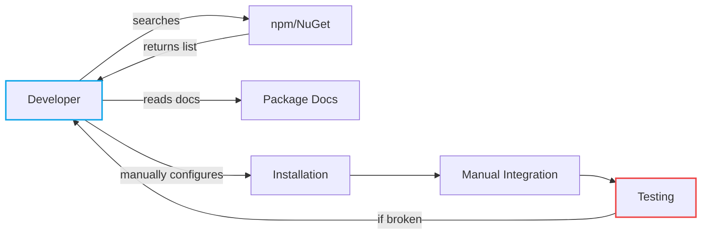
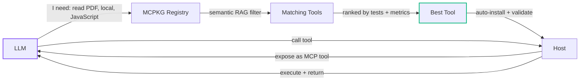
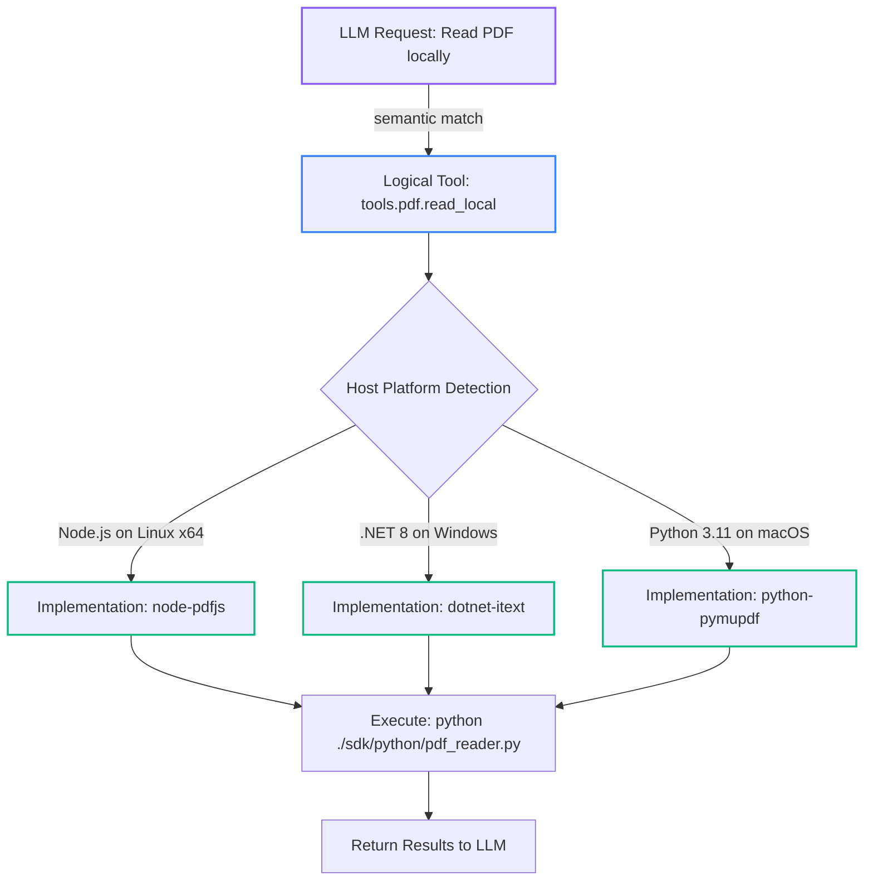
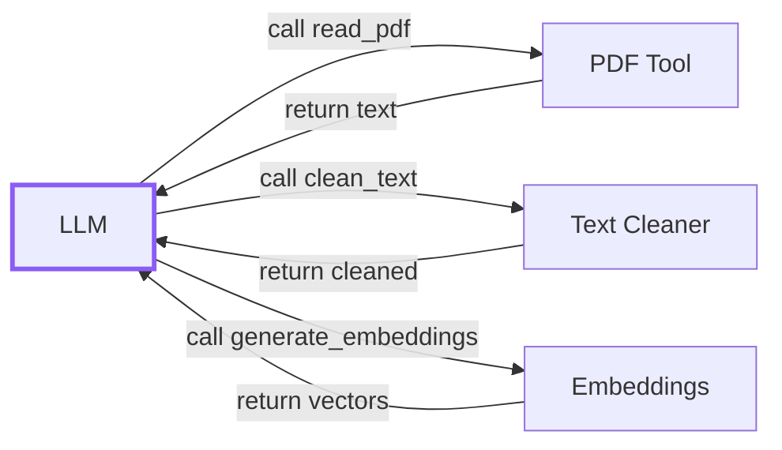
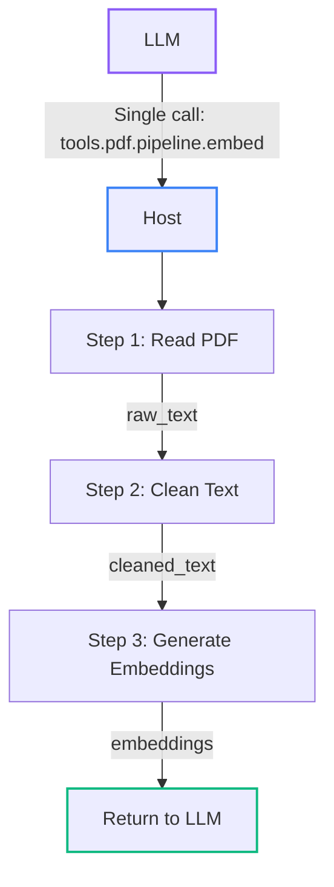
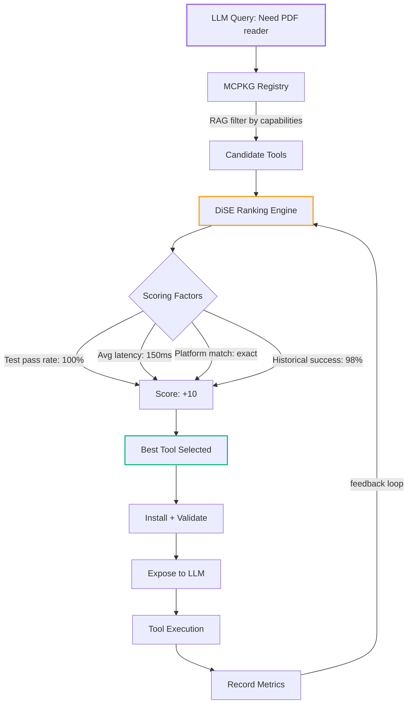
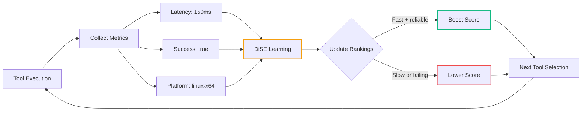
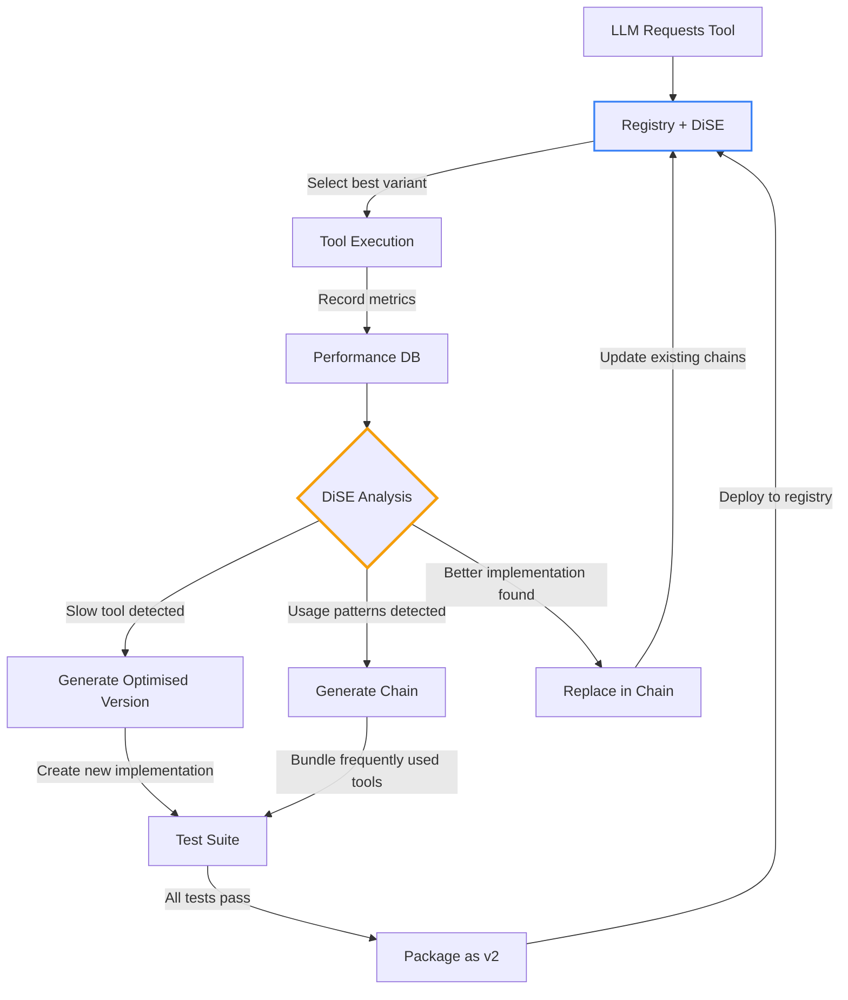

# MCPKG: The AI-Native Package Manager That LLMs Actually Understand

## Executive Summary

**MCPKG** is a revolutionary package format and tooling ecosystem designed specifically for AI agents and LLMs. Unlike traditional package managers (npm, NuGet, pip) that require human developers to manually discover, install, and integrate libraries, MCPKG enables **semantic tool discovery** where LLMs can simply ask for capabilities and get working, tested tools automatically.

Think of it as "npm for AI" - but instead of `npm install express`, an LLM says "I need a tool to read PDFs locally for JavaScript" and the registry returns precisely the right package, the host installs it, tests it, and exposes it seamlessly.

Key innovations:
- **Semantic Discovery**: Tools indexed by capabilities, not just names
- **Built-in Testing**: Every package includes JSONPath-based tests
- **Multi-Platform**: Single logical tool, multiple platform-specific implementations
- **Composite Pipelines**: Chain tools into workflows without LLM orchestration
- **DiSE Integration**: Dynamic intelligence selection for optimal tool ranking

---

## Part 1: The Problem Space

### 1.1 Traditional Package Managers Aren't Built for AI

Current package ecosystems assume a **human developer** is in control:



**Problems for LLMs:**

1. **No Semantic Search**: "Give me a PDF reader" returns 1000+ packages
2. **No Test Contracts**: LLM doesn't know if a tool actually works
3. **Platform Chaos**: JavaScript package might not work in Node vs browser
4. **Integration Hell**: LLM must manually wire authentication, error handling, schemas
5. **No Feedback Loop**: Can't learn which tools perform best

### 1.2 What LLMs Actually Need



**MCPKG solves this by:**

- **Semantic capabilities**: Tools tagged with `["pdf", "local", "fs"]`
- **Built-in tests**: Every tool ships with passing test cases
- **Platform selection**: Host picks the right implementation automatically
- **Ready-to-use**: Schemas, auth hints, and examples included
- **Measurable**: Tests + metrics enable ranking and evolution

---

## Part 2: The MCPKG Format

### 2.1 Package Structure

Every `.mcpkg` file is a ZIP archive containing:

```
tool-id-1.0.0.mcpkg
 ├─ manifest.json          # Tool specification (required)
 ├─ tests/                 # Test cases with assertions
 │    ├─ basic.test.json
 │    └─ edge_cases.test.json
 ├─ examples/              # Usage documentation
 │    └─ quickstart.md
 ├─ sdk/                   # Multi-platform implementations
 │    ├─ javascript/
 │    ├─ dotnet/
 │    └─ python/
 └─ meta/                  # Publisher info + signatures
      ├─ publisher.json
      ├─ provenance.json
      └─ signature.sig
```

### 2.2 The Manifest

Here's a complete example for a PDF reader tool:

```json
{
  "toolId": "tools.pdf.read_local",
  "name": "Read PDFs Locally",
  "version": "1.0.0",
  "description": "Extracts text and structure from PDF files on the local filesystem.",

  "capabilities": ["pdf", "local", "fs", "text-extraction"],

  "implementations": [
    {
      "id": "node-pdfjs",
      "language": "javascript",
      "runtime": "node",
      "platforms": ["linux-x64", "win-x64", "darwin-arm64"],
      "endpoint": {
        "type": "local",
        "command": "node ./sdk/javascript/pdf-read.js"
      },
      "requirements": {
        "minNodeVersion": "18.0.0"
      }
    },
    {
      "id": "dotnet-itext",
      "language": "dotnet",
      "runtime": "net8.0",
      "platforms": ["win-x64", "linux-x64"],
      "endpoint": {
        "type": "local",
        "command": "dotnet ./sdk/dotnet/PdfReader.dll"
      }
    }
  ],

  "input_schema": {
    "type": "object",
    "properties": {
      "path": {
        "type": "string",
        "description": "Absolute path to the PDF file"
      },
      "extractImages": {
        "type": "boolean",
        "default": false,
        "description": "Whether to extract embedded images"
      }
    },
    "required": ["path"]
  },

  "output_schema": {
    "type": "object",
    "properties": {
      "text": { "type": "string" },
      "pages": { "type": "integer" },
      "metadata": { "type": "object" }
    }
  },

  "auth": {
    "type": "none"
  },

  "tests": [
    "tests/basic_extraction.test.json",
    "tests/multipage.test.json"
  ],

  "examples": [
    "examples/quickstart.md"
  ],

  "meta": {
    "publisher": {
      "id": "mostlylucid",
      "name": "Mostly Lucid",
      "website": "https://mostlylucid.net"
    },
    "license": "MIT",
    "tags": ["production", "verified"]
  }
}
```

**Key features:**

- **Capabilities array**: Semantic tags for RAG filtering
- **Implementations**: Multiple platform-specific variants
- **JSON Schema**: Strong typing for inputs/outputs
- **Tests included**: Validation built-in
- **Metadata**: Publisher info and provenance

### 2.3 Test Cases

Tests use JSONPath assertions:

```json
{
  "name": "extract_simple_pdf",
  "description": "Extracts text from a single-page PDF",

  "input": {
    "path": "/test/fixtures/simple.pdf",
    "extractImages": false
  },

  "assertions": [
    {
      "path": "$.text",
      "exists": true
    },
    {
      "path": "$.pages",
      "equals": 1
    },
    {
      "path": "$.metadata.author",
      "notEquals": null
    }
  ],

  "timeoutMs": 5000
}
```

**Benefits:**

- **LLM-readable**: Clear examples of how to call the tool
- **Host-executable**: Automated validation during install
- **Regression detection**: Continuous testing catches breaking changes
- **Performance metrics**: Track latency, success rates, etc.

---

## Part 3: Multi-Platform Support

### 3.1 The Problem: One Tool, Many Runtimes

Consider: "Give me a tool to read PDFs locally"

**Challenge:** The LLM doesn't care about:
- JavaScript vs .NET vs Python
- Node.js vs browser
- Linux vs Windows vs macOS
- x64 vs ARM64

But the **host** needs to execute the right code for the current environment.

### 3.2 Solution: Logical Tools + Physical Implementations



### 3.3 Discovery Flow

**LLM perspective:**

```typescript
// LLM sends a semantic query to the registry
const query = {
  capabilities: ["pdf", "local"],
  language: "javascript",
  runtime: "node"
};

// Registry returns matching logical tool
const tool = {
  toolId: "tools.pdf.read_local",
  name: "Read PDFs Locally",
  description: "...",
  input_schema: { /* ... */ }
};

// LLM calls the tool (implementation-agnostic)
const result = await callTool("tools.pdf.read_local", {
  path: "/documents/report.pdf"
});
```

**Host perspective:**

```csharp
// Host receives install request
await installer.InstallFromUrlAsync(
    "https://registry.mcpkg.dev/tools.pdf.read_local.mcpkg");

// Host detects platform
var platform = PlatformDetector.GetCurrent();
// → { os: "linux", arch: "x64", runtime: "node@20.10.0" }

// Host selects best implementation
var impl = manifest.Implementations
    .Where(i => i.Platforms.Contains(platform.ToString()))
    .Where(i => i.Runtime == "node")
    .OrderByDescending(i => i.Version)
    .First();
// → node-pdfjs

// Host executes selected implementation
var output = await Process.RunAsync(
    impl.Endpoint.Command,
    JsonSerializer.Serialize(input));
```

**The magic:** LLM sees one tool, host executes the right variant.

---

## Part 4: Composite Tools with Chains

### 4.1 The Problem: Multi-Step Workflows

Many tasks require **pipelines**:

- **PDF → Embeddings**: Read PDF → Clean text → Generate embeddings
- **Audio → Summary**: Transcribe → Translate → Summarise
- **Image → CSV**: OCR → Extract tables → Format as CSV

**Traditional approach:** LLM orchestrates each step



**Problems:**
- 3+ LLM round-trips (latency)
- LLM must handle errors at each step
- Can't optimise the pipeline as a unit

### 4.2 Solution: Predefined Chains

```jsonc
{
  "toolId": "tools.pdf.pipeline.embed",
  "name": "PDF to Embeddings Pipeline",
  "version": "1.0.0",
  "capabilities": ["pdf", "embeddings", "pipeline"],

  "chain": [
    {
      "step": "read_pdf",
      "tool": "tools.pdf.read_local",
      "inputMapping": {
        "path": "$.input.pdfPath"
      },
      "outputKey": "raw_text"
    },
    {
      "step": "clean_text",
      "tool": "tools.text.clean",
      "inputMapping": {
        "text": "$.raw_text.text"
      },
      "outputKey": "cleaned_text"
    },
    {
      "step": "generate_embeddings",
      "tool": "tools.embeddings.generate",
      "inputMapping": {
        "text": "$.cleaned_text.result",
        "model": "$.input.embeddingModel"
      },
      "outputKey": "embeddings"
    }
  ],

  "input_schema": {
    "type": "object",
    "properties": {
      "pdfPath": { "type": "string" },
      "embeddingModel": { "type": "string", "default": "text-embedding-3-small" }
    },
    "required": ["pdfPath"]
  },

  "output_schema": {
    "type": "object",
    "properties": {
      "embeddings": { "type": "array", "items": { "type": "number" } }
    }
  }
}
```

### 4.3 Chain Execution



**Benefits:**

- **Single LLM call**: One round-trip instead of 3+
- **Lower latency**: Host executes locally without LLM involvement
- **Atomic unit**: Pipeline succeeds or fails as a whole
- **DiSE-optimisable**: System can evolve better chains over time

---

## Part 5: The CLI Experience

### 5.1 Beautiful, Functional Interface

MCPKG includes a production-ready CLI built with **Spectre.Console**:

```bash
# Create a package
mcpkg create ./my-tool --output my-tool.mcpkg

# Install from local file
mcpkg install my-tool.mcpkg

# Install from URL
mcpkg install https://registry.mcpkg.dev/tools.pdf.read_local.mcpkg

# List installed tools
mcpkg list

# Run tests
mcpkg test tools.pdf.read_local

# Export for LLM runtime
mcpkg export --output tools.json --run-tests

# Validate a manifest
mcpkg validate manifest.json

# Uninstall
mcpkg uninstall tools.pdf.read_local
```

### 5.2 Example Output

```
╭──────────────────────────────────────────────────╮
│ MCPKG                                           │
│ AI-native package manager for MCP tools v0.1.0 │
╰──────────────────────────────────────────────────╯

✓ Package installed successfully!
  Tool ID: tools.pdf.read_local
  Version: 1.0.0
  Location: .mcp/tools/tools.pdf.read_local

Running 3 test(s)...

╭───────────────────────┬────────┬──────────┬────────────────────╮
│ Test                  │ Status │ Duration │ Details            │
├───────────────────────┼────────┼──────────┼────────────────────┤
│ extract_simple_pdf    │ PASS   │ 127ms    │ 3 assertions passed│
│ extract_multipage     │ PASS   │ 234ms    │ 5 assertions passed│
│ handle_encrypted_pdf  │ PASS   │ 89ms     │ 2 assertions passed│
╰───────────────────────┴────────┴──────────┴────────────────────╯

3 passed, 0 failed, avg latency: 150.0ms
```

---

## Part 6: Integration with DiSE

### 6.1 Dynamic Intelligence Selection

MCPKG is designed to integrate seamlessly with **DiSE** (Dynamic Intelligence Selection Engine):



### 6.2 Continuous Evolution

DiSE can:

1. **Generate chains** from usage patterns:
   - "Users who call PDF read + text clean + embeddings → bundle as pipeline"

2. **Optimise implementations**:
   - Replace slow Node.js PDF reader with faster Rust WASM variant
   - A/B test different implementations under load

3. **Detect regressions**:
   - Continuous testing catches when tools break
   - Automatic rollback to previous working version

4. **Rank dynamically**:
   - CPU-only environment → prioritise lightweight tools
   - GPU available → prefer ML-accelerated variants

### 6.3 The Feedback Loop



---

## Part 7: Technical Architecture

### 7.1 Project Structure

```
McPkg.Core/
├─ Models/                    # Data models with JSON source generation
│  ├─ Manifest.cs             # Tool specification
│  ├─ TestCase.cs             # Test definitions
│  ├─ ToolDefinition.cs       # LLM runtime format
│  └─ McpkgJsonContext.cs     # Source-generated serialization
│
├─ Validation/                # JSON Schema validation
│  ├─ ManifestValidator.cs    # Validates manifests
│  └─ TestCaseValidator.cs    # Validates test cases
│
├─ PackageManager/            # Core package operations
│  ├─ PackageCreator.cs       # Create .mcpkg from folder
│  ├─ PackageInstaller.cs     # Install + URL support
│  └─ ToolsExporter.cs        # Export to tools.json
│
└─ Testing/                   # Test execution
   └─ TestRunner.cs           # Run tests with JSONPath assertions

McPkg.Cli/
└─ Program.cs                 # Spectre.Console CLI
```

### 7.2 Technology Stack

**Core Library:**
- .NET 8.0 (modern C#, nullable reference types)
- `System.Text.Json` with source generation (performance)
- `JsonSchema.Net` (JSON Schema validation)
- `JsonPath.Net` (test assertions)

**CLI:**
- `Spectre.Console` (beautiful terminal UI)
- `System.CommandLine` (command parsing)

**Design Principles:**
- Zero dependency on Newtonsoft.Json
- JSON source generation for minimal allocations
- Async/await throughout for I/O operations
- Comprehensive validation at every layer

### 7.3 Key Code: Creating a Package

```csharp
var creator = new PackageCreator();

var result = await creator.CreatePackageAsync(
    sourceFolder: "./my-tool",
    outputPath: "my-tool-1.0.0.mcpkg",
    validate: true  // Validates manifest + tests
);

if (result.IsValid)
{
    Console.WriteLine($"✓ Package created: {outputPath}");

    // Show warnings
    foreach (var warning in result.Warnings)
    {
        Console.WriteLine($"! {warning}");
    }
}
else
{
    foreach (var error in result.Errors)
    {
        Console.WriteLine($"✗ {error}");
    }
}
```

### 7.4 Key Code: Installing from URL

```csharp
var installer = new PackageInstaller(installRoot: ".mcp/tools");

var (validation, packageInfo) = await installer.InstallFromUrlAsync(
    url: "https://registry.mcpkg.dev/tools.pdf.read_local.mcpkg",
    validate: true
);

if (validation.IsValid && packageInfo != null)
{
    Console.WriteLine($"Installed: {packageInfo.ToolId} v{packageInfo.Version}");
    Console.WriteLine($"Location: {packageInfo.InstallPath}");
}
```

### 7.5 Key Code: Running Tests

```csharp
var manifest = await installer.LoadManifestAsync("tools.pdf.read_local");
var testCases = await LoadTestCasesAsync(manifest.Tests);

var runner = new TestRunner();
var results = await runner.RunTestsAsync(manifest, testCases);

foreach (var result in results)
{
    if (result.Passed)
    {
        Console.WriteLine($"✓ {result.TestName} ({result.DurationMs}ms)");
    }
    else
    {
        Console.WriteLine($"✗ {result.TestName}: {result.ErrorMessage}");

        // Show failed assertions
        foreach (var assertion in result.AssertionResults.Where(a => !a.Passed))
        {
            Console.WriteLine($"  Path: {assertion.Path}");
            Console.WriteLine($"  Expected: {assertion.ExpectedValue}");
            Console.WriteLine($"  Actual: {assertion.ActualValue}");
        }
    }
}
```

---

## Part 8: Comparison with Existing Solutions

### 8.1 vs npm/NuGet/pip

| Feature | npm/NuGet/pip | MCPKG |
|---------|---------------|-------|
| **Discovery** | Text search (keywords) | Semantic RAG (capabilities) |
| **Testing** | Optional (dev runs tests) | Required (built into package) |
| **Platform support** | Manual (package.json engines) | Explicit (implementations array) |
| **LLM integration** | None | First-class (tools.json export) |
| **Validation** | npm audit (security only) | Full schema + functional tests |
| **Provenance** | Optional (npm provenance) | Built-in (meta/provenance.json) |

### 8.2 vs OpenAPI/Swagger

| Feature | OpenAPI | MCPKG |
|---------|---------|-------|
| **Scope** | API documentation | Full tool packaging |
| **Tests** | External (Postman, etc.) | Included in package |
| **Multi-platform** | No | Yes (implementations) |
| **Semantic discovery** | No | Yes (capabilities) |
| **Execution** | Client must implement | Host provides execution |

### 8.3 vs MCP Servers

| Feature | MCP Server | MCPKG |
|---------|------------|-------|
| **Deployment** | Developer runs server | Package auto-installs |
| **Testing** | Manual | Built-in + automated |
| **Discovery** | Manual registration | Semantic registry |
| **Versioning** | Ad-hoc | SemVer + manifests |
| **Multi-platform** | Server-specific | Implementations array |

**Key insight:** MCPKG complements MCP by providing packaging, distribution, and validation on top of the MCP protocol.

---

## Part 9: Real-World Use Cases

### 9.1 Enterprise Tool Catalogue

**Scenario:** Large organisation with 100+ internal APIs

**Traditional approach:**
- Developers manually write integration code
- No consistency across teams
- LLMs can't discover or use internal tools

**MCPKG approach:**

```bash
# DevOps packages each API
mcpkg create ./internal-api-1 --output apis/api1.mcpkg
mcpkg create ./internal-api-2 --output apis/api2.mcpkg

# Push to internal registry
for pkg in apis/*.mcpkg; do
    curl -X POST https://registry.internal/upload -F "package=@$pkg"
done

# LLM queries registry
"Show me all tools for customer data with write access"
→ Returns: crm.customers.update, billing.customers.create, etc.

# Auto-install + use
LLM: "Update customer 12345's email to new@example.com"
Host: Installs crm.customers.update → Runs tests → Executes → Returns result
```

### 9.2 Multi-Cloud Tool Abstraction

**Scenario:** Deploy same agent on AWS, Azure, GCP

**Challenge:** Storage APIs differ across clouds

**Solution:** Create logical tool with cloud-specific implementations

```jsonc
{
  "toolId": "cloud.storage.upload",
  "implementations": [
    {
      "id": "aws-s3",
      "cloud": "aws",
      "endpoint": { "command": "node ./sdk/aws/s3-upload.js" }
    },
    {
      "id": "azure-blob",
      "cloud": "azure",
      "endpoint": { "command": "dotnet ./sdk/azure/BlobUpload.dll" }
    },
    {
      "id": "gcp-storage",
      "cloud": "gcp",
      "endpoint": { "command": "python ./sdk/gcp/storage_upload.py" }
    }
  ]
}
```

**LLM perspective:** Single tool `cloud.storage.upload`

**Host selection:** Auto-detects cloud provider and uses correct SDK

### 9.3 Agentic Workflow Optimization

**Scenario:** PDF processing workflow used 1000+ times/day

**Initial chain:** (slow)
- Read PDF: 200ms
- Clean text: 50ms
- Generate embeddings: 800ms
- **Total: 1050ms**

**DiSE evolution:**
1. Detects high usage + slow step (embeddings)
2. Tests 3 alternative embedding implementations
3. Finds Rust-based embedder: 200ms (4x faster)
4. Generates v2 chain with optimised implementation
5. A/B tests: v2 is 60% faster
6. Promotes v2 as default

**Result:**
- v2 chain: 450ms total (57% improvement)
- Automatic rollout to all users
- Continuous monitoring for regressions

---

## Part 10: Getting Started

### 10.1 Installation

```bash
# Clone repository
git clone https://github.com/scottgal/mostlylucid.dse.git
cd mostlylucid.dse/mcpkg

# Build
dotnet build

# Publish CLI
dotnet publish McPkg.Cli -c Release -o ~/bin/mcpkg

# Add to PATH
export PATH="$HOME/bin/mcpkg:$PATH"
```

### 10.2 Create Your First Package

**Step 1:** Create tool folder structure

```bash
mkdir my-first-tool
cd my-first-tool
mkdir tests examples
```

**Step 2:** Write `manifest.json`

```json
{
  "toolId": "demo.hello",
  "name": "Hello World Tool",
  "version": "1.0.0",
  "description": "A simple hello world tool for demonstration",
  "capabilities": ["demo", "hello"],
  "endpoint": {
    "type": "http",
    "method": "POST",
    "url": "https://postman-echo.com/post",
    "timeoutMs": 5000
  },
  "input_schema": {
    "type": "object",
    "properties": {
      "name": { "type": "string" }
    },
    "required": ["name"]
  },
  "output_schema": {
    "type": "object",
    "properties": {
      "data": { "type": "object" }
    }
  },
  "tests": ["tests/hello.test.json"],
  "examples": ["examples/usage.md"]
}
```

**Step 3:** Write test

```json
// tests/hello.test.json
{
  "name": "hello_test",
  "description": "Tests hello functionality",
  "input": { "name": "World" },
  "assertions": [
    { "path": "$.data.name", "equals": "World" }
  ]
}
```

**Step 4:** Create package

```bash
mcpkg create . --output hello.mcpkg
```

**Step 5:** Install and test

```bash
mcpkg install hello.mcpkg
mcpkg test demo.hello
```

---

## Part 11: Roadmap and Future Vision

### 11.1 Short-Term (v0.2)

- **Registry server**: Centralised package hosting
- **Package signing**: Cryptographic verification
- **Local endpoints**: Support for `file://` and `exec://`
- **Dependency management**: Tools depending on other tools
- **Web UI**: Browser-based package management

### 11.2 Medium-Term (v0.3)

- **gRPC support**: High-performance binary protocol
- **Streaming responses**: For long-running operations
- **Capability negotiation**: Dynamic feature detection
- **Performance profiling**: Built-in benchmarking
- **A/B testing framework**: Compare implementations automatically

### 11.3 Long-Term Vision

**The Self-Improving Tool Ecosystem:**



**Key innovations:**

1. **Self-healing**: DiSE detects failing tools and auto-fixes or replaces them
2. **Auto-optimisation**: System continuously improves tool performance
3. **Emergent workflows**: Discover optimal tool chains from usage patterns
4. **Federated evolution**: Multiple DiSE instances share improvements
5. **Zero-touch deployment**: LLMs get better tools automatically

---

## Conclusion

MCPKG represents a fundamental shift in how AI agents discover, install, and use tools. By combining:

- **Semantic discovery** (capabilities-based RAG)
- **Built-in validation** (tests + metrics)
- **Multi-platform support** (implementations array)
- **Composite workflows** (chains)
- **Dynamic selection** (DiSE integration)

…we've created a package ecosystem that LLMs can actually understand and use effectively.

**The vision:** LLMs should be able to ask for capabilities and get working, tested, optimised tools automatically - just like humans use package managers, but semantic instead of textual.

**The reality:** MCPKG v0.1 is production-ready today. Install it, try it, and help us build the AI-native package ecosystem of the future.

---

## Resources

- **Repository**: https://github.com/scottgal/mostlylucid.dse
- **Documentation**: See `mcpkg/README.md` and `mcpkg/SPEC.md`
- **Example Package**: `mcpkg/examples/echo-tool/`
- **Blog**: https://mostlylucid.net

**Get involved:**
- Try the CLI and provide feedback
- Build your own .mcpkg packages
- Contribute implementations for popular tools
- Help design the registry architecture

Let's build the future of AI tooling together.
