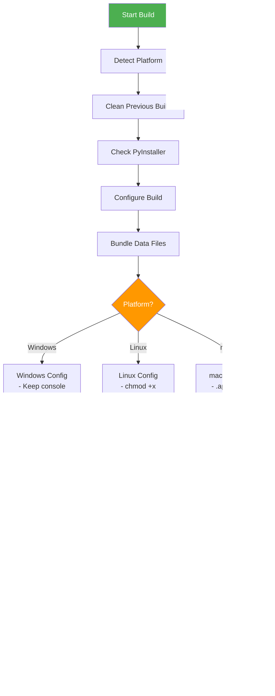

# Understanding The Forge: A Deep Dive into the Code Evolution Build System

## Introduction

The Forge is a sophisticated build and workflow system designed to create, manage, and execute code evolution workflows. At its core, it's a meta-programming system that can generate tools, build workflows, and evolve code through LLM-powered transformations. This article takes you through the complete architecture, showing you exactly how the system constructs workflows, manages tools, and executes code.

**What you'll learn:**
- The complete architecture of the Forge build system
- How workflows are constructed from YAML definitions
- The tool loading and execution pipeline
- How the build system creates standalone executables
- Real code examples with detailed explanations
- The workflow execution lifecycle

---

## Table of Contents

1. [System Architecture](#system-architecture)
2. [The Build System](#the-build-system)
3. [Workflow Construction](#workflow-construction)
4. [Tool Management](#tool-management)
5. [Runtime Execution](#runtime-execution)
6. [Complete Workflow Example](#complete-workflow-example)
7. [Advanced Features](#advanced-features)

---

## System Architecture

The Forge consists of five major subsystems that work together to create a complete code evolution environment:


### Key Components

1. **User Interface Layer**: Entry points for user interaction
2. **Workflow Layer**: Declarative workflow construction and execution
3. **Tool Layer**: Tool registry and management
4. **Execution Layer**: Runtime environment for code execution
5. **Build Layer**: Packaging and distribution

---

## The Build System

The build system (`build.py`) is responsible for creating standalone executable files from Python applications. It uses PyInstaller under the hood but adds intelligent dependency management and platform-specific optimizations.

### Build System Architecture



### Build System Code Walkthrough

Let's examine the core build function from `build.py`:

```python
def build_executable(platform_name: str, app_name: str = "CodeEvolver"):
    """
    Build executable for specified platform.

    This function orchestrates the entire build process:
    1. Configures PyInstaller with platform-specific settings
    2. Bundles data files (prompts, config, documentation)
    3. Creates a single-file executable
    4. Verifies the output

    Args:
        platform_name: Target platform (windows, linux, macos)
        app_name: Application name
    """
    print(f"\n{'='*60}")
    print(f"Building {app_name} for {platform_name}")
    print(f"{'='*60}\n")

    # Base PyInstaller arguments
    # --name: Sets the executable name
    # --onefile: Creates a single executable (no dependencies)
    # --clean: Removes previous build cache
    # --noconfirm: Overwrites without prompting
    args = [
        "pyinstaller",
        "--name", app_name,
        "--onefile",  # Single executable
        "--clean",
        "--noconfirm",
    ]
```

**Why `--onefile`?** This is crucial for deployment. Instead of creating a folder with hundreds of files, PyInstaller bundles everything into a single executable. This makes distribution dramatically simpler.

#### Data File Bundling

```python
    # Add data files
    # These files are embedded into the executable
    # The syntax is: source_path:destination_path
    data_files = [
        ("prompts", "prompts"),      # System prompts directory
        ("config.yaml", "."),        # Configuration file
        ("APP_MANUAL.md", "."),      # User documentation
        ("CLAUDE.md", "."),          # Claude integration docs
        ("BUILD_SCRIPTS.md", "."),   # Build documentation
        ("QUICKSTART.md", "."),      # Quick start guide
        ("README.md", "."),          # Main readme
    ]

    for src, dest in data_files:
        if Path(src).exists():
            # Platform-specific path separator
            # Windows uses ';' while Unix uses ':'
            separator = ';' if platform_name == 'windows' else ':'
            args.extend(["--add-data", f"{src}{separator}{dest}"])
        else:
            print(f"Warning: {src} not found, skipping...")
```

**Key Insight**: The path separator is platform-specific. Windows uses semicolons (`;`) to separate source and destination paths, while Linux and macOS use colons (`:`). This is a common source of cross-platform build failures.

#### Platform-Specific Configuration

```python
    # Platform-specific settings
    if platform_name == "windows":
        # Keep console visible for CLI app
        # We DON'T use --noconsole because this is a CLI tool
        # If this were a GUI app, we'd add --noconsole
        pass  # No special Windows config needed

    elif platform_name == "macos":
        # macOS apps use .app bundles
        args.extend([
            "--windowed",  # Create .app bundle
            # "--icon", "icon.icns",  # Would add custom icon
        ])
```

**Why no `--noconsole` on Windows?** This is a CLI application that needs to interact with the terminal. Using `--noconsole` would hide all output, making it impossible to use. This flag is only for GUI applications.

#### Build Execution

```python
    # Entry point - the main Python file to execute
    args.append("chat_cli.py")

    print("Running PyInstaller with arguments:")
    print(" ".join(args))
    print()

    try:
        # subprocess.run executes PyInstaller
        # check=True raises CalledProcessError on failure
        result = subprocess.run(args, check=True)

        if result.returncode == 0:
            print(f"\n{'='*60}")
            print(f"✓ Build successful!")
            print(f"{'='*60}")

            # Determine executable path based on platform
            if platform_name == "windows":
                exe_path = Path("dist") / f"{app_name}.exe"
            elif platform_name == "macos":
                exe_path = Path("dist") / f"{app_name}.app"
            else:  # Linux
                exe_path = Path("dist") / app_name

            if exe_path.exists():
                print(f"\nExecutable created: {exe_path.absolute()}")

                # Calculate and display file size
                if exe_path.is_file():
                    size_mb = exe_path.stat().st_size / (1024 * 1024)
                    print(f"Size: {size_mb:.2f} MB")
            else:
                print(f"\nWarning: Expected executable not found at {exe_path}")

            return True

    except subprocess.CalledProcessError as e:
        print(f"\n✗ Build failed with error code {e.returncode}")
        return False
```

**Error Handling**: The build system uses exceptions for error handling. `subprocess.run` with `check=True` will raise `CalledProcessError` if PyInstaller fails, allowing us to catch and report the error gracefully.

### Build Packaging Process

After building the executable, the system creates a complete distribution package:


**Package Contents**:
- **Executable**: Single-file application (no dependencies)
- **Configuration**: `config.yaml` with default settings
- **Documentation**: README, LICENSE, manuals
- **Prompts**: System prompt templates
- **Installer**: Platform-specific install script
- **Archive**: ZIP file for distribution

**Installer Scripts**:

Windows (`install.bat`):
```batch
@echo off
echo Installing CodeEvolver...
mkdir "%APPDATA%\CodeEvolver"
copy CodeEvolver.exe "%APPDATA%\CodeEvolver\"
copy config.yaml "%APPDATA%\CodeEvolver\"
echo Installation complete!
```

Linux/macOS (`install.sh`):
```bash
#!/bin/bash
echo "Installing CodeEvolver..."
mkdir -p ~/.local/bin
mkdir -p ~/.config/code_evolver
cp CodeEvolver ~/.local/bin/
cp config.yaml ~/.config/code_evolver/
chmod +x ~/.local/bin/CodeEvolver
echo "Installation complete!"
```

---

## Workflow Construction

Workflows are the heart of the Forge system. They define how tools are connected, how data flows between steps, and what transformations are applied.

### Workflow Data Structures

The workflow system uses three core data structures defined in `workflow_spec.py`:


### Step Types Explained

The `StepType` enum defines four different kinds of workflow steps:

```python
class StepType(Enum):
    """Types of workflow steps"""
    LLM_CALL = "llm_call"              # Call an LLM tool
    PYTHON_TOOL = "python_tool"        # Execute a Python tool
    SUB_WORKFLOW = "sub_workflow"      # Execute a nested workflow
    EXISTING_TOOL = "existing_tool"    # Use a registered tool
```

**LLM_CALL**: This step type calls an LLM (Large Language Model) with a prompt. For example, you might use this to generate content, analyze text, or answer questions.

**PYTHON_TOOL**: This executes a Python script or function. The tool can be either pre-existing or dynamically generated during workflow execution.

**SUB_WORKFLOW**: This allows workflows to call other workflows, creating a hierarchy. This is crucial for building complex, modular systems.

**EXISTING_TOOL**: This references a tool that's already registered in the tool registry, allowing for reusable components.

### Building a Simple Workflow

Let's walk through how to build a workflow programmatically:

```python
from workflow_spec import (
    WorkflowSpec, WorkflowStep, WorkflowInput, WorkflowOutput,
    StepType, create_simple_workflow
)

# Step 1: Create the base workflow
# This initializes with ID, description, and timestamp
workflow = create_simple_workflow(
    workflow_id="article_writer",
    description="Generate a blog article with outline and content"
)

# Step 2: Define inputs
# Workflows can accept parameters - here we need a topic
workflow.add_input(
    name="topic",
    type="string",
    required=True,
    description="Topic to write about"
)

# Step 3: Add workflow steps
# First step: Create an outline
workflow.add_step(WorkflowStep(
    step_id="create_outline",
    step_type=StepType.LLM_CALL,
    description="Create article outline",
    tool_name="content_generator",

    # The prompt template uses {topic} as a placeholder
    # This will be filled in from the input_mapping
    prompt_template="Create an outline for an article about {topic}",

    # input_mapping tells the workflow where to get data
    # "inputs.topic" means "use the 'topic' input parameter"
    input_mapping={"topic": "inputs.topic"},

    # The output will be stored under this name
    # Other steps can reference it as "steps.create_outline.outline"
    output_name="outline"
))

# Second step: Write the article using the outline
workflow.add_step(WorkflowStep(
    step_id="write_article",
    step_type=StepType.LLM_CALL,
    description="Write the article",
    tool_name="content_generator",

    # This prompt uses the output from the previous step
    prompt_template="Write an article based on this outline: {outline}",

    # Notice how we reference the previous step's output
    # "steps.create_outline.outline" means:
    #   - Look at the "create_outline" step
    #   - Get its "outline" output
    input_mapping={"outline": "steps.create_outline.outline"},

    output_name="article"
))

# Step 4: Define outputs
# The workflow's final output comes from the last step
workflow.add_output(
    name="final_article",
    type="string",

    # source_reference points to where the data comes from
    source_reference="steps.write_article.article",

    description="The completed article"
)

# Step 5: Validate the workflow
is_valid, message = workflow.validate()
if not is_valid:
    raise ValueError(f"Invalid workflow: {message}")

# Step 6: Export to JSON
workflow_json = workflow.to_json()
print(workflow_json)
```

#### Understanding Input Mapping

Input mapping is how data flows through the workflow. Let's break down the syntax:

```python
input_mapping={"topic": "inputs.topic"}
#              ^^^^^^    ^^^^^^^^^^^^^
#              |         |
#              |         Source: where to get the data
#              |         - "inputs.X" = workflow input parameter
#              |         - "steps.Y.Z" = output from step Y
#              |
#              Target: variable name in the template
```

Here's how data flows through a multi-step workflow:


**Data Flow Explained**:
1. **Workflow inputs** (blue) are provided by the user
2. **Step outputs** (orange) are stored and can be referenced by later steps
3. **Final output** (green) is extracted from the last step
4. **References** use dot notation: `inputs.X` or `steps.Y.Z`

### Workflow JSON Format

When you call `workflow.to_json()`, it produces a JSON specification like this:

```json
{
  "workflow_id": "article_writer",
  "version": "1.0.0",
  "description": "Generate a blog article with outline and content",
  "created_by": "code_evolver",
  "created_at": "2025-01-20T10:30:00Z",
  "tags": [],
  "portable": false,

  "inputs": {
    "topic": {
      "type": "string",
      "required": true,
      "description": "Topic to write about"
    }
  },

  "outputs": {
    "final_article": {
      "type": "string",
      "source_reference": "steps.write_article.article",
      "description": "The completed article"
    }
  },

  "steps": [
    {
      "step_id": "create_outline",
      "type": "llm_call",
      "description": "Create article outline",
      "tool": "content_generator",
      "prompt_template": "Create an outline for an article about {topic}",
      "input_mapping": {
        "topic": "inputs.topic"
      },
      "output_name": "outline"
    },
    {
      "step_id": "write_article",
      "type": "llm_call",
      "description": "Write the article",
      "tool": "content_generator",
      "prompt_template": "Write an article based on this outline: {outline}",
      "input_mapping": {
        "outline": "steps.create_outline.outline"
      },
      "output_name": "article"
    }
  ],

  "dependencies": {
    "llm_tools": ["content_generator"],
    "python_tools": [],
    "pip_packages": []
  }
}
```

**Portable vs. Non-Portable Workflows**:
- **Non-portable** (default): Lists tool dependencies but doesn't include the actual tool code
- **Portable**: Embeds complete tool definitions, making the workflow self-contained

### Workflow Validation Process

Before a workflow can execute, it must pass validation:


**Validation Checks**:
1. **Workflow ID**: Must be present and non-empty
2. **Steps**: Must have at least one step defined
3. **Unique IDs**: All step IDs must be unique
4. **Valid References**: All input mappings must reference existing inputs or steps
5. **No Cycles**: Dependencies must form a DAG (Directed Acyclic Graph)
6. **Dependencies Exist**: All `depends_on` steps must exist

---

## Tool Management

The Tools Manager (`tools_manager.py`) is responsible for discovering, loading, and executing all tools in the system.

### Tool Types

The system supports multiple tool types organized in a hierarchy:


The full enumeration in code:

```python
class ToolType(Enum):
    """Types of tools that can be registered."""
    # Execution Tools
    FUNCTION = "function"              # Python function
    EXECUTABLE = "executable"         # Command-line tool
    WORKFLOW = "workflow"             # Complete workflow

    # Integration Tools
    OPENAPI = "openapi"               # OpenAPI/REST API tool
    MCP = "mcp"                       # Model Context Protocol tool
    MESSAGE_QUEUE = "message_queue"   # Kafka/RabbitMQ

    # Data & Storage Tools
    DATABASE = "database"             # Database connections
    FILE_SYSTEM = "file_system"       # File storage
    VECTOR_STORE = "vector_store"     # RAG/embeddings
    CACHE = "cache"                   # In-memory/Redis cache

    # AI/ML Tools
    LLM = "llm"                       # Specialized LLM model
    FINE_TUNED_LLM = "fine_tuned_llm" # Fine-tuned models
    OPTIMIZER = "optimizer"           # Code optimizers
```

### YAML Tool Definitions

Tools are defined using YAML files. Let's examine a real example - the `evolve_tool.yaml`:

```yaml
name: "Evolve Tool"
type: "executable"
description: "Evolves a failing tool by regenerating it with fixes and mutations."

# Should this tool's usage be tracked in RAG?
track_usage: false

# Execution configuration
executable:
  command: "python"
  args: ["tools/executable/evolve_tool.py"]

# Input parameters (JSON schema)
input_schema:
  tool_id:
    type: string
    description: "ID of the tool to evolve"
    required: true

  error_message:
    type: string
    description: "Error message that occurred"
    required: false
    default: "Unknown error"

  mutation_hint:
    type: string
    description: "User hint for what to fix/change"
    required: false
    default: "Fix the error"

  dynamic_schema:
    type: boolean
    description: "Make output schema dynamic (flexible JSON)"
    default: false
    required: false

# Output format (JSON schema)
output_schema:
  type: object
  properties:
    success:
      type: boolean
    tool_id:
      type: string
    original_version:
      type: string
    new_version:
      type: string
    evolved_file:
      type: string
      description: "Path to evolved tool file"
    message:
      type: string

# Classification tags for discovery
tags: ["evolution", "tool-mutation", "code-generation", "self-improvement"]

# Resource usage tiers
cost_tier: "medium"     # API/compute cost
speed_tier: "slow"      # Execution time
quality_tier: "excellent" # Output quality
priority: 90            # Execution priority (0-100)
```

**Why YAML?** YAML is human-readable and supports complex nested structures without the verbosity of JSON. It's perfect for configuration files that humans need to edit frequently.

### Tool Loading Process


### Tool Hash and Versioning

One of the most sophisticated features is automatic versioning based on content changes:

```python
def calculate_tool_hash(tool_def: Dict[str, Any]) -> str:
    """
    Calculate SHA256 hash of tool definition for change detection.

    This is used to detect when a tool's definition has changed.
    If the hash changes, we automatically bump the version number.

    Args:
        tool_def: Tool definition dictionary (from YAML)

    Returns:
        Hexadecimal hash string
    """
    # Create a stable JSON representation
    # sort_keys=True ensures the same dict always produces
    # the same hash, regardless of key order
    stable_json = json.dumps(tool_def, sort_keys=True)

    # SHA256 is cryptographically secure and produces
    # a 64-character hexadecimal string
    return hashlib.sha256(stable_json.encode('utf-8')).hexdigest()


def bump_version(current_version: str, change_type: str = "patch") -> str:
    """
    Bump semantic version based on change type.

    Semantic versioning format: MAJOR.MINOR.PATCH
    - MAJOR: Breaking changes (incompatible API changes)
    - MINOR: New features (backward-compatible)
    - PATCH: Bug fixes (backward-compatible)

    Args:
        current_version: Current version (e.g., "1.2.3")
        change_type: Type of change: "major", "minor", or "patch"

    Returns:
        New version string
    """
    try:
        major, minor, patch = map(int, current_version.split('.'))

        if change_type == "major":
            # Breaking change: increment major, reset minor and patch
            return f"{major + 1}.0.0"
        elif change_type == "minor":
            # New feature: increment minor, reset patch
            return f"{major}.{minor + 1}.0"
        else:  # patch
            # Bug fix: increment patch only
            return f"{major}.{minor}.{patch + 1}"
    except:
        # Invalid version format, start fresh
        return "1.0.0"
```

**Why automatic versioning?** When you modify a tool's YAML definition, the system automatically detects the change via hash comparison and bumps the version. This creates a complete history of tool evolution without manual intervention.

### Tool Versioning Decision Flow


**Versioning Rules**:
- **Major** (X.0.0): Breaking changes that affect existing workflows
- **Minor** (X.Y.0): New features that are backward-compatible
- **Patch** (X.Y.Z): Bug fixes and improvements

---

## Runtime Execution

The Node Runtime (`node_runtime.py`) provides the execution environment for generated code and workflows.

### Runtime Architecture


### The Singleton Pattern

The runtime uses a singleton pattern to ensure only one instance exists:

```python
class NodeRuntime:
    """Runtime environment for generated nodes."""

    # Class variable to store the single instance
    _instance = None

    @classmethod
    def get_instance(cls):
        """
        Get singleton instance.

        Why singleton? Because we want to share:
        - The same Ollama client connection (avoid reconnecting)
        - The same Tools Manager (tools are loaded once)
        - The same RAG memory (avoid reloading embeddings)

        This significantly improves performance.
        """
        if cls._instance is None:
            cls._instance = cls()  # Create instance on first call
        return cls._instance

    def __init__(self):
        """
        Initialize runtime.

        This is only called once (singleton pattern).
        All initialization happens here.
        """
        # Load configuration from config.yaml
        config_path = Path(__file__).parent / "config.yaml"
        self.config = ConfigManager(str(config_path))

        # Initialize Ollama client for LLM calls
        # This maintains a persistent connection to the Ollama server
        self.client = OllamaClient(
            self.config.ollama_url,
            config_manager=self.config
        )

        # Initialize RAG (Retrieval-Augmented Generation) memory
        # This loads embeddings for semantic search
        self.rag = create_rag_memory(self.config, self.client)

        # Initialize tools manager
        # This loads all tool definitions from YAML files
        self.tools = ToolsManager(
            config_manager=self.config,
            ollama_client=self.client,
            rag_memory=self.rag
        )
```

**Why Singleton?** Imagine if every function call created a new runtime instance. Each instance would:
1. Reconnect to Ollama (slow)
2. Reload all tool definitions (slow)
3. Reload RAG embeddings (very slow)

The singleton pattern ensures these expensive operations happen only once.

### Tool Calling Mechanism

The `call_tool` function is the primary interface for executing tools. Here's how it routes requests to different tool types:


The complete `call_tool` function implementation:

```python
def call_tool(self, tool_name: str, prompt: str, **kwargs) -> str:
    """
    Call any tool by name (LLM, OpenAPI, or Executable).

    This function is the universal interface for tool execution.
    It handles routing to the appropriate executor based on tool type.

    Args:
        tool_name: Name of the tool (e.g., "technical_writer")
        prompt: The prompt to send to the tool
        **kwargs: Additional arguments (temperature, system_prompt, etc.)

    Returns:
        Tool output as string

    Example:
        runtime = NodeRuntime.get_instance()

        # Call an LLM tool
        article = runtime.call_tool(
            "technical_writer",
            "Write a blog post about Python decorators",
            temperature=0.7
        )

        # Call an executable tool
        translation = runtime.call_tool(
            "nmt_translator",
            "Translate to German: Hello"
        )
    """
    from src.tools_manager import ToolType

    # Wait for tools to finish loading
    # Tools are loaded asynchronously in the background
    if hasattr(self.tools, '_loading_complete'):
        if not self.tools._loading_complete.wait(timeout=30):
            logging.warning("Tools still loading after 30s, proceeding anyway...")

    # Find the tool by name
    tool = self.tools.get_tool(tool_name)
    if not tool:
        # Fallback: Try to find best matching LLM tool
        tool = self.tools.get_best_llm_for_task(prompt)

    if not tool:
        raise ValueError(f"Tool '{tool_name}' not found")

    # Track usage in RAG (for analytics and optimization)
    disable_tracking = kwargs.pop('disable_tracking', False)
    if not disable_tracking:
        try:
            tool_metadata = getattr(tool, 'metadata', {})
            self._track_tool_usage(tool.tool_id, tool_metadata)
        except Exception as e:
            logging.warning(f"Failed to track usage: {e}")

    # Route to appropriate executor based on tool type
    if tool.tool_type == ToolType.LLM:
        # LLM tools: Call Ollama with the prompt
        return self.tools.invoke_llm_tool(
            tool.tool_id,
            prompt=prompt,
            **kwargs
        )

    elif tool.tool_type == ToolType.EXECUTABLE:
        # Executable tools: Run Python script and capture output
        result = self.tools.invoke_executable_tool(
            tool.tool_id,
            source_file="",  # Not used for prompt-based tools
            prompt=prompt,
            **kwargs
        )
        # Extract stdout (or stderr if stdout is empty)
        return result.get("stdout", "").strip() or result.get("stderr", "")

    elif tool.tool_type == ToolType.WORKFLOW:
        # Workflow tools: Execute as subprocess
        import subprocess
        import json

        # Workflows are stored in nodes/{tool_id}/main.py
        node_dir = os.path.join("nodes", tool.tool_id)
        main_py = os.path.join(node_dir, "main.py")

        if not os.path.exists(main_py):
            raise FileNotFoundError(
                f"Workflow '{tool.tool_id}' main.py not found at {main_py}"
            )

        # Execute the workflow
        try:
            # Prepare input JSON
            input_data = {"prompt": prompt}
            input_json = json.dumps(input_data)

            # Run as subprocess
            result = subprocess.run(
                ["python", main_py],
                input=input_json,           # Send input via stdin
                capture_output=True,         # Capture stdout/stderr
                text=True,                   # Return strings (not bytes)
                timeout=kwargs.get('timeout', 300)  # 5-minute timeout
            )

            if result.returncode != 0:
                raise RuntimeError(
                    f"Workflow '{tool.tool_id}' failed: {result.stderr}"
                )

            return result.stdout.strip()

        except subprocess.TimeoutExpired:
            raise TimeoutError(f"Workflow '{tool.tool_id}' timed out")

    else:
        raise ValueError(f"Unknown tool type: {tool.tool_type}")
```

### Usage Tracking

The runtime tracks tool usage for analytics and optimization:

```python
def _track_tool_usage(self, tool_id: str, tool_metadata: dict = None):
    """
    Track tool usage in RAG (enabled by default).

    This creates a usage history that enables:
    1. Identifying popular tools (for optimization)
    2. Detecting unused tools (for cleanup)
    3. Analyzing usage patterns (for recommendations)
    4. Aggregating usage across tool versions

    Args:
        tool_id: The tool's unique identifier
        tool_metadata: Tool metadata (to check for opt-out flag)
    """
    from datetime import datetime

    try:
        # Check if tracking disabled at tool level
        if tool_metadata and not tool_metadata.get('track_usage', True):
            logging.debug(f"Usage tracking disabled for tool: {tool_id}")
            return

        # Check if tracking disabled at workflow level
        if os.environ.get('DISABLE_USAGE_TRACKING', '').lower() in ('true', '1', 'yes'):
            logging.debug("Usage tracking disabled via DISABLE_USAGE_TRACKING")
            return

        # Increment usage count in RAG
        self.rag.increment_usage(tool_id)

        # Update last_used timestamp
        self.rag.update_artifact_metadata(
            tool_id,
            {
                "last_used": datetime.utcnow().isoformat() + "Z"
            }
        )

    except Exception as e:
        # Don't fail if tracking fails - it's not critical
        logging.debug(f"Usage tracking not available: {e}")
```

**Privacy Note**: Usage tracking is enabled by default but can be disabled at three levels:
1. **Tool level**: Set `track_usage: false` in the YAML
2. **Workflow level**: Set `DISABLE_USAGE_TRACKING=true` environment variable
3. **Call level**: Pass `disable_tracking=True` to `call_tool`

### RAG Integration for Semantic Tool Discovery

The system uses RAG (Retrieval-Augmented Generation) to enable semantic tool discovery. Instead of just searching by exact name, you can describe what you want to do:

```mermaid
sequenceDiagram
    participant User
    participant Runtime
    participant TM as Tools Manager
    participant RAG as RAG Memory
    participant Qdrant as Vector DB
    participant Ollama

    User->>Runtime: call_tool("translate", prompt)
    Runtime->>TM: get_tool("translate")
    TM-->>Runtime: None (not found)

    Runtime->>TM: get_best_llm_for_task(prompt)

    TM->>Ollama: Generate embedding<br/>for "translate"
    Ollama-->>TM: [0.23, 0.45, ...]

    TM->>RAG: semantic_search(embedding)
    RAG->>Qdrant: Search vectors
    Qdrant-->>RAG: Top matches:<br/>1. nmt_translator (0.95)<br/>2. language_detector (0.73)

    RAG->>RAG: Filter by constraints<br/>- tool_type<br/>- tags<br/>- min_score

    RAG-->>TM: Best match: nmt_translator

    TM-->>Runtime: Tool: nmt_translator

    Runtime->>Runtime: Execute tool

    Runtime-->>User: Translation result

    style User fill:#e3f2fd
    style Qdrant fill:#4caf50,color:#fff
    style Ollama fill:#ff9800,color:#fff
    style RAG fill:#2196f3,color:#fff
```

**How It Works**:
1. **Embedding Generation**: Convert tool descriptions to vectors using Ollama
2. **Vector Storage**: Store embeddings in Qdrant vector database
3. **Semantic Search**: Find tools by meaning, not just exact name match
4. **Ranking**: Sort results by similarity score (0-1)
5. **Filtering**: Apply constraints (type, tags, min score)
6. **Fallback**: If no exact match, return semantically similar tool

---

## Complete Workflow Example

Let's put it all together with a complete, real-world example: generating a technical article with research, outline, and content.

### Step 1: Define the Workflow

```python
"""
article_generator_workflow.py

This workflow demonstrates a multi-step process:
1. Research the topic
2. Create an outline
3. Write each section
4. Combine into final article
"""

from workflow_spec import (
    WorkflowSpec, WorkflowStep, WorkflowInput, WorkflowOutput,
    StepType, create_simple_workflow
)

# Create the workflow
workflow = create_simple_workflow(
    workflow_id="advanced_article_generator",
    description="Generate a technical article with research and structure"
)

# Define inputs
workflow.add_input(
    name="topic",
    type="string",
    required=True,
    description="Article topic"
)

workflow.add_input(
    name="target_length",
    type="number",
    required=False,
    default=2000,
    description="Target word count"
)

# Step 1: Research the topic
workflow.add_step(WorkflowStep(
    step_id="research",
    step_type=StepType.LLM_CALL,
    description="Research key points about the topic",
    tool_name="researcher",
    prompt_template=(
        "Research {topic}. Provide:\n"
        "1. Key concepts\n"
        "2. Common challenges\n"
        "3. Best practices\n"
        "4. Real-world examples"
    ),
    input_mapping={"topic": "inputs.topic"},
    output_name="research_notes"
))

# Step 2: Create outline
workflow.add_step(WorkflowStep(
    step_id="create_outline",
    step_type=StepType.LLM_CALL,
    description="Create structured outline",
    tool_name="technical_writer",
    prompt_template=(
        "Create a detailed outline for an article about {topic}.\n"
        "Target length: {target_length} words.\n"
        "Research notes:\n{research_notes}"
    ),
    input_mapping={
        "topic": "inputs.topic",
        "target_length": "inputs.target_length",
        "research_notes": "steps.research.research_notes"
    },
    output_name="outline"
))

# Step 3: Write introduction
workflow.add_step(WorkflowStep(
    step_id="write_intro",
    step_type=StepType.LLM_CALL,
    description="Write engaging introduction",
    tool_name="technical_writer",
    prompt_template=(
        "Write an engaging introduction for an article about {topic}.\n"
        "Outline:\n{outline}"
    ),
    input_mapping={
        "topic": "inputs.topic",
        "outline": "steps.create_outline.outline"
    },
    output_name="introduction"
))

# Step 4: Write main content
workflow.add_step(WorkflowStep(
    step_id="write_body",
    step_type=StepType.LLM_CALL,
    description="Write main content sections",
    tool_name="technical_writer",
    prompt_template=(
        "Write the main content for an article about {topic}.\n"
        "Follow this outline:\n{outline}\n"
        "Research notes:\n{research_notes}"
    ),
    input_mapping={
        "topic": "inputs.topic",
        "outline": "steps.create_outline.outline",
        "research_notes": "steps.research.research_notes"
    },
    output_name="body_content"
))

# Step 5: Write conclusion
workflow.add_step(WorkflowStep(
    step_id="write_conclusion",
    step_type=StepType.LLM_CALL,
    description="Write compelling conclusion",
    tool_name="technical_writer",
    prompt_template=(
        "Write a compelling conclusion for an article about {topic}.\n"
        "Summarize key points from:\n{body_content}"
    ),
    input_mapping={
        "topic": "inputs.topic",
        "body_content": "steps.write_body.body_content"
    },
    output_name="conclusion"
))

# Step 6: Combine sections (using a Python tool)
workflow.add_step(WorkflowStep(
    step_id="combine_sections",
    step_type=StepType.PYTHON_TOOL,
    description="Combine all sections into final article",
    tool_path="tools/executable/content_combiner.py",
    input_mapping={
        "introduction": "steps.write_intro.introduction",
        "body": "steps.write_body.body_content",
        "conclusion": "steps.write_conclusion.conclusion"
    },
    output_name="final_article"
))

# Define output
workflow.add_output(
    name="article",
    type="string",
    source_reference="steps.combine_sections.final_article",
    description="Complete article with all sections"
)

# Validate and save
is_valid, message = workflow.validate()
if not is_valid:
    raise ValueError(f"Workflow validation failed: {message}")

# Save to file
with open("workflows/article_generator.json", "w") as f:
    f.write(workflow.to_json())

print("✓ Workflow created: workflows/article_generator.json")
```

### Step 2: Create the Content Combiner Tool

```python
"""
tools/executable/content_combiner.py

This tool combines article sections with proper formatting.
"""
import json
import sys

def combine_sections(introduction: str, body: str, conclusion: str) -> dict:
    """
    Combine article sections into a formatted document.

    Args:
        introduction: Introduction section
        body: Main body content
        conclusion: Conclusion section

    Returns:
        Dict with combined content and metadata
    """
    # Add section separators
    sections = [
        "# Introduction\n\n" + introduction.strip(),
        "\n\n# Main Content\n\n" + body.strip(),
        "\n\n# Conclusion\n\n" + conclusion.strip()
    ]

    # Combine with double newlines between sections
    combined = "\n\n".join(sections)

    # Calculate word count (approximate)
    word_count = len(combined.split())

    return {
        "content": combined,
        "word_count": word_count,
        "section_count": 3,
        "success": True
    }

def main():
    """
    Main entry point.
    Reads JSON input from stdin, combines sections, writes JSON output to stdout.
    """
    try:
        # Read input from stdin
        input_data = json.loads(sys.stdin.read())

        # Extract sections
        introduction = input_data.get("introduction", "")
        body = input_data.get("body", "")
        conclusion = input_data.get("conclusion", "")

        # Validate inputs
        if not all([introduction, body, conclusion]):
            raise ValueError("Missing required sections")

        # Combine sections
        result = combine_sections(introduction, body, conclusion)

        # Write output to stdout
        print(json.dumps(result, indent=2))

    except Exception as e:
        # Write error to stderr
        error_result = {
            "success": False,
            "error": str(e)
        }
        print(json.dumps(error_result, indent=2), file=sys.stderr)
        sys.exit(1)

if __name__ == "__main__":
    main()
```

### Step 3: Execute the Workflow

```python
"""
run_article_workflow.py

Execute the article generation workflow.
"""
from node_runtime import NodeRuntime
from workflow_spec import WorkflowSpec
import json

# Load the runtime
runtime = NodeRuntime.get_instance()

# Load the workflow
with open("workflows/article_generator.json") as f:
    workflow_spec = WorkflowSpec.from_json(f.read())

# Prepare inputs
inputs = {
    "topic": "Understanding Python Decorators",
    "target_length": 2000
}

print("Starting workflow: article_generator")
print(f"Topic: {inputs['topic']}")
print(f"Target length: {inputs['target_length']} words\n")

# Execute workflow steps
step_outputs = {}

for step in workflow_spec.steps:
    print(f"Executing step: {step.step_id} ({step.description})")

    # Resolve input mapping
    step_inputs = {}
    for param_name, reference in step.input_mapping.items():
        if reference.startswith("inputs."):
            # Get from workflow inputs
            input_name = reference.split(".", 1)[1]
            step_inputs[param_name] = inputs[input_name]
        elif reference.startswith("steps."):
            # Get from previous step output
            parts = reference.split(".")
            step_id = parts[1]
            output_name = parts[2]
            step_inputs[param_name] = step_outputs[step_id][output_name]

    # Build prompt from template
    if step.prompt_template:
        prompt = step.prompt_template.format(**step_inputs)
    else:
        prompt = json.dumps(step_inputs)

    # Execute step
    if step.step_type == StepType.LLM_CALL:
        result = runtime.call_tool(step.tool_name, prompt)
        step_outputs[step.step_id] = {step.output_name: result}

    elif step.step_type == StepType.PYTHON_TOOL:
        result = runtime.call_tool(step.tool_path, json.dumps(step_inputs))
        result_data = json.loads(result)
        step_outputs[step.step_id] = {step.output_name: result_data["content"]}

    print(f"✓ Completed: {step.step_id}\n")

# Get final output
final_output_ref = workflow_spec.outputs[0].source_reference
parts = final_output_ref.split(".")
step_id = parts[1]
output_name = parts[2]
final_article = step_outputs[step_id][output_name]

# Save result
with open("output/article.md", "w") as f:
    f.write(final_article)

print("✓ Workflow complete!")
print(f"Article saved to: output/article.md")
print(f"Word count: {len(final_article.split())} words")
```

### Workflow Execution Diagram


---

## Advanced Features

### Tool Evolution

The system includes a sophisticated tool evolution mechanism. When a tool fails, it can automatically evolve to fix the issue.

#### Tool Evolution Process Flow

```mermaid
sequenceDiagram
    participant User
    participant Runtime
    participant Tool as CSV Parser v1.0
    participant Evolver as Evolve Tool
    participant LLM as Code Generator
    participant Registry
    participant NewTool as CSV Parser v1.1

    User->>Runtime: call_tool("csv_parser", data)
    Runtime->>Tool: Execute
    Tool-->>Runtime: ❌ Error: Invalid format
    Runtime-->>User: Exception thrown

    User->>Runtime: call_tool("evolve_tool", {...})
    Runtime->>Evolver: Start evolution

    Evolver->>Tool: Read source code
    Tool-->>Evolver: Source code

    Evolver->>LLM: Generate evolved version<br/>+ Original code<br/>+ Error message<br/>+ Mutation hint
    LLM-->>Evolver: Evolved code

    Evolver->>Evolver: Increment version<br/>1.0.0 → 1.1.0

    Evolver->>Registry: Save evolved tool
    Registry-->>Evolver: Saved

    Evolver->>Registry: Create promotion entry
    Note over Registry: .tool_promotions.json<br/>csv_parser → v1.1.0

    Evolver-->>Runtime: Success: v1.1.0
    Runtime-->>User: Evolution complete

    User->>Runtime: call_tool("csv_parser", data)
    Runtime->>Registry: Get tool
    Registry-->>Runtime: Use promoted v1.1.0
    Runtime->>NewTool: Execute
    NewTool-->>Runtime: ✅ Success
    Runtime-->>User: Parsed data

    style Tool fill:#f44336,color:#fff
    style NewTool fill:#4caf50,color:#fff
    style LLM fill:#2196f3,color:#fff
```

#### Evolution Example Code

```python
"""
Example: Automatic tool evolution when errors occur
"""
from node_runtime import NodeRuntime
import json

runtime = NodeRuntime.get_instance()

try:
    # Try to call a tool
    result = runtime.call_tool("csv_parser", "parse this data: ...")

except Exception as e:
    error_message = str(e)
    print(f"Tool failed: {error_message}")

    # Evolve the tool to fix the error
    print("Evolving tool...")
    evolution_result = runtime.call_tool("evolve_tool", json.dumps({
        "tool_id": "csv_parser",
        "error_message": error_message,
        "mutation_hint": "Add support for malformed CSV files",
        "dynamic_schema": True
    }))

    evolution_data = json.loads(evolution_result)

    if evolution_data["success"]:
        print(f"✓ Evolved to v{evolution_data['new_version']}")
        print(f"  File: {evolution_data['evolved_file']}")

        # Retry with evolved tool
        result = runtime.call_tool("csv_parser", "parse this data: ...")
        print("✓ Tool now works!")
```

**Key Points**:
- Original tool remains unchanged (safe evolution)
- New version is created with incremented version number
- Promotion system routes calls to evolved version
- Can be reverted by deleting `.tool_promotions.json`

### Tool Inlining for Enterprise Deployment

For enterprise environments, tools can be "inlined" into workflows for complete reproducibility:

```python
"""
Example: Create a portable, self-contained workflow
"""
from node_runtime import NodeRuntime
import json

runtime = NodeRuntime.get_instance()

# Pin specific tool versions for production
runtime.call_tool("pin_tool_version", json.dumps({
    "tool_id": "technical_writer",
    "version": "2.5.0",
    "workflow_id": "production_article_gen",
    "reason": "Validated for production use - tested with 10K articles"
}))

# Inline the tool code into the workflow file
runtime.call_tool("inline_tool", json.dumps({
    "operation": "inline",
    "workflow_file": "workflows/production_article_gen.py",
    "tool_id": "technical_writer",
    "version": "2.5.0",
    "pin_version": True
}))

print("✓ Workflow is now self-contained and production-ready")
```

This creates a workflow file that contains all tool code embedded inline, making it completely standalone and reproducible.

### Parallel Execution

Workflows support parallel execution of independent steps, dramatically improving performance:


**Performance Gain**: Sequential execution takes 35 seconds, parallel execution takes only 15 seconds - a 2.3x speedup!

#### Parallel Execution Configuration

```python
# These three steps can run in parallel
workflow.add_step(WorkflowStep(
    step_id="research_tech",
    step_type=StepType.LLM_CALL,
    description="Research technical aspects",
    tool_name="researcher",
    prompt_template="Research technical aspects of {topic}",
    input_mapping={"topic": "inputs.topic"},
    output_name="tech_research",
    parallel_group=1  # Group 1: can run in parallel
))

workflow.add_step(WorkflowStep(
    step_id="research_business",
    step_type=StepType.LLM_CALL,
    description="Research business aspects",
    tool_name="researcher",
    prompt_template="Research business aspects of {topic}",
    input_mapping={"topic": "inputs.topic"},
    output_name="business_research",
    parallel_group=1  # Group 1: runs in parallel with research_tech
))

workflow.add_step(WorkflowStep(
    step_id="research_market",
    step_type=StepType.LLM_CALL,
    description="Research market trends",
    tool_name="researcher",
    prompt_template="Research market trends for {topic}",
    input_mapping={"topic": "inputs.topic"},
    output_name="market_research",
    parallel_group=1  # Group 1: runs in parallel with others
))

# This step depends on all research steps completing
workflow.add_step(WorkflowStep(
    step_id="combine_research",
    step_type=StepType.PYTHON_TOOL,
    description="Combine research findings",
    tool_path="tools/executable/research_combiner.py",
    input_mapping={
        "tech": "steps.research_tech.tech_research",
        "business": "steps.research_business.business_research",
        "market": "steps.research_market.market_research"
    },
    output_name="combined_research",
    depends_on=["research_tech", "research_business", "research_market"]
))
```

#### Execution Flow with Dependencies


**Key Concepts**:
- **parallel_group**: Steps with the same group number run concurrently
- **depends_on**: Explicitly declares dependencies between steps
- **Automatic sync**: Runtime waits for all dependencies before executing a step
- **Resource optimization**: System manages thread/process pools automatically

---

## Conclusion

The Forge build system is a sophisticated meta-programming environment that combines:

1. **Declarative Workflows**: JSON/YAML specifications that are easy to read and modify
2. **Tool Management**: Automatic versioning, discovery, and evolution
3. **Runtime Execution**: Efficient singleton-based execution environment
4. **Build System**: Cross-platform executable generation
5. **Advanced Features**: Tool evolution, inlining, and parallel execution

### Key Takeaways

- **Workflows are declarative**: Define what you want, not how to do it
- **Tools are versionable**: Every change creates a new version automatically
- **Runtime is efficient**: Singleton pattern minimizes overhead
- **Build is cross-platform**: One codebase, multiple platforms
- **Evolution is automatic**: Tools can fix themselves when they fail

### Next Steps

To get started with the Forge system:

1. **Explore the examples**: Check `workflows/` directory for real examples
2. **Create a simple tool**: Start with a YAML definition in `tools/custom/`
3. **Build a workflow**: Use the WorkflowBuilder to create your first workflow
4. **Run the orchestrator**: Use `python orchestrator.py` to execute workflows
5. **Package for deployment**: Use `python build.py` to create executables

### Further Reading

- [Workflow Specification Reference](./workflow-spec-reference.md)
- [Tool Definition Guide](./tool-definition-guide.md)
- [Build System Documentation](./BUILD_SCRIPTS.md)
- [Runtime API Reference](./runtime-api-reference.md)

---

*This article was generated to document the Forge build system architecture and implementation.*
