# mostlylucid-dse : Self-Optimizing, Self-Evolving, Self-Composing, code generating Multi-LLM Workflow System

> **An experiment in Directed Synthetic Evolution** - going with the blog series at [mostlylucid.net](https://www.mostlylucid.net/blog/category/Emergent%20Intelligence)

Welcome to **DiSE**, the **Directed Synthetic Evolution** project.

<p align="left">
  
  <strong>An AI-powered system</strong> that generates executes, evaluates, and optimizes Python code using multiple LLM models. Features intelligent task classification, RAG-powered tool selection, automatic code generation, and self-optimisation through iterative improvement.
</p>

Like the [Exocomp](https://memory-alpha.fandom.com/wiki/Exocomp) of Star Trek — autonomous repair drones that learn, adapt, and evolve — my system is a code exocomp: a reflexive orchestration mesh that builds, mutates, and specializes itself over time. It doesn’t just run code. It remembers every invocation, tracks performance, and rewrites its own workflows.

---
 
## ⚠️ **IMPORTANT: Prototype/Concept Project - NOT for Production Use**

**This is an experimental research project and proof-of-concept.** It is **NOT suitable for production environments** or scenarios involving untrusted code execution.

### Security Limitations

- **No sandboxing**: Generated code executes as Python subprocesses with full system access
- **No network restrictions**: Code can make arbitrary HTTP requests and network connections
- **No filesystem isolation**: Code can read/write any files accessible to the main process
- **No resource enforcement**: Memory limits are monitored but not enforced
- **Trusted code only**: System assumes all generated code is trustworthy

### Suitable Use Cases

✅ **Development and experimentation**
✅ **Educational purposes and learning**
✅ **Single-user local environments**
✅ **Research and prototyping**

### NOT Suitable For

❌ **Production deployments**
❌ **Multi-tenant environments**
❌ **Untrusted code execution**
❌ **Internet-facing services**
❌ **Environments requiring security isolation**

**Use at your own risk.** This project prioritizes rapid experimentation and AI research over security hardening.

---

##  What It Does

Code Evolver is a **self-assembling, self-optimizing workflow system** that:

1. **Understands** your task using intelligent LLM-based classification
2. **Converses** with smart conversation mode - multi-chat context memory with auto-summarization
3. **Plans** the optimal approach using an overseer model with parallel execution support
4. **Generates** Python code with appropriate tool selection from multiple LLM backends
5. **Tests** the code automatically with BDD-enhanced specifications
6. **Optimizes** performance through multi-level recursive optimization (4 levels!)
7. **Evolves** overnight with batch optimizer using expensive cloud LLMs for high-value artifacts
8. **Learns** from successful solutions via RAG memory and pattern clustering
9. **Serves** workflows as HTTP APIs for integration with other systems
10. **Adapts** tools through mutation and targeted optimization commands
11. **Trains** continuously with random prompt variations for system improvement

### 🔄 Auto-Scaling Architecture

**Works on ANY infrastructure** - from a single laptop to cloud frontier models:

- **Local Setup** (Ollama): Uses qwen2.5-coder:3b → codellama:7b → deepseek-coder-v2:16b
  - Cost: $0 (all free)
  - Privacy: 100% local, no data leaves your machine
  - Performance: Good for most tasks, escalation handles complex cases

- **Cloud Setup** (OpenAI/Anthropic): Uses gpt-3.5-turbo → gpt-4-turbo → claude-3.5-sonnet
  - Cost: Pay-per-use (but often succeeds first try = less total cost)
  - Performance: Frontier models rarely need escalation
  - Speed: Faster inference, fewer retry cycles

- **Hybrid Setup**: Local for simple tasks, cloud for complex
  - Best of both worlds: privacy + power when needed
  - Smart routing minimizes cloud costs

**Key Insight**: More powerful models = less escalation. A local "god-level" model (deepseek-coder:6.7b) is actually a minor deity compared to cloud frontier models (GPT-4, Claude 3.5 Sonnet). The system automatically adapts its escalation strategy based on what models you have available.

##  Documentation

### Core Framework Documentation

This project has evolved into a comprehensive **Digital Synthetic Evolution (DSE)** framework. For detailed documentation, see the [docs/](docs/) folder.

#### Essential Reading

- **[ARCHITECTURE.md](code_evolver/ARCHITECTURE.md)** - Complete system architecture (9 layers, 851 lines)
- **[PAPER.md](code_evolver/PAPER.md)** - Academic paper: "Digital Synthetic Evolution"
- **[CONFIGURATION_GUIDE.md](code_evolver/CONFIGURATION_GUIDE.md)** - Complete setup guide for all LLM backends
- **[QUICK_REFERENCE.md](docs/QUICK_REFERENCE.md)** - Quick reference guide

#### Additional Documentation

See the **[docs/](docs/)** folder for comprehensive documentation including:

- **Architecture & Design**: [BACKEND_ARCHITECTURE.md](docs/BACKEND_ARCHITECTURE.md), [EXECUTION_ARCHITECTURE.md](docs/EXECUTION_ARCHITECTURE.md), [SYSTEM_OVERVIEW.md](docs/SYSTEM_OVERVIEW.md)
- **Configuration**: [BACKEND_CONFIGURATION.md](docs/BACKEND_CONFIGURATION.md), [DOCKER_QUICK_START.md](docs/DOCKER_QUICK_START.md), [DOCKER_PACKAGING_GUIDE.md](docs/DOCKER_PACKAGING_GUIDE.md)
- **Tools & Workflows**: [TECHNICAL_WRITING_TOOLS.md](docs/TECHNICAL_WRITING_TOOLS.md), [WORKFLOW_REUSE.md](docs/WORKFLOW_REUSE.md), [PARALLEL_EXECUTION.md](docs/PARALLEL_EXECUTION.md)
- **Implementation**: [IMPLEMENTATION_NOTES.md](docs/IMPLEMENTATION_NOTES.md), [CODE_FIXING_CYCLE.md](docs/CODE_FIXING_CYCLE.md)
- **Features**: [HIERARCHICAL_RAG_IMPLEMENTATION.md](docs/HIERARCHICAL_RAG_IMPLEMENTATION.md), [JSON_STRUCTURED_OUTPUT.md](docs/JSON_STRUCTURED_OUTPUT.md)
- **Quality**: [QUALITY_EVALUATION.md](docs/QUALITY_EVALUATION.md)
- **Skills**: [SKILLS_README.md](docs/SKILLS_README.md)
- **Blog Articles**: [blog-article-dse-part7.md](docs/blog-article-dse-part7.md), [ARTICLE_PART8_TOOLS_SYSTEM.md](docs/ARTICLE_PART8_TOOLS_SYSTEM.md)

**Key DSE Innovations:**
-  **Executable ground truth** (not metadata) with empirical proof
-  **99% cost reduction** through caching and reuse
-  **Auto-evolution** triggered by performance drift
-  **Platform variants** (same workflow, optimized for Pi/Edge/Cloud)
-  **Meta-optimization** (system optimizes itself)
-  **Fine-tuned specialists** created from successful patterns

##  What's New

**Recent Feature Additions:**

### 💬 Smart Conversation Mode
**Multi-chat context memory with semantic search and auto-summarization:**
- **Context-Aware Conversations** - Maintains conversation state across multiple exchanges
- **Auto-Summarization** - Automatically summarizes long conversations when context window threshold is reached
- **Semantic Memory** - Stores conversation metadata in Qdrant for future retrieval
- **Related Context** - Pulls in relevant snippets from past conversations
- **Smart Orchestration** - Dynamically calls tools and generates workflows during conversations
- **Performance Tracking** - Tracks response times and conversation metrics

**Usage with Slash Commands:**
```bash
# Start a conversation
/conversation_start software architecture

# Chat normally - context is managed automatically
User: "What are the benefits of microservices?"
Assistant: [Response with full context from conversation history]

# End conversation (saves summary to RAG)
/conversation_end
```

**Key Features:**
- **Automatic context management** - No manual prompting needed
- **Volatile storage** - Conversations stored in Qdrant, cleaned up after ending
- **Cross-conversation learning** - Related context from past conversations enhances current responses
- **Model-aware optimization** - Context sized appropriately for the response model
- **Smart tool calling** - Can invoke tools and create workflows during conversation

See `/conversation_start` and `/conversation_end` slash commands for details.

### 🔄 Multi-Level Recursive Optimization
**System optimizes itself at ALL levels recursively:**

**Recursive System Optimizer** - Four levels of recursive optimization:
1. **Level 0: Code Artifacts** - Individual functions and algorithms
2. **Level 1: Workflows** - Workflows that use those artifacts
3. **Level 2: Tools** - Tool definitions and selection logic
4. **Level 3: Meta-System** - The optimizer itself optimizes its own optimization!

**Offline Batch Optimizer** - Overnight cloud optimization:
- **Value-Based Selection** - Identifies high-reuse, low-quality artifacts worth expensive optimization
- **Cloud LLM Investment** - Uses expensive cloud models (GPT-4, Claude) when cost doesn't matter
- **Scheduled Runs** - Runs overnight to optimize high-value artifacts
- **ROI Tracking** - Calculates value score (reuse × improvement potential)
- **Cost-Aware** - Respects maximum cost budgets for batch runs

**Pattern-Based Optimization** - Automatic tool generation:
- **Pattern Clustering** - Analyzes RAG memory for recurring patterns
- **Tool Suggestions** - Generates parameterized tools for common operations
- **Optimization Pressure** - Can target specific functions/code areas for focused optimization
- **ROI Estimation** - Calculates potential time savings from new tools

**Usage:**
```bash
# Optimize everything recursively (all 4 levels)
optimizer.optimize_everything(max_depth=3)

# Run overnight batch optimization (max $50 cloud spend)
optimizer.batch_optimize_overnight(max_cost=50.00)

# Analyze patterns and suggest tools
/optimize_tools

# Focus optimization on specific function
/optimize_tools translate_text
```

### 🎓 Continuous Training Mode
**Train the system with random prompt variations:**
- **Random Variation Generation** - Creates variations of base prompts
- **Continuous Execution** - Runs until user interrupts
- **Performance Tracking** - Tracks success rates and metrics
- **Factory Task Training** - Default random task generation
- **Statistics Display** - Shows training results when stopped

**Usage:**
```bash
# Train with a base prompt
/train write a function to process data

# Train with random factory tasks
/train
```

The system will continuously generate variations and execute them, learning from each iteration.

### 🎯 Intelligent Task Processing
- **Accidental Input Detection** - Detects nonsense/test inputs (e.g., "test", "asdf") and provides helpful suggestions
- **Smart Pre-Classification** - Uses tinyllama/phi3/gemma based on input length for efficient triage
- **Complexity Assessment** - Automatically evaluates task complexity (simple/moderate/complex) for smart tier routing
  - **Auto-scales to your infrastructure** - uses local models (Ollama) or cloud frontier models (GPT-4, Claude)
  - Simple tasks → tier_1 (fast model: qwen2.5-coder:3b local OR gpt-3.5-turbo cloud)
  - Moderate tasks → tier_2 (balanced: codellama:7b local OR gpt-4-turbo cloud)
  - Complex tasks → tier_3 (powerful: deepseek-coder-v2:16b local OR claude-3.5-sonnet cloud)
  - With frontier models, often succeeds on first try (no escalation needed)
- **Adaptive Timeout System** - Self-adjusting response time management ([see details](code_evolver/ADAPTIVE_TIMEOUT.md))
  - Learns optimal timeouts from actual performance (95th percentile + 20% buffer)
  - Automatic progressive fallback to smaller/faster models on timeout (tier_3 → tier_2 → tier_1)
  - Per-model metrics stored in RAG for continuous improvement
  - Adapts to your infrastructure automatically (GPU/CPU/Cloud)

### 🔧 Advanced Code Generation & Fixing
- **6-Stage Adaptive Escalation** - Progressive code fixing with increasing model power and temperature
  - **Auto-scales from single PC to cloud frontier models** - uses whatever models you have available
  - More powerful models = less escalation needed (GPT-4/Claude may succeed on first try)
  - Local setup example: codellama → qwen2.5-coder:14b → deepseek-coder:6.7b (god-mode for local)
  - Cloud setup example: gpt-3.5-turbo → gpt-4 → claude-3.5-sonnet (true frontier models)
  - Stages 1-2: Fast model with low temperature (conservative fixes)
  - Stages 3-4: Add debug logging for visibility
  - Stages 5-6: Escalate to powerful model with full context
  - Stage 7: "God-level" tool (best available model - relative to your setup)
- **Automatic Logging Management** - Adds debug logging during fixing, auto-removes after success
- **Code Simplification** - Preference for simpler, more readable code and specifications

### 🚀 System Features
- **Multi-Backend LLM Support** - Use Ollama, OpenAI, Anthropic, Azure OpenAI, or LM Studio with automatic fallback
- **HTTP Server Tool** - Expose workflows as REST APIs with dynamic routing and CORS support
- **HTTP Content Fetcher** - Comprehensive HTTP client with all methods, auth types, and response formats
- **Pattern Clustering** - Automatic RAG analysis to identify optimization opportunities and generate parameterized tools
- **Parallel Execution** - Multi-level parallelism for workflow steps and code-level tool calls
- **Slash Commands** - `/mutate` and `/optimize` commands for tool improvement and performance tuning
- **BDD Specifications** - Behavior-driven development support for hierarchical workflow testing
- **Pattern Recognizer** - Advanced time series analysis with peak detection, changepoints, and anomalies
- **Optimization Pressure** - Target specific functions or code areas for focused optimization

### 🔍 Python Static Analysis & Code Quality

**Integrated Static Analysis Escalation Workflow:**
- **Automatic Code Quality Checks** - Every generated code piece runs through multiple static analysis tools
- **Escalation Pipeline** - If code fails analysis, automatically escalates to more powerful models with targeted fixes
- **Multi-Stage Quality Gates**:
  - Stage 1: Style checking (flake8, black formatting)
  - Stage 2: Code quality analysis (pylint, radon complexity)
  - Stage 3: Type safety (mypy strict mode)
  - Stage 4: Security scanning (bandit vulnerability detection)
  - Stage 5-7: Escalate to more powerful models with full context if needed

**Quality Metrics Tracked:**
- Maintainability index
- Cyclomatic complexity
- Code duplication
- Security vulnerability risk score
- Type annotation coverage

**Example Workflow:**
```
Code Generated → Runs flake8 ✓ → Runs pylint → Error Found → Escalate to GPT-4 → Fix Applied → Retest → Pass ✓
```

### 🧪 Test Data Generation Tool

**Random Test Data Generator:**
- **Automatic Fixture Generation** - Creates realistic test data for various Python types
- **Smart Property Generation**:
  - Strings: Various lengths, special characters, Unicode support
  - Numbers: Integer ranges, floats, edge cases
  - Collections: Lists, dicts, nested structures
  - Objects: Dataclass instances, Pydantic models
  - Time: Dates, datetimes, timezones

**Features:**
- **Seeded Generation** - Reproducible test data using seed values
- **Schema-Aware** - Generates data matching type hints and Pydantic models
- **Constraint Support** - Respects min/max values, patterns, allowed values
- **Coverage-Focused** - Generates edge cases and boundary conditions
- **Performance Testing** - Creates large datasets for load testing

**Example Usage:**
```python
from src.test_data_generator import generate_test_data

# Generate test data matching a function signature
test_cases = generate_test_data(
    function=process_user_data,
    num_samples=50,
    seed=42
)

# Generate data for specific types
users = generate_test_data(
    type_hint=List[User],
    count=100
)

# Generate edge case data
edge_cases = generate_test_data(
    schema=UserSchema,
    focus="edge_cases"  # Focuses on boundary conditions
)
```

### 📦 Workflow Datastore

**Persistent Workflow Storage & Management:**
- **Automatic Workflow Serialization** - All executed workflows are saved with full context
- **Workflow Retrieval** - Search and reuse complete workflows by name, tags, or components
- **Workflow Composition** - Chain stored workflows together for complex pipelines
- **Performance Tracking** - Historical metrics for each workflow execution
- **Versioning** - Multiple versions of workflows with rollback capability

**What's Stored:**
- Workflow definition (steps, dependencies, parameters)
- Execution history and performance metrics
- Generated code for each step
- Test results and quality scores
- RAG embeddings for semantic search

**Usage:**
```python
# Save workflow
datastore.save_workflow(workflow_id="translation_pipeline", workflow)

# Retrieve workflow
workflow = datastore.get_workflow("translation_pipeline")

# Find similar workflows
similar = datastore.find_workflows(
    query="multi-language processing",
    limit=5
)

# Compose new workflow from existing ones
new_workflow = datastore.compose(
    [workflow1, workflow2],
    name="combined_pipeline"
)
```

### 🎯 Smarter Tool Use & Enhanced NodeRuntime

**Intelligent Tool Invocation:**
- **Automatic Tool Discovery** - System finds best matching tools for task requirements
- **Context-Aware Tool Selection** - Selects tools based on current workflow state and performance metrics
- **Tool Chaining** - Automatically chains multiple tools for complex operations
- **Error Recovery** - Smart fallback to alternative tools when primary fails
- **Performance Optimization** - Routes to fastest available tool variant

**Enhanced NodeRuntime Features:**
- **Parallel Tool Calls** - Execute multiple tools concurrently with `call_tools_parallel()`
- **Tool Composition** - Easily compose tools together in workflows
- **Smart Parameter Inference** - Automatically matches function signatures to tool inputs
- **Result Caching** - Cache tool results to avoid redundant calls
- **Execution Tracing** - Detailed logs of tool invocations for debugging

**Example:**
```python
from node_runtime import call_tool, call_tools_parallel

# Single tool call with smart invocation
result = call_tool("translate", "Hello", target_lang="es")

# Parallel tool execution
results = call_tools_parallel([
    ("translate", text, {"target_lang": "fr"}),
    ("translate", text, {"target_lang": "es"}),
    ("translate", text, {"target_lang": "de"})
])

# Tool composition
combined = call_tool("pipeline", input_data, steps=["clean", "analyze", "report"])
```

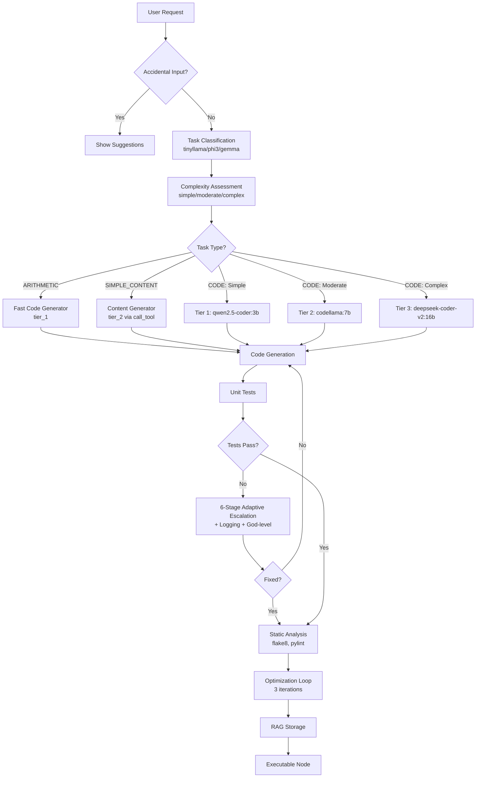

##  Quick Start

### Installation

```bash
# Clone the repository
git clone https://github.com/yourusername/code_evolver
cd code_evolver

# Install dependencies
pip install -r requirements.txt

# Option 1: Use Ollama (local, free)
ollama pull llama3
ollama pull codellama
ollama pull gemma3:4b

# Option 2: Use OpenAI (requires API key)
export OPENAI_API_KEY="your-api-key"

# Option 3: Use Anthropic Claude (requires API key)
export ANTHROPIC_API_KEY="your-api-key"

# Option 4: Use Azure OpenAI (requires endpoint and key)
export AZURE_OPENAI_API_KEY="your-api-key"
export AZURE_OPENAI_ENDPOINT="your-endpoint"

# Option 5: Use LM Studio (local GGUF models)
# Start LM Studio server on port 1234

# Optional: Install Qdrant for scalable RAG
docker run -p 6333:6333 qdrant/qdrant
```

### Backend Configuration

The new configuration system uses **roles** and **tiers** for flexible model management:

**Role-based Configuration:**
```yaml
llm:
  backend: "ollama"  # or "openai", "anthropic", "azure", "lmstudio"

  # Map abstract roles to actual models
  model_roles:
    fast: "qwen2.5-coder:3b"      # Fast, simple tasks
    base: "codellama:7b"           # Most tasks (default)
    powerful: "qwen2.5-coder:14b"  # Complex reasoning
    god_level: "deepseek-coder-v2:16b"  # Last resort
    embedding: "nomic-embed-text"  # Vector embeddings

  # For multi-backend with fallback
  fallback_backends: ["openai", "anthropic"]
```

**Tier-based Configuration:**
```yaml
model_tiers:
  coding:
    tier_1:  # Fast, simple tasks
      model: "qwen2.5-coder:3b"
      context_window: 32768
      timeout: 60
    tier_2:  # General coding (DEFAULT)
      model: "codellama:7b"
      context_window: 16384
      timeout: 120
    tier_3:  # Complex coding
      model: "qwen2.5-coder:14b"
      context_window: 32768
      timeout: 600
```

See example configs:
- `config.anthropic.minimal.yaml` - Claude with role mapping
- `config.openai.minimal.yaml` - OpenAI with role mapping
- `config.local.minimal.yaml` - Ollama with role mapping
- `config.tiered.yaml` - Tier-based configuration
- `config.unified.yaml` - Unified model registry

See [NEW_CONFIG_ARCHITECTURE.md](code_evolver/NEW_CONFIG_ARCHITECTURE.md) and [MODEL_TIERS.md](code_evolver/MODEL_TIERS.md) for details.

### Basic Usage

**Standard Code Generation:**
```bash
# Start interactive CLI
cd code_evolver
python chat_cli.py
```

```
CodeEvolver> add 10 and 20
> Task classified as ARITHMETIC
> Using Fast Code Generator (gemma3:4b)
✓ Code generated and tested
✓ Optimization complete (best score: 1.10)

RESULT: 30
```

**Conversation Mode:**
```bash
CodeEvolver> /conversation_start software design

Started conversation about software design.
Context memory: Active
Auto-summarization: Enabled

CodeEvolver> What are the benefits of microservices?
> [Response with full conversation context]

CodeEvolver> How does that compare to monoliths?
> [Response aware of previous discussion about microservices]

CodeEvolver> /conversation_end
Conversation ended. Summary saved to RAG.
```

**Training Mode:**
```bash
CodeEvolver> /train write a function to process data

Training started. Press any key to stop.
Variation 1: write a function to process user data
Variation 2: write a function to process JSON data
Variation 3: write a function to process CSV data
...
[Continues until stopped]

Training complete!
Success rate: 85%
Total variations: 42
```

**Pattern Optimization:**
```bash
CodeEvolver> /optimize_tools

Analyzing RAG patterns...
Found 5 high-value optimization opportunities

1. translation (12 operations, similarity 0.87)
   Suggested tool: translate_text
   Time savings: 8 hours/week

✓ Tool definitions saved to tools/suggested/
```

##  System Architecture

### High-Level Flow

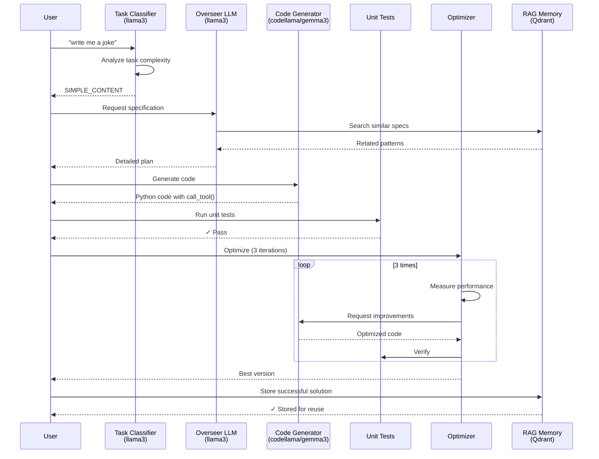

### Content Generation Flow


##  Examples

### Example 1: Simple Arithmetic

```bash
CodeEvolver> add 5 and 8

> Task classified as ARITHMETIC (basic arithmetic operation)
> Using Fast Code Generator (gemma3:4b)
> Generating code...
✓ Generated 15 lines of code
✓ Tests passed
✓ Optimization complete (score: 1.10)

RESULT: 13
```

**Generated Code:**
```python
import json
import sys

def main():
    input_data = json.load(sys.stdin)

    # Extract numbers from description
    desc = input_data.get("description", "")
    numbers = [int(s) for s in desc.split() if s.isdigit()]

    if len(numbers) >= 2:
        result = numbers[0] + numbers[1]
    else:
        result = 0

    print(json.dumps({"result": result}))

if __name__ == "__main__":
    main()
```

### Example 2: Content Generation

```bash
CodeEvolver> write me a joke about programmers

> Task classified as SIMPLE_CONTENT (short joke generation)
> Using powerful model for content generation
> Generating code...
✓ Generated code with call_tool()
✓ Tests passed

RESULT:
"Why do programmers prefer dark mode?
Because light attracts bugs!"
```

**Generated Code:**
```python
import json
import sys
from node_runtime import call_tool

def main():
    input_data = json.load(sys.stdin)

    # Use LLM tool for creative content generation
    content = call_tool("content_generator", input_data.get("description"))

    print(json.dumps({"result": content}))

if __name__ == "__main__":
    main()
```

### Example 3: Complex Algorithm

```bash
CodeEvolver> calculate fibonacci sequence

> Task classified as ALGORITHM (fibonacci computation)
> Using powerful model (qwen2.5-coder:14b)
> Generating code...
✓ Generated optimized implementation
✓ Tests passed
✓ Optimization complete (score: 1.15)
```

**Generated Code:**
```python
import json
import sys

def fibonacci(n):
    """Calculate first n fibonacci numbers with safety limit."""
    # Safety limit to prevent infinite computation
    n = min(n, 100)

    if n <= 0:
        return []
    elif n == 1:
        return [0]

    fib = [0, 1]
    for i in range(2, n):
        fib.append(fib[i-1] + fib[i-2])

    return fib[:n]

def main():
    input_data = json.load(sys.stdin)
    desc = input_data.get("description", "")

    # Extract number from description, default to 10
    n = 10
    for word in desc.split():
        if word.isdigit():
            n = int(word)
            break

    result = fibonacci(n)
    print(json.dumps({"result": result}))

if __name__ == "__main__":
    main()
```

##  Optimization System

### How Optimization Works

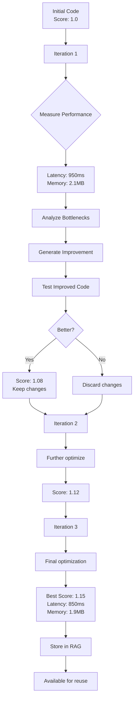

### Optimization Example

```python
# Iteration 1: Initial code
def process_data(data):
    result = []
    for item in data:
        result.append(expensive_operation(item))
    return result

# Score: 1.0 (baseline)
# Latency: 1200ms
# Memory: 3.5MB

# Iteration 2: Optimized - use list comprehension
def process_data(data):
    return [expensive_operation(item) for item in data]

# Score: 1.05 (5% improvement)
# Latency: 1100ms
# Memory: 3.2MB

# Iteration 3: Optimized - add caching
_cache = {}
def process_data(data):
    return [
        _cache.setdefault(item, expensive_operation(item))
        for item in data
    ]

# Score: 1.15 (15% improvement)
# Latency: 850ms
# Memory: 2.8MB
```

##  RAG Memory System

### What Gets Stored

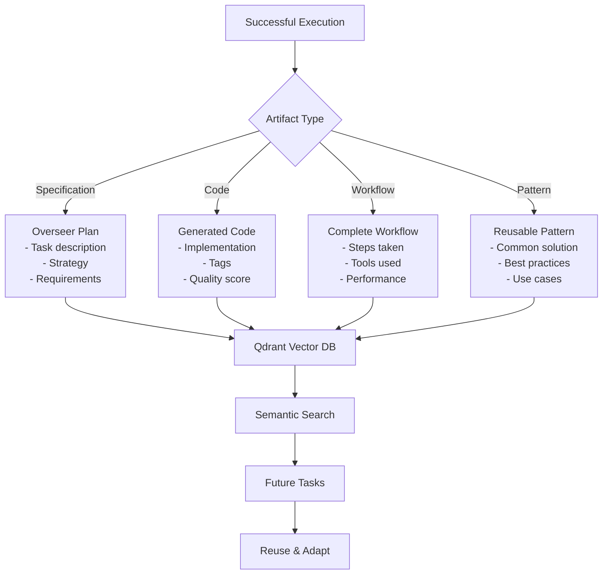

### RAG Workflow Reuse

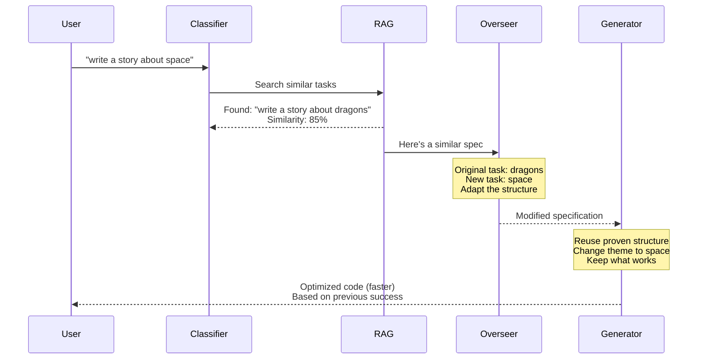

## ️ Configuration

### Multi-Endpoint Setup

With the new role-based system, you configure backends and map roles to models:

```yaml
# config.yaml
llm:
  backend: "ollama"

  backends:
    ollama:
      base_url: "http://localhost:11434"
      enabled: true

  # Map roles to models (models reference backend automatically)
  model_roles:
    fast: "qwen2.5-coder:3b"      # Quick tasks
    base: "codellama:7b"           # Default for most work
    powerful: "qwen2.5-coder:14b"  # Complex tasks
    god_level: "deepseek-coder-v2:16b"  # Last resort
```

Tools reference roles, not specific models:
```yaml
tools:
  general:
    llm:
      role: "base"  # Uses codellama:7b with this config

  security_auditor:
    llm:
      role: "powerful"  # Uses qwen2.5-coder:14b
```

### Tool Configuration

**New Role-Based Tools:**

Tools are now defined in the `tools/` directory and reference abstract roles:

```yaml
# tools/llm/content_generator.yaml
name: "Content Generator"
type: "llm"
description: "Generates creative content (jokes, stories, articles)"

llm:
  role: "base"  # References the "base" role from config

# Metadata for tool selection
cost_tier: "medium"
speed_tier: "fast"
quality_tier: "excellent"
tags: ["content", "creative", "writing"]
```

**Benefits:**
- Tools defined once, work with any backend
- Switch backends by changing role mapping in config
- No tool duplication across configs
- Backend-agnostic tool definitions

See [NEW_CONFIG_ARCHITECTURE.md](code_evolver/NEW_CONFIG_ARCHITECTURE.md) for the complete architecture.

### OpenAPI-Based Tools

Code Evolver supports **OpenAPI/REST API integration**, allowing you to seamlessly integrate external APIs into your workflows. This powerful feature enables:

- **Automatic API discovery** from OpenAPI/Swagger specifications
- **Type-safe API calls** with parameter validation
- **Authentication support** (Bearer, API Key, Basic Auth)
- **Code generation templates** for easy integration
- **RAG-powered learning** from successful API interactions

#### Configuring OpenAPI Tools

```yaml
tools:
  nmt_translator:
    name: "NMT Translation Service"
    type: "openapi"
    description: "Neural Machine Translation service for translating text between languages"

    # Performance/cost metadata for intelligent tool selection
    cost_tier: "low"           # Helps planner choose appropriate tools
    speed_tier: "very-fast"    # Fast local API
    quality_tier: "good"       # Good but needs validation
    max_output_length: "long"  # Can handle long texts

    # OpenAPI configuration
    openapi:
      # Load spec from URL (or use spec_path for local files)
      spec_url: "http://localhost:8000/openapi.json"
      base_url: "http://localhost:8000"

      # Optional authentication
      auth:
        type: "bearer"         # bearer | api_key | basic
        token: "your-api-key-here"
        # For API key auth:
        # api_key_name: "X-API-Key"
        # For basic auth:
        # username: "user"
        # password: "pass"

    # Python code template for using this API
    code_template: |
      import requests
      import json

      def translate_text(text, source_lang="en", target_lang="es"):
          url = "http://localhost:8000/translate"
          payload = {"text": text, "source_lang": source_lang, "target_lang": target_lang}
          response = requests.post(url, json=payload)
          response.raise_for_status()
          return response.json().get("translated_text", "")

    tags: ["translation", "nmt", "neural", "languages", "openapi", "api"]
```

#### How OpenAPI Tools Work

1. **Automatic Discovery**: The system loads the OpenAPI spec and parses all available endpoints
2. **Intelligent Selection**: RAG-powered search finds the right API based on task description
3. **Code Generation**: LLM generates Python code using the API with proper error handling
4. **Execution**: Generated code calls the API and processes responses
5. **Learning**: Successful API interactions are stored in RAG for future reuse

#### Example: Using Translation API

```bash
CodeEvolver> translate "Hello, world!" to Spanish

> Task classified as API_CALL
> Found tool: NMT Translation Service
> Generating integration code...
✓ Code generated with API client
✓ Tests passed
✓ Translation complete

RESULT: "¡Hola, mundo!"
```

**Generated Code:**
```python
import json
import sys
import requests

def main():
    input_data = json.load(sys.stdin)
    text = input_data.get("text", "Hello, world!")
    target_lang = input_data.get("target_lang", "es")

    # Call translation API
    url = "http://localhost:8000/translate"
    payload = {
        "text": text,
        "source_lang": "en",
        "target_lang": target_lang
    }

    response = requests.post(url, json=payload)
    response.raise_for_status()

    result = response.json()
    translated = result.get("translated_text", "")

    print(json.dumps({"result": translated}))

if __name__ == "__main__":
    main()
```

#### OpenAPI Features

- **Multiple spec formats**: JSON, YAML, or loaded from URL
- **Authentication**: Automatic header injection for Bearer, API Key, or Basic Auth
- **Parameter handling**: Path, query, header, and body parameters
- **Error handling**: Proper HTTP status code handling and error reporting
- **Code templates**: Provide examples to guide LLM code generation
- **Metadata enrichment**: Cost, speed, and quality tiers for intelligent tool selection

### Python Testing & Code Quality Tools

Code Evolver includes **executable tools** for Python code analysis and testing:

```yaml
tools:
  # Static analysis
  pylint_checker:
    name: "Pylint Code Quality Checker"
    type: "executable"
    description: "Runs pylint static analysis on Python code"
    executable:
      command: "pylint"
      args: ["--output-format=text", "--score=yes", "{source_file}"]
      install_command: "pip install pylint"
    tags: ["python", "static-analysis", "quality", "linting"]

  # Type checking
  mypy_type_checker:
    name: "MyPy Type Checker"
    type: "executable"
    description: "Runs mypy type checking on Python code"
    executable:
      command: "mypy"
      args: ["--strict", "--show-error-codes", "{source_file}"]
      install_command: "pip install mypy"
    tags: ["python", "type-checking", "static-analysis"]

  # Security scanning
  bandit_security:
    name: "Bandit Security Scanner"
    type: "executable"
    description: "Finds common security issues in Python code"
    executable:
      command: "bandit"
      args: ["-r", "{source_file}"]
      install_command: "pip install bandit"
    tags: ["python", "security", "vulnerability"]

  # Unit testing
  pytest_runner:
    name: "Pytest Test Runner"
    type: "executable"
    description: "Runs pytest unit tests with coverage"
    executable:
      command: "pytest"
      args: ["-v", "--tb=short", "{test_file}"]
      install_command: "pip install pytest"
    tags: ["python", "testing", "pytest"]
```

**Available Testing Tools:**

- **pylint** - PEP 8 style checking and code quality analysis
- **mypy** - Static type checking
- **flake8** - Style checking and error detection
- **black** - Code formatting validation
- **bandit** - Security vulnerability scanning
- **pytest** - Unit test execution with coverage
- **radon** - Complexity analysis (cyclomatic complexity, maintainability index)
- **vulture** - Dead code detection
- **pydocstyle** - Docstring validation (PEP 257)
- **isort** - Import statement organization

These tools are automatically invoked during code generation and optimization to ensure high-quality, secure, and well-tested code.

##  Performance Metrics

### Tracked Metrics

- **Latency**: Execution time in milliseconds
- **Memory**: Peak memory usage in MB
- **CPU Time**: Actual CPU processing time
- **Success Rate**: Percentage of successful executions
- **Quality Score**: Combined metric (latency + memory + correctness)

### Example Metrics

```
Optimization Results:
├─ Iteration 1: Score 1.00 (baseline)
│  ├─ Latency: 1200ms
│  └─ Memory: 3.5MB
├─ Iteration 2: Score 1.05 (+5%)
│  ├─ Latency: 1100ms
│  └─ Memory: 3.2MB
└─ Iteration 3: Score 1.15 (+15%)
   ├─ Latency: 850ms
   └─ Memory: 2.8MB

Best version selected: Iteration 3
```

##  Advanced Features

### Smart Conversation Mode (Multi-Chat Context Memory)

Code Evolver includes a sophisticated conversation system that maintains context across multiple exchanges with intelligent memory management.

**Architecture:**

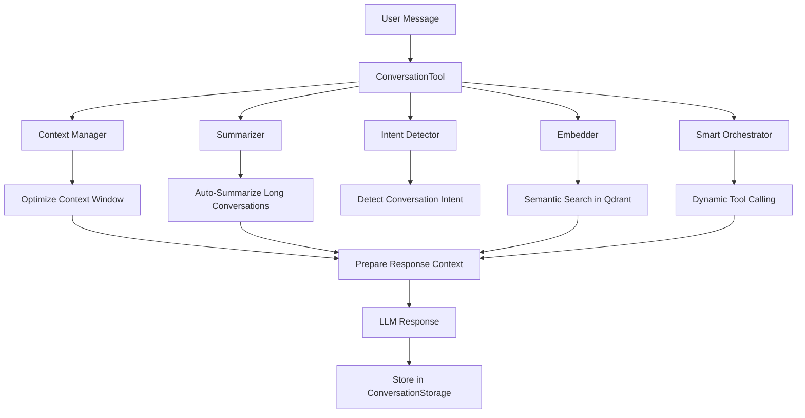

**Components:**

1. **ConversationStorage** - Volatile Qdrant storage for active conversations
   - Creates separate collection per conversation
   - Stores messages with embeddings
   - Tracks metadata (topic, creation time, performance)
   - Cleans up after conversation ends

2. **ContextMemoryManager** - Model-aware context window optimization
   - Knows context limits for different models
   - Decides when to summarize
   - Optimizes context for response model
   - Prevents context overflow

3. **ConversationSummarizer** - Intelligent summarization
   - Summarizes old messages when threshold reached
   - Preserves key information
   - Maintains conversation continuity
   - Uses fast local model (gemma3:1b)

4. **ConversationEmbedder** - Semantic search
   - Stores conversation metadata in Qdrant
   - Finds related context from past conversations
   - Enables cross-conversation learning
   - Retrieves relevant snippets

5. **SmartConversationOrchestrator** - Dynamic workflow generation
   - Detects when tools needed during conversation
   - Calls tools automatically
   - Generates workflows on-the-fly
   - Integrates results seamlessly

**Usage Example:**

```python
from code_evolver.src.conversation import ConversationTool

# Initialize from config
tool = ConversationTool.create_from_config_file(
    "code_evolver/config.yaml",
    conversation_model="gemma3:1b"
)

# Start conversation
result = tool.start_conversation(topic="API optimization")
print(f"Started: {result['conversation_id']}")

# Add user message
tool.add_user_message("How can I reduce API latency?")

# Prepare context for response
context = tool.prepare_context_for_response(
    user_message="How can I reduce API latency?",
    response_model="llama3"
)

# Context includes:
# - Recent messages
# - Summary of older messages (if any)
# - Related context from past conversations
# - Optimized for llama3's context window

# Add assistant response
tool.add_assistant_message(
    content="Here are 5 strategies...",
    performance_data={"response_time": 2.3}
)

# End conversation (saves summary to RAG)
summary = tool.end_conversation()
print(f"Key points: {summary['key_points']}")
```

**Context Window Optimization:**

The system automatically manages context based on model capabilities:

| Model | Context Window | Summary Threshold | Recent Messages |
|-------|----------------|-------------------|-----------------|
| llama3 | 8,192 tokens | 6,000 tokens | Last 10 |
| gemma3:1b | 2,048 tokens | 1,500 tokens | Last 5 |
| gpt-4 | 128,000 tokens | 100,000 tokens | Last 50 |
| claude-3 | 200,000 tokens | 150,000 tokens | Last 100 |

**Benefits:**

- ✅ No manual context management needed
- ✅ Automatic summarization prevents context overflow
- ✅ Learns from past conversations
- ✅ Model-aware optimization
- ✅ Performance tracking built-in
- ✅ Clean separation of concerns

### Multi-Level Recursive Optimization

Code Evolver includes powerful optimization systems that work at multiple levels to continuously improve performance.

**1. Recursive System Optimizer**

Optimizes the entire system recursively at 4 levels:

```python
from code_evolver.src.recursive_optimizer import RecursiveSystemOptimizer

optimizer = RecursiveSystemOptimizer(
    config_manager=config,
    rag_memory=rag,
    optimization_pipeline=pipeline,
    tools_manager=tools
)

# Optimize everything from bottom to top
results = optimizer.optimize_everything(max_depth=3)

# Results include improvements at each level:
# Level 0: Individual code artifacts optimized
# Level 1: Workflows using those artifacts re-optimized
# Level 2: Tool definitions improved
# Level 3: The optimizer itself optimized!
```

**Optimization Levels:**

| Level | Target | Example Optimization |
|-------|--------|---------------------|
| 0 | Code Artifacts | Optimize `fibonacci()` algorithm |
| 1 | Workflows | Re-optimize workflows using `fibonacci()` |
| 2 | Tools | Improve tool selection logic |
| 3 | Meta-System | Optimize the optimizer itself! |

**How it Works:**

1. **Level 0** - Optimize individual functions
   - Finds slow/inefficient code artifacts
   - Applies optimization techniques
   - Measures improvement

2. **Level 1** - Re-optimize dependent workflows
   - Finds workflows using optimized artifacts
   - Regenerates workflow code
   - Benefits from Level 0 improvements

3. **Level 2** - Improve tool selection
   - Analyzes tool usage patterns
   - Optimizes tool selection logic
   - Improves RAG retrieval

4. **Level 3** - Meta-optimization
   - The optimizer optimizes itself!
   - Improves optimization strategies
   - Recursive self-improvement

**2. Offline Batch Optimizer**

Runs overnight to optimize high-value artifacts using expensive cloud LLMs:

```python
from code_evolver.src.offline_optimizer import OfflineBatchOptimizer

optimizer = OfflineBatchOptimizer(
    config_manager=config,
    rag_memory=rag,
    optimization_pipeline=pipeline
)

# Find candidates for optimization
candidates = optimizer.identify_optimization_candidates(
    min_reuse_count=10,      # Must be used 10+ times
    max_quality_score=0.75   # Quality score < 0.75
)

# Run overnight batch (max $50 cloud spend)
results = optimizer.batch_optimize_overnight(
    max_cost=50.00,
    use_cloud_llm=True,
    cloud_model="gpt-4"
)

# Results show ROI
# Spent: $23.50
# Artifacts optimized: 15
# Avg improvement: 35%
# Estimated time saved: 12 hours/week
```

**Value-Based Selection:**

The optimizer calculates a value score for each artifact:

```
value_score = reuse_count × (1 - quality_score) × improvement_potential
```

High value score = frequently used + low quality + high potential

**Example Candidates:**

| Artifact | Reuse Count | Quality | Improvement | Value Score |
|----------|-------------|---------|-------------|-------------|
| translate_text | 50 | 0.60 | 0.40 | 8.0 (HIGH) |
| fetch_api_data | 30 | 0.75 | 0.25 | 1.9 (MED) |
| simple_add | 100 | 0.95 | 0.05 | 0.5 (LOW) |

**Scheduling:**

```python
# Schedule nightly optimization
optimizer.schedule_nightly_optimization(
    hour=2,              # Run at 2 AM
    max_cost=50.00,      # Max $50/night
    min_candidates=5     # Only run if 5+ candidates
)
```

**3. Pattern-Based Optimization**

Analyzes RAG memory to find patterns and suggest new tools:

```python
from code_evolver.src.pattern_clusterer import PatternClusterer

clusterer = PatternClusterer(
    rag_memory=rag,
    min_cluster_size=3,
    similarity_threshold=0.75
)

# Analyze patterns
clusters = clusterer.analyze_patterns()

# Or apply optimization pressure to specific area
clusters = clusterer.analyze_patterns(
    target_filter="translate"
)

# Generate tool definitions for high-value clusters
for cluster in clusters:
    if cluster.optimization_potential > 0.5:
        tool_def = clusterer.generate_tool_definition(cluster)
        # Save to tools/suggested/
```

**Optimization Pressure:**

Focus optimization on specific functions or code areas:

```bash
# Analyze all translation-related patterns
/optimize_tools translate

# This filters RAG artifacts to only those matching "translate"
# Applies focused optimization pressure to that area
```

**Pattern Clustering Output:**

```
Operation Type: translation
Similarity: 0.87
Suggested Tool: translate_text
Parameters: ['target_language', 'source_language']
Optimization Potential: 0.72

Examples:
  - Translate to French
  - Translate to Spanish
  - Translate to German

Estimated time savings: 8 hours/week
Tool definition saved to: tools/suggested/translate_text.yaml
```

### Multi-Backend LLM Support

Code Evolver supports multiple LLM backends with automatic fallback:

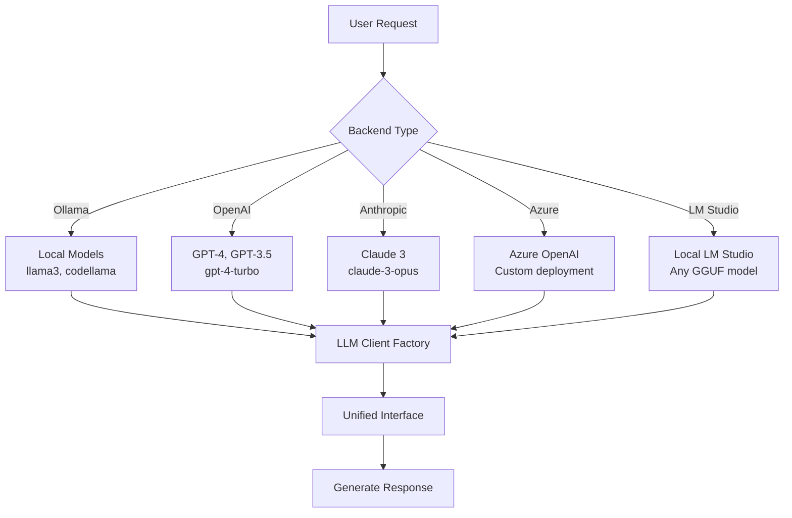

**Supported Backends:**

| Backend | Description | Use Case |
|---------|-------------|----------|
| **Ollama** | Local open-source models | Privacy, offline, no API costs |
| **OpenAI** | GPT-4, GPT-3.5 | High quality, fast inference |
| **Anthropic** | Claude 3 Opus/Sonnet | Complex reasoning, long context |
| **Azure OpenAI** | Enterprise OpenAI | Corporate compliance, SLAs |
| **LM Studio** | Local GGUF models | Custom fine-tuned models |

**Configuration Example (Role-Based):**

```yaml
# config.yaml
llm:
  backend: "ollama"  # Primary backend
  fallback_backends: ["openai", "anthropic"]  # Automatic fallback

  # Map abstract roles to actual models
  model_roles:
    fast: "qwen2.5-coder:3b"      # Ollama model for fast tasks
    base: "codellama:7b"           # Ollama model for general tasks
    powerful: "qwen2.5-coder:14b"  # Ollama model for complex tasks
    god_level: "deepseek-coder-v2:16b"  # Most powerful Ollama model

  backends:
    ollama:
      base_url: "http://localhost:11434"
      enabled: true

    openai:
      api_key: "${OPENAI_API_KEY}"
      base_url: "https://api.openai.com/v1"
      enabled: false

    anthropic:
      api_key: "${ANTHROPIC_API_KEY}"
      base_url: "https://api.anthropic.com"
      enabled: false

    azure:
      api_key: "${AZURE_OPENAI_API_KEY}"
      endpoint: "${AZURE_OPENAI_ENDPOINT}"
      deployment_name: "gpt-4"
      enabled: false

    lmstudio:
      base_url: "http://localhost:1234/v1"
      enabled: false
```

**Switching Backends:**

To switch from Ollama to Anthropic, just change role mappings:

```yaml
llm:
  backend: "anthropic"
  model_roles:
    fast: "claude-3-haiku-20240307"
    base: "claude-3-5-sonnet-20241022"
    powerful: "claude-3-opus-20240229"
```

All tools automatically use the new models - no changes needed!

**Using Multi-Backend Client:**

```python
from src.llm_client_factory import LLMClientFactory

# Create client with fallback support
client = LLMClientFactory.create_multi_backend_client(
    config_manager=config,
    primary_backend="ollama",
    fallback_backends=["openai", "anthropic"]
)

# Automatically tries ollama first, falls back to openai/anthropic if unavailable
response = client.generate(
    model="llama3",
    prompt="Explain quantum computing",
    temperature=0.7
)
```

### HTTP Server Tool: Workflows as APIs

Expose your workflows as HTTP endpoints with automatic routing and request handling.

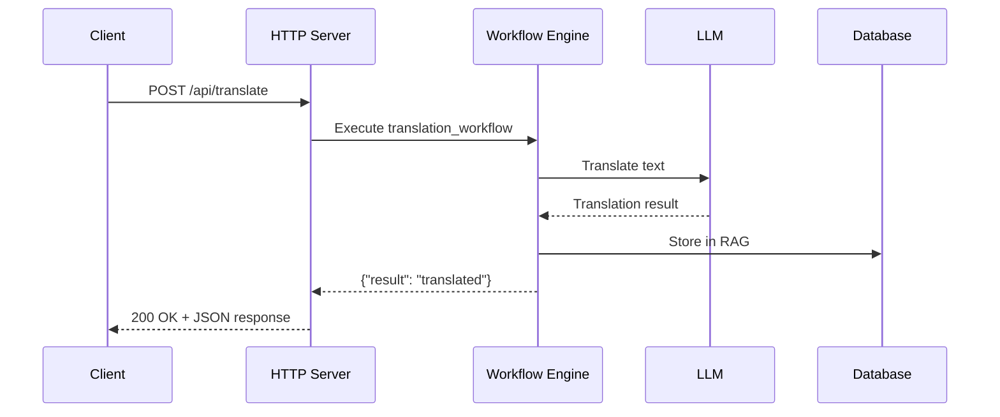

**Features:**
- Start/stop HTTP servers dynamically
- Register routes with GET, POST, PUT, DELETE support
- Route requests to workflow handlers
- JSON and HTML response types
- CORS support for web applications
- Error handling and logging

**Example Usage:**

```python
from src.http_server_tool import HTTPServerTool

# Create HTTP server
server = HTTPServerTool(host="0.0.0.0", port=8080)

# Add JSON API endpoint
server.add_route(
    path="/api/translate",
    methods=["POST"],
    handler=lambda data: {
        "result": translate_text(data["text"], data["target_lang"])
    },
    response_type="json"
)

# Add HTML endpoint
server.add_route(
    path="/",
    methods=["GET"],
    handler=lambda: "<h1>Translation API</h1><p>POST to /api/translate</p>",
    response_type="html"
)

# Start server in background
server.start(blocking=False)
```

**Workflow Integration:**

```python
from src.http_server_tool import WorkflowHTTPAdapter

adapter = WorkflowHTTPAdapter(workflow_manager, tools_manager)

# Create server for workflow
server = adapter.create_server("api_server", port=8080)

# Register workflow as endpoint
adapter.register_workflow_endpoint(
    server_id="api_server",
    workflow_id="translation_pipeline",
    path="/api/translate",
    methods=["POST"]
)

adapter.start_server("api_server")
```

**Example API Response:**

```bash
curl -X POST http://localhost:8080/api/translate \
  -H "Content-Type: application/json" \
  -d '{"text": "Hello", "target_lang": "es"}'

# Response:
{
  "workflow_id": "translation_pipeline",
  "status": "success",
  "output": "Hola"
}
```

### HTTP Content Fetcher: Comprehensive HTTP Client

A powerful HTTP client supporting all methods, authentication types, and response formats.

**Features:**
- All HTTP methods: GET, POST, PUT, DELETE, PATCH, HEAD, OPTIONS
- All body types: JSON, form-data, multipart, XML, text, binary
- Authentication: Bearer, API Key, Basic, Digest, Custom Headers
- Response formats: JSON, text, binary (auto-detect)
- Retry logic with exponential backoff
- File upload/download with streaming
- Proxy support and SSL/TLS configuration

**Example Usage:**

```python
from src.http_content_fetcher import HTTPContentFetcher

# Initialize fetcher
fetcher = HTTPContentFetcher(
    default_timeout=30,
    max_retries=3,
    verify_ssl=True
)

# GET request with parameters
result = fetcher.get(
    url="https://api.example.com/data",
    params={"limit": 10, "offset": 0},
    headers={"Accept": "application/json"}
)

# POST with JSON body and Bearer auth
result = fetcher.post(
    url="https://api.example.com/create",
    body={"name": "Test", "value": 123},
    body_type="json",
    auth={
        "type": "bearer",
        "token": "your-api-token"
    }
)

# File upload
result = fetcher.upload_file(
    url="https://api.example.com/upload",
    file_path="/path/to/file.pdf",
    field_name="document",
    additional_data={"description": "Important document"}
)

# File download with streaming
result = fetcher.download_file(
    url="https://example.com/large-file.zip",
    save_path="/path/to/save/file.zip",
    chunk_size=8192
)
```

**Integration with Workflows:**

```yaml
# tools.yaml
tools:
  api_client:
    name: "API Client"
    type: "http_fetcher"
    description: "Fetch data from REST APIs"
    http:
      default_timeout: 30
      max_retries: 3
      retry_backoff_factor: 0.3
    tags: ["http", "api", "fetching"]
```

**Generated Code Example:**

```python
import json
import sys
from node_runtime import call_tool

def main():
    input_data = json.load(sys.stdin)
    url = input_data.get("url")

    # Use HTTP fetcher tool
    result = call_tool("http_content_fetcher", {
        "url": url,
        "method": "GET",
        "response_format": "json"
    })

    print(json.dumps({"result": result["data"]}))
```

### Pattern Clustering & RAG Optimization

Automatically analyzes RAG memory to find patterns and suggest parameterized tools for optimization.

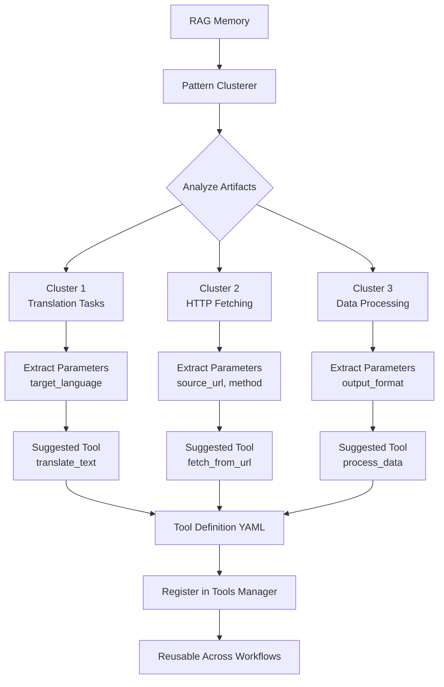

**How It Works:**

1. **Analyze RAG memory** for similar operations
2. **Cluster similar patterns** using cosine similarity
3. **Extract common parameters** from descriptions
4. **Generate parameterized tools** for reuse
5. **Calculate optimization potential** based on frequency

**Example Analysis:**

```python
from src.pattern_clusterer import PatternClusterer

# Initialize with RAG memory
clusterer = PatternClusterer(
    rag_memory=rag,
    min_cluster_size=3,
    similarity_threshold=0.75
)

# Analyze patterns
clusters = clusterer.analyze_patterns()

for cluster in clusters:
    print(f"Operation Type: {cluster.operation_type}")
    print(f"Similarity: {cluster.similarity_score:.2f}")
    print(f"Suggested Tool: {cluster.suggested_tool_name}")
    print(f"Parameters: {cluster.suggested_parameters}")
    print(f"Optimization Potential: {cluster.optimization_potential:.2f}")
```

**Example Output:**

```
Operation Type: translation
Similarity: 0.87
Suggested Tool: translate_text
Parameters: ['target_language']
Optimization Potential: 0.72
Examples:
  - Translate to French
  - Translate to Spanish
  - Translate to German
```

**Generate Tool Definition:**

```python
tool_def = clusterer.generate_tool_definition(cluster)

# Results in:
{
  "name": "Translate Text",
  "type": "llm",
  "description": "Performs translation with parameterized inputs",
  "parameters": ["target_language"],
  "llm": {"model": "llama3"},
  "tags": ["translation", "parameterized", "optimized"],
  "cluster_info": {
    "similarity_score": 0.87,
    "artifact_count": 12
  }
}
```

**Optimization Pressure Targeting:**

```python
# Focus optimization on specific function/code
clusters = clusterer.analyze_patterns(target_filter="translate")

# Only analyzes artifacts related to translation
# Applies "optimization pressure" to that specific area
```

### Parallel Workflow Execution

Execute independent workflow steps concurrently for faster completion.

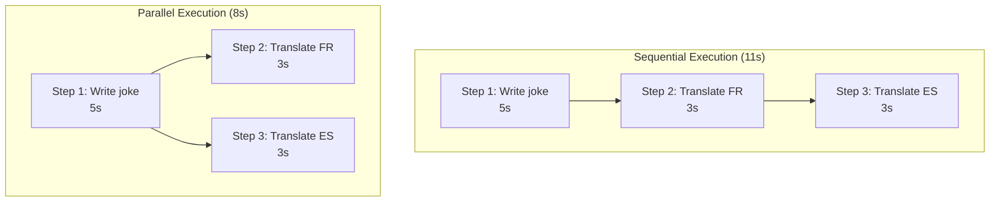

**Multi-Level Parallelism:**

**Level 1: Workflow Step Parallelism**

```json
{
  "steps": [
    {
      "step_id": "step1",
      "description": "Write a joke",
      "parallel_group": null,
      "depends_on": []
    },
    {
      "step_id": "step2",
      "description": "Translate to French",
      "parallel_group": 1,
      "depends_on": ["step1"]
    },
    {
      "step_id": "step3",
      "description": "Translate to Spanish",
      "parallel_group": 1,
      "depends_on": ["step1"]
    }
  ]
}
```

**Level 2: Code-Level Parallelism**

```python
from node_runtime import call_tools_parallel

def main():
    input_data = json.load(sys.stdin)
    content = input_data.get("content", "")

    # Execute multiple tools in parallel
    results = call_tools_parallel([
        ("nmt_translator", f"Translate to french: {content}", {"target_lang": "fr"}),
        ("nmt_translator", f"Translate to spanish: {content}", {"target_lang": "es"}),
        ("nmt_translator", f"Translate to german: {content}", {"target_lang": "de"})
    ])

    french, spanish, german = results

    return {
        "french": french,
        "spanish": spanish,
        "german": german
    }
```

**Dependency Analysis:**

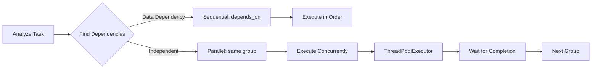

**Performance Benefits:**

| Scenario | Sequential | Parallel | Speedup |
|----------|-----------|----------|---------|
| 3 independent jokes | 15s | 5s | 3× |
| 1 joke + 3 translations | 14s | 8s | 1.75× |
| 5 A/B test headlines | 25s | 5s | 5× |

**Usage Example:**

```bash
CodeEvolver> write a joke and translate to french and spanish

> Task classified as MULTI_STEP_WORKFLOW
> Decomposing into parallel workflow...

Workflow Plan (3 steps):
  1. Write a joke [sequential]
  2. Translate to French [parallel group 1]
  3. Translate to Spanish [parallel group 1]

Executing step 1: Write a joke
✓ Completed in 5s

Executing 2 steps in parallel:
  - Translate to French
  - Translate to Spanish
✓ Both completed in 3s (parallel execution)

Total time: 8s (vs 11s sequential)
```

### Slash Commands for Tool Management

Powerful CLI commands for managing and optimizing tools.

**Available Commands:**

```bash
/tools                                  # List all available tools
/mutate tool <tool_id> <instructions>   # Improve a tool
/optimize tool <tool_id> [target]       # Optimize for performance/quality
/backends [--test]                      # Check LLM backend status
/workflow <node_id>                     # Display workflow for node
/list                                   # List all nodes in registry
```

**Command: /mutate tool**

Improve a tool based on natural language instructions.

```bash
CodeEvolver> /mutate tool my_translator make it support more languages

> Analyzing tool: my_translator
> Current implementation: Supports English, French, Spanish
> Applying mutation: "make it support more languages"

Generating improved version:
  ✓ Added support for German, Italian, Portuguese
  ✓ Updated language detection
  ✓ Improved error handling for unsupported languages

Testing improved tool:
  ✓ All existing tests pass
  ✓ New language tests pass

Optimization metrics:
  Quality: 1.15× improvement
  Coverage: 3 → 6 languages

Tool updated successfully.
```

**Command: /optimize tool**

Iteratively optimize a tool for specific targets.

```bash
CodeEvolver> /optimize tool data_processor performance

> Starting optimization for 'data_processor'
> Target: performance
> Iterations: 3

Iteration 1:
  Current: 1200ms, 3.5MB
  Optimization: Use list comprehension instead of loop
  Result: 1100ms, 3.2MB (8% faster)

Iteration 2:
  Current: 1100ms, 3.2MB
  Optimization: Add caching for repeated operations
  Result: 850ms, 2.8MB (23% faster overall)

Iteration 3:
  Current: 850ms, 2.8MB
  Optimization: Use generator for memory efficiency
  Result: 820ms, 2.1MB (32% faster, 40% less memory)

Best version selected: Iteration 3
Performance improvement: 32%
Memory improvement: 40%
```

**Optimization Targets:**

| Target | Focus | Metrics |
|--------|-------|---------|
| `performance` | Speed | Latency, throughput |
| `quality` | Accuracy | Correctness, robustness |
| `memory` | Efficiency | Memory usage, allocations |
| `latency` | Response time | Time to first output |

**Command: /backends**

Check status of all configured LLM backends.

```bash
CodeEvolver> /backends --test

Checking backend configurations...

✓ Ollama
  Status: Connected
  URL: http://localhost:11434
  Models: llama3, codellama, gemma3:4b (3 models)

✓ OpenAI
  Status: Authenticated
  Models: gpt-4, gpt-3.5-turbo
  Organization: your-org-name

✗ Anthropic
  Status: Missing API key
  Fix: Set ANTHROPIC_API_KEY environment variable

✓ LM Studio
  Status: Connected
  URL: http://localhost:1234/v1
  Models: custom-fine-tuned-model

Summary: 3/4 backends operational
```

### BDD-Enhanced Workflow Specifications

Behavior-driven development specifications for hierarchical testing.

**Workflow Specification Structure:**

```python
from src.workflow_spec import WorkflowSpec, WorkflowStep, StepType

# Define workflow
spec = WorkflowSpec(
    workflow_id="translation_pipeline",
    name="Multi-Language Translation",
    description="Translate content to multiple languages",
    inputs=[
        WorkflowInput("text", "string", required=True),
        WorkflowInput("languages", "array", required=True)
    ],
    outputs=[
        WorkflowOutput("translations", "object", source_reference="steps.combine.output")
    ],
    steps=[
        WorkflowStep(
            step_id="translate_fr",
            step_type=StepType.LLM_CALL,
            tool_name="nmt_translator",
            input_mapping={"text": "${inputs.text}", "target_lang": "fr"},
            parallel_group=1,
            depends_on=[]
        ),
        WorkflowStep(
            step_id="translate_es",
            step_type=StepType.LLM_CALL,
            tool_name="nmt_translator",
            input_mapping={"text": "${inputs.text}", "target_lang": "es"},
            parallel_group=1,
            depends_on=[]
        )
    ]
)

# Export to JSON
with open("translation_pipeline.json", "w") as f:
    json.dump(spec.to_dict(), f, indent=2)
```

**BDD Test Specification:**

```yaml
# translation_pipeline.bdd.yaml
feature: Multi-Language Translation Pipeline

scenarios:
  - name: Translate to multiple languages
    given:
      - Text input: "Hello, world!"
      - Target languages: ["fr", "es", "de"]
    when:
      - Translation workflow executes
    then:
      - All translations are present
      - French translation contains "Bonjour"
      - Spanish translation contains "Hola"
      - German translation contains "Hallo"
      - Execution time < 10 seconds

  - name: Handle empty input
    given:
      - Text input: ""
      - Target languages: ["fr"]
    when:
      - Translation workflow executes
    then:
      - Returns empty translation
      - No errors are raised
```

**Tool-Level BDD:**

```yaml
# nmt_translator.bdd.yaml
tool: nmt_translator

behaviors:
  - behavior: Translate English to French
    input:
      text: "Good morning"
      source_lang: "en"
      target_lang: "fr"
    expected:
      result_contains: "Bonjour"
      confidence: ">= 0.8"

  - behavior: Preserve formatting
    input:
      text: "Line 1\nLine 2"
      target_lang: "es"
    expected:
      result_contains: "\n"
      line_count: 2

  - behavior: Handle special characters
    input:
      text: "Price: $100.00"
      target_lang: "de"
    expected:
      result_contains: "$"
      result_contains: "100"
```

### Pattern Recognizer with Scikit-Learn

Advanced pattern recognition for data streams with statistical analysis.

**Features:**
- Peak and valley detection
- Trend and changepoint detection
- Anomaly and outlier detection
- Time series motif discovery

**Example Usage:**

```python
from examples.pattern_recognizer import detect_patterns

# Sample data
data = [10, 12, 15, 13, 20, 25, 22, 18, 30, 15, 12]

# Detect patterns
results = detect_patterns(
    data=data,
    sensitivity=2.0  # Standard deviations for anomaly detection
)

print(results)
# {
#   "peaks": [4, 8],           # Indices of peaks
#   "valleys": [0, 10],        # Indices of valleys
#   "changepoints": [4, 8],    # Trend changes
#   "anomalies": [8],          # Outliers
#   "summary": {
#     "total_patterns": 4,
#     "peak_count": 2,
#     "anomaly_count": 1
#   }
# }
```

**Integration with Workflows:**

```yaml
# tools.yaml
tools:
  pattern_analyzer:
    name: "Pattern Analyzer"
    type: "python"
    description: "Detect patterns in time series data"
    module: "examples.pattern_recognizer"
    function: "detect_patterns"
    parameters:
      - data: array
      - sensitivity: float
    tags: ["analysis", "pattern-recognition", "statistics"]
```

### Adaptive Escalation

When code fails tests, the system automatically escalates through multiple attempts:

1. **Attempt 1**: Fast model (codellama) with low temperature (0.1)
2. **Attempt 2**: Fast model with higher temperature (0.3) - more creative
3. **Attempt 3**: Powerful model (qwen2.5-coder:14b) with temp 0.5

### Static Analysis

Automatically runs multiple code quality tools:
- **flake8**: PEP 8 style checking
- **pylint**: Code quality analysis
- **mypy**: Type checking
- **black**: Code formatting validation

### Workflow Tracking

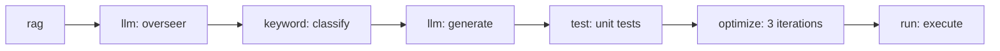

## 🎓 Use Cases

### 1. Rapid Prototyping
Generate working code for quick experiments and proof-of-concepts.

### 2. Code Learning
See how different LLMs approach the same problem, learn optimization techniques.

### 3. Automated Testing
Generate comprehensive unit tests automatically for your code.

### 4. Content Generation
Create stories, jokes, articles, and other creative content via LLM tools.

### 5. Algorithm Optimization
Let the system iteratively improve your algorithms for better performance.

##  Slash Commands

Code Evolver provides powerful slash commands for managing conversations, tools, and workflows.

### Conversation Management

**`/conversation_start [topic]`** - Start a new conversation with multi-chat context memory
```bash
/conversation_start software architecture
```
Features:
- Multi-chat context memory
- Auto-summarization based on context window
- Semantic search for related conversations
- Performance tracking
- Smart orchestration with tool calling

**`/conversation_end [topic]`** - End current or specified conversation
```bash
/conversation_end
/conversation_end software architecture
```
Features:
- Saves conversation summary to RAG
- Extracts key points
- Cleans up volatile storage
- Tracks conversation metrics

### Tool Management

**`/create_tool`** - Create a new tool with interactive prompts
```bash
/create_tool
```
Creates LLM, executable, or OpenAPI tools with full configuration.

**`/list_tools`** - List all available tools with filtering
```bash
/list_tools
/list_tools --type llm
/list_tools --tag translation
```

**`/remove_tool <tool_id>`** - Remove a tool from the registry
```bash
/remove_tool my_translator
```

**`/optimize_tools [target]`** - Analyze RAG patterns and suggest optimizations
```bash
# Analyze all patterns
/optimize_tools

# Focus on specific function (optimization pressure)
/optimize_tools translate_text
```
Features:
- Pattern clustering analysis
- Similarity detection
- Parameterized tool suggestions
- ROI estimation
- Auto-generates tool definitions

**`/tool-compile`** - Compile tool configurations
```bash
/tool-compile
```

### Training & Optimization

**`/train [prompt]`** - Continuous training with random variations
```bash
# Train with specific prompt
/train write a function to process data

# Train with random factory tasks
/train
```
Features:
- Random variation generation
- Continuous execution (stop with any key)
- Performance tracking
- Success rate statistics

### System Commands

**`help`** - Show available commands
**`status`** - Show system status
**`auto on/off`** - Toggle auto-evolution

### Example Workflow

```bash
# Start a conversation about optimization
/conversation_start performance optimization

# Chat about the topic
> "How can I optimize my API calls?"
> "What about caching strategies?"

# Analyze patterns and suggest tools
/optimize_tools

# End conversation (saves to RAG)
/conversation_end

# Train the system
/train optimize database queries
```

##  API Reference

### Command-Line Interface

```bash
# Generate code
python chat_cli.py
> add 10 and 20

# List available commands
> help

# Check system status
> status

# Toggle auto-evolution
> auto on/off
```

### Programmatic Usage

```python
from src import ChatCLI, ConfigManager

# Initialize
config = ConfigManager()
cli = ChatCLI(config)

# Generate code
success = cli.generate_code("calculate fibonacci")

# Execute node
stdout, stderr, metrics = cli.runner.run_node(
    "fibonacci_node",
    {"description": "calculate first 10 fibonacci numbers"}
)
```

##  Troubleshooting

### Common Issues

**Problem**: "Cannot connect to Ollama server"
```bash
# Solution: Start Ollama
ollama serve

# Verify models are available
ollama list
```

**Problem**: "Module 'node_runtime' not found"
```bash
# Solution: PYTHONPATH is automatically set by node_runner
# If running manually, set it:
export PYTHONPATH=/path/to/code_evolver:$PYTHONPATH
```

**Problem**: "Tests always fail"
```bash
# Check if dependencies are installed
pip install -r requirements.txt

# Verify static analysis tools
pip install flake8 pylint mypy black
```

##  Contributing

This is an experimental project. Contributions welcome!

### Recent Improvements

- [x] **Smart Conversation Mode** - Multi-chat context memory with auto-summarization
- [x] **Multi-Level Recursive Optimization** - System optimizes itself at 4 levels recursively
- [x] **Offline Batch Optimizer** - Overnight cloud optimization for high-value artifacts
- [x] **Pattern-Based Optimization** - Automatic tool generation from RAG patterns
- [x] **Continuous Training Mode** - Train with random prompt variations
- [x] **Slash Commands** - Complete command system for conversations, tools, and training
- [x] Multi-backend LLM support (Ollama, OpenAI, Anthropic, Azure, LM Studio)
- [x] HTTP server tool for workflow-as-API
- [x] Comprehensive HTTP client with all methods and auth types
- [x] Pattern clustering for RAG optimization
- [x] Parallel workflow execution (multi-level)
- [x] Tool mutation and optimization commands
- [x] BDD-enhanced workflow specifications
- [x] Pattern recognizer with statistical analysis

### Areas for Future Enhancement

- [ ] Async/await support for I/O-bound operations
- [ ] Resource-aware scheduling (limit concurrent LLM calls)
- [ ] GPU-aware parallelism for local LLMs
- [ ] Web UI for easier interaction
- [ ] Distributed execution across machines
- [ ] More comprehensive test coverage
- [ ] GraphQL API support
- [ ] Streaming response support for real-time workflows
- [ ] Workflow visualization and debugging tools

##  License

MIT License - See LICENSE file

##  Acknowledgments

Built with:
- [Ollama](https://ollama.ai) - Local LLM inference
- [Qdrant](https://qdrant.tech) - Vector database for RAG
- [Rich](https://github.com/Textualize/rich) - Terminal UI
- Multiple open-source LLMs (llama3, codellama, gemma3, qwen)

---

**Built with ❤️ for the AI community**

*An experiment in emergent intelligence through directed synthetic evolution*
