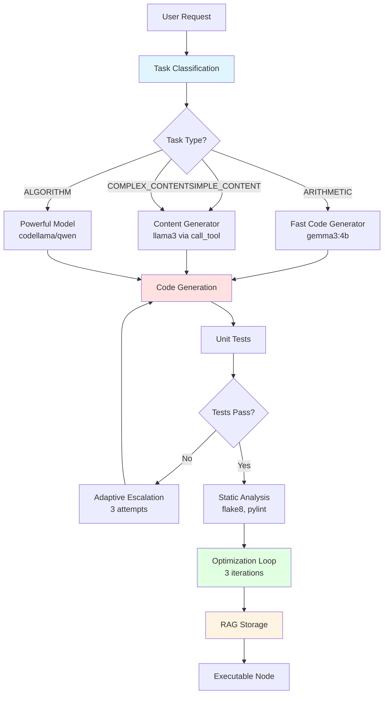
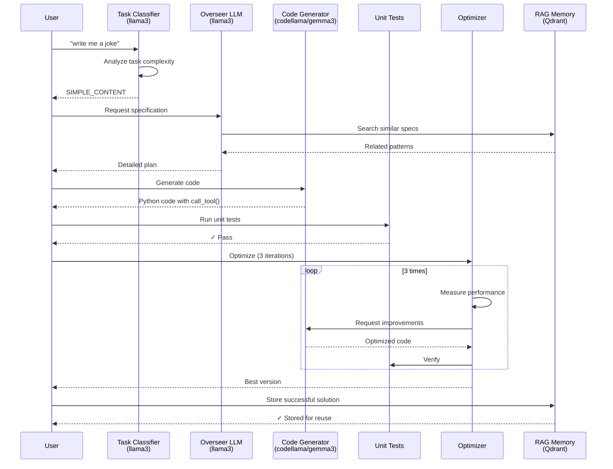
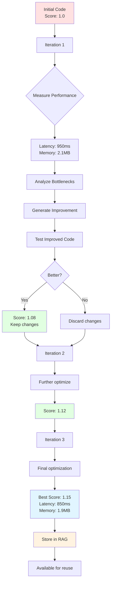
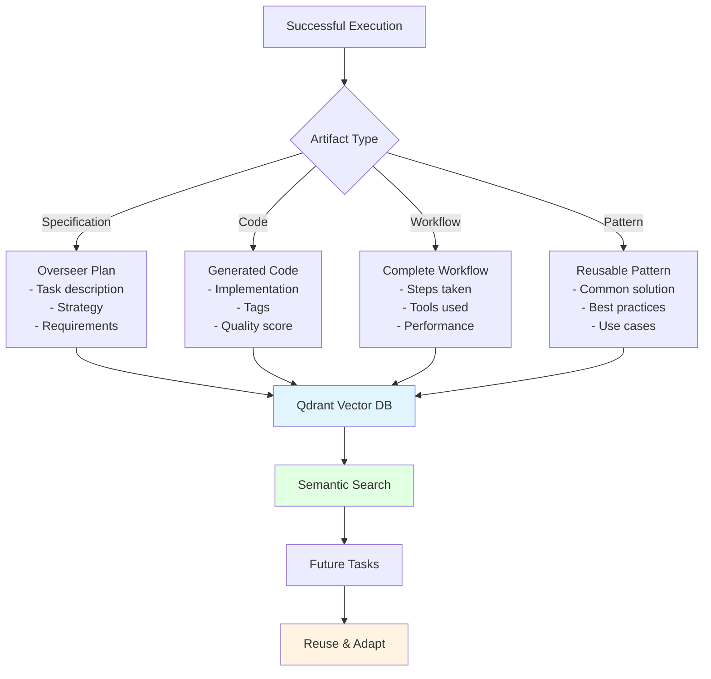
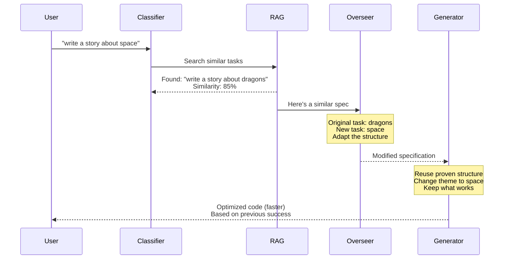
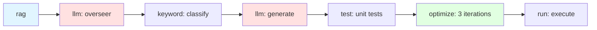

# Code Evolver: Self-Optimizing Multi-LLM Workflow System

> **An experiment in Directed Synthetic Evolution** - accompanying the blog series at [mostlylucid.net](https://www.mostlylucid.net/blog/category/Emergent%20Intelligence)

An AI-powered system that generates, executes, evaluates, and optimizes Python code using multiple LLM models. Features intelligent task classification, RAG-powered tool selection, automatic code generation, and self-optimization through iterative improvement.

## 🎯 What It Does

Code Evolver is a **self-assembling, self-optimizing workflow system** that:

1. **Understands** your task using intelligent LLM-based classification
2. **Plans** the optimal approach using an overseer model
3. **Generates** Python code with appropriate tool selection
4. **Tests** the code automatically with generated unit tests
5. **Optimizes** performance through iterative improvement
6. **Learns** from successful solutions via RAG memory



## 🚀 Quick Start

### Installation

```bash
# Clone the repository
git clone https://github.com/yourusername/code_evolver
cd code_evolver

# Install dependencies
pip install -r requirements.txt

# Install Ollama models
ollama pull llama3
ollama pull codellama
ollama pull gemma3:4b

# Optional: Install Qdrant for scalable RAG
docker run -p 6333:6333 qdrant/qdrant
```

### Basic Usage

```bash
# Start interactive CLI
cd code_evolver
python chat_cli.py
```

```
CodeEvolver> add 10 and 20
> Task classified as ARITHMETIC
> Using Fast Code Generator (gemma3:4b)
✓ Code generated and tested
✓ Optimization complete (best score: 1.10)

RESULT: 30
```

## 📊 System Architecture

### High-Level Flow



### Content Generation Flow


## 💡 Examples

### Example 1: Simple Arithmetic

```bash
CodeEvolver> add 5 and 8

> Task classified as ARITHMETIC (basic arithmetic operation)
> Using Fast Code Generator (gemma3:4b)
> Generating code...
✓ Generated 15 lines of code
✓ Tests passed
✓ Optimization complete (score: 1.10)

RESULT: 13
```

**Generated Code:**
```python
import json
import sys

def main():
    input_data = json.load(sys.stdin)

    # Extract numbers from description
    desc = input_data.get("description", "")
    numbers = [int(s) for s in desc.split() if s.isdigit()]

    if len(numbers) >= 2:
        result = numbers[0] + numbers[1]
    else:
        result = 0

    print(json.dumps({"result": result}))

if __name__ == "__main__":
    main()
```

### Example 2: Content Generation

```bash
CodeEvolver> write me a joke about programmers

> Task classified as SIMPLE_CONTENT (short joke generation)
> Using powerful model for content generation
> Generating code...
✓ Generated code with call_tool()
✓ Tests passed

RESULT:
"Why do programmers prefer dark mode?
Because light attracts bugs!"
```

**Generated Code:**
```python
import json
import sys
from node_runtime import call_tool

def main():
    input_data = json.load(sys.stdin)

    # Use LLM tool for creative content generation
    content = call_tool("content_generator", input_data.get("description"))

    print(json.dumps({"result": content}))

if __name__ == "__main__":
    main()
```

### Example 3: Complex Algorithm

```bash
CodeEvolver> calculate fibonacci sequence

> Task classified as ALGORITHM (fibonacci computation)
> Using powerful model (qwen2.5-coder:14b)
> Generating code...
✓ Generated optimized implementation
✓ Tests passed
✓ Optimization complete (score: 1.15)
```

**Generated Code:**
```python
import json
import sys

def fibonacci(n):
    """Calculate first n fibonacci numbers with safety limit."""
    # Safety limit to prevent infinite computation
    n = min(n, 100)

    if n <= 0:
        return []
    elif n == 1:
        return [0]

    fib = [0, 1]
    for i in range(2, n):
        fib.append(fib[i-1] + fib[i-2])

    return fib[:n]

def main():
    input_data = json.load(sys.stdin)
    desc = input_data.get("description", "")

    # Extract number from description, default to 10
    n = 10
    for word in desc.split():
        if word.isdigit():
            n = int(word)
            break

    result = fibonacci(n)
    print(json.dumps({"result": result}))

if __name__ == "__main__":
    main()
```

## 🔄 Optimization System

### How Optimization Works



### Optimization Example

```python
# Iteration 1: Initial code
def process_data(data):
    result = []
    for item in data:
        result.append(expensive_operation(item))
    return result

# Score: 1.0 (baseline)
# Latency: 1200ms
# Memory: 3.5MB

# Iteration 2: Optimized - use list comprehension
def process_data(data):
    return [expensive_operation(item) for item in data]

# Score: 1.05 (5% improvement)
# Latency: 1100ms
# Memory: 3.2MB

# Iteration 3: Optimized - add caching
_cache = {}
def process_data(data):
    return [
        _cache.setdefault(item, expensive_operation(item))
        for item in data
    ]

# Score: 1.15 (15% improvement)
# Latency: 850ms
# Memory: 2.8MB
```

## 🧠 RAG Memory System

### What Gets Stored



### RAG Workflow Reuse



## 🛠️ Configuration

### Multi-Endpoint Setup

```yaml
# config.yaml
ollama:
  base_url: "http://localhost:11434"

  models:
    overseer:
      model: "llama3"
      endpoint: "http://powerful-cpu-machine:11434"

    generator:
      model: "codellama"
      endpoints:  # Round-robin load balancing
        - "http://gpu-machine-1:11434"
        - "http://gpu-machine-2:11434"

    evaluator:
      model: "llama3"
      endpoint: "http://localhost:11434"
```

### Tool Configuration

```yaml
tools:
  content_generator:
    name: "Content Generator"
    type: "llm"
    description: "Generates creative content (jokes, stories, articles)"
    llm:
      model: "llama3"
      endpoint: null
    cost_tier: "medium"
    speed_tier: "fast"
    quality_tier: "excellent"
    tags: ["content", "creative", "writing"]
```

## 📈 Performance Metrics

### Tracked Metrics

- **Latency**: Execution time in milliseconds
- **Memory**: Peak memory usage in MB
- **CPU Time**: Actual CPU processing time
- **Success Rate**: Percentage of successful executions
- **Quality Score**: Combined metric (latency + memory + correctness)

### Example Metrics

```
Optimization Results:
├─ Iteration 1: Score 1.00 (baseline)
│  ├─ Latency: 1200ms
│  └─ Memory: 3.5MB
├─ Iteration 2: Score 1.05 (+5%)
│  ├─ Latency: 1100ms
│  └─ Memory: 3.2MB
└─ Iteration 3: Score 1.15 (+15%)
   ├─ Latency: 850ms
   └─ Memory: 2.8MB

Best version selected: Iteration 3
```

## 🔧 Advanced Features

### Adaptive Escalation

When code fails tests, the system automatically escalates through multiple attempts:

1. **Attempt 1**: Fast model (codellama) with low temperature (0.1)
2. **Attempt 2**: Fast model with higher temperature (0.3) - more creative
3. **Attempt 3**: Powerful model (qwen2.5-coder:14b) with temp 0.5

### Static Analysis

Automatically runs multiple code quality tools:
- **flake8**: PEP 8 style checking
- **pylint**: Code quality analysis
- **mypy**: Type checking
- **black**: Code formatting validation

### Workflow Tracking



## 🎓 Use Cases

### 1. Rapid Prototyping
Generate working code for quick experiments and proof-of-concepts.

### 2. Code Learning
See how different LLMs approach the same problem, learn optimization techniques.

### 3. Automated Testing
Generate comprehensive unit tests automatically for your code.

### 4. Content Generation
Create stories, jokes, articles, and other creative content via LLM tools.

### 5. Algorithm Optimization
Let the system iteratively improve your algorithms for better performance.

## 📝 API Reference

### Command-Line Interface

```bash
# Generate code
python chat_cli.py
> add 10 and 20

# List available commands
> help

# Check system status
> status

# Toggle auto-evolution
> auto on/off
```

### Programmatic Usage

```python
from src import ChatCLI, ConfigManager

# Initialize
config = ConfigManager()
cli = ChatCLI(config)

# Generate code
success = cli.generate_code("calculate fibonacci")

# Execute node
stdout, stderr, metrics = cli.runner.run_node(
    "fibonacci_node",
    {"description": "calculate first 10 fibonacci numbers"}
)
```

## 🔍 Troubleshooting

### Common Issues

**Problem**: "Cannot connect to Ollama server"
```bash
# Solution: Start Ollama
ollama serve

# Verify models are available
ollama list
```

**Problem**: "Module 'node_runtime' not found"
```bash
# Solution: PYTHONPATH is automatically set by node_runner
# If running manually, set it:
export PYTHONPATH=/path/to/code_evolver:$PYTHONPATH
```

**Problem**: "Tests always fail"
```bash
# Check if dependencies are installed
pip install -r requirements.txt

# Verify static analysis tools
pip install flake8 pylint mypy black
```

## 🤝 Contributing

This is an experimental project. Contributions welcome!

### Areas for Improvement

- [ ] More sophisticated optimization algorithms
- [ ] Better error handling and recovery
- [ ] Additional LLM tool integrations
- [ ] Web UI for easier interaction
- [ ] Distributed execution across machines
- [ ] More comprehensive test coverage

## 📄 License

MIT License - See LICENSE file

## 🙏 Acknowledgments

Built with:
- [Ollama](https://ollama.ai) - Local LLM inference
- [Qdrant](https://qdrant.tech) - Vector database for RAG
- [Rich](https://github.com/Textualize/rich) - Terminal UI
- Multiple open-source LLMs (llama3, codellama, gemma3, qwen)

---

**Built with ❤️ for the AI community**

*An experiment in emergent intelligence through directed synthetic evolution*
