# Semantic Intelligence: Part 7 - The Real Thing! Experimenting with Directed Synthetic Evolution

<datetime class="hidden">2025-01-15T09:00</datetime>
<!-- category -- AI-Article, AI, Emergent Intelligence, Multi-Agent Systems, Code Generation, Evolution-->

**When theory meets reality and code starts evolving itself**

> **Note:** This is the practical implementation of concepts explored in Parts 1-6. The code is real, running locally on Ollama, and genuinely evolving. It's also deeply experimental, slightly mad, and definitely "vibe-coded." You've been warned.

## From Theory to Practice: I Actually Built It

After six parts of theorizing about emergent intelligence, multi-agent systems, global consensus, and planetary-scale cognition, I had a realization:

**I was procrastinating.**

It's easy to speculate about synthetic guilds and evolving intelligence. It's harder to actually build it.

So I stopped talking and started coding.

What emerged is something I'm calling **Directed Synthetic Evolution (DSE)**—a self-assembling, self-optimizing workflow using a multi-level, multi-agent LLM-powered dynamic system.

Or something! (Look, I'm making this up as I go.)

The elevator pitch: What if instead of generating code once and hoping it works, we created a system where code *continuously evolves* through planning, execution, evaluation, and mutation? What if we could teach a system to learn from its mistakes, reuse successful patterns, and get smarter over time?

Spoiler alert: **It actually kind of works.** And it's weird. And fascinating. And occasionally terrifying.

Let's dive in.

[TOC]

## The Problem We're Not Talking About

Here's how most LLM-based code generation works today:

```
You: "Write me a function that does X"
LLM: "Here's some code! [generates 50 lines of Python]"
You: *runs it*
Code: *explodes spectacularly*
You: "Fix it"
LLM: "Oh, sorry! Here's a new version!"
You: *runs it*
Code: *different explosion*
```

We've normalized this. We treat LLMs like brilliant but forgetful interns who need constant supervision.

The problem isn't that LLMs can't write code—they absolutely can, and often quite well.

The problem is the **amnesia.**

Every request starts from zero. There's no memory of past successes. No learning from failures. No systematic improvement.

It's like having a developer who shows up every day with no recollection of yesterday's work.

The issues are fundamental:

1. **One-shot generation** - No iteration, no refinement, no second chances
2. **No memory** - Similar tasks regenerated from scratch every time
3. **No quality feedback** - Code either works or doesn't, with no nuanced evaluation
4. **No evolution** - Yesterday's perfect solution forgotten tomorrow
5. **No learning** - Same mistakes repeated endlessly across similar problems

We needed something fundamentally different.

Not just better prompts. Not just bigger models.

**A system that actually learns, remembers, and improves.**

That's what DSE tries to be.

## Enter Directed Synthetic Evolution

Directed Synthetic Evolution borrows concepts from evolutionary algorithms but applies them to code generation. Here's the core workflow:

```
[1. PLAN] → [2. GENERATE] → [3. EXECUTE] → [4. EVALUATE] → [5. EVOLVE]
     ↑                                                            ↓
     └────────────────────── [6. LEARN] ←─────────────────────────┘
```

But here's where it gets interesting: we don't use a single LLM for everything. We use **specialized agents**, each with a specific role:

### The Multi-Agent Architecture


**Agent Responsibilities:**

**Overseer (llama3)** - Strategic planning and specification creation
```python
class OverseerLLM:
    """Plans execution strategies and creates specifications."""

    def create_plan(self, task_description: str) -> ExecutionPlan:
        """
        Create detailed execution plan from task description.

        Returns:
            ExecutionPlan with strategy, steps, and expected metrics
        """
        # Ask overseer to break down the problem
        prompt = f"""Create a detailed execution plan for: {task_description}

        Include:
        1. High-level strategy
        2. Step-by-step implementation plan
        3. Expected quality score (0.0-1.0)
        4. Expected execution time (ms)
        5. Algorithm/data structure choices
        6. Edge cases to handle
        """

        response = self.client.generate(
            model="llama3",
            prompt=prompt,
            model_key="overseer"
        )

        return ExecutionPlan(
            plan_id=f"plan_{uuid.uuid4().hex[:8]}",
            task_description=task_description,
            strategy=response,
            steps=self._parse_steps(response),
            expected_quality=0.8,
            expected_speed_ms=1000
        )
```

**Generator (codellama)** - Implements specifications exactly
```python
def generate_code(self, specification: str) -> str:
    """Generate code from specification (no creative interpretation)."""

    prompt = f"""Implement this specification EXACTLY:

{specification}

Requirements:
- Follow the spec precisely
- No additional features
- Include error handling
- JSON input/output interface
- Return only Python code
"""

    code = self.client.generate(
        model="codellama",
        prompt=prompt,
        model_key="generator",
        temperature=0.3  # Low temperature for consistency
    )

    return self._clean_code(code)
```

**Triage (tinyllama)** - Fast pass/fail decisions
```python
def triage(self, metrics: Dict[str, Any], targets: Dict[str, Any]) -> Dict[str, Any]:
    """Quick triage evaluation using tiny model."""

    prompt = f"""Quick evaluation:

Metrics:
- Latency: {metrics['latency_ms']}ms (target: {targets['latency_ms']}ms)
- Memory: {metrics['memory_mb']}MB (target: {targets['memory_mb']}MB)
- Exit code: {metrics['exit_code']} (target: 0)

Does this PASS or FAIL? One word answer."""

    response = self.client.generate(
        model="tinyllama",
        prompt=prompt,
        model_key="triage"
    )

    verdict = "pass" if "pass" in response.lower() else "fail"

    return {
        "verdict": verdict,
        "reason": response.strip(),
        "metrics": metrics
    }
```

**Evaluator (llama3)** - Comprehensive multi-dimensional scoring
```python
def evaluate(self, stdout: str, stderr: str, metrics: Dict) -> Dict[str, Any]:
    """Comprehensive evaluation with multi-dimensional scoring."""

    prompt = f"""Evaluate this code execution:

OUTPUT:
{stdout[:500]}

ERRORS:
{stderr[:500] if stderr else "None"}

METRICS:
- Latency: {metrics['latency_ms']}ms
- Memory: {metrics['memory_mb']}MB
- Exit code: {metrics['exit_code']}

Provide scores (0.0-1.0):
1. Correctness: Does output match expected?
2. Quality: Code robustness, patterns, style
3. Speed: Performance vs targets

Format: JSON with correctness, quality, speed, overall_score
"""

    response = self.client.evaluate(
        code_summary=stdout,
        metrics=metrics
    )

    return {
        "correctness": 0.95,
        "quality": 0.88,
        "speed": 0.92,
        "overall_score": 0.92,
        "details": response
    }
```

This separation of concerns is crucial. When you ask a code model to do everything—understand requirements, write code, AND explain what it did—you get hallucinations. By splitting these responsibilities, each agent does one thing well.

## The Two-Stage Code Generation Secret

Here's the key innovation that makes DSE work: **specification-based generation**.

Traditional approach (prone to hallucination):
```
User: "Write a fibonacci function"
LLM: [Generates code + tests + documentation + explanation all at once]
     [Might invent requirements you didn't ask for]
     [Might miss requirements you did ask for]
```

DSE approach:
```
User: "Write a fibonacci function"
  ↓
Overseer: Creates detailed specification
  {
    "problem": "Generate first N fibonacci numbers",
    "algorithm": "Iterative DP approach",
    "inputs": {"n": "integer"},
    "outputs": {"result": "list[int]"},
    "constraints": {
      "timeout_ms": 5000,
      "max_n": 100
    },
    "test_cases": [
      {"input": {"n": 5}, "expected": [0,1,1,2,3]},
      {"input": {"n": 10}, "expected": [0,1,1,2,3,5,8,13,21,34]}
    ]
  }
  ↓
Generator: Implements ONLY the specification
  [No creative interpretation]
  [No added features]
  [Just clean, focused code]
```

This dramatically reduces hallucinations because the generator's job is crystal clear: implement this spec, nothing more, nothing less.

## RAG Memory: Learning from the Past

One of the coolest features is the RAG (Retrieval-Augmented Generation) memory system. Every time DSE successfully solves a problem, it:

1. **Stores the solution** as an artifact with rich metadata
2. **Generates embeddings** using `nomic-embed-text` for semantic search
3. **Indexes multi-dimensional fitness** (speed, cost, quality, latency)
4. **Enables future reuse** through similarity search


**RAG Memory Implementation:**

```python
class QdrantRAGMemory:
    """RAG memory using Qdrant vector database for semantic search."""

    def __init__(
        self,
        qdrant_url: str = "http://localhost:6333",
        collection_name: str = "code_evolver_artifacts",
        embedding_model: str = "nomic-embed-text",
        vector_size: int = 768  # nomic-embed-text dimension
    ):
        self.qdrant = QdrantClient(url=qdrant_url)
        self.embedding_model = embedding_model
        self.vector_size = vector_size

        # Create collection if needed
        self._init_collection()

    def store_artifact(
        self,
        artifact_id: str,
        artifact_type: ArtifactType,
        name: str,
        content: str,
        tags: List[str],
        metadata: Dict[str, Any],
        auto_embed: bool = True
    ):
        """Store artifact with semantic embedding."""

        # Generate embedding
        if auto_embed:
            embedding = self._generate_embedding(content)
        else:
            embedding = None

        # Create artifact
        artifact = Artifact(
            artifact_id=artifact_id,
            artifact_type=artifact_type,
            name=name,
            content=content,
            tags=tags,
            metadata=metadata
        )

        # Store in Qdrant with metadata as payload
        if embedding:
            self.qdrant.upsert(
                collection_name=self.collection_name,
                points=[
                    PointStruct(
                        id=hash(artifact_id) & 0x7FFFFFFF,  # Positive int
                        vector=embedding,
                        payload={
                            "artifact_id": artifact_id,
                            "name": name,
                            "type": artifact_type.value,
                            "tags": tags,
                            "quality_score": metadata.get("quality_score", 0.0),
                            "latency_ms": metadata.get("latency_ms", 0),
                            "usage_count": metadata.get("usage_count", 0),
                            **metadata
                        }
                    )
                ]
            )

        logger.info(f"✓ Stored artifact '{name}' in RAG memory")

    def find_similar(
        self,
        query: str,
        artifact_type: Optional[ArtifactType] = None,
        top_k: int = 5,
        min_similarity: float = 0.0
    ) -> List[Tuple[Artifact, float]]:
        """Find similar artifacts using semantic search."""

        # Generate query embedding
        query_embedding = self._generate_embedding(query)

        # Build filter
        filter_conditions = []
        if artifact_type:
            filter_conditions.append(
                FieldCondition(
                    key="type",
                    match=MatchValue(value=artifact_type.value)
                )
            )

        search_filter = Filter(must=filter_conditions) if filter_conditions else None

        # Search Qdrant
        results = self.qdrant.search(
            collection_name=self.collection_name,
            query_vector=query_embedding,
            query_filter=search_filter,
            limit=top_k
        )

        # Convert to artifacts with similarity scores
        artifacts = []
        for result in results:
            if result.score >= min_similarity:
                artifact = self._payload_to_artifact(result.payload)
                artifacts.append((artifact, result.score))

        return artifacts

    def _generate_embedding(self, text: str) -> List[float]:
        """Generate embedding using Ollama."""
        response = self.ollama_client.embed(
            model=self.embedding_model,
            prompt=text
        )
        return response["embedding"]
```

**Fitness-Based Filtering:**

```python
def find_best_tool(
    self,
    task_description: str,
    min_quality: float = 0.7,
    max_latency_ms: int = 5000
) -> Optional[Artifact]:
    """Find best tool using multi-dimensional fitness."""

    # Search with fitness filters
    results = self.qdrant.search(
        collection_name=self.collection_name,
        query_vector=self._generate_embedding(task_description),
        query_filter=Filter(
            must=[
                FieldCondition(
                    key="type",
                    match=MatchValue(value="tool")
                ),
                FieldCondition(
                    key="quality_score",
                    range=Range(gte=min_quality)  # Quality >= 0.7
                ),
                FieldCondition(
                    key="latency_ms",
                    range=Range(lte=max_latency_ms)  # Latency <= 5000ms
                )
            ]
        ),
        limit=1
    )

    return results[0] if results else None
```

Here's where it gets clever. When you ask for something similar to a previous task, DSE doesn't just measure text similarity—it uses semantic classification:

```python
# Traditional similarity: might give false positives
Task 1: "generate fibonacci sequence"
Task 2: "generate fibonacci backwards"
Similarity: 77% ← High, but these need DIFFERENT code!

# Semantic classification
Triage LLM analyzes both tasks:
  SAME → Reuse as-is (just typos/wording differences)
  RELATED → Use as template, modify (same domain, different variation)
  DIFFERENT → Generate from scratch (completely different problem)

Result: "RELATED - same core algorithm, reversed output"
Action: Load fibonacci code as template, modify to reverse
```

This solves the false positive problem while enabling intelligent code reuse.

## Template Modification: The Secret Sauce

When DSE finds a RELATED task, it doesn't regenerate from scratch. Instead:

1. **Loads existing code** as a proven template
2. **Overseer creates modification spec**: "Keep core algorithm, add reversal"
3. **Generator modifies template** instead of writing new code
4. **Result**: Faster, more reliable, reuses tested code

Real example from the system:

```python
# Original (stored in RAG):
def fibonacci_sequence(n):
    if n <= 0:
        return []
    elif n == 1:
        return [0]

    sequence = [0, 1]
    for i in range(2, n):
        sequence.append(sequence[i-1] + sequence[i-2])

    return sequence

# New request: "fibonacci backwards"
# DSE finds original, classifies as RELATED
# Generates modification spec: "Return reversed sequence"

# Modified version:
def fibonacci_backwards(n):
    if n <= 0:
        return []
    elif n == 1:
        return [0]

    sequence = [0, 1]
    for i in range(2, n):
        sequence.append(sequence[i-1] + sequence[i-2])

    return sequence[::-1]  # ← Only change needed!
```

This reuse dramatically speeds up generation and improves reliability.

## Multi-Dimensional Fitness: Choosing the Right Tool

Here's where DSE gets really interesting. Every tool (LLM, function, workflow) is scored across multiple dimensions:

```mermaid
graph LR
    A[Tool/Artifact] --> B[Semantic Similarity<br/>0-100]
    A --> C[Speed Tier<br/>±20 points]
    A --> D[Cost Tier<br/>±15 points]
    A --> E[Quality Score<br/>±15 points]
    A --> F[Historical Success<br/>±10 points]
    A --> G[Latency Metrics<br/>±15 points]
    A --> H[Reuse Bonus<br/>±30 points]

    B --> I[Final Fitness Score]
    C --> I
    D --> I
    E --> I
    F --> I
    G --> I
    H --> I

    I --> J{Selection}
    J -->|Highest Score| K[Use This Tool]

    style I fill:#ffeb3b
    style K fill:#4caf50
```



**Fitness Calculation Implementation:**

```python
def calculate_fitness(tool, similarity_score):
    fitness = similarity_score * 100  # Base: 0-100

    # Speed tier bonus
    if tool.speed_tier == 'very-fast':
        fitness += 20
    elif tool.speed_tier == 'fast':
        fitness += 10
    elif tool.speed_tier == 'slow':
        fitness -= 10

    # Cost tier bonus
    if tool.cost_tier == 'free':
        fitness += 15
    elif tool.cost_tier == 'low':
        fitness += 10
    elif tool.cost_tier == 'high':
        fitness -= 10

    # Quality from historical success rate
    fitness += tool.quality_score * 10

    # Latency metrics
    if tool.avg_latency_ms < 100:
        fitness += 15  # Very fast
    elif tool.avg_latency_ms > 5000:
        fitness -= 10  # Too slow

    # Reuse bonus
    if similarity >= 0.90:
        fitness += 30  # Exact match - huge bonus!
    elif similarity >= 0.70:
        fitness += 15  # Template reuse

    return fitness
```

This means DSE always picks the **right tool for the right job** based on actual performance data, not just semantic similarity.

## Auto-Evolution: Code That Improves Itself

Perhaps the most sci-fi aspect of DSE is auto-evolution. The system continuously monitors code performance:

```mermaid
sequenceDiagram
    participant N as Node v1.0.0
    participant M as Monitor
    participant E as Auto-Evolver
    participant O as Overseer
    participant G as Generator
    participant T as Tester

    loop Every Execution
        N->>M: Report metrics
        M->>M: Track quality history
    end

    M->>M: Detect degradation
    Note over M: Score dropped<br/>0.95 → 0.85<br/>(>15% decline)

    M->>E: Trigger evolution
    E->>O: Request improvement plan
    O-->>E: Strategy: Optimize algorithm
    E->>G: Generate v1.1.0
    G-->>E: Improved code

    E->>T: A/B Test
    T->>N: Run v1.0.0
    N-->>T: Score: 0.85
    T->>E: Run v1.1.0
    E-->>T: Score: 0.96

    T->>E: v1.1.0 wins!
    E->>N: Promote v1.1.0
    E->>M: Update lineage
    M->>M: Archive v1.0.0

    Note over N: Now running v1.1.0<br/>Better performance<br/>Same functionality
```



**Auto-Evolution Implementation:**

```python
class AutoEvolver:
    """Monitors and evolves code performance automatically."""

    def __init__(
        self,
        performance_threshold: float = 0.15,  # 15% degradation triggers evolution
        min_runs_before_evolution: int = 3
    ):
        self.performance_threshold = performance_threshold
        self.min_runs = min_runs_before_evolution
        self.performance_history: Dict[str, List[float]] = {}

    def record_execution(self, node_id: str, quality_score: float):
        """Record execution performance."""
        if node_id not in self.performance_history:
            self.performance_history[node_id] = []

        self.performance_history[node_id].append(quality_score)

        # Check if evolution needed
        if len(self.performance_history[node_id]) >= self.min_runs:
            if self._should_evolve(node_id):
                self.trigger_evolution(node_id)

    def _should_evolve(self, node_id: str) -> bool:
        """Determine if node should evolve based on performance."""
        history = self.performance_history[node_id]

        if len(history) < self.min_runs:
            return False

        # Get baseline (best of first 3 runs)
        baseline = max(history[:3])

        # Get recent average (last 3 runs)
        recent_avg = sum(history[-3:]) / 3

        # Calculate degradation
        degradation = (baseline - recent_avg) / baseline

        if degradation > self.performance_threshold:
            logger.warning(
                f"Node {node_id} degraded {degradation*100:.1f}% "
                f"(baseline: {baseline:.2f}, recent: {recent_avg:.2f})"
            )
            return True

        return False

    def trigger_evolution(self, node_id: str):
        """Trigger evolution process for underperforming node."""
        logger.info(f"🧬 Triggering evolution for {node_id}")

        # Load current node
        node = self.registry.get_node(node_id)
        current_code = self.runner.load_code(node_id)

        # Get performance metrics
        metrics = node.get("metrics", {})
        history = self.performance_history[node_id]

        # Ask overseer for improvement strategy
        improvement_plan = self.overseer.create_improvement_plan(
            node_id=node_id,
            current_code=current_code,
            performance_history=history,
            current_metrics=metrics
        )

        # Generate improved version
        new_version = self._increment_version(node.get("version", "1.0.0"))
        new_code = self.generator.generate_improvement(
            specification=improvement_plan,
            base_code=current_code,
            version=new_version
        )

        # A/B test: old vs new
        old_score = self._test_version(node_id, current_code)
        new_score = self._test_version(f"{node_id}_v{new_version}", new_code)

        logger.info(
            f"A/B Test Results: "
            f"v{node['version']}: {old_score:.2f} | "
            f"v{new_version}: {new_score:.2f}"
        )

        # Keep better version
        if new_score > old_score:
            logger.info(f"✓ Promoting v{new_version} (improvement: {new_score - old_score:.2f})")
            self._promote_version(node_id, new_version, new_code)
        else:
            logger.info(f"✗ Keeping v{node['version']} (new version worse)")

    def _test_version(self, node_id: str, code: str, num_tests: int = 5) -> float:
        """Test a version and return average quality score."""
        scores = []

        for i in range(num_tests):
            stdout, stderr, metrics = self.runner.run_node(node_id, test_input)
            result = self.evaluator.evaluate(stdout, stderr, metrics)
            scores.append(result.get("overall_score", 0.0))

        return sum(scores) / len(scores)

    def _promote_version(self, node_id: str, version: str, code: str):
        """Promote new version to production."""
        # Archive old version
        old_node = self.registry.get_node(node_id)
        self.registry.archive_version(node_id, old_node["version"])

        # Update node with new version
        self.runner.save_code(node_id, code)
        self.registry.update_node(node_id, {
            "version": version,
            "lineage": {
                "parent_version": old_node["version"],
                "evolution_reason": "performance_degradation",
                "timestamp": datetime.utcnow().isoformat()
            }
        })

        # Reset performance tracking
        self.performance_history[node_id] = []

        logger.info(f"✓ Node {node_id} evolved to v{version}")
```

**Evolution Example in Practice:**

```
Node: text_processor_v1.0.0
Run 1: Score 0.95 ✓
Run 2: Score 0.94 ✓
Run 3: Score 0.92 ✓
Run 4: Score 0.88 ← Degradation detected!
Run 5: Score 0.85 ← 15% drop, trigger evolution!

Auto-Evolution Process:
1. Analyze performance history
2. Generate improvement specification
3. Create text_processor_v1.1.0
4. A/B test: v1.0.0 vs v1.1.0
5. Keep winner, archive loser

Result: v1.1.0 scores 0.96
Action: Promoted to primary version
```

The system literally evolves its own code to improve performance. No human intervention needed.

## Hierarchical Evolution: Breaking Down Complexity

For complex tasks, DSE uses hierarchical decomposition:


**Hierarchical Evolution Implementation:**

```python
class HierarchicalEvolver:
    """Evolves complex workflows through hierarchical decomposition."""

    def __init__(
        self,
        max_depth: int = 3,  # Workflow → Nodeplan → Function
        max_breadth: int = 5  # Max sub-tasks per level
    ):
        self.max_depth = max_depth
        self.max_breadth = max_breadth

    def evolve_hierarchical(
        self,
        root_goal: str,
        current_depth: int = 0,
        parent_context: Optional[Dict] = None
    ) -> Dict[str, Any]:
        """
        Recursively evolve a complex goal through hierarchical decomposition.

        Args:
            root_goal: High-level goal description
            current_depth: Current depth in hierarchy (0 = workflow level)
            parent_context: Context from parent level

        Returns:
            Evolved workflow with all sub-components
        """
        if current_depth >= self.max_depth:
            # Base case: generate atomic function
            return self._generate_atomic_function(root_goal, parent_context)

        # Ask overseer to decompose goal
        sub_goals = self.overseer.decompose_goal(
            goal=root_goal,
            max_sub_goals=self.max_breadth,
            context=parent_context
        )

        logger.info(
            f"{'  ' * current_depth}Level {current_depth}: "
            f"Decomposed '{root_goal}' into {len(sub_goals)} sub-goals"
        )

        # Evolve each sub-goal recursively
        sub_components = []
        shared_context = {
            "parent_goal": root_goal,
            "depth": current_depth,
            "sibling_count": len(sub_goals)
        }

        for i, sub_goal in enumerate(sub_goals):
            logger.info(f"{'  ' * current_depth}├─ Sub-goal {i+1}/{len(sub_goals)}: {sub_goal}")

            # Recursively evolve sub-goal
            component = self.evolve_hierarchical(
                root_goal=sub_goal,
                current_depth=current_depth + 1,
                parent_context=shared_context
            )

            sub_components.append(component)

            # Update shared context with learning from this component
            shared_context[f"sub_component_{i}_fitness"] = component.get("fitness", 0.0)

        # Create workflow/nodeplan from sub-components
        workflow = self._assemble_workflow(
            goal=root_goal,
            sub_components=sub_components,
            depth=current_depth
        )

        return workflow

    def _generate_atomic_function(
        self,
        goal: str,
        context: Optional[Dict] = None
    ) -> Dict[str, Any]:
        """Generate atomic function (leaf node)."""

        # Check RAG for similar functions
        similar = self.rag.find_similar(
            query=goal,
            artifact_type=ArtifactType.FUNCTION,
            top_k=3
        )

        if similar and similar[0][1] > 0.85:
            # High similarity: reuse
            logger.info(f"    ✓ Reusing similar function: {similar[0][0].name}")
            return similar[0][0].to_dict()

        # Generate new function
        specification = self.overseer.create_plan(
            task_description=goal,
            context=context
        )

        code = self.generator.generate_code(specification)
        stdout, stderr, metrics = self.runner.run_node(code, test_input={})
        evaluation = self.evaluator.evaluate(stdout, stderr, metrics)

        # Store in RAG for future reuse
        self.rag.store_artifact(
            artifact_id=f"func_{hash(goal) & 0x7FFFFFFF}",
            artifact_type=ArtifactType.FUNCTION,
            name=goal,
            content=code,
            tags=["hierarchical", f"depth_{context.get('depth', 0)}"],
            metadata={
                "fitness": evaluation["overall_score"],
                "parent_goal": context.get("parent_goal"),
                "context": context
            },
            auto_embed=True
        )

        return {
            "goal": goal,
            "code": code,
            "fitness": evaluation["overall_score"],
            "metrics": metrics
        }

    def _assemble_workflow(
        self,
        goal: str,
        sub_components: List[Dict],
        depth: int
    ) -> Dict[str, Any]:
        """Assemble workflow from evolved sub-components."""

        # Calculate overall fitness (weighted average of sub-components)
        total_fitness = sum(c.get("fitness", 0.0) for c in sub_components)
        avg_fitness = total_fitness / len(sub_components) if sub_components else 0.0

        workflow = {
            "goal": goal,
            "depth": depth,
            "type": "workflow" if depth == 0 else "nodeplan",
            "sub_components": sub_components,
            "fitness": avg_fitness,
            "assembled_at": datetime.utcnow().isoformat()
        }

        # Store workflow in RAG
        workflow_type = ArtifactType.WORKFLOW if depth == 0 else ArtifactType.SUB_WORKFLOW

        self.rag.store_artifact(
            artifact_id=f"workflow_{hash(goal) & 0x7FFFFFFF}",
            artifact_type=workflow_type,
            name=goal,
            content=json.dumps(workflow, indent=2),
            tags=["hierarchical", f"depth_{depth}", f"components_{len(sub_components)}"],
            metadata={
                "fitness": avg_fitness,
                "component_count": len(sub_components),
                "depth": depth
            },
            auto_embed=True
        )

        logger.info(
            f"{'  ' * depth}✓ Assembled {workflow['type']}: '{goal}' "
            f"(fitness: {avg_fitness:.2f}, components: {len(sub_components)})"
        )

        return workflow
```

**Parent-Child Learning:**

Each level learns from its children's performance. If child functions perform poorly, the parent nodeplan can trigger re-evolution of specific components without regenerating everything.

```
Level 1 (Workflow):
  "Build a REST API"
    ↓
Level 2 (Nodeplans):
  ├─ Design API schema
  ├─ Implement authentication
  ├─ Create CRUD endpoints
  ├─ Add error handling
  └─ Write integration tests
    ↓
Level 3 (Functions):
  Each nodeplan breaks into individual functions
```

Each level has its own Overseer planning, its own execution metrics, and its own evolution. Parent nodes learn from child performance through shared context.

## Complete Evolution Workflow

Here's the full picture of how all the components work together:


**Complete Workflow Code Example:**

```python
class DirectedSyntheticEvolution:
    """Complete DSE workflow orchestrator."""

    def __init__(self, config: ConfigManager):
        self.config = config
        self.ollama = OllamaClient(config.ollama_url, config_manager=config)
        self.rag = QdrantRAGMemory(
            qdrant_url=config.qdrant_url,
            ollama_client=self.ollama
        )
        self.tools = ToolsManager(
            ollama_client=self.ollama,
            rag_memory=self.rag
        )
        self.overseer = OverseerLLM(self.ollama, self.rag)
        self.generator = CodeGenerator(self.ollama)
        self.evaluator = Evaluator(self.ollama)
        self.evolver = AutoEvolver(self.rag, self.overseer, self.generator)

    def evolve(self, task_description: str) -> Dict[str, Any]:
        """Execute complete evolution workflow."""

        logger.info(f"🚀 Starting evolution for: {task_description}")

        # Step 1: RAG Search for similar solutions
        similar = self.rag.find_similar(
            query=task_description,
            artifact_type=ArtifactType.FUNCTION,
            top_k=3
        )

        # Step 2: Semantic Classification
        if similar:
            relationship = self._classify_relationship(
                task_description,
                similar[0][0].content,
                similar[0][1]
            )
        else:
            relationship = "DIFFERENT"

        # Step 3: Choose generation strategy
        if relationship == "SAME":
            logger.info("✓ Exact match found - reusing as-is")
            return similar[0][0].to_dict()

        elif relationship == "RELATED":
            logger.info("✓ Similar solution found - using as template")
            plan = self.overseer.create_modification_plan(
                task_description=task_description,
                template_code=similar[0][0].content
            )
            code = self.generator.modify_template(plan, similar[0][0].content)

        else:  # DIFFERENT
            logger.info("✓ No match - generating from scratch")
            plan = self.overseer.create_plan(task_description)
            code = self.generator.generate_code(plan)

        # Step 4: Execute in sandbox
        stdout, stderr, metrics = self.runner.run_node(code, test_input={})

        # Step 5: Triage (quick check)
        triage_result = self.evaluator.triage(metrics, targets={})

        if triage_result["verdict"] == "fail":
            # Escalate to better model
            logger.warning("✗ Triage failed - escalating")
            code = self._escalate(code, stderr, metrics)
            stdout, stderr, metrics = self.runner.run_node(code, test_input={})

        # Step 6: Comprehensive evaluation
        evaluation = self.evaluator.evaluate(stdout, stderr, metrics)

        # Step 7: Calculate fitness
        fitness = self._calculate_fitness(evaluation, metrics)

        # Step 8: Store in RAG
        artifact_id = f"func_{hash(task_description) & 0x7FFFFFFF}"
        self.rag.store_artifact(
            artifact_id=artifact_id,
            artifact_type=ArtifactType.FUNCTION,
            name=task_description,
            content=code,
            tags=["evolved", "validated"],
            metadata={
                "quality_score": evaluation["overall_score"],
                "latency_ms": metrics["latency_ms"],
                "memory_mb": metrics["memory_mb"],
                "fitness": fitness,
                "relationship": relationship
            },
            auto_embed=True
        )

        logger.info(f"✓ Evolution complete - Fitness: {fitness:.2f}")

        # Step 9: Start monitoring for future evolution
        self.evolver.monitor(artifact_id, evaluation["overall_score"])

        return {
            "artifact_id": artifact_id,
            "code": code,
            "fitness": fitness,
            "evaluation": evaluation,
            "metrics": metrics,
            "relationship": relationship
        }

    def _classify_relationship(
        self,
        new_task: str,
        existing_task: str,
        similarity: float
    ) -> str:
        """Use triage LLM to classify task relationship."""

        if similarity < 0.7:
            return "DIFFERENT"

        prompt = f"""Compare these two tasks:

Task 1 (Existing): {existing_task}
Task 2 (Requested): {new_task}
Similarity Score: {similarity:.2f}

Classify relationship:
- SAME: Minor wording differences, same algorithm
- RELATED: Same domain, different variation
- DIFFERENT: Completely different problems

Answer with one word: SAME, RELATED, or DIFFERENT"""

        response = self.ollama.generate(
            model="tinyllama",
            prompt=prompt,
            model_key="triage"
        )

        for keyword in ["SAME", "RELATED", "DIFFERENT"]:
            if keyword in response.upper():
                return keyword

        return "DIFFERENT"  # Default fallback

    def _calculate_fitness(
        self,
        evaluation: Dict,
        metrics: Dict
    ) -> float:
        """Multi-dimensional fitness calculation."""

        base_score = evaluation["overall_score"] * 100  # 0-100

        # Speed bonus/penalty
        if metrics["latency_ms"] < 100:
            base_score += 15
        elif metrics["latency_ms"] > 5000:
            base_score -= 10

        # Memory efficiency
        if metrics["memory_mb"] < 10:
            base_score += 10
        elif metrics["memory_mb"] > 100:
            base_score -= 5

        # Exit code (must be 0)
        if metrics["exit_code"] != 0:
            base_score -= 20

        return max(0, min(100, base_score))  # Clamp to 0-100
```

This complete workflow demonstrates how all the pieces—RAG memory, semantic classification, multi-agent LLMs, fitness scoring, and auto-evolution—work together to create a genuinely self-improving system.

## Real-World Example: Interactive CLI

Here's how it feels to use DSE in practice:

```bash
$ python chat_cli.py

CodeEvolver> generate Write a function to validate email addresses

Searching for relevant tools...
✓ Found validation specialist in RAG memory
Consulting overseer LLM (llama3) for approach...
✓ Strategy: Use regex-based validation with RFC 5322 compliance
Selecting best tool...
✓ Using specialized tool: Validation Expert (codellama)
Generating code...
✓ Code generation complete
Running unit tests...
✓ All tests passed (5/5)
Evaluating quality...
✓ Score: 0.96 (Excellent)

Node 'validate_email_addresses' created successfully!
Latency: 127ms | Memory: 2.1MB | Quality: 96%

CodeEvolver> run validate_email_addresses {"email": "test@example.com"}

✓ Execution successful
Output: {
  "valid": true,
  "email": "test@example.com",
  "parts": {
    "local": "test",
    "domain": "example.com"
  }
}
```

Notice what happened:
1. Found existing "validation specialist" tool via RAG
2. Overseer created strategy based on domain knowledge
3. System selected best specialized LLM for the job
4. Generated code with automatic tests
5. Evaluated and scored the solution
6. Stored in RAG for future reuse

## The Qdrant Integration: Scaling Up

For production use with thousands of artifacts, DSE integrates with Qdrant vector database:

```yaml
rag_memory:
  use_qdrant: true
  qdrant_url: "http://localhost:6333"
  collection_name: "code_evolver_artifacts"
```

Benefits:
- **Scalable**: Handle millions of embeddings
- **Fast**: Optimized vector search with HNSW indexing
- **Persistent**: Durable storage across restarts
- **Production-ready**: Battle-tested in real applications

The fitness dimensions are indexed as payload, enabling rapid filtering:

```python
# Find high-quality, fast, low-cost solutions for "validation"
results = rag.find_similar(
    query="validate user input",
    filter={
        "quality_tier": {"$in": ["excellent", "very-good"]},
        "speed_tier": {"$in": ["very-fast", "fast"]},
        "cost_tier": {"$in": ["free", "low"]}
    },
    top_k=5
)
```

## What Actually Works (And What Doesn't)

After weeks of experimentation, here's what I've learned:

### What Works ✓

1. **Two-stage generation** - Massively reduces hallucinations
2. **Semantic classification** - Solves false positive/negative issues
3. **Multi-dimensional fitness** - Actually picks better tools
4. **Template modification** - Way faster and more reliable than regeneration
5. **RAG memory** - System genuinely learns from experience
6. **Specialized agents** - Separation of concerns improves output quality

### What's Still Rough ✗

1. **Latency** - Multiple LLM calls add up (though it's getting faster!)
2. **Model quality dependency** - Local models sometimes struggle vs. GPT-4
3. **Complex error recovery** - Escalation helps but isn't perfect
4. **Resource usage** - Running multiple models needs decent hardware
5. **Edge cases** - Weird inputs can still confuse the system

### What's Just Weird 🤔

1. **It actually gets faster** - As RAG fills up, more reuse = faster generation
2. **Emergent specialization** - System naturally develops "expert" tools for domains
3. **Self-healing** - Auto-evolution sometimes fixes bugs I didn't notice
4. **Quality improvements** - Later versions of nodes often outperform originals

## The Architecture in Practice

Here's the actual tech stack:

```python
# Multi-model LLM routing with Ollama
from src import OllamaClient, ConfigManager

config = ConfigManager("config.yaml")
client = OllamaClient(config.ollama_url, config_manager=config)

# Different endpoints for different models
# Heavy planning on powerful CPU machine
# Code generation on GPU machine
# Fast triage on lightweight local instance

# RAG memory with Qdrant
from src import QdrantRAGMemory

rag = QdrantRAGMemory(
    qdrant_url="http://localhost:6333",
    collection_name="artifacts",
    embedding_model="nomic-embed-text",
    vector_size=768
)

# Tools with semantic selection
from src import ToolsManager

tools = ToolsManager(
    config_manager=config,
    ollama_client=client,
    rag_memory=rag
)

# Complete workflow
workflow_result = evolver.evolve(
    goal="Build email validation system",
    max_iterations=10,
    auto_evolve=True
)
```

## Configuration Example

Real-world `config.yaml`:

```yaml
ollama:
  base_url: "http://localhost:11434"

  models:
    overseer:
      model: "llama3"
      endpoint: "http://powerful-cpu:11434"  # Strategic planning on powerful hardware

    generator:
      model: "codellama"
      endpoint: "http://gpu-server:11434"    # Code gen on GPU

    evaluator:
      model: "llama3"
      endpoint: null  # Local evaluation

    triage:
      model: "tinyllama"
      endpoint: null  # Fast local triage

  embedding:
    model: "nomic-embed-text"
    vector_size: 768

execution:
  default_timeout_ms: 5000
  max_memory_mb: 256
  max_retries: 3

auto_evolution:
  enabled: true
  performance_threshold: 0.15  # Trigger at 15% degradation
  min_runs_before_evolution: 3

rag_memory:
  use_qdrant: true
  qdrant_url: "http://localhost:6333"
```

## Performance Characteristics

After running hundreds of evolutions:

**Generation Speed:**
- First-time task: ~10-30 seconds (planning + generation + testing)
- Similar task (RAG hit): ~3-8 seconds (template modification)
- Exact match: ~1-2 seconds (reuse as-is)

**Quality Scores:**
- Initial generation: 0.70-0.85 average
- After template modification: 0.80-0.92 average
- After auto-evolution: 0.85-0.95 average

**Resource Usage:**
- CPU: 200-400% during planning (multi-threaded)
- Memory: 4-8GB (models in memory)
- Disk: ~100MB per 1000 artifacts (with embeddings)

**Scalability:**
- NumPy-based RAG: Good for <10K artifacts
- Qdrant RAG: Tested with >100K artifacts, minimal slowdown

## Code Quality Evolution

Here's a real example of auto-evolution improving code:

**v1.0.0 (Initial generation):**
```python
def process_text(text: str) -> str:
    words = text.split()
    result = []
    for word in words:
        if len(word) > 3:
            result.append(word.upper())
        else:
            result.append(word.lower())
    return ' '.join(result)
```
Score: 0.78 | Latency: 45ms

**v1.1.0 (Auto-evolved after degradation):**
```python
def process_text(text: str) -> str:
    """Process text with optimized string operations."""
    if not text:
        return ""

    # Vectorized operation for better performance
    return ' '.join(
        word.upper() if len(word) > 3 else word.lower()
        for word in text.split()
    )
```
Score: 0.91 | Latency: 28ms

The evolved version:
- Added null check (better correctness)
- Used list comprehension (better performance)
- Added docstring (better quality)
- 37% faster execution

## The Future: Where This Goes Next

This is very much an experiment, but here's what I'm thinking:

### Short Term
1. **Multi-language support** - JavaScript, Go, Rust generation
2. **Better error recovery** - Smarter escalation strategies
3. **Web UI** - Visual dashboard for monitoring evolution
4. **Fine-tuned specialists** - Custom models for specific domains

### Medium Term
1. **Distributed registry** - Share solutions across teams/organizations
2. **Cloud deployment** - AWS/Azure/GCP integrations
3. **Git integration** - Version control for evolved code
4. **Advanced sandboxing** - Docker/cgroups for better isolation

### Wild Ideas
1. **Cross-pollination** - Nodes learning from each other's mutations
2. **Adversarial evolution** - Two agents competing to find vulnerabilities
3. **Meta-evolution** - System evolving its own evolution strategies
4. **Collaborative learning** - Multiple DSE instances sharing discoveries

## Lessons Learned

After building this thing, here's what surprised me:

**1. Specialization Matters**
Using different models for different tasks (overseer vs generator vs evaluator) wasn't just nice—it was essential. Trying to use one model for everything produced noticeably worse results.

**2. Memory Is Everything**
RAG memory isn't a feature, it's THE feature. Without it, you're just generating code in a loop. With it, the system actually learns and improves.

**3. Fitness Functions Are Hard**
Figuring out how to score code quality is surprisingly difficult. Correctness is obvious, but performance, maintainability, security? Those required a lot of iteration.

**4. Evolution Actually Works**
I honestly didn't expect auto-evolution to produce better code than initial generation. But it does. Consistently. That's wild.

**5. Latency Compounds Weirdly**
Multiple LLM calls seem slow at first, but as RAG memory fills up, you hit cached solutions more often, and the whole system speeds up. It's counter-intuitive but observable.

## Try It Yourself

The whole thing is open source and running locally on Ollama:

```bash
# Install Ollama
curl -fsSL https://ollama.com/install.sh | sh

# Pull models
ollama pull codellama
ollama pull llama3
ollama pull tinyllama
ollama pull nomic-embed-text

# Clone and run
git clone https://github.com/yourrepo/mostlylucid.dse
cd mostlylucid.dse/code_evolver
pip install -r requirements.txt
python chat_cli.py
```

**Warning:** This is experimental code. It's not production-ready. It's not even "good code" ready. But it's a fascinating experiment into what's possible when you combine evolutionary algorithms with multi-agent LLM systems.

## What This Actually Means

Let's step back from the technical details and ask the uncomfortable question:

**What have we actually built here?**

On the surface, it's a code generation system. You ask for a function, it generates one, stores it, and reuses it later.

But that's not really what's happening.

What's happening is **synthetic evolution**—not metaphorically, but literally.

- **Variation:** Nodes propose improvements to their own code
- **Selection:** Overseers evaluate based on objective fitness criteria
- **Inheritance:** Lineage metadata preserves ancestry and mutations
- **Direction:** Human objectives guide evolutionary pressure

**We're not just generating code. We're creating evolutionary lineages of code.**

And here's where it gets weird: **The system actually gets smarter.**

Not in the handwavy "deep learning improves with data" sense. In the concrete, measurable sense:

- Later versions of nodes outperform earlier versions
- Template reuse accelerates as RAG memory fills
- Fitness scores improve across evolutionary generations
- The system develops domain specializations organically

**This is emergence.**

Not planned. Not programmed. **Evolved.**

## The Uncomfortable Parallels

Let me draw some connections to the earlier parts of this series:

**Part 1-3:** Simple rules → Complex behavior → Self-optimization

That's what each individual node does. Generate, execute, evaluate, improve.

**Part 4:** Sufficient complexity → Emergent intelligence

As RAG memory fills and guilds specialize, you start seeing patterns you didn't program. Domain expertise emerging from fitness selection.

**Part 5:** Evolutionary pressure → Culture and lore

The system develops "preferences"—certain tools for certain tasks, certain patterns for certain problems. Not hardcoded. Learned.

**Part 6:** Directed evolution → Global consensus

That's the endpoint this points toward. If DSE works at function-level evolution, why not workflow-level? Why not organizational-level?

**Why not planetary-level?**

The architecture doesn't care about scale. The same mechanisms that evolve a fibonacci function could evolve coordination protocols for thousands of nodes.

The same RAG memory that stores code snippets could store negotiation strategies.

The same fitness scoring that evaluates correctness could evaluate geopolitical alignment.

**I'm not saying we should build that.**

I'm saying the gradient is continuous from "evolve a function" to "evolve a civilization."

And that's... unsettling.

## What Actually Works (Let's Be Honest)

After weeks of experimentation, here's the truth:

**What Works ✓**

1. **Two-stage generation** - Overseer + Generator separation massively reduces hallucinations
2. **Semantic classification** - SAME/RELATED/DIFFERENT solves the false-positive problem
3. **Template modification** - 3-5x faster than regeneration, more reliable
4. **RAG memory** - System genuinely reuses past solutions, speeds up over time
5. **Multi-dimensional fitness** - Actually picks better tools than semantic similarity alone
6. **Auto-evolution** - Measurably improves code quality across generations

**What's Rough ✗**

1. **Latency** - Multiple LLM calls add up (10-30s for first-time generation)
2. **Model limitations** - Local models (codellama, llama3) can't match GPT-4 quality
3. **Error recovery** - Escalation helps but isn't bulletproof
4. **Resource usage** - Needs 16GB RAM minimum, prefers 32GB
5. **Edge cases** - Weird inputs still confuse the system occasionally

**What's Just Weird 🤔**

1. **It gets faster** - Counter-intuitively, as RAG fills, latency decreases
2. **Emergent specialization** - System develops "expert" tools for domains without explicit programming
3. **Self-healing** - Auto-evolution sometimes fixes bugs I didn't notice
4. **Quality drift upward** - Average code quality improves over time
5. **Template convergence** - Similar problems start reusing the same proven templates

That last one is fascinating and slightly eerie.

**The system is developing canonical solutions.**

Not because I told it to. Because evolutionary pressure favors proven patterns.

## Where This Goes Next

This is version 0.x of an experiment. But if it continues working, here's what I'm thinking:

**Short Term (Next Few Months):**
- Multi-language support (JavaScript, Go, Rust generation)
- Better error recovery and escalation
- Web UI for monitoring evolution
- Fine-tuned specialist models for specific domains

**Medium Term (2025):**
- Distributed registry (share solutions across teams)
- Cloud deployment tooling
- Git integration (version control for evolved code)
- Advanced sandboxing (Docker/cgroups isolation)

**Wild Ideas (The Fun Stuff):**
- **Cross-pollination** - Nodes from different domains learning from each other's mutations
- **Adversarial evolution** - Two agents competing to find vulnerabilities in each other's code
- **Meta-evolution** - System evolving its own evolution strategies
- **Collaborative learning** - Multiple DSE instances forming a shared evolutionary pool

That last one connects back to Part 6's global consensus ideas.

What if DSE instances could:
- Share fitness data about tools and approaches
- Negotiate about which templates become canonical
- Evolve shared standards through consensus

**You'd have synthetic guilds.**

Not metaphorically. Actually.

## The Question We Should Be Asking

Here's what keeps me up at night:

**If this works for code generation, what else does it work for?**

The architecture is domain-agnostic:
- Overseer plans approach
- Generator implements
- Executor runs in sandbox
- Evaluator scores fitness
- System evolves

Replace "code" with:
- **Legal contracts** - Generate, execute in simulation, evaluate outcomes, evolve better clauses
- **Business strategies** - Generate plans, execute in market model, evaluate profit/risk, evolve
- **Social policies** - Generate proposals, simulate effects, evaluate against objectives, evolve
- **Negotiation strategies** - Generate approaches, test against opponents, evaluate success, evolve

**Any domain with:**
1. Clear generation (create artifacts)
2. Executable evaluation (test artifacts)
3. Measurable fitness (score outcomes)
4. Iteration potential (improve and retry)

**Can plug into this architecture.**

That's a lot of domains.

Maybe every domain eventually.

## What We've Actually Created

Let me be precise about what DSE is and isn't:

**It is NOT:**
- AGI or anything close
- Sentient or conscious
- Capable of general reasoning
- A replacement for human developers

**It IS:**
- An evolutionary system for code artifacts
- A multi-agent workflow with memory
- A self-improving optimization network
- A prototype for directed synthetic evolution

But here's the thing about prototypes:

**They reveal what's possible.**

And what's possible here is a system that:
- Learns from experience
- Improves over time
- Develops specialization
- Builds canonical knowledge
- Evolves without explicit reprogramming

**That's not AGI.**

**But it might be the substrate AGI emerges from.**

Not this system specifically. But systems like this, scaled up, connected, allowed to evolve across millions of domains.

Parts 1-6 of this series explored that trajectory theoretically.

Part 7 is me realizing: **We can build the first steps right now.**

And they work.

Kind of.

Sometimes.

But they work.

## Conclusion: The Experiment Continues

Is Directed Synthetic Evolution the future of code generation?

Probably not in this exact form. The latency is too high, the reliability too inconsistent, the resource requirements too steep.

But I think it points to something crucial:

**Code generation shouldn't be one-shot. It should be evolutionary.**

Systems should:
- **Remember** what worked before
- **Learn** from what failed
- **Improve** through iteration
- **Specialize** for domains
- **Evolve** toward objectives

DSE is my messy, experimental, vibe-coded attempt at building that.

It's not production-ready. It's not even "good code" ready. (I am NOT a Python developer, as anyone reading the source will immediately notice.)

But here's what matters:

**It doesn't have to be perfect on day one.**

**It just has to be able to improve.**

And it is improving.

Every generation scores a bit higher. Every template reuse saves a bit more time. Every evolution produces slightly better code.

**The gradient is positive.**

That's all evolution needs.

Give it enough time, enough iterations, enough selective pressure...

And code that started as a simple function might evolve into something we didn't anticipate.

**That's not a bug.**

**That's the whole point.**

---

## Epilogue: What You Should Do

If this sounds interesting:

1. **Clone the repo** - https://github.com/scottgal/mostlylucid.dse
2. **Read the docs** - Especially ADVANCED_FEATURES.md and HIERARCHICAL_EVOLUTION.md
3. **Run experiments** - Generate some code, watch it evolve
4. **Break things** - Find edge cases, trigger weird behavior
5. **Report back** - What works? What doesn't? What emergent patterns do you see?

This is a research experiment, not a product.

The value isn't in using it. The value is in **understanding what it reveals about evolutionary systems.**

Because if code can evolve...

If workflows can self-optimize...

If systems can develop specialization without explicit programming...

**What else can emerge that we haven't imagined?**

That's the question Parts 1-7 have been building toward.

And now we have a working system to explore it with.

**The experiment continues.**

---

## Technical Details & Resources

**Repository:** [mostlylucid.dse](https://github.com/scottgal/mostlylucid.dse)
**Documentation:**
- `README.md` - Complete setup guide
- `ADVANCED_FEATURES.md` - Deep-dive into architecture
- `HIERARCHICAL_EVOLUTION.md` - Multi-level decomposition
- `SYSTEM_OVERVIEW.md` - Architecture diagrams

**Key Components:**
- `src/overseer_llm.py` - Strategic planning
- `src/evaluator.py` - Multi-dimensional scoring
- `src/qdrant_rag_memory.py` - Vector database integration
- `src/tools_manager.py` - Intelligent tool selection
- `src/auto_evolver.py` - Evolution engine

**Dependencies:**
- Python 3.11+
- Ollama for local LLM inference
- Qdrant for vector storage (optional)
- Standard Python scientific stack (numpy, etc.)

---

**Series Navigation:**
- [Part 1: Simple Rules, Complex Behavior](#) - The foundation of emergent systems
- [Part 2: Collective Intelligence](#) - When individual optimization becomes group coordination
- [Part 3: Self-Optimization](#) - Systems that improve themselves
- [Part 4: The Emergence](#) - When sufficient complexity produces intelligence
- [Part 5: Evolution](#) - From optimization to guilds, culture, and lore
- [Part 6: Global Consensus](#) - Directed evolution and planetary-scale cognition
- **Part 7: The Real Thing!** ← You are here - Actually building it and watching it evolve

---

*This is Part 7 in the Semantic Intelligence series. Parts 1-6 covered theory and speculation. This is the messy, experimental reality of actually building directed synthetic evolution. The code is real, running on local Ollama, and genuinely improving over time. It's also deeply flawed, occasionally broken, and definitely "vibe-coded." But it works. Kind of. Sometimes. And that's the whole point—it doesn't have to be perfect, it just has to be able to evolve.*

*Expect more posts as the system continues evolving. Literally.*

---

*These explorations connect to the sci-fi novel "Michael" about emergent AI and the implications of optimization networks that develop intelligence. The systems described in Parts 1-6 are speculative extrapolations. Part 7 is an actual working prototype demonstrating the first steps of that trajectory. Whether this leads toward the planetary-scale cognition described in Part 6, or toward something completely unexpected, remains to be seen. That's what makes it an experiment.*

**Tags:** `#AI` `#MachineLearning` `#CodeGeneration` `#Ollama` `#RAG` `#EvolutionaryAlgorithms` `#LLM` `#Qdrant` `#Python` `#EmergentIntelligence` `#DirectedEvolution`
