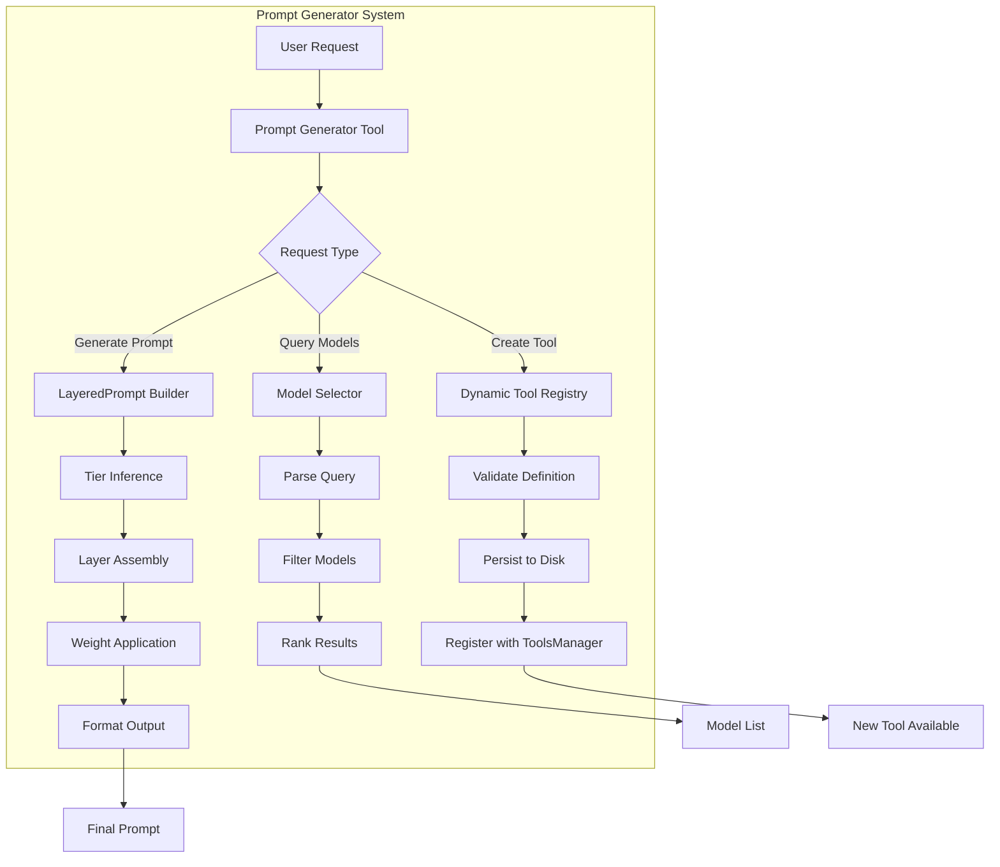
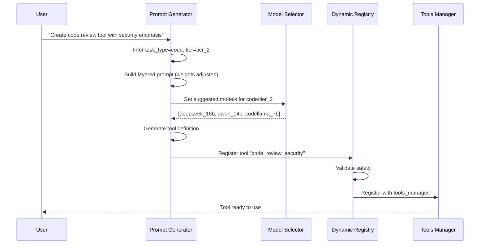

# Prompt Generator System

A comprehensive meta-tool system for creating, managing, and optimizing LLM prompts and tools dynamically.

## Table of Contents

- [Overview](#overview)
- [Architecture](#architecture)
- [Components](#components)
- [Usage Guide](#usage-guide)
- [Examples](#examples)
- [Best Practices](#best-practices)
- [API Reference](#api-reference)

---

## Overview

The Prompt Generator System enables:

1. **Layered Prompt Generation** - Build sophisticated prompts using a tiered architecture
2. **Conversational Model Selection** - Query models naturally: "what fast summary models do we have"
3. **Dynamic Tool Creation** - Generate new LLM tools from descriptions at runtime
4. **Weight Adjustment** - Fine-tune prompt emphasis for specific requirements
5. **Safe Tool Management** - Validate, register, and manage dynamically created tools

### Key Features

✅ **Layered Architecture** - 7 distinct prompt layers (system, role, context, task, constraints, output, examples)
✅ **Weight System** - Adjust layer importance (0.0 to 1.0) for precise control
✅ **Model Intelligence** - Conversational queries automatically filter and rank models
✅ **Quality Assurance** - All tools include quality, speed, cost metadata for safe usage
✅ **Dynamic Creation** - Create specialized LLM tools on-the-fly
✅ **Persistent Storage** - Tools are saved and reloaded across sessions

---

## Architecture



### Component Interaction



---

## Components

### 1. Layered Prompt Builder

**File:** `src/prompt_generator_tool.py`

#### Prompt Layers

| Layer | Weight | Purpose | Example |
|-------|--------|---------|---------|
| **SYSTEM** | 1.0 | System-level instructions | "You are an expert software engineer..." |
| **ROLE** | 0.8 | Role definition and persona | "Your role is to review code for..." |
| **CONTEXT** | 0.7 | Background information | "The user requires assistance with..." |
| **TASK** | 1.0 | Specific task description | "Review this code for security issues" |
| **CONSTRAINTS** | 0.9 | Limitations and requirements | "- Check for SQL injection\n- Verify input validation" |
| **OUTPUT** | 0.8 | Output format specification | "Provide findings in markdown format" |
| **EXAMPLES** | 0.6 | Example inputs/outputs | "Input: function foo() {...}\nOutput: No issues found" |

#### Weight System

Weights range from **0.0** (exclude) to **1.0** (critical emphasis):

- **1.0** - Critical importance (SYSTEM, TASK)
- **0.9** - Important (CONSTRAINTS)
- **0.8** - Standard (ROLE, OUTPUT)
- **0.7** - Contextual (CONTEXT)
- **0.6** - Optional enhancement (EXAMPLES)
- **0.0** - Exclude layer

Higher weights add emphasis markers:
- `weight >= 0.9`: "CRITICAL: {LAYER}"
- `weight >= 0.7`: "IMPORTANT: {LAYER}"
- `weight < 0.7`: No emphasis

#### Task Types

| Task Type | Use Cases | Specialized Models |
|-----------|-----------|-------------------|
| `code` | Code generation, review, debugging | deepseek-coder, codellama, qwen-coder |
| `content` | Writing, articles, creative text | mistral-nemo, claude-sonnet, llama3 |
| `analysis` | Evaluation, assessment, critique | claude-opus, gpt-4, deepseek |
| `summary` | Summarization, TL;DR, key points | gemma3, qwen, claude-haiku |
| `translation` | Language translation | claude-sonnet, gpt-4 |
| `general` | General-purpose tasks | llama3, codellama |

#### Complexity Tiers

| Tier | Complexity | Models | Use When |
|------|-----------|--------|----------|
| **tier_1** | Simple/Fast | gemma3:4b, qwen:3b | Quick tasks, simple queries |
| **tier_2** | Balanced | codellama:7b, llama3 | Standard complexity, general work |
| **tier_3** | Complex | deepseek:16b, claude-opus | Deep analysis, complex reasoning |

### 2. Model Selector with Query Capabilities

**File:** `src/model_selector_tool.py`

#### Conversational Queries

Ask natural language questions about available models:

```python
from node_runtime import call_tool

# Query fast models
result = call_tool("model_selector", {"query": "what fast summary models do we have"})

# Query by cost
result = call_tool("model_selector", {"query": "show me free code models"})

# Query by context
result = call_tool("model_selector", {"query": "which models have large context windows"})
```

#### Query Keywords

**Speed:**
- "fast", "quick", "rapid" → filters for fast/very-fast models
- "slow", "thorough", "powerful" → filters for slow/medium models

**Cost:**
- "free", "cheap", "low cost", "local" → filters for free models
- "expensive", "premium", "cloud" → filters for paid models

**Quality:**
- "best", "high quality", "excellent" → filters for excellent models

**Specialization:**
- "code", "coding", "programming" → filters for code-specialized models
- "summary", "summarize" → filters for summary-capable models
- "content", "writing", "creative" → filters for content-specialized models

**Context:**
- "large context", "long context" → filters for models with context window >= 50K tokens

### 3. Dynamic Tool Registry

**File:** `src/dynamic_tool_registry.py`

Manages lifecycle of dynamically created tools:

- **Registration** - Validate and register new tools
- **Persistence** - Save tools to disk (YAML format)
- **Validation** - Safety checks for dangerous operations
- **Lifecycle** - Update, delete, track usage

#### Safety Features

✅ **Structure Validation** - Ensures required fields present
✅ **Type Checking** - Validates tool type and configuration
✅ **Command Safety** - Detects potentially dangerous commands
✅ **Metadata Enforcement** - Requires quality/speed/cost tiers
✅ **Automatic Defaults** - Fills missing fields with safe defaults

---

## Usage Guide

### Basic Prompt Generation

```python
from node_runtime import call_tool

# Generate a prompt for code review
result = call_tool("prompt_generator", {
    "description": "Review code for security vulnerabilities",
    "task_type": "code"
})

print(result["prompt"])
print(result["suggested_models"])
```

**Output:**
```markdown
## CRITICAL: SYSTEM

You are an expert software engineer specializing in clean, efficient, and maintainable code.

## ROLE

Your role is to write, review, or optimize code with attention to best practices and performance.

## TASK

Review code for security vulnerabilities

## CRITICAL: CONSTRAINTS

- Provide accurate and helpful responses
- Follow best practices for the task type
- Be concise yet thorough
- Include error handling
- Add appropriate comments
- Follow language-specific conventions
```

### Adjusting Weights

Emphasize specific aspects by adjusting layer weights:

```python
result = call_tool("prompt_generator", {
    "description": "Review code with focus on security",
    "task_type": "code",
    "weights": {
        "constraints": 1.0,  # Critical emphasis on constraints
        "system": 0.9,       # Important system instructions
        "context": 0.5,      # De-emphasize context
        "examples": 0.0      # Exclude examples
    }
})
```

### Querying Models

Ask conversational questions about available models:

```python
# Query fast code models
result = call_tool("model_selector", {
    "query": "what fast code models do we have"
})

for model in result:
    print(f"{model['name']}: speed={model['speed']}, quality={model['quality']}")
```

**Output:**
```
qwen2.5-coder:3b: speed=very-fast, quality=good
codellama:7b: speed=fast, quality=excellent
qwen2.5-coder:14b: speed=medium, quality=excellent
```

### Creating Dynamic Tools

Generate new LLM tools from descriptions:

```python
result = call_tool("prompt_generator", {
    "description": "Translate technical documentation to Spanish",
    "task_type": "translation",
    "create_tool": True,
    "tool_name": "tech_doc_translator",
    "tier": "tier_2"
})

# Tool is now registered and available
tool_def = result["tool_definition"]
print(f"Created tool: {tool_def['name']}")
print(f"Model: {tool_def['llm']['model']}")
print(f"Quality: {tool_def['metadata']['quality_tier']}")
```

### Using Dynamically Created Tools

Once created, dynamic tools work like any other tool:

```python
from node_runtime import call_tool

# Use the newly created translator
result = call_tool("dynamic_tech_doc_translator", {
    "text": "This function validates user input for SQL injection attacks.",
    "target_language": "es"
})

print(result)
# Output: "Esta función valida la entrada del usuario para ataques de inyección SQL."
```

---

## Examples

### Example 1: Generate Code Review Prompt

```python
from node_runtime import call_tool
import json

# Generate sophisticated code review prompt
result = call_tool("prompt_generator", {
    "description": "Perform thorough code review with emphasis on security, performance, and maintainability",
    "task_type": "code",
    "tier": "tier_3",  # Complex task
    "weights": {
        "system": 1.0,
        "constraints": 1.0,
        "output": 0.9
    },
    "format_style": "markdown"
})

print("Generated Prompt:")
print(result["prompt"])
print("\nSuggested Models:")
for model in result["suggested_models"]:
    print(f"  - {model['name']} (score: {model['match_score']})")
```

### Example 2: Query and Select Models

```python
# Find fast models for summarization
models = call_tool("model_selector", {
    "query": "what fast summary models do we have"
})

print("Fast Summary Models:")
for model in models:
    print(f"  {model['name']}")
    print(f"    Speed: {model['speed']}")
    print(f"    Context: {model['context_window']} tokens")
    print(f"    Cost: {model['cost']}")
    print()
```

### Example 3: Create Custom Translation Tool

```python
# Create a specialized translator for medical documents
result = call_tool("prompt_generator", {
    "description": "Translate medical documentation from English to Spanish, preserving technical terminology",
    "task_type": "translation",
    "tier": "tier_2",
    "create_tool": True,
    "tool_name": "medical_translator"
})

# Tool is now available
print(f"Created: {result['tool_definition']['name']}")

# Use it immediately
translation = call_tool("dynamic_medical_translator", {
    "text": "The patient exhibits symptoms of acute myocardial infarction.",
    "source_lang": "en",
    "target_lang": "es"
})

print(f"Translation: {translation}")
```

### Example 4: Multi-Step Workflow with Tool Creation

```python
# Step 1: Query available models
print("Step 1: Finding suitable models...")
models = call_tool("model_selector", {
    "query": "what are the best local code models"
})

selected_model = models[0]["name"]
print(f"Selected: {selected_model}")

# Step 2: Generate custom prompt for the model
print("\nStep 2: Generating optimized prompt...")
prompt_result = call_tool("prompt_generator", {
    "description": "Optimize Python code for performance",
    "task_type": "code",
    "tier": "tier_2",
    "model_preference": selected_model
})

print(f"Prompt ready with {len(prompt_result['layers'])} layers")

# Step 3: Create a specialized tool
print("\nStep 3: Creating specialized tool...")
tool_result = call_tool("prompt_generator", {
    "description": "Python performance optimizer specializing in loop and memory optimization",
    "task_type": "code",
    "create_tool": True,
    "tool_name": "python_perf_optimizer",
    "tier": "tier_2"
})

print(f"Tool created: {tool_result['tool_definition']['name']}")
print(f"Ready to optimize Python code!")
```

---

## Best Practices

### 1. Choose the Right Tier

- **tier_1** - Simple, straightforward tasks (e.g., "format this text", "add comments")
- **tier_2** - Standard complexity (e.g., "review this code", "translate document")
- **tier_3** - Complex reasoning (e.g., "deep security audit", "architectural review")

### 2. Adjust Weights Strategically

```python
# For security-focused code review
weights = {
    "constraints": 1.0,  # Emphasize security requirements
    "system": 0.9,       # Important: system instructions
    "task": 1.0,         # Critical: the actual task
    "examples": 0.3      # De-emphasize examples
}

# For creative content generation
weights = {
    "role": 1.0,         # Emphasize creative persona
    "context": 0.9,      # Important: background context
    "examples": 0.8,     # Helpful: example outputs
    "constraints": 0.5   # Relax constraints for creativity
}
```

### 3. Query Models Before Creating Tools

Always check available models first:

```python
# Check what's available
models = call_tool("model_selector", {
    "query": "what models can handle large context"
})

# Then create tool with appropriate model
if models:
    result = call_tool("prompt_generator", {
        "description": "Summarize large documents",
        "create_tool": True,
        "tool_name": "large_doc_summarizer",
        "model_preference": models[0]["name"]
    })
```

### 4. Use Descriptive Tool Names

Good:
- `python_security_reviewer`
- `medical_doc_translator`
- `api_documentation_generator`

Avoid:
- `tool1`
- `translator`
- `my_tool`

### 5. Monitor Tool Metadata

Always check the metadata of dynamically created tools:

```python
tool_def = result["tool_definition"]
print(f"Quality: {tool_def['metadata']['quality_tier']}")
print(f"Speed: {tool_def['metadata']['speed_tier']}")
print(f"Cost: {tool_def['metadata']['cost_tier']}")
print(f"Context: {tool_def['metadata']['context_window']}")
print(f"Timeout: {tool_def['metadata']['timeout']}s")
```

This ensures the tool is appropriate for your use case.

### 6. Test Dynamic Tools Before Production

```python
# Create tool
result = call_tool("prompt_generator", {
    "description": "Test tool",
    "create_tool": True,
    "tool_name": "test_tool"
})

# Test with sample data
test_result = call_tool("dynamic_test_tool", {
    "test_input": "sample data"
})

# Verify output before using in production
if test_result["status"] == "success":
    print("Tool is production-ready")
else:
    print("Tool needs adjustment")
```

---

## API Reference

### PromptGeneratorTool

#### `generate_prompt(description, task_type=None, tier=None, weights=None, format_style="markdown")`

Generate a layered prompt from a description.

**Parameters:**
- `description` (str): Task description
- `task_type` (str, optional): Task type (code, content, analysis, summary, translation, general)
- `tier` (str, optional): Complexity tier (tier_1, tier_2, tier_3)
- `weights` (dict, optional): Layer weight overrides
- `format_style` (str): Output format (markdown, xml, plain)

**Returns:**
```python
{
    "prompt": str,              # Final formatted prompt
    "layers": dict,             # Individual layers with weights
    "metadata": dict,           # Task type, tier, format, temperature, max_tokens
    "suggested_models": list    # Recommended models with match scores
}
```

#### `query_models(query, filter_by=None)`

Query available models conversationally.

**Parameters:**
- `query` (str): Natural language query
- `filter_by` (dict, optional): Additional filters

**Returns:**
```python
[
    {
        "id": str,              # Model ID
        "name": str,            # Model name
        "backend": str,         # Backend (ollama, anthropic, etc.)
        "speed": str,           # Speed tier
        "quality": str,         # Quality tier
        "cost": str,            # Cost tier
        "context_window": int,  # Context window size
        "specialization": str   # Specialization (code, content, etc.)
    },
    ...
]
```

#### `create_dynamic_tool(tool_name, description, task_type=None, model_preference=None, tier=None)`

Create a dynamic LLM tool from a description.

**Parameters:**
- `tool_name` (str): Name for the new tool
- `description` (str): What the tool should do
- `task_type` (str, optional): Task type
- `model_preference` (str, optional): Specific model to use
- `tier` (str, optional): Complexity tier

**Returns:**
```python
{
    "name": str,
    "type": str,
    "description": str,
    "llm": {
        "model": str,
        "backend": str,
        "temperature": float,
        "max_tokens": int,
        "system_prompt": str,
        "prompt_template": str
    },
    "metadata": {
        "cost_tier": str,
        "speed_tier": str,
        "quality_tier": str,
        "context_window": int,
        "timeout": int,
        "generated_by": str,
        "task_type": str,
        "tier": str
    },
    "tags": list
}
```

### ModelSelectorTool

#### `select_model(task_description, constraints=None, backend_preference=None, model_preference=None, top_k=3)`

Select the best models for a task.

**Parameters:**
- `task_description` (str): Description of task
- `constraints` (dict, optional): Constraints like {"max_cost": "medium", "min_speed": "fast"}
- `backend_preference` (str, optional): Preferred backend
- `model_preference` (str, optional): Preferred model
- `top_k` (int): Number of recommendations

**Returns:**
```python
[
    {
        "rank": int,
        "backend": str,
        "model": str,
        "score": float,
        "info": dict,
        "reasoning": str
    },
    ...
]
```

#### `query_models(query, filter_by=None)`

Query models conversationally (same as PromptGeneratorTool.query_models).

### DynamicToolRegistry

#### `register_tool(tool_name, tool_definition, validate=True, persist=True)`

Register a dynamically created tool.

**Parameters:**
- `tool_name` (str): Name for the tool
- `tool_definition` (dict): Tool definition
- `validate` (bool): Validate before registration
- `persist` (bool): Save to disk

**Returns:**
- `str`: Tool ID if successful, None otherwise

#### `list_tools(filter_by=None)`

List all dynamic tools.

**Parameters:**
- `filter_by` (dict, optional): Filters like {"task_type": "code"}

**Returns:**
- `list`: List of tool definitions

#### `update_tool(tool_id, updates, validate=True)`

Update an existing tool.

**Parameters:**
- `tool_id` (str): Tool ID
- `updates` (dict): Updates to apply
- `validate` (bool): Validate after update

**Returns:**
- `bool`: True if successful

#### `delete_tool(tool_id)`

Delete a dynamic tool.

**Parameters:**
- `tool_id` (str): Tool ID

**Returns:**
- `bool`: True if successful

---

## Advanced Topics

### Custom Format Styles

Choose the output format that works best for your LLM:

#### Markdown (Default)
```markdown
## CRITICAL: SYSTEM
You are an expert...

## TASK
Review this code...
```

#### XML
```xml
<system weight="1.0">
You are an expert...
</system>

<task weight="1.0">
Review this code...
</task>
```

#### Plain
```
CRITICAL: SYSTEM:
You are an expert...

TASK:
Review this code...
```

### Integration with Existing Tools

The prompt generator works seamlessly with other system tools:

```python
# 1. Generate prompt
prompt_result = call_tool("prompt_generator", {
    "description": "Optimize database queries"
})

# 2. Use with code generator
code = call_tool("fast_code_generator", {
    "prompt": prompt_result["prompt"],
    "context": "PostgreSQL database"
})

# 3. Review generated code
review = call_tool("code_reviewer", {
    "code": code,
    "focus": "performance"
})
```

### Persistence and Reusability

Dynamic tools are automatically saved to `./tools/dynamic/`:

```bash
./tools/dynamic/
├── dynamic_medical_translator.yaml
├── dynamic_python_perf_optimizer.yaml
├── dynamic_tech_doc_translator.yaml
└── ...
```

These tools are reloaded on system restart and available across sessions.

### Error Handling

The system includes comprehensive error handling:

```python
try:
    result = call_tool("prompt_generator", {
        "description": "Complex task",
        "create_tool": True,
        "tool_name": "my_tool"
    })

    if "error" in result:
        print(f"Error: {result['error']}")
    else:
        print(f"Success: {result['tool_definition']['name']}")

except Exception as e:
    print(f"Failed: {e}")
```

---

## Troubleshooting

### Tool Creation Fails

**Problem:** Dynamic tool creation returns None

**Solutions:**
1. Check validation errors in logs
2. Ensure tool_name is unique
3. Verify model availability
4. Check permissions for `./tools/dynamic/` directory

### Query Returns No Models

**Problem:** `query_models()` returns empty list

**Solutions:**
1. Simplify query (e.g., "fast models" instead of "super fast awesome models")
2. Check model registry is loaded (verify `config.yaml`)
3. Try with explicit filters instead of query string

### Prompt Quality Issues

**Problem:** Generated prompts don't work well

**Solutions:**
1. Adjust tier (try tier_3 for better quality)
2. Increase relevant layer weights
3. Provide more detailed description
4. Add examples to the prompt

### Tool Not Appearing

**Problem:** Created tool doesn't show up in tools list

**Solutions:**
1. Check `persist=True` was used
2. Verify `./tools/dynamic/` exists and is writable
3. Check logs for registration errors
4. Try restarting the system to reload tools

---

## Future Enhancements

Planned improvements:

- [ ] **Prompt Templates Library** - Pre-built templates for common tasks
- [ ] **A/B Testing** - Compare different prompt variations
- [ ] **Automatic Optimization** - Learn optimal weights from usage
- [ ] **Prompt Versioning** - Track prompt evolution over time
- [ ] **Multi-Model Ensembles** - Route different layers to different models
- [ ] **Context-Aware Caching** - Cache common prompt patterns
- [ ] **Fine-Tuning Integration** - Create fine-tuning datasets from successful prompts

---

## Conclusion

The Prompt Generator System provides a comprehensive solution for dynamic prompt engineering and tool creation. By combining layered prompts, weight adjustment, model selection, and dynamic tool generation, it enables sophisticated LLM workflows that are safe, efficient, and adaptable.

**Key Takeaways:**

1. Use layered prompts for better control and quality
2. Adjust weights to emphasize critical aspects
3. Query models conversationally for better selection
4. Create dynamic tools for specialized tasks
5. Monitor metadata for safe and efficient usage

For questions or issues, check the logs in `code_evolver.log` or the system documentation.
