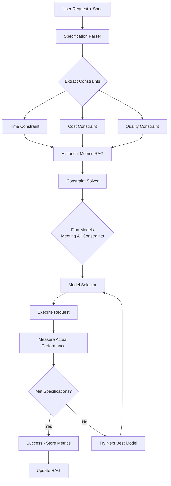
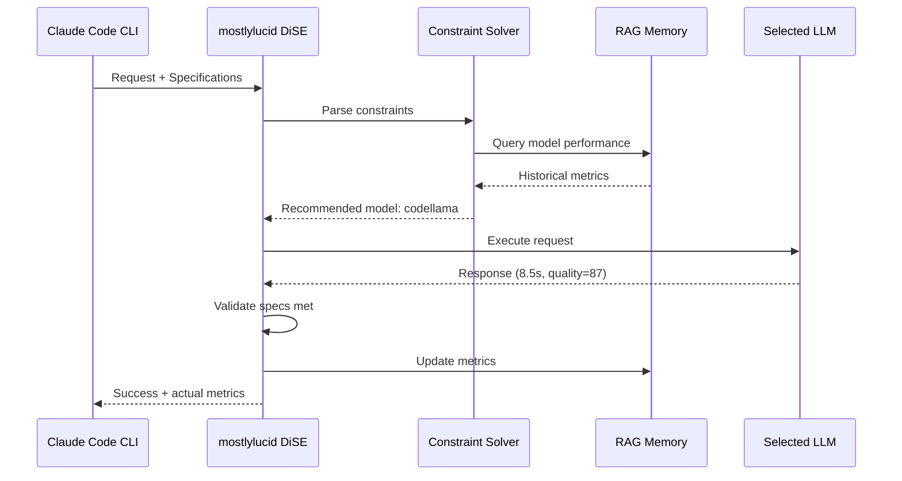

# Specification-Based Model Selection (Future)

## Overview

This document describes a **future enhancement** to mostlylucid DiSE that will enable specification-driven model selection. Instead of manually choosing models or tiers, users will provide performance specifications (e.g., "respond within 10 seconds", "use less than $0.01", "achieve 95% accuracy"), and the system will automatically select the optimal model and configuration to meet those requirements.

## Current State vs. Future

### Current System (Implemented)

The current system features:
- **Adaptive timeouts:** Learns from response times and adjusts timeouts
- **Automatic fallback:** Falls back to smaller models on timeout
- **Tier-based selection:** Maps task complexity to model tiers (tier_1/tier_2/tier_3)

See [ADAPTIVE_TIMEOUT.md](./ADAPTIVE_TIMEOUT.md) for details on the current implementation.

### Future Enhancement (This Document)

The future system will add:
- **Specification-driven selection:** Users specify constraints, system chooses model
- **Predictive optimization:** System predicts which model can meet specifications
- **Automatic testing:** Validates that specifications are met
- **Cost-quality tradeoffs:** Optimizes for cost, speed, or quality based on specs

## Use Cases

### 1. Time-Constrained Responses

**User Request:**
```
"Write a joke - must respond within 5 seconds"
```

**System Behavior:**
1. Parse specification: `response_time < 5s`
2. Query RAG for historical performance:
   - tinyllama: avg 2.3s, p95 3.1s ✓ (meets spec)
   - codellama: avg 8.5s, p95 12.1s ✗ (too slow)
   - qwen2.5-coder:3b: avg 4.2s, p95 5.8s ✗ (too close to limit)
3. Select: **tinyllama** (fastest, meets spec with margin)
4. Execute with timeout: 5s
5. Measure: 2.8s ✓ (met specification)

### 2. Cost-Constrained Tasks

**User Request:**
```
"Translate this paragraph - cost must be under $0.01"
```

**System Behavior:**
1. Parse specification: `cost < $0.01`
2. Estimate costs:
   - Local ollama (qwen2.5-coder:3b): $0.00 ✓
   - OpenAI (gpt-3.5-turbo): $0.008 ✓
   - OpenAI (gpt-4): $0.15 ✗
   - Anthropic (claude-3.5-sonnet): $0.12 ✗
3. Select: **qwen2.5-coder:3b** (free, meets spec)
4. Execute and measure actual cost: $0.00 ✓

### 3. Quality-Constrained Generation

**User Request:**
```
"Generate a technical article - must score 90+ quality rating"
```

**System Behavior:**
1. Parse specification: `quality_score >= 90`
2. Query historical quality metrics:
   - qwen2.5-coder:3b: avg quality 72 ✗
   - codellama:7b: avg quality 85 ✗
   - deepseek-coder-v2:16b: avg quality 93 ✓
   - claude-3.5-sonnet: avg quality 96 ✓
3. Select: **deepseek-coder-v2:16b** (cheapest option meeting quality spec)
4. Execute and evaluate quality: 92 ✓

### 4. Multi-Constraint Optimization

**User Request:**
```
"Generate code - within 30 seconds, quality > 85, cost < $0.05"
```

**System Behavior:**
1. Parse multi-constraint spec:
   - `response_time < 30s`
   - `quality_score > 85`
   - `cost < $0.05`
2. Filter models by each constraint
3. Find optimal model using constraint satisfaction:
   - codellama:7b: time=12s ✓, quality=87 ✓, cost=$0.00 ✓ **[SELECTED]**
   - gpt-4-turbo: time=8s ✓, quality=95 ✓, cost=$0.08 ✗
4. Execute with codellama
5. Validate all constraints met: ✓

## Architecture

### Components



### 1. Specification Parser

**Location:** `src/specification_parser.py` (future)

**Functionality:**
- Parse natural language specifications
- Extract constraints (time, cost, quality, etc.)
- Convert to structured constraint objects

**Example:**
```python
class SpecificationParser:
    def parse(self, spec_string: str) -> List[Constraint]:
        """
        Parse specification string into constraints.

        Examples:
          "within 10 seconds" → TimeConstraint(max_seconds=10)
          "cost under $0.05" → CostConstraint(max_cost=0.05)
          "quality > 90" → QualityConstraint(min_score=90)
        """
        constraints = []

        # Time patterns
        if match := re.search(r"within (\d+) seconds?", spec_string):
            constraints.append(TimeConstraint(max_seconds=int(match.group(1))))

        # Cost patterns
        if match := re.search(r"cost (?:under|less than|<) \$?([\d.]+)", spec_string):
            constraints.append(CostConstraint(max_cost=float(match.group(1))))

        # Quality patterns
        if match := re.search(r"quality (?:>|above|at least) (\d+)", spec_string):
            constraints.append(QualityConstraint(min_score=int(match.group(1))))

        return constraints
```

### 2. Historical Metrics Store

**Location:** Enhanced `src/rag_memory.py`

**New Artifact Types:**
```python
# Performance metrics per model
{
    "artifact_id": "perf_metrics_codellama",
    "artifact_type": "performance_metrics",
    "model": "codellama",
    "metrics": {
        "avg_response_time": 8.5,
        "p50_response_time": 7.2,
        "p95_response_time": 15.1,
        "p99_response_time": 22.3,
        "avg_cost": 0.0,  # Free for local
        "avg_quality_score": 87,
        "success_rate": 0.95,
        "timeout_rate": 0.05,
        "sample_count": 150
    }
}

# Task-specific performance
{
    "artifact_id": "task_perf_joke_generation",
    "artifact_type": "task_performance",
    "task_type": "joke_generation",
    "model_performance": {
        "tinyllama": {"avg_time": 2.3, "quality": 75},
        "codellama": {"avg_time": 8.5, "quality": 82},
        "gpt-3.5-turbo": {"avg_time": 1.8, "quality": 88}
    }
}
```

### 3. Constraint Solver

**Location:** `src/constraint_solver.py` (future)

**Functionality:**
- Take constraints + available models
- Query RAG for historical performance
- Predict which models can meet constraints
- Rank models by optimization goal

**Algorithm:**
```python
class ConstraintSolver:
    def solve(
        self,
        constraints: List[Constraint],
        task_type: str,
        optimization_goal: str = "cost"  # or "speed", "quality"
    ) -> List[ModelCandidate]:
        """
        Find models that satisfy all constraints.

        Returns:
            List of viable models, ranked by optimization goal.
        """
        # Get all available models
        models = self.get_available_models()

        # Filter by constraints
        viable_models = []
        for model in models:
            metrics = self.get_model_metrics(model, task_type)

            if self.satisfies_constraints(metrics, constraints):
                viable_models.append(ModelCandidate(
                    model=model,
                    predicted_time=metrics["p95_response_time"],
                    predicted_cost=metrics["avg_cost"],
                    predicted_quality=metrics["avg_quality_score"],
                    confidence=self.calculate_confidence(metrics)
                ))

        # Rank by optimization goal
        if optimization_goal == "cost":
            return sorted(viable_models, key=lambda m: m.predicted_cost)
        elif optimization_goal == "speed":
            return sorted(viable_models, key=lambda m: m.predicted_time)
        elif optimization_goal == "quality":
            return sorted(viable_models, key=lambda m: -m.predicted_quality)

        return viable_models
```

### 4. Specification Validator

**Location:** `src/specification_validator.py` (future)

**Functionality:**
- Measure actual performance after execution
- Compare against specifications
- Trigger re-selection if specs not met

**Algorithm:**
```python
class SpecificationValidator:
    def validate(
        self,
        constraints: List[Constraint],
        actual_metrics: Dict[str, Any]
    ) -> ValidationResult:
        """
        Validate that actual performance meets specifications.

        Returns:
            ValidationResult with pass/fail for each constraint.
        """
        results = []

        for constraint in constraints:
            if isinstance(constraint, TimeConstraint):
                passed = actual_metrics["execution_time"] <= constraint.max_seconds
                results.append(ConstraintResult(
                    constraint=constraint,
                    passed=passed,
                    actual_value=actual_metrics["execution_time"],
                    expected_value=constraint.max_seconds
                ))

            elif isinstance(constraint, CostConstraint):
                passed = actual_metrics["cost"] <= constraint.max_cost
                results.append(ConstraintResult(
                    constraint=constraint,
                    passed=passed,
                    actual_value=actual_metrics["cost"],
                    expected_value=constraint.max_cost
                ))

            elif isinstance(constraint, QualityConstraint):
                passed = actual_metrics["quality_score"] >= constraint.min_score
                results.append(ConstraintResult(
                    constraint=constraint,
                    passed=passed,
                    actual_value=actual_metrics["quality_score"],
                    expected_value=constraint.min_score
                ))

        return ValidationResult(
            all_passed=all(r.passed for r in results),
            results=results
        )
```

## Integration with Claude Code CLI

This feature is specifically designed to work seamlessly with the Claude Code CLI tool integration.

### Usage from Claude Code CLI

When using mostlylucid DiSE as an MCP tool in Claude Code CLI, you can specify performance requirements directly:

```python
# Example MCP tool call
{
  "tool": "code_evolver",
  "operation": "generate_code",
  "task": "Write a function to parse JSON",
  "specifications": {
    "max_response_time": 10,  # seconds
    "max_cost": 0.01,         # USD
    "min_quality": 85         # score out of 100
  }
}
```

### Automatic Model Selection

mostlylucid DiSE will:
1. Parse the specifications
2. Query RAG for model performance history
3. Select the optimal model meeting all constraints
4. Execute the request
5. Validate specifications were met
6. Return results to Claude Code CLI

### Feedback Loop



### Configuration for Claude Code CLI

**MCP Tool Definition:**
```json
{
  "name": "code_evolver_with_specs",
  "description": "Generate code with performance specifications",
  "parameters": {
    "task": {
      "type": "string",
      "description": "The coding task to perform"
    },
    "specifications": {
      "type": "object",
      "properties": {
        "max_response_time": {
          "type": "number",
          "description": "Maximum response time in seconds"
        },
        "max_cost": {
          "type": "number",
          "description": "Maximum cost in USD"
        },
        "min_quality": {
          "type": "number",
          "description": "Minimum quality score (0-100)"
        }
      }
    }
  }
}
```

**Example Claude Code CLI Prompts:**

```
User: "Generate a JSON parser using mostlylucid DiSE, but it needs to respond in under 15 seconds"

Claude: [Uses MCP tool]
{
  "tool": "code_evolver_with_specs",
  "task": "Generate a JSON parser",
  "specifications": {"max_response_time": 15}
}

mostlylucid DiSE:
  → Selected model: codellama (predicted: 12s, actual: 11.3s ✓)
  → Specification met ✓
```

## Testing Framework

### Specification-Based Tests

**Location:** `tests/test_specification_selection.py` (future)

```python
class TestSpecificationSelection:

    def test_time_constraint_selection(self):
        """Test that system selects fast model for tight time constraint."""
        spec = "respond within 5 seconds"
        constraints = parser.parse(spec)

        # Should select tinyllama (fastest)
        model = solver.select_model(constraints, task_type="simple_generation")
        assert model.name == "tinyllama"

    def test_quality_constraint_selection(self):
        """Test that system selects powerful model for high quality."""
        spec = "quality score above 90"
        constraints = parser.parse(spec)

        # Should select powerful model
        model = solver.select_model(constraints, task_type="code_generation")
        assert model.name in ["deepseek-coder-v2:16b", "gpt-4", "claude-3.5-sonnet"]

    def test_multi_constraint_optimization(self):
        """Test multi-constraint optimization."""
        spec = "within 30 seconds, cost under $0.05, quality > 80"
        constraints = parser.parse(spec)

        model = solver.select_model(constraints, task_type="code_generation")

        # Execute and validate
        result = executor.execute(model, task)
        validation = validator.validate(constraints, result.metrics)

        assert validation.all_passed

    def test_impossible_constraints(self):
        """Test handling of impossible constraints."""
        spec = "within 1 second, quality > 95"
        constraints = parser.parse(spec)

        # Should raise or return None (no model can meet this)
        with pytest.raises(NoViableModelError):
            solver.select_model(constraints, task_type="complex_reasoning")
```

### Performance Regression Tests

```python
class TestPerformanceRegression:

    def test_actual_vs_predicted_time(self):
        """Validate predictions are accurate within margin."""
        model_candidate = solver.select_model(constraints, task_type="translation")

        result = executor.execute(model_candidate.model, task)

        # Predicted should be within 20% of actual
        assert abs(result.time - model_candidate.predicted_time) / result.time < 0.2

    def test_specification_compliance_rate(self):
        """Track how often specs are actually met."""
        test_cases = load_test_cases()

        compliance_rate = 0
        for test in test_cases:
            model = solver.select_model(test.constraints, test.task_type)
            result = executor.execute(model, test.task)
            validation = validator.validate(test.constraints, result.metrics)

            if validation.all_passed:
                compliance_rate += 1

        # Should meet specs >90% of the time
        assert (compliance_rate / len(test_cases)) > 0.9
```

## Implementation Roadmap

### Phase 1: Metrics Collection (Enhanced)
- ✓ Collect response times (already implemented)
- ✓ Store in RAG memory (already implemented)
- ⬜ Add cost tracking per model/backend
- ⬜ Add quality scoring for outputs
- ⬜ Add task-type tagging for context-specific metrics

### Phase 2: Specification Parser
- ⬜ Implement natural language constraint parsing
- ⬜ Support time, cost, quality constraints
- ⬜ Support combined constraints
- ⬜ Add constraint validation

### Phase 3: Constraint Solver
- ⬜ Implement model filtering by constraints
- ⬜ Add prediction from historical metrics
- ⬜ Implement ranking by optimization goal
- ⬜ Add confidence scoring

### Phase 4: Validation & Feedback
- ⬜ Implement specification validation
- ⬜ Add automatic retry on spec failure
- ⬜ Update RAG with actual vs. predicted
- ⬜ Improve predictions over time

### Phase 5: Claude Code CLI Integration
- ⬜ Create MCP tool definition
- ⬜ Add specification parameter support
- ⬜ Implement feedback to Claude Code CLI
- ⬜ Add example prompts and documentation

## Example Scenarios

### Scenario 1: Rapid Prototyping
```
User: "Generate a prototype REST API - must be done in under 20 seconds, don't care about quality"

System:
  Constraints: max_time=20s
  Optimization: speed
  Selected: qwen2.5-coder:3b (fastest available)
  Result: 12.3s ✓ (met spec)
```

### Scenario 2: Production Code
```
User: "Generate production-ready authentication system - quality must be 95+, cost under $0.50"

System:
  Constraints: min_quality=95, max_cost=$0.50
  Optimization: quality
  Selected: gpt-4-turbo (best quality within cost limit)
  Result: quality=96 ✓, cost=$0.28 ✓ (met both specs)
```

### Scenario 3: Batch Processing
```
User: "Translate 100 documents - total cost must be under $1.00, no time limit"

System:
  Constraints: max_cost=$1.00 (total)
  Optimization: cost
  Selected: local qwen2.5-coder:3b ($0.00 per request)
  Result: $0.00 total ✓, completed in 45 minutes
```

## Benefits

1. **User-Centric:** Users specify what they need, system figures out how
2. **Predictable:** Know constraints will be met (or fail fast)
3. **Optimizable:** System learns and improves predictions over time
4. **Transparent:** Clear feedback on why a model was selected
5. **Flexible:** Works across all backends (Ollama, OpenAI, Anthropic, etc.)
6. **Claude Code CLI Ready:** Seamless integration as MCP tool

## Summary

Specification-based model selection will transform mostlylucid DiSE from a tier-based system to an intelligent constraint solver that:

- Accepts natural language performance specifications
- Predicts which models can meet requirements
- Automatically selects optimal model
- Validates specifications were met
- Continuously learns and improves

This feature will be particularly powerful when used through Claude Code CLI, enabling Claude to automatically choose the right model for each task based on user requirements.
