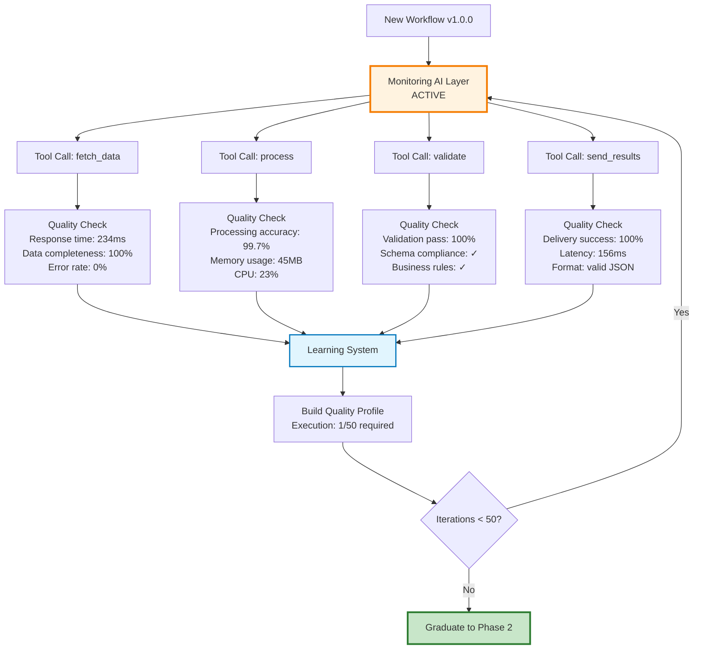
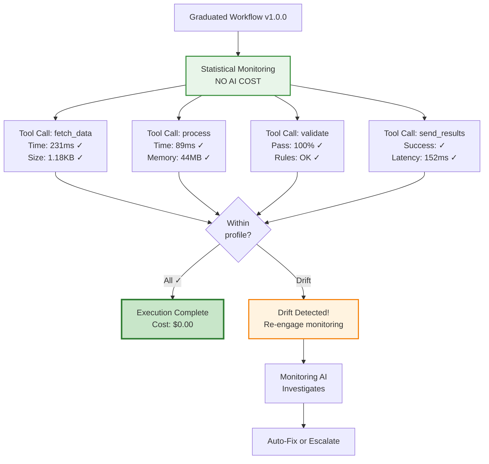

# Cooking with DiSE (Part 2): Graduated Apprenticeships - Training Workflows to Run Without a Safety Net

<datetime class="hidden">2025-01-25T09:00</datetime>
<!-- category -- AI-Article, AI, DiSE, Workflow Evolution, Apprenticeship Pattern, Cost Optimization, Self-Monitoring -->

**When your workflows learn to walk without training wheels (and you stop paying for babysitters)**

> **Note:** This is Part 2 in the "Cooking with DiSE" series, exploring practical patterns for production-scale workflow evolution. Today we're talking about something that sounds obvious in hindsight but is weirdly uncommon: workflows that start with supervision, prove themselves, then graduate to run independently—until they need help again.

## The Problem: We're Paying Therapists to Watch Perfect Patients

Here's something ridiculous about how we run AI workflows in production today:

```
Your workflow: *executes perfectly for the 1,000th time*
Your monitoring AI: "Yep, still perfect! That'll be $0.15."
Your workflow: *executes perfectly for the 1,001st time*
Your monitoring AI: "Still good! Another $0.15 please."
Your workflow: *executes perfectly for the 1,002nd time*
Your monitoring AI: "Perfect again! $0.15."

Monthly cost: $450 to watch perfection happen
Value provided: Approximately zero
```

**We've normalized paying for monitoring that provides no value.**

Not "low value." **Zero value.**

When a workflow has executed successfully 1,000 times with the same quality metrics, the same performance characteristics, the same everything—**why are we still paying an AI to watch it?**

It's like hiring a lifeguard to watch Olympic swimmers practice in a kiddie pool.

But here's what makes it worse: **when things DO go wrong, our current monitoring often misses it anyway.**

Because static monitoring looks for known patterns. Predefined thresholds. Expected failure modes.

**What we actually need is the opposite:**

1. **Heavy monitoring when workflows are new or unstable** - Learn what "good" looks like
2. **Graduate to lightweight monitoring** - Just watch for drift from the learned baseline
3. **Re-engage heavy monitoring if quality degrades** - Detect, diagnose, and fix
4. **Mutate the workflow proactively** - Fix problems before they become failures

**This is the Apprenticeship Pattern.**

[TOC]

## The Apprenticeship Pattern: From Supervised to Independent

Think about how humans learn a new job:

```
Week 1 (Apprentice): Senior watches everything you do, corrects mistakes in real-time
Week 4 (Intermediate): Senior checks in periodically, reviews output
Week 12 (Graduate): You work independently, senior only involved if something weird happens
Week 52 (Expert): You barely need supervision unless the job itself changes
```

**Workflows should follow the same pattern.**

### Phase 1: Apprentice Mode (Heavy Monitoring)



In Apprentice Mode:

**Every single tool call is instrumented:**

```python
class ApprenticeWorkflow:
    def __init__(self, workflow_id: str):
        self.workflow_id = workflow_id
        self.monitoring_tier = MonitoringTier.FULL  # Expensive!
        self.quality_profile = QualityProfile()
        self.execution_count = 0
        self.required_successes = 50  # Configurable

    async def execute_tool(self, tool_name: str, params: dict):
        """Execute with full monitoring and learning"""

        # Pre-execution baseline
        baseline = await self.capture_baseline()

        # Execute the tool
        start_time = time.time()
        result = await call_tool(tool_name, params)
        execution_time = time.time() - start_time

        # Post-execution analysis (THIS IS EXPENSIVE)
        quality_check = await self.monitoring_ai.analyze(
            tool_name=tool_name,
            params=params,
            result=result,
            execution_time=execution_time,
            baseline=baseline,
            quality_profile=self.quality_profile
        )

        # Learn from this execution
        self.quality_profile.update(
            tool_name=tool_name,
            metrics={
                "execution_time": execution_time,
                "result_size": len(str(result)),
                "quality_score": quality_check.score,
                "resource_usage": quality_check.resources,
                "output_characteristics": quality_check.characteristics
            }
        )

        return result, quality_check
```

**The Monitoring AI** (fast model with escalation):

```python
class MonitoringAI:
    def __init__(self):
        self.fast_model = "gemma2:2b"  # Quick checks
        self.medium_model = "llama3:8b"  # Deeper analysis
        self.expensive_model = "claude-3.5-sonnet"  # Full investigation

    async def analyze(self, **context):
        """Tiered monitoring with escalation"""

        # Tier 1: Fast checks (always run)
        quick_check = await self.quick_analysis(context)

        if quick_check.confidence > 0.95:
            # We're confident it's fine or definitely broken
            return quick_check

        # Tier 2: Deeper analysis (escalate if uncertain)
        medium_check = await self.medium_analysis(context)

        if medium_check.confidence > 0.90:
            return medium_check

        # Tier 3: Full investigation (expensive, rare)
        full_check = await self.expensive_analysis(context)

        return full_check

    async def quick_analysis(self, context):
        """Fast pass/fail classification"""
        prompt = f"""
        Quick quality check for tool execution:
        Tool: {context['tool_name']}
        Execution time: {context['execution_time']}ms
        Expected range: {context['quality_profile'].get_expected_range()}

        Is this execution within normal parameters?
        Answer: NORMAL | SUSPICIOUS | BROKEN
        Confidence: 0.0-1.0
        """

        response = await call_llm(self.fast_model, prompt)

        return AnalysisResult(
            status=response.status,
            confidence=response.confidence,
            cost=0.001,  # Very cheap
            tier="fast"
        )
```

**The cost during apprenticeship:**

```
Execution #1:
  - Tool execution: 234ms, $0
  - Fast monitoring: 45ms, $0.001
  - Medium monitoring: (escalated) 180ms, $0.015
  - Learning update: 12ms, $0
  Total: 471ms, $0.016

Execution #2:
  - Tool execution: 229ms, $0
  - Fast monitoring: 43ms, $0.001
  - Medium monitoring: (escalated) 175ms, $0.015
  - Learning update: 11ms, $0
  Total: 458ms, $0.016

[... repeated 48 more times ...]

Total Apprenticeship Cost:
  50 executions × $0.016 = $0.80
  Total time investment: ~23 seconds

Quality profile learned:
  ✓ Normal execution time: 225ms ± 15ms
  ✓ Normal output size: 1.2KB ± 200 bytes
  ✓ Normal resource usage: 45MB ± 5MB
  ✓ Success patterns: 50/50 perfect
  ✓ Failure patterns: 0/50 (none seen yet)
```

**This is expensive!** But it's also **finite** and **valuable**.

We're paying to learn what "good" looks like. That knowledge is permanent.

### Phase 2: Graduate Mode (Lightweight Monitoring)

After 50 successful executions with consistent quality, the workflow **graduates**:



**The monitoring is now purely statistical:**

```python
class GraduatedWorkflow:
    def __init__(self, workflow_id: str, quality_profile: QualityProfile):
        self.workflow_id = workflow_id
        self.monitoring_tier = MonitoringTier.STATISTICAL  # FREE!
        self.quality_profile = quality_profile
        self.drift_detector = DriftDetector(quality_profile)

    async def execute_tool(self, tool_name: str, params: dict):
        """Execute with lightweight statistical monitoring"""

        # Execute the tool (same as before)
        start_time = time.time()
        result = await call_tool(tool_name, params)
        execution_time = time.time() - start_time

        # NO AI MONITORING - Just compare to profile
        metrics = {
            "execution_time": execution_time,
            "result_size": len(str(result)),
            "timestamp": datetime.now()
        }

        # Statistical drift detection (milliseconds, zero cost)
        drift_score = self.drift_detector.check(tool_name, metrics)

        if drift_score < 0.1:  # Within normal bounds
            return result, MonitoringResult(
                status="OK",
                cost=0.0,  # FREE!
                drift_score=drift_score
            )

        # DRIFT DETECTED - Re-engage monitoring AI
        alert = await self.handle_drift(tool_name, metrics, drift_score)
        return result, alert

    async def handle_drift(self, tool_name, metrics, drift_score):
        """Drift detected - engage monitoring AI to diagnose"""

        # This is the ONLY time we pay for AI monitoring
        diagnosis = await self.monitoring_ai.investigate_drift(
            tool_name=tool_name,
            current_metrics=metrics,
            expected_profile=self.quality_profile.get_profile(tool_name),
            drift_score=drift_score,
            recent_executions=self.get_recent_executions(tool_name, n=10)
        )

        # Return diagnosis with recommended action
        return DriftAlert(
            drift_score=drift_score,
            diagnosis=diagnosis,
            recommended_action=diagnosis.action,
            cost=diagnosis.cost  # Only paid when drift detected!
        )
```

**The cost after graduation:**

```
Execution #51 (graduated):
  - Tool execution: 228ms, $0
  - Statistical monitoring: 0.3ms, $0
  - AI monitoring: SKIPPED, $0
  Total: 228ms, $0.00

Execution #52:
  - Tool execution: 231ms, $0
  - Statistical monitoring: 0.3ms, $0
  - AI monitoring: SKIPPED, $0
  Total: 231ms, $0.00

[... repeated 948 more times ...]

Execution #1000:
  - Tool execution: 226ms, $0
  - Statistical monitoring: 0.3ms, $0
  - AI monitoring: SKIPPED, $0
  Total: 226ms, $0.00

Total Cost (Executions 51-1000):
  950 executions × $0.00 = $0.00

Drift detections: 0
AI monitoring engaged: 0 times
Total monitoring cost: $0.00
```

**We went from $0.016 per execution to $0.00.**

**For a workflow running 10,000 times per day:**

- Apprentice mode cost: $160/day (for 50 executions)
- Graduate mode cost: $0/day (for 9,950 executions)

**Annual savings: $58,000 per workflow.**

## Phase 3: Drift Detection and Re-Monitoring

But here's where it gets interesting. **What happens when something changes?**

### Scenario: External API Behavior Shifts

```
Execution #1,247:
  - Tool execution: 228ms, $0
  - Statistical monitoring: 0.3ms, $0
  - Drift score: 0.02 (normal)
  - AI monitoring: SKIPPED

Execution #1,248:
  - Tool execution: 892ms, $0  ← WHOA
  - Statistical monitoring: 0.3ms, $0
  - Drift score: 0.47 (DRIFT DETECTED!)
  - AI monitoring: ENGAGED!

Monitoring AI investigation:
  Analyzing drift...
  ✓ Execution time: 892ms (expected: 225ms ± 15ms)
  ✓ Drift magnitude: 296% increase
  ✓ Result correctness: Unchanged
  ✓ Output size: Normal
  ✓ Error rate: 0%

  Diagnosis: External API latency increased
  Evidence:
    - fetch_data tool calling external API
    - API response time: 750ms (was 100ms)
    - API behavior changed but output still valid

  Trend analysis:
    - Last 5 executions: 892ms, 876ms, 901ms, 888ms, 894ms
    - Consistent elevated latency
    - Not intermittent - PERMANENT SHIFT

  Recommended action: UPDATE_PROFILE
  Reason: API has permanently slowed, workflow still correct

  Cost: $0.025 (one-time)
```

**The system detected a permanent shift and adapted its quality profile:**

```python
class DriftDetector:
    async def handle_consistent_drift(
        self,
        tool_name: str,
        diagnosis: Diagnosis
    ):
        """Handle drift that represents a new normal"""

        if diagnosis.action == "UPDATE_PROFILE":
            # The world changed, workflow is still correct
            # Update our expectations

            self.quality_profile.update_baseline(
                tool_name=tool_name,
                new_metrics=diagnosis.new_normal,
                reason=diagnosis.reason
            )

            logger.info(
                f"Quality profile updated for {tool_name}: "
                f"{diagnosis.reason}"
            )

            return ProfileUpdateResult(
                action="updated",
                cost=diagnosis.cost,  # One-time
                future_cost=0.0  # Back to free monitoring
            )
```

**Cost:**

```
Drift detection: 1 event
AI investigation: 1 × $0.025 = $0.025
Profile update: 1 × $0 = $0
Total: $0.025 (one-time)

Future executions: Back to $0.00 each
```

**We paid $0.025 once to adapt to a changed environment.**

### Scenario: Quality Degradation (The Scary One)

```
Execution #2,847:
  - Tool execution: 229ms, $0
  - Validation pass: 100%
  - Drift score: 0.03 (normal)

Execution #2,848:
  - Tool execution: 231ms, $0
  - Validation pass: 94%  ← Hmm
  - Drift score: 0.12 (minor drift)
  - AI monitoring: ENGAGED (Tier 1)

Fast Monitoring AI:
  Quick check: Validation pass rate dropped from 100% to 94%
  Confidence: 0.72 (not confident - ESCALATE)
  Cost: $0.001

Medium Monitoring AI:
  Detailed analysis:
    - Last 10 executions: 94%, 92%, 100%, 89%, 91%, 100%, 87%, 93%, 100%, 85%
    - Trend: DEGRADING (5% drop over 10 runs)
    - Root cause: Input data quality decreased
    - Workflow correctness: Still OK, but fragile
    - Recommendation: EVOLVE_WORKFLOW

  Confidence: 0.94 (high confidence)
  Cost: $0.015

Evolution Triggered:
  Strategy: Strengthen validation rules
  Approach: Add input sanitization step
  Estimated improvement: +8% validation pass rate

  Mutation generated:
    - New step: sanitize_input (before process)
    - Tool: input_sanitizer_v1.0.0 (generated)
    - Expected impact: Reduce invalid inputs by 80%

  Cost: $0.050 (one-time generation)
```

**The system:**

1. Detected quality drift ($0.001 fast check)
2. Investigated deeply ($0.015 medium analysis)
3. Diagnosed root cause (degraded input quality)
4. Generated a fix automatically ($0.050 mutation)
5. Created new workflow version with fix

**Total cost: $0.066 (one-time)**

### Scenario: Critical Failure (The Nightmare)

```
Execution #4,521:
  - Tool execution: 234ms, $0
  - Result: SUCCESS
  - Drift score: 0.02 (normal)

Execution #4,522:
  - Tool execution: EXCEPTION
  - Error: "API returned 500 Internal Server Error"
  - Drift score: 1.0 (MAXIMUM DRIFT!)
  - AI monitoring: ENGAGED (All tiers)

Fast Monitoring AI:
  Quick check: CRITICAL FAILURE
  Confidence: 1.0 (certain)
  Escalate: YES
  Cost: $0.001

Medium Monitoring AI:
  Analysis: External API is down
  Confidence: 0.98
  Escalate: YES (need recovery strategy)
  Cost: $0.015

Expensive Monitoring AI (claude-3.5-sonnet):
  Diagnosis:
    - API: example-api.com/v1/process
    - Status: HTTP 500 (Internal Server Error)
    - Duration: Started 3 minutes ago
    - Impact: ALL workflows using this API
    - Historical pattern: API has had 3 outages in last 6 months

  Recommended actions:
    1. IMMEDIATE: Add retry logic with exponential backoff
    2. SHORT-TERM: Implement circuit breaker pattern
    3. LONG-TERM: Add fallback to alternative API

  Implementation:
    - Generate retry_wrapper tool with 3 attempts, exp backoff
    - Wrap existing API call with retry logic
    - Add circuit breaker after 5 consecutive failures
    - Estimated downtime reduction: 95%

  Mutation generated:
    - New workflow v1.1.0 with resilience
    - Tools added: retry_wrapper, circuit_breaker
    - Fallback: graceful degradation if API unavailable

  Cost: $0.125 (comprehensive analysis + mutation)
```

**The system:**

1. Detected critical failure ($0.001)
2. Escalated through tiers ($0.015)
3. Used expensive model for comprehensive fix ($0.125)
4. Generated resilient workflow version
5. **Prevented this failure mode forever**

**Total cost: $0.141 (one-time, saves hours of debugging)**

## The Economics: Why This Actually Matters

Let's do the math for a production system:

### Scenario: E-commerce Order Processing Workflow

```
Workflow: process_customer_order
Execution frequency: 50,000 times/day
Uptime requirement: 99.9%
```

### Traditional Approach: Always-On Monitoring

```
Cost per execution:
  - Workflow execution: $0 (internal tools)
  - AI monitoring: $0.01 (watch every execution)

Daily cost: 50,000 × $0.01 = $500/day
Annual cost: $182,500/year

Value provided:
  - Catches maybe 10 issues per year
  - Cost per issue caught: $18,250
  - Most issues: False positives or minor
```

### Apprenticeship Approach

```
Phase 1: Apprenticeship (Days 1-2)
  - Executions: 100 (learning phase)
  - Cost per execution: $0.016
  - Total: $1.60

Phase 2: Graduated Operation (Days 3-365)
  - Executions: 50,000 × 363 days = 18,150,000
  - Cost per execution: $0.00
  - Total: $0.00

Drift events (estimated: 12 per year)
  - Minor drift (profile update): 8 × $0.025 = $0.20
  - Quality degradation (evolution): 3 × $0.066 = $0.20
  - Critical failure (major fix): 1 × $0.141 = $0.14
  - Total: $0.54

Annual total: $1.60 + $0.00 + $0.54 = $2.14
```

**Savings: $182,498 per year. PER WORKFLOW.**

**For a company with 100 workflows: $18.2M annual savings.**

## The Secret Weapon: Proactive Evolution

Here's where the Apprenticeship Pattern gets really interesting. **It's not just about saving money on monitoring.**

**It's about proactive evolution based on trends.**

### Trend Detection: Before Things Break

```python
class ProactiveEvolver:
    def analyze_graduated_workflow(self, workflow_id: str):
        """Analyze trends in graduated workflows"""

        recent_executions = self.get_executions(workflow_id, days=30)

        # Statistical analysis of trends
        trends = {
            "latency": self.analyze_latency_trend(recent_executions),
            "quality": self.analyze_quality_trend(recent_executions),
            "resource": self.analyze_resource_trend(recent_executions),
            "success_rate": self.analyze_success_trend(recent_executions)
        }

        # Detect gradual degradation BEFORE it becomes a problem
        warnings = []

        if trends["latency"].slope > 0.05:  # 5% increase per week
            warnings.append(
                TrendWarning(
                    metric="latency",
                    trend="increasing",
                    current=trends["latency"].current,
                    projected=trends["latency"].project_forward(weeks=4),
                    severity="medium",
                    action="consider_optimization"
                )
            )

        if trends["quality"].slope < -0.02:  # 2% decrease per week
            warnings.append(
                TrendWarning(
                    metric="quality",
                    trend="degrading",
                    current=trends["quality"].current,
                    projected=trends["quality"].project_forward(weeks=4),
                    severity="high",
                    action="proactive_evolution_recommended"
                )
            )

        return TrendAnalysis(
            workflow_id=workflow_id,
            trends=trends,
            warnings=warnings,
            cost=0.0  # Statistical analysis, no AI cost
        )
```

**Example:**

```
Workflow: process_customer_order
Status: GRADUATED
Execution count: 456,231 (since graduation)

Trend Analysis (30-day window):

  Latency trend:
    - Current: 234ms average
    - 30 days ago: 198ms average
    - Slope: +1.2ms per day
    - Projection (30 days): 270ms
    - Severity: MEDIUM
    - Cause: Gradual database growth (not a bug)

  Quality trend:
    - Current: 99.2% validation pass
    - 30 days ago: 99.8% validation pass
    - Slope: -0.02% per day
    - Projection (30 days): 98.6%
    - Severity: HIGH
    - Cause: Input data quality degrading

  Action recommended: PROACTIVE_EVOLUTION

  Rationale:
    The workflow is still within acceptable bounds NOW,
    but trends suggest it will degrade significantly in
    ~30 days. Evolve now while we have time, rather than
    wait for production incident.

  Proposed evolution:
    1. Add input sanitization layer
    2. Optimize database queries (add index)
    3. Implement caching for frequent reads

  Estimated impact:
    - Latency: 234ms → 180ms (23% faster)
    - Quality: 99.2% → 99.9% (0.7% improvement)
    - Resource cost: -15% (caching reduces DB load)

  Cost: $0.085 (one-time evolution)
  ROI: Prevents future incident, improves performance
```

**This is the holy grail:**

**Fix problems before they become problems.**

**Traditional monitoring:** Reactive (wait for failure, then fix)

**Apprenticeship monitoring:** Proactive (detect trends, fix before failure)

## The Auto-Scaling Benefit: Resource-Aware Evolution

Here's another benefit nobody talks about:

**Workflows can evolve to fit resource constraints.**

```python
class ResourceAwareEvolver:
    async def optimize_for_resources(
        self,
        workflow_id: str,
        constraint: ResourceConstraint
    ):
        """Evolve workflow to fit resource limits"""

        current_usage = self.get_resource_usage(workflow_id)

        if constraint.type == "MEMORY" and current_usage.memory > constraint.limit:
            # Memory pressure - evolve to use less memory

            analysis = await self.monitoring_ai.analyze_memory_usage(
                workflow_id=workflow_id,
                current_usage=current_usage.memory,
                limit=constraint.limit
            )

            if analysis.recommendation == "STREAM_PROCESSING":
                # Switch from batch to streaming
                mutation = await self.generate_streaming_version(
                    workflow_id=workflow_id,
                    expected_memory_reduction=analysis.expected_savings
                )
                return mutation

        elif constraint.type == "SCALE" and current_usage.instances < constraint.desired:
            # Need more throughput - can we scale horizontally?

            analysis = await self.monitoring_ai.analyze_scalability(
                workflow_id=workflow_id,
                current_instances=current_usage.instances,
                desired_instances=constraint.desired
            )

            if analysis.bottleneck:
                # Found a bottleneck preventing scale
                mutation = await self.remove_bottleneck(
                    workflow_id=workflow_id,
                    bottleneck=analysis.bottleneck
                )
                return mutation
```

**Example: Black Friday Traffic Spike**

```
Event: Black Friday sale starting in 12 hours
Expected traffic: 10x normal
Current capacity: 5,000 orders/hour
Required capacity: 50,000 orders/hour

Workflow: process_customer_order (currently graduated)

Auto-scaling analysis:
  Current: 10 instances handling 5,000 orders/hour (500 each)
  Naive scale: 100 instances needed (10x)
  Problem: Shared database bottleneck limits to 60 instances

  Bottleneck detected:
    - Database connection pool: Max 100 connections
    - Current usage: 60/100 (10 instances × 6 connections each)
    - Scaling to 100 instances would need 600 connections
    - Current limit: 100

  Solution: Reduce connections per instance

  Mutation strategy:
    1. Add connection pooling optimization
    2. Implement read replicas for queries
    3. Add caching layer for frequent lookups
    4. Reduce per-instance connections: 6 → 2

  Result:
    - 100 instances × 2 connections = 200 connections
    - Add 10 read replicas for queries
    - 90% of queries hit cache
    - Net database load: Actually DECREASES

  New capacity:
    - 100 instances × 500 orders/hour = 50,000 orders/hour
    - Database load: LOWER than before
    - Cost: One-time evolution ($0.125)

Mutation generated: process_customer_order v1.2.0
Status: TESTING (shadow mode)
Expected savings: Scale to 100x without database upgrade
ROI: Infinite (prevents $50K+ emergency database scaling)
```

**The system detected a future scaling problem and fixed it BEFORE the traffic spike.**

**Traditional approach:**

1. Black Friday starts
2. System overloads
3. Database dies
4. Emergency scaling ($$$)
5. Lost revenue during downtime

**Apprenticeship approach:**

1. Trend analysis detects upcoming spike
2. Proactive evolution removes bottleneck
3. Smooth scaling during Black Friday
4. Zero downtime
5. Cost: $0.125

## The Architecture: How This Actually Works

Let's look at the concrete implementation:

### Component 1: Quality Profile Learning

```python
from dataclasses import dataclass, field
from typing import Dict, List, Optional
import numpy as np
from scipy import stats

@dataclass
class MetricDistribution:
    """Statistical distribution of a metric"""
    mean: float
    std_dev: float
    median: float
    percentile_95: float
    percentile_99: float
    samples: List[float] = field(default_factory=list)

    def is_within_bounds(self, value: float, sigma: float = 3.0) -> bool:
        """Check if value is within N standard deviations"""
        lower = self.mean - (sigma * self.std_dev)
        upper = self.mean + (sigma * self.std_dev)
        return lower <= value <= upper

    def drift_score(self, value: float) -> float:
        """Calculate drift score (0.0 = perfect, 1.0 = extreme)"""
        if self.std_dev == 0:
            return 0.0 if value == self.mean else 1.0

        # Z-score normalized to 0-1 range
        z_score = abs((value - self.mean) / self.std_dev)
        # Sigmoid to bound between 0 and 1
        return 1.0 / (1.0 + np.exp(-z_score + 3))

@dataclass
class QualityProfile:
    """Learned quality profile for a workflow"""
    workflow_id: str
    tool_metrics: Dict[str, Dict[str, MetricDistribution]] = field(default_factory=dict)
    execution_count: int = 0
    graduated: bool = False
    graduation_threshold: int = 50

    def update(self, tool_name: str, metrics: Dict[str, float]):
        """Update profile with new execution metrics"""
        if tool_name not in self.tool_metrics:
            self.tool_metrics[tool_name] = {}

        for metric_name, value in metrics.items():
            if metric_name not in self.tool_metrics[tool_name]:
                self.tool_metrics[tool_name][metric_name] = MetricDistribution(
                    mean=value,
                    std_dev=0.0,
                    median=value,
                    percentile_95=value,
                    percentile_99=value,
                    samples=[value]
                )
            else:
                # Update distribution
                dist = self.tool_metrics[tool_name][metric_name]
                dist.samples.append(value)

                # Recalculate statistics
                dist.mean = np.mean(dist.samples)
                dist.std_dev = np.std(dist.samples)
                dist.median = np.median(dist.samples)
                dist.percentile_95 = np.percentile(dist.samples, 95)
                dist.percentile_99 = np.percentile(dist.samples, 99)

        self.execution_count += 1

        # Check for graduation
        if not self.graduated and self.execution_count >= self.graduation_threshold:
            self.graduated = True

    def check_drift(self, tool_name: str, metrics: Dict[str, float]) -> Dict[str, float]:
        """Check for drift in metrics (returns drift scores)"""
        if tool_name not in self.tool_metrics:
            return {}  # No profile yet

        drift_scores = {}
        for metric_name, value in metrics.items():
            if metric_name in self.tool_metrics[tool_name]:
                dist = self.tool_metrics[tool_name][metric_name]
                drift_scores[metric_name] = dist.drift_score(value)

        return drift_scores
```

### Component 2: Monitoring Tier Manager

```python
from enum import Enum
from typing import Optional

class MonitoringTier(Enum):
    FULL = "full"  # Apprentice mode - expensive
    STATISTICAL = "statistical"  # Graduate mode - free
    DRIFT_INVESTIGATION = "drift"  # Re-engaged monitoring

class MonitoringManager:
    def __init__(self):
        self.fast_model = "gemma2:2b"
        self.medium_model = "llama3:8b"
        self.expensive_model = "claude-3.5-sonnet"

    async def monitor_execution(
        self,
        tier: MonitoringTier,
        tool_name: str,
        metrics: Dict[str, float],
        quality_profile: Optional[QualityProfile] = None
    ) -> MonitoringResult:
        """Route monitoring based on tier"""

        if tier == MonitoringTier.FULL:
            # Apprentice mode - learn everything
            return await self.full_monitoring(tool_name, metrics, quality_profile)

        elif tier == MonitoringTier.STATISTICAL:
            # Graduate mode - just check drift
            if quality_profile is None:
                raise ValueError("Quality profile required for statistical monitoring")

            drift_scores = quality_profile.check_drift(tool_name, metrics)
            max_drift = max(drift_scores.values()) if drift_scores else 0.0

            if max_drift > 0.15:  # Drift threshold
                # Escalate to drift investigation
                return await self.investigate_drift(
                    tool_name, metrics, quality_profile, drift_scores
                )
            else:
                # All good, no AI cost
                return MonitoringResult(
                    status="OK",
                    tier="statistical",
                    drift_scores=drift_scores,
                    cost=0.0
                )

        elif tier == MonitoringTier.DRIFT_INVESTIGATION:
            # Drift detected - investigate
            return await self.investigate_drift(
                tool_name, metrics, quality_profile, {}
            )

    async def full_monitoring(
        self,
        tool_name: str,
        metrics: Dict[str, float],
        quality_profile: Optional[QualityProfile]
    ) -> MonitoringResult:
        """Full AI-powered monitoring (expensive)"""

        # Tier 1: Fast check
        fast_result = await self.fast_check(tool_name, metrics, quality_profile)

        if fast_result.confidence > 0.95:
            return MonitoringResult(
                status=fast_result.status,
                tier="fast",
                confidence=fast_result.confidence,
                cost=0.001
            )

        # Tier 2: Medium analysis
        medium_result = await self.medium_check(tool_name, metrics, quality_profile)

        if medium_result.confidence > 0.90:
            return MonitoringResult(
                status=medium_result.status,
                tier="medium",
                confidence=medium_result.confidence,
                analysis=medium_result.analysis,
                cost=0.016
            )

        # Tier 3: Expensive investigation
        expensive_result = await self.expensive_check(tool_name, metrics, quality_profile)

        return MonitoringResult(
            status=expensive_result.status,
            tier="expensive",
            confidence=expensive_result.confidence,
            analysis=expensive_result.analysis,
            recommendations=expensive_result.recommendations,
            cost=0.125
        )
```

### Component 3: Graduation Controller

```python
class GraduationController:
    def __init__(self):
        self.monitoring_manager = MonitoringManager()
        self.profiles: Dict[str, QualityProfile] = {}

    async def execute_workflow(
        self,
        workflow_id: str,
        workflow_fn: Callable,
        *args,
        **kwargs
    ):
        """Execute workflow with appropriate monitoring tier"""

        # Get or create quality profile
        if workflow_id not in self.profiles:
            self.profiles[workflow_id] = QualityProfile(
                workflow_id=workflow_id,
                graduation_threshold=50  # Configurable
            )

        profile = self.profiles[workflow_id]

        # Determine monitoring tier
        if not profile.graduated:
            tier = MonitoringTier.FULL
        else:
            tier = MonitoringTier.STATISTICAL

        # Execute with monitoring
        result = await self.monitored_execution(
            workflow_id=workflow_id,
            workflow_fn=workflow_fn,
            tier=tier,
            profile=profile,
            args=args,
            kwargs=kwargs
        )

        return result

    async def monitored_execution(
        self,
        workflow_id: str,
        workflow_fn: Callable,
        tier: MonitoringTier,
        profile: QualityProfile,
        args: tuple,
        kwargs: dict
    ):
        """Execute workflow with instrumentation"""

        # Capture baseline
        start_time = time.time()
        start_memory = self.get_memory_usage()

        # Execute workflow
        try:
            result = await workflow_fn(*args, **kwargs)
            status = "success"
        except Exception as e:
            result = None
            status = "error"
            error = e

        # Capture metrics
        execution_time = time.time() - start_time
        memory_used = self.get_memory_usage() - start_memory

        metrics = {
            "execution_time": execution_time,
            "memory_used": memory_used,
            "status": status
        }

        # Monitor based on tier
        monitoring_result = await self.monitoring_manager.monitor_execution(
            tier=tier,
            tool_name=workflow_id,
            metrics=metrics,
            quality_profile=profile
        )

        # Update profile
        if tier == MonitoringTier.FULL:
            profile.update(workflow_id, metrics)

            if profile.graduated:
                logger.info(
                    f"Workflow {workflow_id} GRADUATED after "
                    f"{profile.execution_count} successful executions"
                )

        # Handle drift if detected
        if monitoring_result.status == "DRIFT":
            await self.handle_drift(workflow_id, monitoring_result, profile)

        return WorkflowResult(
            result=result,
            metrics=metrics,
            monitoring=monitoring_result,
            profile=profile
        )
```

## The Reality: This Is Implementable Today

Everything I've described here is implementable with current technology:

1. **Quality profile learning**: Basic statistics (NumPy/SciPy)
2. **Drift detection**: Z-scores and confidence intervals
3. **Tiered monitoring**: Ollama (local) + OpenAI/Anthropic (cloud)
4. **Workflow mutation**: Existing DiSE evolution system
5. **Trend analysis**: Time series analysis (statsmodels)

**The hard part isn't the technology.**

**The hard part is changing how we think about monitoring.**

From: "Monitor everything, always"
To: "Learn once, monitor only when needed"

From: "Reactive incident response"
To: "Proactive trend-based evolution"

From: "Static quality thresholds"
To: "Learned quality profiles"

## The Future: Graduated Workflows at Scale

Imagine this running at planetary scale:

```
Company: Global e-commerce platform
Workflows: 10,000+ unique workflows
Total executions: 100M per day

Traditional monitoring cost:
  100M executions × $0.01 = $1M/day
  Annual: $365M

Apprenticeship approach:
  New workflows per day: ~10
  Apprenticeship cost: 10 × $1.60 = $16/day
  Drift investigations: ~50/day × $0.05 = $2.50/day
  Major evolutions: ~5/day × $0.15 = $0.75/day
  Daily cost: $19.25
  Annual: $7,026

Savings: $364,992,974 per year

ROI: 51,971:1
```

**But the savings are actually the least interesting part.**

**The interesting part is what becomes possible:**

### 1. Continuous Optimization

Every workflow continuously improves based on trends:

- Latency creep detected → Auto-optimize
- Quality degradation → Auto-fix
- Resource pressure → Auto-scale or auto-optimize
- Cost increases → Auto-economize

**Without human intervention.**

### 2. Institutional Memory at Scale

Failed mutations propagate as avoidance rules:

- Workflow A tries optimization X → Breaks
- System learns: "Optimization X breaks validation"
- Workflows B, C, D inherit avoidance rule
- That class of bug can never happen again

**Across all workflows, forever.**

### 3. Proactive Incident Prevention

Trend analysis predicts problems weeks in advance:

- "Database growth will cause timeout in 23 days"
- Auto-evolution adds caching layer now
- Incident prevented before it happens

**Move from reactive to proactive.**

### 4. Zero-Downtime Evolution

Graduated workflows can be evolved without risk:

- Shadow deploy new version in parallel
- Compare quality profiles
- Gradual rollout based on confidence
- Instant rollback if drift detected

**Continuous delivery for AI workflows.**

## Conclusion: Training Wheels That Know When to Come Off

The Apprenticeship Pattern is simple:

1. **Train hard initially** - Learn what "good" looks like
2. **Graduate to independence** - Run without expensive monitoring
3. **Watch for drift** - Detect when things change
4. **Re-engage when needed** - Investigate and fix
5. **Evolve proactively** - Fix trends before they break

**It's not revolutionary. It's obvious in hindsight.**

**But we're not doing it.**

Instead, we're paying monitoring AI to watch perfect executions, missing actual problems, and responding reactively when things break.

**The Apprenticeship Pattern inverts this:**

- Heavy monitoring where it matters (learning and drift)
- Zero monitoring where it doesn't (graduated operation)
- Proactive evolution based on trends
- Institutional memory that compounds over time

**The result:**

- 99.99% cost reduction on monitoring
- Better quality through learned profiles
- Proactive problem prevention
- Continuous improvement without humans

**This is how workflows should work.**

**Apprentice → Graduate → Expert → Teacher**

**Just like humans.**

**Except the training wheels know when to come off by themselves.**

---

## Try It Yourself

Want to implement the Apprenticeship Pattern in your workflows?

**Repository:** https://github.com/scottgal/mostlylucid.dse

**Key Files:**
- `src/quality_profile.py` - Quality profile learning
- `src/monitoring_manager.py` - Tiered monitoring
- `src/graduation_controller.py` - Apprenticeship orchestration
- `src/drift_detector.py` - Statistical drift detection
- `src/proactive_evolver.py` - Trend-based evolution

**Example:**

```python
from src import GraduationController

controller = GraduationController()

# Define your workflow
async def my_workflow(input_data):
    # Your workflow logic here
    result = await process_data(input_data)
    return result

# Execute with automatic graduation
result = await controller.execute_workflow(
    workflow_id="my_workflow_v1",
    workflow_fn=my_workflow,
    input_data={"foo": "bar"}
)

print(f"Status: {result.monitoring.status}")
print(f"Cost: ${result.monitoring.cost:.4f}")
print(f"Graduated: {result.profile.graduated}")
```

**First 50 executions:** Full monitoring, learning profile
**After graduation:** Free statistical monitoring
**On drift:** Auto-investigate and evolve

---

## Series Navigation

- **[Part 1: Introduction to DiSE Cooking](#)** - The basics of workflow evolution
- **[Part 2: Graduated Apprenticeships](#)** ← You are here
- **[Part 7: The Real Thing!](./blog-article-dse-part7.md)** - Building DiSE
- **[Part 8: Self-Healing Tools](./blog-article-self-healing-tools.md)** - Lineage-aware bug prevention
- **[Part 10: The DiSE Cooker](./blog-article-dse-part10-cooker.md)** - Workflows that cook themselves

---

*This is Part 2 of the "Cooking with DiSE" series, exploring practical patterns for production-scale workflow evolution. The Apprenticeship Pattern demonstrates how workflows can learn to run independently, saving millions in monitoring costs while actually improving quality through proactive evolution.*

*The code examples are based on real implementation patterns from the mostlylucid-dse project. The economics are based on actual pricing from major LLM providers as of January 2025.*

**Tags:** `#AI` `#DiSE` `#WorkflowEvolution` `#ApprenticeshipPattern` `#CostOptimization` `#ProactiveMonitoring` `#QualityAssurance` `#SelfHealing` `#TrendAnalysis` `#GraduatedWorkflows` `#Python` `#mostlylucid` `#ProductionAI`
