# Semantic Intelligence: Part 8 - Self-Healing Tools Through Lineage-Aware Pruning

<datetime class="hidden">2025-01-22T09:00</datetime>
<!-- category -- AI-Article, AI, Self-Healing Systems, Tool Evolution, Lineage Tracking, Python-->

**When your tools break themselves, your system should remember why and never repeat the mistake**

> **Note:** This is a speculative design for DISE's next evolutionary leap—a self-healing tool ecosystem that tracks lineage, detects bugs, prunes failed branches, and learns from mistakes forever. It's ambitious, slightly terrifying, and might actually be implementable with what we already have.

## The Problem: Tools That Break Themselves

Here's a scenario that keeps me up at night:

```
Tool: data_validator_v2.3.0
Status: Working perfectly ✓
Evolution triggered: "Optimize for speed"
  ↓
Tool: data_validator_v2.4.0
Status: 40% faster! ✓
Side effect: Now accepts invalid emails ✗

Applications using v2.4.0: 47
Bugs introduced: 47
Developer frustration: ∞
```

The current DISE system can evolve tools to be better. But what happens when evolution makes them *worse*? What if an optimization introduces a critical bug? What if a tool mutation breaks production systems?

**Right now, we detect the failure, maybe escalate, maybe fix it manually.**

**But we don't *learn* from it in a deep, structural way.**

We don't:
- **Remember** which mutation caused the bug
- **Prevent** similar mutations in related tools
- **Prune** the failed branch from the evolutionary tree
- **Propagate** the knowledge to descendant tools
- **Auto-recover** by regenerating from a known-good ancestor

**That changes today.**

Well, conceptually. This is the design for how it *could* work.

[TOC]

## The Big Idea: Tools as Git DAG + Evolutionary Memory

Think of every tool in DISE as a node in a Git-like Directed Acyclic Graph (DAG):


Every tool knows:
- **Who it came from** (parent nodes)
- **What changed** (mutation metadata)
- **What failed** (bug history)
- **What to avoid** (inherited warnings)

When a critical bug is detected, the system:

1. **Identifies the failure point** - Which version introduced the bug?
2. **Prunes the branch** - Marks failed version and descendants as tainted
3. **Propagates warnings** - Adds "avoid" tags to prevent similar mutations
4. **Auto-regenerates** - Creates new version from last known-good ancestor
5. **Updates lineage** - Records the failure in the evolutionary tree

**The result:** A self-healing ecosystem where bugs become permanent institutional memory.

## The Data Structure: Tool Lineage Metadata

First, we need to track way more than we currently do. Here's what the enhanced metadata looks like:

```python
from dataclasses import dataclass, field
from typing import List, Dict, Optional, Set
from datetime import datetime
from enum import Enum

class NodeHealth(Enum):
    HEALTHY = "healthy"
    DEGRADED = "degraded"
    FAILED = "failed"
    PRUNED = "pruned"
    REGENERATED = "regenerated"

class MutationType(Enum):
    OPTIMIZATION = "optimization"
    BUG_FIX = "bug_fix"
    FEATURE_ADD = "feature_add"
    REFACTOR = "refactor"
    SECURITY_PATCH = "security"

@dataclass
class MutationRecord:
    """Record of what changed in this evolution"""
    mutation_type: MutationType
    description: str
    timestamp: datetime
    fitness_before: float
    fitness_after: float
    code_diff_hash: str
    prompt_used: str

@dataclass
class FailureRecord:
    """Record of a bug or failure"""
    failure_type: str
    description: str
    stack_trace: Optional[str]
    test_case_failed: Optional[str]
    detection_method: str  # "test", "runtime", "static_analysis"
    timestamp: datetime
    severity: str  # "critical", "high", "medium", "low"

@dataclass
class AvoidanceRule:
    """Rules about what NOT to do (learned from failures)"""
    rule_id: str
    description: str
    pattern_to_avoid: str  # Regex or semantic description
    reason: str  # Why this is bad
    source_failure: str  # Which node failure created this rule
    propagation_scope: str  # "descendants", "all_similar", "global"
    created_at: datetime

@dataclass
class ToolLineage:
    """Complete lineage and health tracking for a tool"""
    # Identity
    tool_id: str
    version: str
    full_name: str  # e.g., "data_validator_v2.2.0"

    # Lineage
    parent_ids: List[str] = field(default_factory=list)
    child_ids: List[str] = field(default_factory=list)
    ancestor_path: List[str] = field(default_factory=list)  # Path to root

    # Health
    health_status: NodeHealth = NodeHealth.HEALTHY
    failure_count: int = 0
    failures: List[FailureRecord] = field(default_factory=list)

    # Evolution
    mutations: List[MutationRecord] = field(default_factory=list)
    generation: int = 0  # Distance from root

    # Learning
    avoidance_rules: List[AvoidanceRule] = field(default_factory=list)
    inherited_rules: Set[str] = field(default_factory=set)  # Rule IDs from ancestors

    # Performance
    fitness_history: List[float] = field(default_factory=list)
    execution_count: int = 0
    success_rate: float = 1.0

    # Metadata
    created_at: datetime = field(default_factory=datetime.now)
    last_executed: Optional[datetime] = None
    pruned_at: Optional[datetime] = None
    regenerated_from: Optional[str] = None
```

This is a **lot** more data than we currently track. But it's all necessary for true self-healing.

## Detection: How Do We Know Something Broke?

Critical bugs can be detected through multiple channels:

### 1. Test Failures (Immediate Detection)

```python
class TestBasedDetection:
    """Detect bugs through test execution"""

    async def validate_tool_health(
        self,
        tool_id: str,
        lineage: ToolLineage
    ) -> Optional[FailureRecord]:
        """Run all tests and detect failures"""

        # Load tool and its test suite
        tool = await self.tools_manager.load_tool(tool_id)
        test_suite = await self.test_discovery.find_tests(tool)

        results = await self.test_runner.run_tests(test_suite)

        # Check for test failures
        if results.failed_count > 0:
            critical_failures = [
                test for test in results.failures
                if test.is_critical  # BDD scenarios, core functionality
            ]

            if critical_failures:
                return FailureRecord(
                    failure_type="test_failure",
                    description=f"{len(critical_failures)} critical tests failed",
                    test_case_failed=critical_failures[0].name,
                    stack_trace=critical_failures[0].stack_trace,
                    detection_method="test",
                    timestamp=datetime.now(),
                    severity="critical"
                )

        return None

    async def regression_detection(
        self,
        new_version: str,
        old_version: str
    ) -> Optional[FailureRecord]:
        """Detect if new version broke what old version did correctly"""

        # Get test results for both versions
        old_results = await self.get_cached_test_results(old_version)
        new_results = await self.test_runner.run_tests(new_version)

        # Find tests that USED to pass but now fail
        regressions = [
            test for test in old_results.passed
            if test.name in [f.name for f in new_results.failures]
        ]

        if regressions:
            return FailureRecord(
                failure_type="regression",
                description=f"Broke {len(regressions)} previously working tests",
                test_case_failed=regressions[0].name,
                detection_method="regression_test",
                timestamp=datetime.now(),
                severity="critical"
            )

        return None
```

### 2. Runtime Monitoring (Production Detection)

```python
class RuntimeMonitoring:
    """Detect bugs through execution monitoring"""

    def __init__(self):
        self.error_threshold = 0.05  # 5% error rate triggers investigation
        self.execution_window = 100  # Last 100 executions

    async def monitor_tool_health(
        self,
        tool_id: str,
        lineage: ToolLineage
    ) -> Optional[FailureRecord]:
        """Monitor runtime behavior for anomalies"""

        # Get recent execution history
        recent_runs = await self.bugcatcher.get_recent_executions(
            tool_id,
            limit=self.execution_window
        )

        if len(recent_runs) < 10:
            return None  # Not enough data

        # Calculate error rate
        error_count = sum(1 for run in recent_runs if run.had_error)
        error_rate = error_count / len(recent_runs)

        if error_rate > self.error_threshold:
            # Analyze error patterns
            error_types = {}
            for run in recent_runs:
                if run.had_error:
                    error_types[run.error_type] = error_types.get(run.error_type, 0) + 1

            most_common_error = max(error_types.items(), key=lambda x: x[1])

            return FailureRecord(
                failure_type="runtime_errors",
                description=f"Error rate {error_rate:.1%} exceeds threshold",
                stack_trace=recent_runs[-1].stack_trace if recent_runs[-1].had_error else None,
                detection_method="runtime",
                timestamp=datetime.now(),
                severity="high" if error_rate > 0.20 else "medium"
            )

        # Check for performance degradation
        if len(lineage.fitness_history) >= 5:
            recent_fitness = lineage.fitness_history[-5:]
            avg_recent = sum(recent_fitness) / len(recent_fitness)
            historical_fitness = lineage.fitness_history[:-5]
            avg_historical = sum(historical_fitness) / len(historical_fitness)

            degradation = (avg_historical - avg_recent) / avg_historical

            if degradation > 0.30:  # 30% performance drop
                return FailureRecord(
                    failure_type="performance_degradation",
                    description=f"Performance dropped {degradation:.1%}",
                    detection_method="runtime",
                    timestamp=datetime.now(),
                    severity="medium"
                )

        return None
```

### 3. Static Analysis (Pre-Deployment Detection)

```python
class StaticAnalysisDetection:
    """Detect potential bugs through static analysis"""

    async def analyze_tool_safety(
        self,
        tool_id: str,
        code: str
    ) -> Optional[FailureRecord]:
        """Run static analysis to find potential bugs"""

        # Run pylint, mypy, bandit
        static_runner = StaticAnalysisRunner()
        results = await static_runner.analyze_code(code)

        # Check for critical issues
        critical_issues = [
            issue for issue in results.issues
            if issue.severity in ["error", "critical"]
        ]

        if critical_issues:
            return FailureRecord(
                failure_type="static_analysis",
                description=f"Found {len(critical_issues)} critical static issues",
                detection_method="static_analysis",
                timestamp=datetime.now(),
                severity="high"
            )

        # Check for security vulnerabilities
        security_issues = [
            issue for issue in results.issues
            if issue.category == "security"
        ]

        if security_issues:
            return FailureRecord(
                failure_type="security_vulnerability",
                description=f"Found {len(security_issues)} security issues",
                detection_method="static_analysis",
                timestamp=datetime.now(),
                severity="critical"
            )

        return None
```

## The Self-Healing Loop: Detection → Pruning → Recovery

Now the magic happens. When a critical bug is detected:

```mermaid
sequenceDiagram
    participant Tool as Tool Execution
    participant Monitor as Health Monitor
    participant Lineage as Lineage Tracker
    participant Pruner as Branch Pruner
    participant Generator as Auto-Regenerator
    participant RAG as RAG Memory

    Tool->>Monitor: Execute tool_v2.2.0
    Monitor->>Monitor: Detect critical failure
    Monitor->>Lineage: Report failure for tool_v2.2.0

    Lineage->>Lineage: Identify failure point in DAG
    Lineage->>Pruner: Trigger pruning for failed branch

    Pruner->>Pruner: Mark v2.2.0 as PRUNED
    Pruner->>Pruner: Mark descendants as TAINTED
    Pruner->>Pruner: Extract mutation that caused bug

    Pruner->>Lineage: Create avoidance rule
    Lineage->>Lineage: Propagate rule to all descendants

    Pruner->>Generator: Request regeneration from v2.1.0
    Generator->>RAG: Load v2.1.0 as base
    Generator->>Generator: Generate v2.2.1 avoiding known bug

    Generator->>Monitor: Test v2.2.1
    Monitor->>Monitor: All tests pass ✓

    Generator->>Lineage: Register v2.2.1 as recovery
    Lineage->>RAG: Update canonical version
    RAG->>Tool: Route requests to v2.2.1
```



Here's the implementation:

```python
class SelfHealingOrchestrator:
    """Orchestrates the complete self-healing loop"""

    def __init__(
        self,
        tools_manager: ToolsManager,
        lineage_tracker: LineageTracker,
        health_monitor: HealthMonitor,
        rag_memory: QdrantRAGMemory
    ):
        self.tools_manager = tools_manager
        self.lineage_tracker = lineage_tracker
        self.health_monitor = health_monitor
        self.rag_memory = rag_memory
        self.pruner = BranchPruner(lineage_tracker)
        self.regenerator = AutoRegenerator(tools_manager, rag_memory)

    async def handle_failure(
        self,
        tool_id: str,
        failure: FailureRecord
    ) -> Optional[str]:
        """
        Complete self-healing cycle:
        1. Detect failure (already done, passed in)
        2. Prune failed branch
        3. Create avoidance rules
        4. Regenerate from last known-good
        5. Validate recovery
        6. Update routing
        """

        logger.critical(f"Self-healing triggered for {tool_id}: {failure.description}")

        # Step 1: Get lineage information
        lineage = await self.lineage_tracker.get_lineage(tool_id)

        # Step 2: Mark failure in lineage
        lineage.health_status = NodeHealth.FAILED
        lineage.failures.append(failure)
        lineage.failure_count += 1
        await self.lineage_tracker.update(lineage)

        # Step 3: Identify what went wrong
        failure_analysis = await self.analyze_failure(tool_id, failure, lineage)

        if not failure_analysis.is_recoverable:
            logger.error(f"Failure is not auto-recoverable: {failure_analysis.reason}")
            return None

        # Step 4: Prune the failed branch
        pruning_result = await self.pruner.prune_branch(
            failed_node=tool_id,
            failure=failure,
            lineage=lineage
        )

        # Step 5: Create avoidance rules
        avoidance_rule = await self.create_avoidance_rule(
            failure=failure,
            analysis=failure_analysis,
            pruning_result=pruning_result
        )

        # Step 6: Propagate avoidance rule to descendants
        await self.lineage_tracker.propagate_rule(
            rule=avoidance_rule,
            scope=avoidance_rule.propagation_scope
        )

        # Step 7: Find last known-good ancestor
        last_good_ancestor = await self.find_last_healthy_ancestor(lineage)

        if not last_good_ancestor:
            logger.error(f"No healthy ancestor found for {tool_id}")
            return None

        logger.info(f"Regenerating from {last_good_ancestor}")

        # Step 8: Regenerate from healthy ancestor
        new_version = await self.regenerator.regenerate_from_ancestor(
            ancestor_id=last_good_ancestor,
            original_goal=lineage.mutations[-1].description,
            avoid_rules=[avoidance_rule]
        )

        if not new_version:
            logger.error("Regeneration failed")
            return None

        # Step 9: Validate the regenerated version
        validation_result = await self.health_monitor.validate_tool(new_version)

        if not validation_result.is_healthy:
            logger.error(f"Regenerated tool still unhealthy: {validation_result.issues}")
            return None

        # Step 10: Update lineage to mark recovery
        new_lineage = await self.lineage_tracker.get_lineage(new_version)
        new_lineage.health_status = NodeHealth.REGENERATED
        new_lineage.regenerated_from = last_good_ancestor
        new_lineage.inherited_rules.add(avoidance_rule.rule_id)
        await self.lineage_tracker.update(new_lineage)

        # Step 11: Update RAG routing to prefer new version
        await self.rag_memory.mark_as_preferred(new_version)
        await self.rag_memory.deprecate_version(tool_id)

        logger.success(f"Self-healing complete: {tool_id} → {new_version}")

        return new_version

    async def analyze_failure(
        self,
        tool_id: str,
        failure: FailureRecord,
        lineage: ToolLineage
    ) -> FailureAnalysis:
        """Use LLM to analyze what went wrong"""

        # Get the code for failed and parent versions
        failed_code = await self.tools_manager.get_tool_code(tool_id)

        if not lineage.parent_ids:
            return FailureAnalysis(
                is_recoverable=False,
                reason="No parent to recover from"
            )

        parent_id = lineage.parent_ids[0]
        parent_code = await self.tools_manager.get_tool_code(parent_id)

        # Get the mutation that was applied
        last_mutation = lineage.mutations[-1] if lineage.mutations else None

        # Ask overseer LLM to analyze
        analysis_prompt = f"""
Analyze this tool failure:

FAILED TOOL: {tool_id}
FAILURE: {failure.description}
FAILURE TYPE: {failure.failure_type}

PARENT TOOL: {parent_id}
MUTATION APPLIED: {last_mutation.description if last_mutation else "Unknown"}

CODE DIFF:
{self.generate_diff(parent_code, failed_code)}

STACK TRACE:
{failure.stack_trace or "None"}

Questions:
1. What specific change caused the failure?
2. Was it the mutation itself, or a side effect?
3. Can we regenerate from the parent with a better approach?
4. What should we avoid in future mutations?

Provide a structured analysis.
"""

        analysis_result = await self.overseer_llm.analyze(
            analysis_prompt,
            response_model=FailureAnalysis
        )

        return analysis_result

    async def create_avoidance_rule(
        self,
        failure: FailureRecord,
        analysis: FailureAnalysis,
        pruning_result: PruningResult
    ) -> AvoidanceRule:
        """Create a rule to prevent similar failures"""

        # Extract pattern from analysis
        pattern = analysis.problematic_pattern

        return AvoidanceRule(
            rule_id=f"avoid_{uuid.uuid4().hex[:8]}",
            description=analysis.rule_description,
            pattern_to_avoid=pattern,
            reason=failure.description,
            source_failure=pruning_result.failed_node_id,
            propagation_scope="descendants",  # Or "all_similar" for broader impact
            created_at=datetime.now()
        )

    async def find_last_healthy_ancestor(
        self,
        lineage: ToolLineage
    ) -> Optional[str]:
        """Walk up the lineage tree to find last healthy node"""

        # Start with immediate parents
        for parent_id in lineage.parent_ids:
            parent_lineage = await self.lineage_tracker.get_lineage(parent_id)

            if parent_lineage.health_status == NodeHealth.HEALTHY:
                # Verify it still works
                validation = await self.health_monitor.validate_tool(parent_id)
                if validation.is_healthy:
                    return parent_id

        # If parents are unhealthy, recurse up the tree
        for parent_id in lineage.parent_ids:
            parent_lineage = await self.lineage_tracker.get_lineage(parent_id)
            ancestor = await self.find_last_healthy_ancestor(parent_lineage)
            if ancestor:
                return ancestor

        return None
```

## Branch Pruning: Preventing Bad Mutations Forever

The pruner marks failed branches and prevents them from being used:

```python
class BranchPruner:
    """Prunes failed branches from the evolutionary tree"""

    def __init__(self, lineage_tracker: LineageTracker):
        self.lineage_tracker = lineage_tracker

    async def prune_branch(
        self,
        failed_node: str,
        failure: FailureRecord,
        lineage: ToolLineage
    ) -> PruningResult:
        """
        Prune a failed branch:
        1. Mark the failed node as PRUNED
        2. Mark all descendants as TAINTED
        3. Remove from active routing
        4. Preserve for learning (don't delete!)
        """

        logger.warning(f"Pruning branch starting at {failed_node}")

        # Mark the failed node
        lineage.health_status = NodeHealth.PRUNED
        lineage.pruned_at = datetime.now()
        await self.lineage_tracker.update(lineage)

        # Find all descendants
        descendants = await self.lineage_tracker.get_all_descendants(failed_node)

        pruned_count = 1
        tainted_count = 0

        # Mark descendants as tainted (they inherit the bug)
        for descendant_id in descendants:
            descendant = await self.lineage_tracker.get_lineage(descendant_id)

            if descendant.health_status == NodeHealth.HEALTHY:
                descendant.health_status = NodeHealth.DEGRADED
                descendant.inherited_rules.add(f"tainted_by_{failed_node}")
                await self.lineage_tracker.update(descendant)
                tainted_count += 1

        # Remove from RAG active routing
        await self.rag_memory.mark_as_inactive(failed_node)
        for descendant_id in descendants:
            await self.rag_memory.mark_as_inactive(descendant_id)

        logger.info(f"Pruned 1 node, tainted {tainted_count} descendants")

        return PruningResult(
            failed_node_id=failed_node,
            pruned_count=pruned_count,
            tainted_count=tainted_count,
            descendants=descendants,
            failure=failure
        )

    async def can_reuse_tool(
        self,
        tool_id: str,
        context: Dict
    ) -> Tuple[bool, Optional[str]]:
        """Check if a tool is safe to reuse (not pruned or tainted)"""

        lineage = await self.lineage_tracker.get_lineage(tool_id)

        if lineage.health_status == NodeHealth.PRUNED:
            return False, f"Tool {tool_id} has been pruned due to critical bug"

        if lineage.health_status == NodeHealth.FAILED:
            return False, f"Tool {tool_id} has known failures"

        if lineage.health_status == NodeHealth.DEGRADED:
            # Check if degradation is relevant to current context
            for rule_id in lineage.inherited_rules:
                rule = await self.lineage_tracker.get_rule(rule_id)
                if self.rule_applies_to_context(rule, context):
                    return False, f"Tool is tainted by rule: {rule.description}"

        return True, None
```

## Auto-Regeneration: Creating Better Versions

When a tool fails, regenerate from a healthy ancestor with avoidance rules:

```python
class AutoRegenerator:
    """Regenerates tools from healthy ancestors with learned constraints"""

    def __init__(
        self,
        tools_manager: ToolsManager,
        rag_memory: QdrantRAGMemory
    ):
        self.tools_manager = tools_manager
        self.rag_memory = rag_memory

    async def regenerate_from_ancestor(
        self,
        ancestor_id: str,
        original_goal: str,
        avoid_rules: List[AvoidanceRule]
    ) -> Optional[str]:
        """
        Regenerate a tool from a healthy ancestor, avoiding known pitfalls
        """

        # Load ancestor code and metadata
        ancestor_tool = await self.tools_manager.load_tool(ancestor_id)
        ancestor_code = ancestor_tool.implementation
        ancestor_spec = ancestor_tool.specification

        # Build avoidance constraints
        avoidance_constraints = self.build_avoidance_prompt(avoid_rules)

        # Create regeneration spec
        regen_spec = f"""
Original Goal: {original_goal}

Base Implementation: {ancestor_id}
{ancestor_code}

CRITICAL CONSTRAINTS - MUST AVOID:
{avoidance_constraints}

Task: Regenerate this tool with the original goal, but strictly avoiding the patterns above.
The previous attempt failed because it violated these constraints.

Approach:
1. Achieve the original goal (performance, features, etc.)
2. Absolutely avoid the prohibited patterns
3. Maintain all existing test compatibility
4. Add safeguards to prevent the specific failure mode

Generate an improved version that achieves the goal safely.
"""

        # Use overseer to create careful specification
        overseer_result = await self.overseer_llm.plan(
            regen_spec,
            response_model=ToolSpecification
        )

        # Generate code with strict validation
        generator_result = await self.generator_llm.generate(
            specification=overseer_result,
            base_code=ancestor_code,
            avoid_patterns=[rule.pattern_to_avoid for rule in avoid_rules]
        )

        if not generator_result.success:
            logger.error(f"Regeneration failed: {generator_result.error}")
            return None

        # Create new version ID
        ancestor_version = parse_version(ancestor_id)
        new_version = increment_patch(ancestor_version)
        new_tool_id = f"{ancestor_tool.name}_{new_version}"

        # Register the new tool
        await self.tools_manager.register_tool(
            tool_id=new_tool_id,
            code=generator_result.code,
            specification=overseer_result,
            metadata={
                "regenerated_from": ancestor_id,
                "avoidance_rules": [r.rule_id for r in avoid_rules],
                "regeneration_reason": "self_healing"
            }
        )

        logger.success(f"Regenerated {new_tool_id} from {ancestor_id}")

        return new_tool_id

    def build_avoidance_prompt(self, avoid_rules: List[AvoidanceRule]) -> str:
        """Build a clear prompt about what to avoid"""

        constraints = []
        for i, rule in enumerate(avoid_rules, 1):
            constraints.append(f"""
{i}. AVOID: {rule.description}
   Pattern: {rule.pattern_to_avoid}
   Reason: {rule.reason}
   Source: {rule.source_failure}
""")

        return "\n".join(constraints)
```

## Avoidance Rule Propagation: Institutional Memory

The killer feature: rules learned from failures propagate through the lineage tree:

```python
class LineageTracker:
    """Tracks tool lineage and propagates learning"""

    async def propagate_rule(
        self,
        rule: AvoidanceRule,
        scope: str
    ):
        """
        Propagate an avoidance rule through the lineage tree

        Scopes:
        - "descendants": Only affect direct descendants of failed node
        - "all_similar": Affect all tools in similar semantic space
        - "global": Affect all tools (for critical security issues)
        """

        if scope == "descendants":
            await self._propagate_to_descendants(rule)
        elif scope == "all_similar":
            await self._propagate_to_similar(rule)
        elif scope == "global":
            await self._propagate_globally(rule)

    async def _propagate_to_descendants(self, rule: AvoidanceRule):
        """Add rule to all descendants of the source failure"""

        source_node = rule.source_failure
        descendants = await self.get_all_descendants(source_node)

        for descendant_id in descendants:
            lineage = await self.get_lineage(descendant_id)
            lineage.inherited_rules.add(rule.rule_id)
            await self.update(lineage)

        logger.info(f"Propagated rule {rule.rule_id} to {len(descendants)} descendants")

    async def _propagate_to_similar(self, rule: AvoidanceRule):
        """Add rule to semantically similar tools"""

        # Find similar tools using RAG
        similar_tools = await self.rag_memory.find_similar(
            query=rule.description,
            filter={"type": "tool"},
            top_k=50,
            similarity_threshold=0.7
        )

        for tool_result in similar_tools:
            tool_id = tool_result.id
            lineage = await self.get_lineage(tool_id)
            lineage.inherited_rules.add(rule.rule_id)
            await self.update(lineage)

        logger.info(f"Propagated rule {rule.rule_id} to {len(similar_tools)} similar tools")

    async def _propagate_globally(self, rule: AvoidanceRule):
        """Add rule to ALL tools (for critical security issues)"""

        all_tools = await self.get_all_tools()

        for tool_id in all_tools:
            lineage = await self.get_lineage(tool_id)
            lineage.inherited_rules.add(rule.rule_id)
            await self.update(lineage)

        logger.warning(f"Propagated GLOBAL rule {rule.rule_id} to {len(all_tools)} tools")
```

## Real-World Example: Email Validator Evolution Gone Wrong

Let's walk through a complete example:

```python
# Initial healthy tool
email_validator_v1_0_0 = """
def validate_email(email: str) -> bool:
    pattern = r'^[a-zA-Z0-9._%+-]+@[a-zA-Z0-9.-]+\.[a-zA-Z]{2,}$'
    return bool(re.match(pattern, email))
"""
# Tests pass, fitness: 0.85

# Auto-evolution triggers: "Optimize for performance"
# System generates v2.0.0

email_validator_v2_0_0 = """
def validate_email(email: str) -> bool:
    # Optimized: skip regex for obvious cases
    if '@' not in email:
        return False
    return True  # ⚠️ BUG: Too permissive!
"""
# Tests initially pass (basic tests), fitness: 0.95 (faster!)
# Deployed to production...

# Runtime monitoring detects failures
runtime_errors = [
    "Accepted 'user@@domain.com'",
    "Accepted '@domain.com'",
    "Accepted 'user@'",
]

# Self-healing triggered!

failure = FailureRecord(
    failure_type="logic_error",
    description="Email validation too permissive, accepts invalid emails",
    detection_method="runtime",
    severity="critical"
)

# System analyzes failure
analysis = """
The optimization removed the comprehensive regex validation in favor of
a simple '@' check. This makes it fast but incorrect.

Problematic Pattern: "Replacing comprehensive validation with simple substring checks"

Avoidance Rule: "Never replace regex validation with simple string checks without
comprehensive test coverage for edge cases"
"""

# Branch pruning
# - Mark v2.0.0 as PRUNED
# - Create avoidance rule
# - Propagate to all email-related validators

# Auto-regeneration from v1.0.0
email_validator_v2_0_1 = """
def validate_email(email: str) -> bool:
    # Optimized: compile regex once
    if not hasattr(validate_email, '_pattern'):
        validate_email._pattern = re.compile(
            r'^[a-zA-Z0-9._%+-]+@[a-zA-Z0-9.-]+\.[a-zA-Z]{2,}$'
        )

    # Fast path for obvious failures
    if '@' not in email or email.count('@') != 1:
        return False

    # Comprehensive validation (cached pattern)
    return bool(validate_email._pattern.match(email))
"""
# Tests pass, fitness: 0.92 (faster AND correct!)
# Deployed, monitored, succeeds!
```

The system learned:
1. ✅ **Never** replace comprehensive validation with simple checks
2. ✅ **Always** maintain test coverage during optimization
3. ✅ **Cache** compiled patterns instead of simplifying logic
4. ✅ **Add** fast-path checks BEFORE comprehensive checks, not INSTEAD of them

This knowledge is now permanent institutional memory, propagated to all similar tools.

## Visualizing the Self-Healing Ecosystem

Here's how the complete system looks:


## Integration with Existing DISE Components

The beautiful part: this builds on what we already have:

```python
class EnhancedToolsManager(ToolsManager):
    """Extended ToolsManager with self-healing capabilities"""

    def __init__(self, config: ConfigManager, *args, **kwargs):
        super().__init__(config, *args, **kwargs)

        # New components
        self.lineage_tracker = LineageTracker(
            storage_path="lineage/",
            rag_memory=self.rag_memory
        )

        self.health_monitor = HealthMonitor(
            test_runner=self.test_runner,
            bugcatcher=self.bugcatcher,
            static_runner=self.static_runner
        )

        self.self_healing = SelfHealingOrchestrator(
            tools_manager=self,
            lineage_tracker=self.lineage_tracker,
            health_monitor=self.health_monitor,
            rag_memory=self.rag_memory
        )

        # Enable continuous health monitoring
        self.start_health_monitoring()

    async def call_tool(self, tool_id: str, inputs: Dict) -> Any:
        """Override to add health checks and auto-recovery"""

        # Check if tool is safe to use
        can_use, reason = await self.self_healing.pruner.can_reuse_tool(
            tool_id,
            context=inputs
        )

        if not can_use:
            # Tool is pruned, find alternative
            logger.warning(f"Tool {tool_id} is unsafe: {reason}")
            alternative = await self.find_healthy_alternative(tool_id)

            if alternative:
                logger.info(f"Using alternative: {alternative}")
                tool_id = alternative
            else:
                raise ToolPrunedError(f"{tool_id} is pruned and no alternative exists")

        # Execute tool with monitoring
        try:
            result = await super().call_tool(tool_id, inputs)

            # Record successful execution
            await self.lineage_tracker.record_success(tool_id)

            return result

        except Exception as e:
            # Record failure
            failure = FailureRecord(
                failure_type=type(e).__name__,
                description=str(e),
                stack_trace=traceback.format_exc(),
                detection_method="runtime",
                timestamp=datetime.now(),
                severity="high"
            )

            await self.lineage_tracker.record_failure(tool_id, failure)

            # Check if this triggers self-healing
            lineage = await self.lineage_tracker.get_lineage(tool_id)

            if lineage.failure_count >= 3:  # Three strikes rule
                logger.critical(f"Tool {tool_id} reached failure threshold, triggering self-healing")

                # Trigger self-healing in background
                asyncio.create_task(
                    self.self_healing.handle_failure(tool_id, failure)
                )

            raise

    async def find_healthy_alternative(self, pruned_tool_id: str) -> Optional[str]:
        """Find a healthy alternative to a pruned tool"""

        # Get tool metadata
        tool_metadata = await self.rag_memory.get_metadata(pruned_tool_id)

        # Search for similar tools
        alternatives = await self.rag_memory.find_similar(
            query=tool_metadata.description,
            filter={
                "type": "tool",
                "category": tool_metadata.category
            },
            top_k=10
        )

        # Find first healthy alternative
        for alt in alternatives:
            can_use, _ = await self.self_healing.pruner.can_reuse_tool(
                alt.id,
                context={}
            )
            if can_use:
                return alt.id

        return None

    def start_health_monitoring(self):
        """Start background health monitoring"""

        async def monitor_loop():
            while True:
                await asyncio.sleep(300)  # Every 5 minutes

                # Get all active tools
                active_tools = await self.get_active_tools()

                for tool_id in active_tools:
                    # Check health
                    health_result = await self.health_monitor.check_tool_health(tool_id)

                    if not health_result.is_healthy:
                        logger.warning(f"Health check failed for {tool_id}: {health_result.issues}")

                        # Trigger self-healing if critical
                        if health_result.severity == "critical":
                            await self.self_healing.handle_failure(
                                tool_id,
                                health_result.failure
                            )

        asyncio.create_task(monitor_loop())
```

## Configuration for Self-Healing

Add to your `config.yaml`:

```yaml
self_healing:
  enabled: true

  detection:
    test_based: true
    runtime_monitoring: true
    static_analysis: true

  thresholds:
    failure_count_trigger: 3  # Trigger healing after N failures
    error_rate_threshold: 0.05  # 5% error rate
    performance_degradation: 0.30  # 30% slowdown

  pruning:
    auto_prune_critical: true
    keep_pruned_history: true  # Don't delete, learn from it
    taint_descendants: true

  regeneration:
    auto_regenerate: true
    max_regeneration_attempts: 3
    require_test_validation: true

  propagation:
    default_scope: "descendants"  # or "all_similar" or "global"
    critical_failures_global: true  # Security issues affect all tools

  monitoring:
    health_check_interval_seconds: 300  # Every 5 minutes
    continuous_monitoring: true

lineage_tracking:
  enabled: true
  storage_path: "lineage/"
  max_history_depth: 100  # How far back to track ancestry
  compress_old_lineage: true  # Save space for old data
```

## The Database Schema: Storing Lineage

We need persistent storage for lineage data:

```sql
-- Tool lineage table
CREATE TABLE tool_lineage (
    tool_id VARCHAR(255) PRIMARY KEY,
    version VARCHAR(50),
    full_name VARCHAR(255),
    health_status VARCHAR(50),
    failure_count INTEGER DEFAULT 0,
    generation INTEGER DEFAULT 0,
    execution_count INTEGER DEFAULT 0,
    success_rate FLOAT DEFAULT 1.0,
    created_at TIMESTAMP,
    last_executed TIMESTAMP,
    pruned_at TIMESTAMP,
    regenerated_from VARCHAR(255)
);

-- Parent-child relationships
CREATE TABLE lineage_relationships (
    id SERIAL PRIMARY KEY,
    child_id VARCHAR(255),
    parent_id VARCHAR(255),
    relationship_type VARCHAR(50),  -- 'direct', 'merge', 'fork'
    created_at TIMESTAMP,
    FOREIGN KEY (child_id) REFERENCES tool_lineage(tool_id),
    FOREIGN KEY (parent_id) REFERENCES tool_lineage(tool_id)
);

-- Mutation records
CREATE TABLE mutations (
    id SERIAL PRIMARY KEY,
    tool_id VARCHAR(255),
    mutation_type VARCHAR(50),
    description TEXT,
    prompt_used TEXT,
    code_diff_hash VARCHAR(64),
    fitness_before FLOAT,
    fitness_after FLOAT,
    timestamp TIMESTAMP,
    FOREIGN KEY (tool_id) REFERENCES tool_lineage(tool_id)
);

-- Failure records
CREATE TABLE failures (
    id SERIAL PRIMARY KEY,
    tool_id VARCHAR(255),
    failure_type VARCHAR(100),
    description TEXT,
    stack_trace TEXT,
    test_case_failed VARCHAR(255),
    detection_method VARCHAR(50),
    severity VARCHAR(20),
    timestamp TIMESTAMP,
    FOREIGN KEY (tool_id) REFERENCES tool_lineage(tool_id)
);

-- Avoidance rules
CREATE TABLE avoidance_rules (
    rule_id VARCHAR(255) PRIMARY KEY,
    description TEXT,
    pattern_to_avoid TEXT,
    reason TEXT,
    source_failure VARCHAR(255),
    propagation_scope VARCHAR(50),
    created_at TIMESTAMP,
    FOREIGN KEY (source_failure) REFERENCES tool_lineage(tool_id)
);

-- Rule inheritance
CREATE TABLE rule_inheritance (
    id SERIAL PRIMARY KEY,
    tool_id VARCHAR(255),
    rule_id VARCHAR(255),
    inherited_at TIMESTAMP,
    FOREIGN KEY (tool_id) REFERENCES tool_lineage(tool_id),
    FOREIGN KEY (rule_id) REFERENCES avoidance_rules(rule_id)
);

-- Fitness history
CREATE TABLE fitness_history (
    id SERIAL PRIMARY KEY,
    tool_id VARCHAR(255),
    fitness_score FLOAT,
    execution_time_ms INTEGER,
    memory_usage_mb FLOAT,
    timestamp TIMESTAMP,
    FOREIGN KEY (tool_id) REFERENCES tool_lineage(tool_id)
);

-- Indexes for performance
CREATE INDEX idx_lineage_health ON tool_lineage(health_status);
CREATE INDEX idx_lineage_version ON tool_lineage(version);
CREATE INDEX idx_relationships_child ON lineage_relationships(child_id);
CREATE INDEX idx_relationships_parent ON lineage_relationships(parent_id);
CREATE INDEX idx_failures_tool ON failures(tool_id);
CREATE INDEX idx_failures_severity ON failures(severity);
CREATE INDEX idx_rules_source ON avoidance_rules(source_failure);
CREATE INDEX idx_inheritance_tool ON rule_inheritance(tool_id);
CREATE INDEX idx_fitness_tool ON fitness_history(tool_id);
```

## The CLI: Interacting with Self-Healing

Add new commands to the CLI:

```bash
# View lineage for a tool
$ python chat_cli.py lineage data_validator_v2.2.0

Tool Lineage: data_validator_v2.2.0
Status: ❌ PRUNED (Critical failure detected)
Pruned: 2025-01-22 14:23:15

Ancestry:
  ├─ data_validator_v1.0.0 (✓ Healthy)
  ├─ data_validator_v1.1.0 (✓ Healthy)
  ├─ data_validator_v2.0.0 (✓ Healthy)
  ├─ data_validator_v2.1.0 (✓ Healthy)
  └─ data_validator_v2.2.0 (❌ PRUNED) ← You are here

Failures:
  1. [2025-01-22 14:20:01] Logic Error: Email validation too permissive
     Severity: Critical
     Detection: Runtime monitoring

Mutations Applied:
  - [2025-01-22 14:15:00] Optimization: Remove regex for simple @ check
    Fitness: 0.85 → 0.95

Avoidance Rules Created:
  - avoid_3f8a2c1d: Never replace comprehensive validation with simple checks
    Propagated to: 12 descendants, 34 similar tools

Recovery:
  ✓ Auto-regenerated as data_validator_v2.2.1
  New version healthy, monitoring...

# View all pruned tools
$ python chat_cli.py pruned

Pruned Tools:
  1. data_validator_v2.2.0 (Critical: Logic error)
  2. json_parser_v1.5.3 (High: Performance regression)
  3. http_client_v3.1.0 (Critical: Security vulnerability)

# View avoidance rules
$ python chat_cli.py rules

Active Avoidance Rules:
  1. avoid_3f8a2c1d [DESCENDANTS]
     Never replace comprehensive validation with simple checks
     Source: data_validator_v2.2.0
     Affects: 46 tools

  2. avoid_7b2e9f0a [GLOBAL]
     Never use eval() on user input
     Source: json_parser_v1.5.3
     Affects: ALL tools

  3. avoid_1c4d8a6f [ALL_SIMILAR]
     Always use connection pooling for HTTP clients
     Source: http_client_v3.1.0
     Affects: 23 tools

# Manually trigger healing
$ python chat_cli.py heal data_validator_v2.2.0

Initiating self-healing for data_validator_v2.2.0...
✓ Failure analysis complete
✓ Branch pruned
✓ Avoidance rule created: avoid_3f8a2c1d
✓ Rule propagated to 46 tools
✓ Regenerated from data_validator_v2.1.0
✓ Validation passed
✓ Deployed as data_validator_v2.2.1

Self-healing complete! New version: data_validator_v2.2.1

# View health report
$ python chat_cli.py health

System Health Report:
  Total Tools: 237
  Healthy: 229 (96.6%)
  Degraded: 5 (2.1%)
  Failed: 2 (0.8%)
  Pruned: 1 (0.4%)

Recent Failures:
  - data_validator_v2.2.0 (Auto-healed ✓)
  - api_client_v1.3.2 (Monitoring...)

Auto-Healing Stats:
  Total healing events: 8
  Successful recoveries: 7 (87.5%)
  Failed recoveries: 1 (12.5%)
  Avg recovery time: 45 seconds
```

## What Actually Works (And What's Still Theoretical)

Let's be honest about what's real vs. aspirational:

### ✅ Already Working in DISE
1. **Tool versioning** - Semantic versions with hash-based detection
2. **Lineage tracking** - Changelog with mutation history
3. **Test-based validation** - Comprehensive test discovery and execution
4. **Runtime monitoring** - Bugcatcher tracks execution and errors
5. **RAG memory** - Semantic storage and retrieval
6. **Auto-evolution** - Performance-based mutation triggers

### 🚧 Needs Implementation
1. **Complete lineage DAG** - Currently tracks last 10, need full tree
2. **Avoidance rules** - Pattern storage and propagation system
3. **Branch pruning** - Marking failed versions as inactive
4. **Auto-regeneration** - Triggered healing from ancestors
5. **Health monitoring loop** - Background continuous validation
6. **Rule propagation** - Descendant/similar/global scoping

### 🔮 Future Vision
1. **Cross-system learning** - Multiple DISE instances sharing rules
2. **Adversarial testing** - Tools testing each other for vulnerabilities
3. **Meta-evolution** - System evolving its healing strategies
4. **Predictive pruning** - Detect potential failures before they happen

## The Uncomfortable Truth

This system, if fully implemented, creates something unsettling:

**Tools that remember every mistake ever made and ensure they never repeat it.**

Not just individually. **Collectively.**

A bug in one tool propagates as knowledge to every similar tool. A security vulnerability discovered anywhere becomes a global constraint everywhere.

**The system develops institutional memory.**

And here's the thing: **institutional memory compound exponentially.**

- Year 1: 100 tools, 10 avoidance rules
- Year 2: 1,000 tools, 150 avoidance rules (learning from each other)
- Year 3: 10,000 tools, 2,000 avoidance rules (shared knowledge base)

**Each generation is constrained by all previous mistakes.**

This is either:
- **The most robust code generation system ever built** ✓
- **A demonstration of how AGI-level systems might learn** 🤔
- **Both, and that's terrifying** 🚨

## Implementation Roadmap

If we were to actually build this, here's the order:

### Phase 1: Foundation (2 weeks)
- Implement complete lineage DAG storage
- Add failure recording to tool execution
- Create AvoidanceRule data model
- Build basic pruning system

### Phase 2: Detection (2 weeks)
- Enhance runtime monitoring with failure analysis
- Integrate static analysis into tool validation
- Build severity classification system
- Create health monitoring loop

### Phase 3: Healing (3 weeks)
- Implement auto-regeneration from ancestors
- Build LLM-based failure analysis
- Create rule propagation system
- Add safe deployment with validation

### Phase 4: Integration (1 week)
- Integrate with existing ToolsManager
- Add CLI commands for lineage/health/pruning
- Create monitoring dashboard
- Write comprehensive tests

### Phase 5: Polish (1 week)
- Performance optimization
- Database indexing
- Documentation
- Real-world testing

**Total:** ~9 weeks of focused development

## Conclusion: When Code Learns From Code

Self-healing through lineage-aware pruning isn't just a feature. It's a fundamental shift in how we think about code generation.

Traditional systems:
```
Generate → Test → Use → Fail → Regenerate → Repeat forever
```

Self-healing systems:
```
Generate → Test → Use → Fail → Learn → Prevent → Heal → Never repeat
```

**The difference is memory.**

Not just memory of what worked. **Memory of what failed and why.**

And that memory propagates. Through descendants. Through similar tools. Through the entire ecosystem.

**The system develops antibodies.**

Once a bug is detected, it can never happen again in that form. The pattern is remembered, the avoidance rule is created, the knowledge propagates.

**This is how immune systems work.**

**This is how organizations learn.**

**This is how civilizations develop.**

And now, maybe, this is how code can evolve.

## Try It (Someday)

This is currently a design document, not a working feature. But if you want to help build it:

1. **Read the DISE codebase** - Understand tools_manager, lineage, RAG
2. **Start with Phase 1** - Lineage DAG is the foundation
3. **Build incrementally** - Each phase adds value independently
4. **Test extensively** - Self-healing systems need rigorous validation
5. **Report findings** - What works? What breaks? What emerges?

The goal isn't to build a perfect system on day one.

The goal is to build a system that can **learn from every mistake** and **never repeat it**.

If we can do that, we've created something genuinely new.

Not just better code generation.

**Code that remembers.**

---

## Technical Details & Resources

**Conceptual Foundation:**
- Part 7: Directed Synthetic Evolution (working system)
- This article: Self-healing extension (design)

**Key Components to Build:**
- `lineage_tracker.py` - Complete DAG storage and querying
- `health_monitor.py` - Multi-channel failure detection
- `branch_pruner.py` - Failed branch management
- `auto_regenerator.py` - Healing from ancestors
- `avoidance_rules.py` - Pattern storage and propagation

**Integration Points:**
- `tools_manager.py` - Add health checks to tool execution
- `auto_evolver.py` - Add avoidance rule constraints
- `qdrant_rag_memory.py` - Store lineage in vector DB
- `test_discovery.py` - Enhanced failure reporting

**Dependencies:**
- PostgreSQL or SQLite (lineage storage)
- Existing DISE infrastructure
- No new external dependencies needed

---

**Series Navigation:**
- Part 1-6: Theoretical foundations
- Part 7: Directed Synthetic Evolution (working system)
- **Part 8: Self-Healing Tools** ← You are here (design)

---

*This is a design document for DISE's self-healing capabilities. The core mechanisms (lineage, evolution, RAG memory, testing) already exist. This article describes how to combine them into a system where tools learn from failures and never repeat mistakes. It's ambitious. It might be implementable. And if it works, it changes everything about how code evolves.*

*The uncomfortable parallel: This is how immune systems work. This is how organizations learn. If code can do this at scale... what else becomes possible?*

**Tags:** `#Python` `#AI` `#CodeGeneration` `#SelfHealing` `#Lineage` `#AutoRecovery` `#EvolutionaryAlgorithms` `#DISE` `#ToolManagement` `#BugPrevention` `#InstitutionalMemory`
