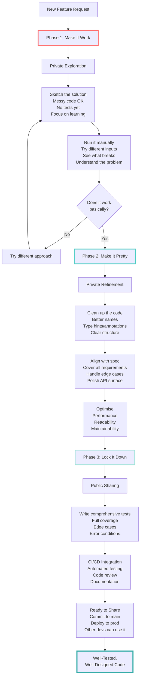
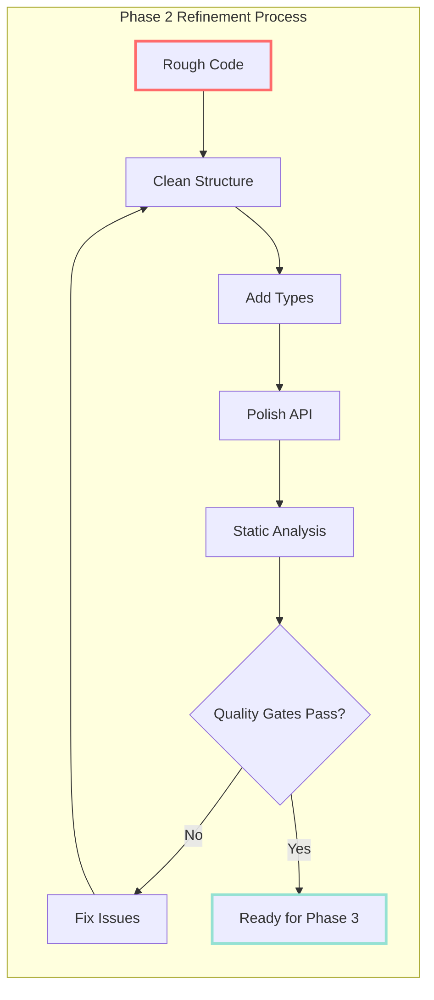
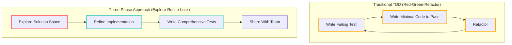

# How I Build Software: Make It Work, Make It Pretty, Lock It Down

<datetime class="hidden">2025-01-18T10:00</datetime>
<!-- category -- Software Development, Testing, TDD, Craftsmanship, Best Practices -->

**Why I write tests last, and why that's not what you think it means**

> **Controversial take:** Test-Driven Development is a brilliant practice that solves the wrong problem for most creative work. Here's what works better.

## The Three Phases of Building Software (That Actually Works)

This is how I build software. It's simple, it's effective, and it makes TDD purists politely furrow their brows:

**Make it work. Make it pretty. Lock it down with tests.**

In that order. Always.

Not because I'm lazy. Not because I don't value testing. But because *this is how creative work actually happens* when you're exploring a problem space you don't fully understand yet.



Not because I'm lazy. Not because I don't value testing. But because *this is how creative work actually happens* when you're exploring a problem space you don't fully understand yet.

Let me explain.

[TOC]

## Phase 1: Make It Work (The Private Sketch)

This is the messy part. The part where I have no idea what I'm doing.

I'm trying to understand:
- Does this API actually work the way the docs claim?
- Can I even solve this problem with the tools I have?
- What does "correct" even mean in this context?
- Is this a two-hour problem or a two-week problem?

**This is invention. This is exploration. This is jazz.**

And you know what kills jazz? Someone standing over your shoulder saying "write the test first."

### Why No Tests Yet?

Because **the shape is still fluid.**

Imagine you're a sculptor. You have a block of marble and a vague idea: "I want to carve a bird."

TDD says: "Before you touch that marble, write down exactly what a bird looks like. Define its wingspan. Specify the angle of each feather. Now carve to those specifications."

That's... not how birds get carved. (Or software gets written, as it turns out.)

Real sculptors *rough out the form first.* They sketch. They make maquettes. They chip away big chunks of stone to find the general shape. Only later do they refine the details.

**Code is the same.**

In Phase 1, I'm writing:
```python
# Ugly, exploratory code
def process_thing(data):
    # TODO: This is terrible, fix later
    result = []
    for item in data:
        # Not sure if this is the right approach...
        x = item.get('value')
        if x:  # Is this even the right condition?
            result.append(x * 2)  # Why multiply by 2? Testing something...
    return result
```

This code is **private.** It's a conversation with myself. It's how I figure out what "working" even means.

Writing tests for this is worse than useless—it's *actively harmful.* Because every time I realise "oh wait, this whole approach is wrong," I'd have to rewrite the tests too.

That's not rigor. That's bureaucracy.

### The Freedom to Fail Fast

Phase 1 is about **learning velocity.**

I need to try five different approaches in an hour. I need to discover that the third-party library I thought I'd use... isn't quite as advertised. I need to realise the problem I'm solving isn't the problem I *should* be solving.

Tests slow this down. Not because testing is slow, but because **premature specification is death.**

If I write tests before I understand the problem, I'm writing tests for the *wrong thing.* Then I'm emotionally invested in the wrong thing. Then I'm defending the wrong thing in code review.

Better to fail fast, in private, with no tests to maintain and no ego to protect.

### What "Working" Means in Phase 1

It means: "I ran it. I gave it some inputs. It produced outputs that seem reasonable. I'm 60% confident I understand the problem now."

That's it.

No edge cases. No error handling. No elegance.

Just a spike. A proof of concept. A sketch.

## Phase 2: Make It Pretty (The Refinement)

Okay, so now I understand the problem. I have something that works, at least for the happy path.

**Now I can start caring about quality.**

Phase 2 is where I:

### 1. Clean Up the Mess

**Python Example:**

```python
# Before (Phase 1) - Exploratory code
def process_thing(data):
    result = []
    for item in data:
        x = item.get('value')
        if x:
            result.append(x * 2)
    return result

# After (Phase 2) - Refined code
def extract_doubled_values(items: list[dict]) -> list[int]:
    """Extract 'value' field from items and double each one.

    Only includes items where 'value' is present and truthy.
    """
    return [
        item['value'] * 2
        for item in items
        if item.get('value')
    ]
```

**C# Example:**

```csharp
// Before (Phase 1) - Exploratory code
public List<int> ProcessThing(List<Dictionary<string, object>> data)
{
    var result = new List<int>();
    foreach (var item in data)
    {
        if (item.ContainsKey("value"))
        {
            var x = item["value"];
            if (x != null)
            {
                result.Add(Convert.ToInt32(x) * 2);
            }
        }
    }
    return result;
}

// After (Phase 2) - Refined code
/// <summary>
/// Extracts 'value' field from items and doubles each one.
/// Only includes items where 'value' is present and non-null.
/// </summary>
public IEnumerable<int> ExtractDoubledValues(IEnumerable<IDictionary<string, object>> items)
{
    return items
        .Where(item => item.ContainsKey("value") && item["value"] != null)
        .Select(item => Convert.ToInt32(item["value"]) * 2);
}
```

Better name. Type annotations. XML documentation. Cleaner LINQ implementation.

### 2. Align With the Spec

Now that I know what I'm actually building, I go back to the original requirements and make sure I'm solving the *right* problem, not just *a* problem.

Often this reveals gaps:
- "Oh, they wanted this to handle negative numbers differently."
- "Wait, there's an edge case where value could be None vs. 0."
- "The spec says 'double' but I think they meant 'scale by a configurable factor.'"

I fix these. Sometimes I push back on the spec: "Actually, we should do X instead because Y."

### 3. Polish the API Surface

This is where I think about the *caller's* experience.

**Python:**

```python
# Phase 1: Works, but awkward to use
process_thing(data)

# Phase 2: Clear, flexible, composable
extract_doubled_values(
    items,
    scale_factor=2.0,
    include_zeros=False
)
```

**C#:**

```csharp
// Phase 1: Works, but awkward to use
ProcessThing(data);

// Phase 2: Clear, flexible, composable
ExtractDoubledValues(
    items,
    scaleFactor: 2.0,
    includeZeros: false
);

// Or even better with a fluent API
items.ExtractValues()
     .Scale(by: 2.0)
     .ExcludingZeros()
     .ToList();
```

Better naming. Sensible defaults. Configuration where it matters. Fluent APIs where appropriate.

This is **craft.** This is where good software comes from.



### Why Still No Tests?

*Oh, I'm running it constantly.* I have a REPL open. I'm trying different inputs. I'm exercising all the paths.

But I'm not *writing those experiments down as formal tests yet.*

Why? Because **I'm still discovering what's worth testing.**

In Phase 1, I didn't know if this function would even exist. In Phase 2, I'm discovering:
- "Oh, the scale factor can't be negative. That's a validation."
- "If the list is empty, we should return empty, not None."
- "We need to handle non-numeric values gracefully."

These insights *emerge from refactoring.* They're not obvious upfront.

If I'd written tests in Phase 1, I'd be rewriting them now. If I write them *after* I've refined the implementation, they'll be correct the first time.

## Phase 3: Lock It Down With Tests (The Sharing Phase)

Okay, now it's real.

The code is clean. The API makes sense. I've covered the edge cases. I'm confident in what I've built.

**Now I write tests. Lots of tests. As-close-to-full-coverage-as-possible tests.**

### Why Now?

Because **tests are a sharing mechanism.**

They're not for me anymore. I already understand this code intimately. I've lived in it for hours or days.

Tests are for:

1. **Future Me** (who will forget everything in three months)
2. **My Teammates** (who need to trust this code works)
3. **The CI Pipeline** (which needs to prevent regressions)
4. **Future Maintainers** (who need to safely refactor this)

Tests are the **presentation layer** for my implementation.

They document:
- What this code does
- What inputs are valid
- What outputs to expect
- What edge cases I've considered
- What assumptions I'm making

### Full Coverage, No Compromises

In Phase 3, I go hard on testing:

```python
def test_extract_doubled_values_basic():
    items = [{'value': 5}, {'value': 10}]
    assert extract_doubled_values(items) == [10, 20]

def test_extract_doubled_values_skips_missing_values():
    items = [{'value': 5}, {'name': 'foo'}, {'value': 3}]
    assert extract_doubled_values(items) == [10, 6]

def test_extract_doubled_values_handles_zeros():
    items = [{'value': 0}, {'value': 5}]
    # By default, zeros are excluded (falsy)
    assert extract_doubled_values(items) == [10]

def test_extract_doubled_values_includes_zeros_when_configured():
    items = [{'value': 0}, {'value': 5}]
    assert extract_doubled_values(items, include_zeros=True) == [0, 10]

def test_extract_doubled_values_custom_scale_factor():
    items = [{'value': 5}]
    assert extract_doubled_values(items, scale_factor=3.0) == [15.0]

def test_extract_doubled_values_rejects_negative_scale_factor():
    with pytest.raises(ValueError):
        extract_doubled_values([], scale_factor=-1.0)

def test_extract_doubled_values_handles_empty_list():
    assert extract_doubled_values([]) == []

def test_extract_doubled_values_handles_non_numeric_values():
    items = [{'value': 'not a number'}]
    with pytest.raises(TypeError):
        extract_doubled_values(items)
```

**This is the safety net.**

Now my teammates can:
- Modify this function confidently
- Understand the edge cases
- Catch regressions immediately
- Refactor without fear

### Tests as Documentation

Good tests are better documentation than comments:

```python
# This comment will drift from reality:
# Doubles all numeric values, skipping None

# This test will fail if reality changes:
def test_extract_doubled_values_skips_none_values():
    items = [{'value': None}, {'value': 5}]
    assert extract_doubled_values(items) == [10]
```

Tests don't lie. They can't drift. If the behaviour changes, the test breaks.

That's **executable documentation.** That's what makes tests valuable.

### The Sharing Boundary

Here's the crucial point: **Phase 3 happens before anyone else touches the code.**

I don't share code without tests. Ever.

But I also don't write tests before the code is ready to share.

The phases are:
1. **Private exploration** (just me, no tests)
2. **Private refinement** (just me, still no tests)
3. **Public sharing** (tests, CI, code review, the whole nine yards)

This protects both my creativity *and* my teammates' sanity.

## Why This Protects Creativity

TDD advocates say "tests give you confidence to refactor."

True! But only if you already know what you're building.

When I'm in Phase 1, I don't need confidence to refactor. **I need permission to throw everything away.**

Tests create psychological debt. Once I've written them, I'm reluctant to delete them. Even if they're testing the wrong thing.

By deferring tests until Phase 3, I keep Phase 1 and 2 *psychologically cheap.*

I can:
- Try wild ideas
- Throw away entire approaches
- Radically change the design
- Discover the problem I'm *actually* solving

All without the guilt of "but I wrote all those tests..."

**This is how creativity works.**

You sketch loosely first. You don't start with the details.

## How This Fits With Agile and XP (And Where It Diverges)

Let's be clear about something: **this is not "test later development."**

This is **"test while developing, but at the right time."**

The timing of *when* to add unit tests is critical. Too early and you're specifying the unknown. Too late and you're shipping without safety nets.

### The XP Practices I Keep

Extreme Programming has brilliant practices worth following:

**Continuous Integration**
- Every feature goes through CI before merging
- Automated test runs on every commit to main
- No broken builds tolerated

**Pair Programming / Code Review**
- Phase 3 code gets reviewed before sharing
- Tests are part of the reviewable artefact
- Collaborative refinement improves design

**Simple Design**
- Phase 2 is *all about* simplification
- Remove what you don't need
- Make it as simple as possible, not simpler

**Refactoring**
- Phase 2 is dedicated refactoring time
- Clean the code *before* locking it down
- Tests protect the refactoring (in Phase 3+)

### Where I Diverge From Strict TDD



**TDD Says:** "Tests first. Always. Red-Green-Refactor is the only way."

**I Say:** "Tests when you know what you're testing. Explore-Refine-Lock is more natural."

The key difference:

| TDD | Three-Phase |
|-----|-------------|
| Test defines the interface | Exploration defines the interface |
| Red-Green-Refactor cycle | Explore-Refine-Lock progression |
| Tests written before implementation | Tests written before *sharing* |
| Test first for everything | Test at the right time for each thing |
| Micro-cycles (minutes) | Macro-phases (hours/days) |

### The Timing Is Critical

Here's the crucial insight: **It's not "tests last." It's "tests before sharing."**

**Wrong timing (too early):**
```
Hour 1: Write test for API I haven't designed yet
Hour 2: Realize the API is wrong, rewrite test
Hour 3: Discover a better approach, rewrite both
Hour 4: Finally get it working
Hour 5: Rewrite tests to match what actually works
```

**Right timing (Phase 3):**
```
Hour 1: Explore 3 different APIs, settle on the best one
Hour 2: Refine the implementation, handle edge cases
Hour 3: Write comprehensive tests for what I built
Hour 4: All tests pass, commit with confidence
```

Same quality outcome. Half the churn.

### This IS Agile

Agile says: **"Respond to change over following a plan."**

TDD can become its own form of plan-following. Once you've written tests, you're psychologically committed to that design.

My approach embraces change:
- Phase 1: Change rapidly, discover the right solution
- Phase 2: Change deliberately, refine toward elegance
- Phase 3: Change carefully, protect what works

This is *more* agile than strict TDD, because it defers commitment until you have information.

### Contrasting Approaches: A C# Example

**Strict TDD Approach:**

```csharp
// Test 1: Write test first (but I don't know the right API yet)
[Test]
public void TestProcessData()
{
    var processor = new DataProcessor();
    var result = processor.Process(new[] { 1, 2, 3 });
    Assert.That(result, Is.EqualTo(new[] { 2, 4, 6 }));
}

// Implementation 1: Make it pass
public class DataProcessor
{
    public int[] Process(int[] data) => data.Select(x => x * 2).ToArray();
}

// Later: Realize I need configurability, rewrite test
[Test]
public void TestProcessDataWithFactor()
{
    var processor = new DataProcessor();
    var result = processor.Process(new[] { 1, 2, 3 }, factor: 3);
    Assert.That(result, Is.EqualTo(new[] { 3, 6, 9 }));
}

// Later: Realize I should use IEnumerable, rewrite test again
[Test]
public void TestProcessDataEnumerable()
{
    var processor = new DataProcessor();
    var data = GetLargeDataset(); // This should be lazy
    var result = processor.Process(data, factor: 3);
    Assert.That(result.Take(3), Is.EqualTo(new[] { 3, 6, 9 }));
}
```

Notice the churn? Three test rewrites as the design evolved.

**Three-Phase Approach:**

```csharp
// Phase 1: Explore (no tests yet)
public int[] ProcessThing(int[] data)
{
    return data.Select(x => x * 2).ToArray();
}
// Try it: var result = ProcessThing(new[] { 1, 2, 3 });
// Hmm, what about configurability? What about lazy evaluation?

// Phase 2: Refine (still no tests)
public static class DataProcessorExtensions
{
    public static IEnumerable<int> Scale(
        this IEnumerable<int> source,
        int factor = 2)
    {
        return source.Select(x => x * factor);
    }
}
// Try it: var result = data.Scale(factor: 3).ToList();
// Much better API!

// Phase 3: Lock it down (NOW write tests, correctly)
[TestFixture]
public class DataProcessorTests
{
    [Test]
    public void Scale_DefaultFactor_DoublesValues()
    {
        var result = new[] { 1, 2, 3 }.Scale();
        Assert.That(result, Is.EqualTo(new[] { 2, 4, 6 }));
    }

    [Test]
    public void Scale_CustomFactor_ScalesCorrectly()
    {
        var result = new[] { 1, 2, 3 }.Scale(factor: 3);
        Assert.That(result, Is.EqualTo(new[] { 3, 6, 9 }));
    }

    [Test]
    public void Scale_LazyEvaluation_DoesNotEnumerateImmediately()
    {
        var enumerated = false;
        var data = GetTestData(() => enumerated = true);
        var scaled = data.Scale(factor: 2);

        Assert.That(enumerated, Is.False, "Should not enumerate yet");

        scaled.ToList();
        Assert.That(enumerated, Is.True, "Should enumerate on materialization");
    }

    [Test]
    public void Scale_EmptySequence_ReturnsEmpty()
    {
        var result = Enumerable.Empty<int>().Scale();
        Assert.That(result, Is.Empty);
    }
}
```

One set of tests. Written once. Correct the first time. Because I knew what I was building.

### The Agile Manifesto Connection

Remember the values:

**"Working software over comprehensive documentation"**
- Phase 1 gets to working software *fast*
- Phase 3 makes tests the comprehensive documentation

**"Responding to change over following a plan"**
- Phases 1-2 embrace change
- Phase 3 locks in the final design

**"Individuals and interactions over processes and tools"**
- Don't let TDD dogma override good judgment
- Collaborate when it helps (Phase 2-3), explore alone when it doesn't (Phase 1)

**"Customer collaboration over contract negotiation"**
- Phase 2 aligns with the spec *after* understanding the problem
- Better to deliver what they need than what they specified

## Why This Reduces Useless Churn

TDD's dirty secret: **most tests written before implementation are rewritten or deleted.**

Why? Because:
- You misunderstood the requirements
- You didn't know the edge cases yet
- You discovered a better API design
- You realised the feature wasn't needed at all

Every test you write in Phase 1 is probably wasted effort.

Better to write *one* set of tests in Phase 3, when you actually know what you're building, than to write-rewrite-rewrite during exploration.

### The TDD Promise vs. Reality

**TDD promises:** "Tests drive your design! They help you discover good APIs!"

**TDD reality:** "I wrote tests for an API I thought made sense. Then I implemented it and realised the API was awkward. Now I'm rewriting both the tests and the code."

That's not design. That's *thrashing.*

**My approach:** Design through implementation, then lock it down with tests.

The final result is the same—well-tested, well-designed code. But I got there with half the churn.

## Why This Still Delivers Disciplined Software

Here's what this approach is *not:*

- "Cowboy coding"
- "No tests"
- "Ship and pray"

By the time I'm done with Phase 3, my code has:
- Comprehensive test coverage
- Edge cases handled
- Clean, readable implementation
- Clear API design
- Documentation (via tests)

*Exactly the same as TDD.*

The difference is *when* those tests were written.

### The Discipline Comes From the Boundary

The rule is simple: **No code leaves Phase 2 without Phase 3.**

I don't:
- Commit untested code
- Open PRs without tests
- Merge to main without CI passing
- Deploy without coverage reports

The discipline isn't in writing tests early. It's in *not sharing code without tests.*

## The Craft Metaphors

This isn't a new idea. It's how creative work has always worked:

### Sketch → Refine → Varnish

Painters don't start with the final brushstrokes.

They:
1. **Sketch** the composition (Phase 1)
2. **Paint** the layers (Phase 2)
3. **Varnish** to protect and present (Phase 3)

The varnish doesn't come first. But it's not optional.

### Draft → Edit → Publish

Writers don't edit as they draft.

They:
1. **Draft** messily (Phase 1)
2. **Edit** ruthlessly (Phase 2)
3. **Publish** with confidence (Phase 3)

"Write drunk, edit sober" is terrible life advice but great writing advice.

### Clay → Form → Glaze

Potters don't glaze before shaping.

They:
1. **Throw** the clay (Phase 1)
2. **Trim and refine** the form (Phase 2)
3. **Glaze and fire** for durability (Phase 3)

The glaze is crucial. But it comes last.

## How This Maps to the DiSE Codegen Pipeline

Here's where this gets interesting: I've actually *implemented* this philosophy in the DiSE (Directed Synthetic Evolution) system.

The codegen pipeline explicitly embodies these three phases:

### Phase 1 in DiSE: The Exploration Stage

When you ask DiSE to solve a problem, it doesn't jump straight to writing perfect, tested code.

Instead, the **Generator** (codellama or similar) gets a clear mandate:

```
"Write code that solves the specification.
Don't worry about perfection yet.
Just get it working."
```

The system generates exploratory code:
- Focused on the happy path
- Minimal error handling
- No premature optimisation
- Just enough to test the approach

Then the **Executor** runs it. Not with formal unit tests—just with the inputs from the specification.

If it fails? No problem. That's **learning.**

The system has a 6-stage adaptive escalation:
1. Try with a fast model (low temperature)
2. Try again with higher creativity (higher temperature)
3. Escalate to a more powerful model
4. Add debug logging to understand failures
5. Give full context to the powerful model
6. Use the "god-level" model as a last resort

This is *exactly* Phase 1. The system is exploring the solution space, learning what works, failing fast, and adapting.

**No tests are written during this phase.** The code is private to the generation process.

### Phase 2 in DiSE: The Optimisation Stage

Once the code passes basic execution, DiSE moves to **optimisation.**

This is the refinement phase. The system:

1. **Cleans up the implementation**
   - Removes debug logging that was added during failures
   - Simplifies overly complex code
   - Improves naming and structure

2. **Runs static analysis**
   ```
   - flake8 (style checking)
   - pylint (code quality)
   - mypy (type checking)
   - black (formatting)
   - radon (complexity analysis)
   ```

3. **Iteratively optimises** (3 iterations by default)
   ```python
   for iteration in range(3):
       # Measure current performance
       metrics = measure_performance(code)

       # Generate improved version
       better_code = optimise(code, metrics)

       # Keep if better, discard if worse
       if better_code.score > code.score:
           code = better_code
   ```

This is *exactly* Phase 2. The code is still private (not in the registry yet), but we're polishing it:
- Better names
- Type hints
- Cleaner structure
- Lower complexity
- Better performance

The shape is no longer fluid. We know what we're building. Now we make it *good.*

### Phase 3 in DiSE: The Testing and Storage Stage

Only *after* optimisation does DiSE generate and run **formal unit tests.**

Here's the crucial part: the tests are generated from the *refined specification and implementation*, not the initial exploration.

```python
# Test generation happens AFTER optimisation
def generate_unit_tests(specification, optimized_code):
    """Generate comprehensive tests for refined code.

    This happens in Phase 3, after we know:
    - What the code actually does
    - What edge cases exist
    - What the API surface looks like
    """
    return llm.generate(
        f"""Generate comprehensive unit tests for this code.

Specification: {specification}
Implementation: {optimized_code}

Include tests for:
- Happy path (from spec examples)
- Edge cases (discovered during optimisation)
- Error conditions (based on actual error handling)
- Performance bounds (based on measured metrics)
"""
    )
```

The tests cover:
- Specification examples (correctness)
- Edge cases discovered during Phase 2
- Error handling that was added during refinement
- Performance characteristics that were measured

Then, *only if tests pass*, the code is:
1. Stored in the **RAG memory** (with embeddings)
2. Added to the **node registry** (as an executable artifact)
3. Made available for **reuse** in future workflows
4. Tracked with **quality scores** and **performance metrics**

**This is the sharing phase.** The code is now public (to the system). It has comprehensive tests. It's locked down.

### Why This Works in a Code Generation System

The three-phase approach is *essential* for AI-driven code generation because:

**Phase 1: Models don't understand the problem upfront**
- They need to explore the solution space
- Initial attempts often fail in interesting ways
- Failures provide information for better attempts
- Premature testing would force premature specification

**Phase 2: Models optimise better with feedback**
- Static analysis reveals real issues
- Performance metrics guide improvements
- Complexity scores highlight simplification opportunities
- This is where quality emerges

**Phase 3: Tests document what was learned**
- Tests capture the *final* understanding
- They reflect the *actual* edge cases
- They encode the *refined* API design
- They're correct the first time (not rewritten 5 times)

### The Evidence: It Actually Works

Here's a real example from the DiSE system:

```
User: "Calculate fibonacci numbers"

[Phase 1: Exploration - 3 attempts]
  Attempt 1: Works for small inputs, explodes on large ones (no safety limit)
  Attempt 2: Adds safety limit, but inefficient recursive approach
  Attempt 3: Switches to iterative DP (PASS)

[Phase 2: Optimization - 3 iterations]
  Iteration 1: Add type hints, improve naming (Score: 1.05)
  Iteration 2: Optimize memory usage with generator (Score: 1.10)
  Iteration 3: Add input validation (Score: 1.15)

[Phase 3: Testing and Storage]
  Generated 8 unit tests covering:
    - Basic cases (n=0, n=1, n=5, n=10)
    - Edge cases (n=negative, n=100, n=None)
    - Type validation

  All tests pass ✓

  Stored in RAG with quality score: 1.15
  Available for reuse: YES
```

The final code is:
- Well-tested (8 tests, all passing)
- Well-optimised (15% better than initial version)
- Well-documented (via tests and type hints)
- Ready to share (in the registry)

*Exactly like TDD promises.* Just via a more natural path.

### The Meta-Level: The System Optimizes Itself

Here's where it gets really interesting: DiSE applies this three-phase approach *to itself.*

The **Recursive System Optimizer** has 4 levels:
1. **Level 0:** Optimize code artifacts (get them working, make them pretty, lock them down)
2. **Level 1:** Optimize workflows that use those artifacts (same three phases)
3. **Level 2:** Optimize the tools and selection logic (you guessed it)
4. **Level 3:** Optimize the optimizer itself (meta!)

At every level: explore → refine → test.

This is the mantra, *all the way down.*

## The Real Reason This Works

Here's the uncomfortable truth: **Most code is written by people who don't fully understand the problem yet.**

That's not a failure. That's *reality.*

Requirements are ambiguous. Specs are incomplete. Third-party APIs are poorly documented. Edge cases emerge from nowhere.

You can't design the perfect API upfront because **you don't have enough information.**

The three phases acknowledge this:

1. **Phase 1:** Learn what you don't know
2. **Phase 2:** Apply what you learned
3. **Phase 3:** Protect what you built

By separating exploration from specification, I can:
- Explore freely (without test debt)
- Refine confidently (knowing what matters)
- Share safely (with comprehensive tests)

This is true for humans writing code. It's *also* true for LLMs generating code. And for systems optimizing themselves.

## When TDD Actually Makes Sense

I'm not anti-TDD. I'm anti-*premature* TDD.

TDD works great when:

### 1. The Problem is Well-Understood

If I'm implementing a known algorithm (sorting, parsing, etc.), TDD is perfect. I know exactly what "correct" means upfront.

```python
# I know what sort() should do. Tests first? Sure!
def test_sort_empty_list():
    assert sort([]) == []

def test_sort_single_element():
    assert sort([5]) == [5]

def test_sort_multiple_elements():
    assert sort([3, 1, 2]) == [1, 2, 3]
```

### 2. You're Fixing a Bug

If I have a regression, TDD is *exactly right*:

1. Write a test that reproduces the bug (red)
2. Fix the code (green)
3. Refactor if needed (refactor)

Perfect.

### 3. You're Refactoring Existing Code

If I already have an implementation and want to change its structure (not behaviour), tests are essential *before* I start.

But that's not Phase 1. That's Phase 4: Maintenance.

## The Honest Truth

This is how I actually work. And I suspect it's how *most* developers actually work, even the ones who claim to do strict TDD.

Because creativity is messy. Learning is iterative. Understanding emerges from doing.

You can't specification yourself out of ignorance.

**You have to build the thing to understand the thing.**

So I build it (Phase 1), refine it (Phase 2), then lock it down (Phase 3).

In that order. Every time.

And you know what? The code I ship is well-tested, well-designed, and well-understood.

*Just like TDD promises.*

I just got there via a different path—one that respects how creative work actually happens.

---

**What's your software building mantra? Do you TDD everything, or do you have a different approach? I'd genuinely love to hear your thoughts in the comments.**

*P.S. - If you're a TDD purist and this post made you raise an eyebrow, excellent! That means we're having a proper engineering discussion. I've been wrong about plenty of things before (just ask my git history), so I'm always curious to hear different perspectives. Maybe you'll convince me there's a better way.*
